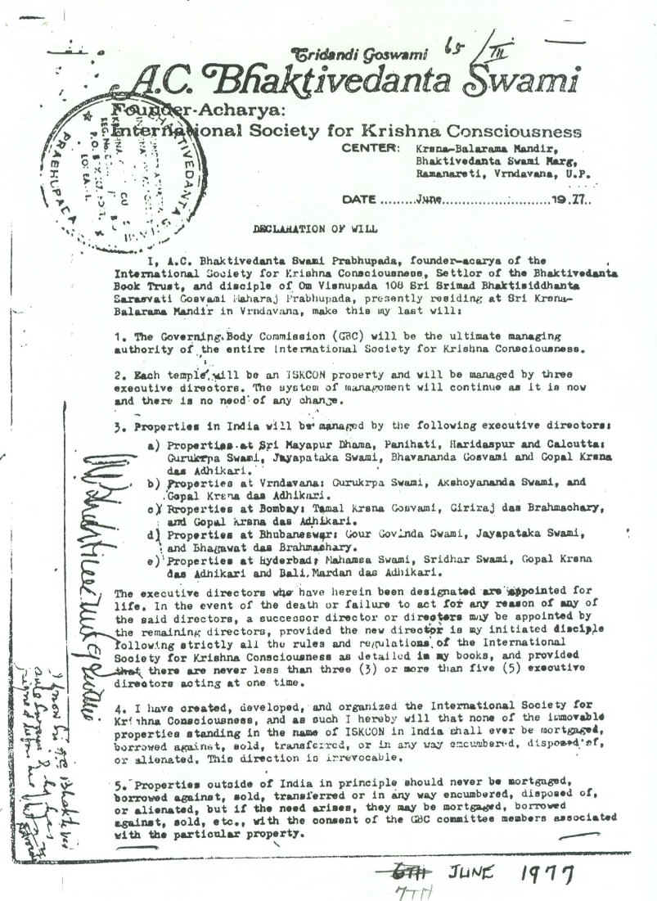
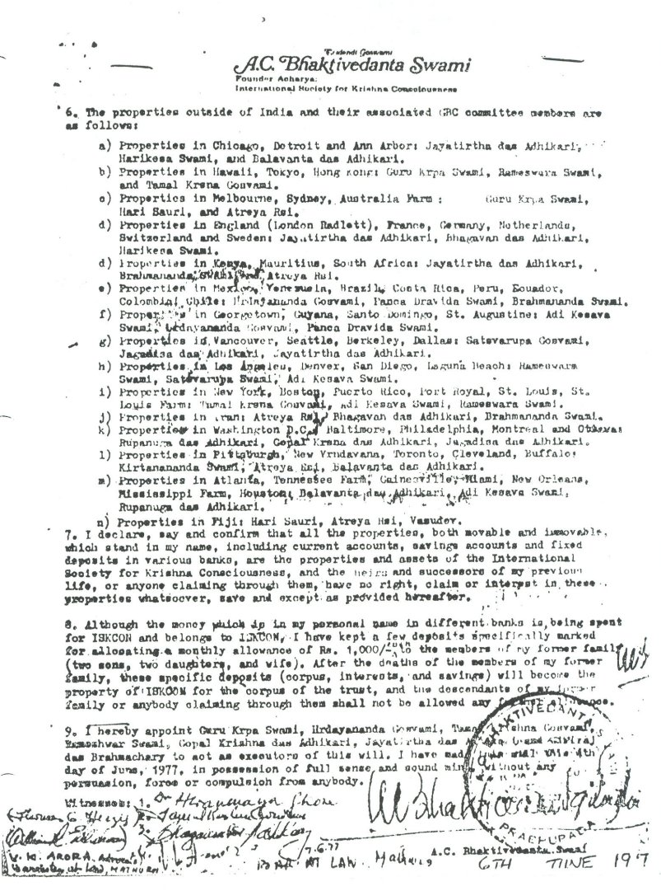
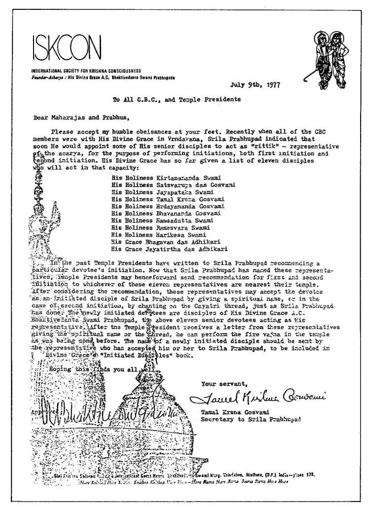

..
 --ШБ 4.8.54 комментарий  - 5 раз

.. NOTE
   Keep `PreprocessorPatterns.sed` file updated with below patterns:

 .. |МООСК| replace:: Международное Общество для Осознания Кришны
 .. |МООСКа| replace:: Международного Общества для Осознания Кришны
 .. |МООСКу| replace:: Международному Обществу для Осознания Кришны
 .. |МООСКом| replace:: Международным Обществом для Осознания Кришны
 .. |ISKCON| replace:: ISKCON
 .. |GBC| replace:: GBC
 .. |ШПа|   replace:: Ш́рӣла Прабхупа̄да̄
 .. |ШПы|  replace:: Ш́рӣлы Прабхупа̄ды
 .. |ШПу|  replace:: Ш́рӣлу Прабхупа̄ду
 .. |ШПе|  replace:: Ш́рӣле Прабхупа̄де
 .. |ШПой| replace:: Ш́рӣлой Прабхупа̄дой
 .. |ЕБМШШБСШПа|   replace:: Его Божественная Милость Ш́рӣ Ш́рӣмад А.Ч. Бхактиведанта Свами |ШПа|
 .. |ЕБМШШБСШПы|  replace:: Его Божественной Милости Ш́рӣ Ш́рӣмад А.Ч. Бхактиведанта Свами |ШПы|
 .. |ЕБМБСПа|  replace:: Его Божественная Милость Ш́рӣ Ш́рӣмад А.Ч. Бхактиведанта Свами Прабхупа̄да̄
 .. |ЕБМБСПы|  replace:: Его Божественной Милости Ш́рӣ Ш́рӣмад А.Ч. Бхактиведанта Свами Прабхупа̄ды
 .. |ЕБМШШБСШПе|  replace:: Его Божественной Милости Ш́рӣ Ш́рӣмад А.Ч. Бхактиведанте Свами |ШПе|
 .. |ЕБМШШБСШПой| replace:: Его Божественной Милостью Ш́рӣ Ш́рӣмад А.Ч. Бхактиведантой Свами |ШПой|
 .. |Шри|         replace:: Ш́рӣ
 .. |Прабхупад|   replace:: Прабхупа̄д

.. |Шрила Вйасадев| replace:: Ш́рӣла Вйа̄садев
.. |Самхит| replace:: Самхит
.. |ишвара| replace:: ӣш́вара
.. |парамешвар| replace:: парамеш́вар
.. |Васудев| replace:: Ва̄судев

..
 .... |Шримати| replace:: Ш́рӣматӣ
 .... |Кришна| replace:: Кр̣шн̣а
 .... |Кришне| replace:: Кр̣шн̣е
 .... |Кришны| replace:: Кр̣шн̣ы
 .... |Кришной| replace:: Кр̣шн̣ой
 .... |Кришну| replace:: Кр̣шн̣у
 .... |Радха| replace:: Ра̄дха̄
 .... |Радхарани| replace:: Ра̄дха̄ра̄н̣ӣ
 .... |Бхагавад-гита| replace:: "*Бхагавад-гӣта̄*"
 .... |Бхагавад-гит| replace:: Бхагавад-гӣт
 .... |Шримад-Бхагаватам| replace:: "*Ш́рӣмад-Бха̄гаватам*"
 Ваишн̣ава
 джагат-гуру
 А̄ча̄рйа
 маха̄-бха̄гавата
 джн̃а̄на

 Ш́рӣ Чаитанйа-чарита̄мр̣та
 А̄ди-лӣла̄
 Мадхйа-лӣла̄
 Антйа-лӣла̄

 |Маха| replace:: Маха̄
 |Майапур| replace:: Ма̄йа̄пур
 |Вриндав| replace:: Вр̣нда̄в
 |Дикша| replace:: Дӣкша̄
 |Гаудия| replace:: Гаўдӣйа
 |матх| replace:: мат̣х
 |ачарья| replace:: ача̄рйа̄

..  NOTE:
    Words in *stars* go to Index ??????
    Ш́рӣле Прабхупа̄де Бхактисиддха̄нте Сарасватӣ Госва̄мӣ Маха̄ра̄дже
    Ш́рӣла Бхактисиддха̄нта Сарасватӣ Т̣ха̄кура
          Бхактисиддха̄нта Сарасватӣ Т̣ха̄кура

.. .. _my-reference-label:

****************************
Введение
****************************

**ОБРАЩЕНИЕ**

 Дорогие преданные! Дорогие читатели!

 Пожалуйста, примите наши нижайшие поклоны.

 Слава |ШПе|!

Смиренно просим всех преданных и всех добродетельных душ простить нас, если мы кому-то доставим беспокойство или совершим неосознанное оскорбление. Простите нас, самых падших, не имеющих никаких положительных качеств, кроме нестерпимого желания, горящего в сердцах никчемных, но жаждущих хоть чем-то помочь нашему духовному учителю. Оно побудило нас обратиться к вам с этой весьма актуальной темой, которая раскрывается в этой книге. Мы вовсе не желаем прибегать к спекулятивным доводам и не хотели бы, чтобы эта книга стала причиной раздоров между теми, кто придерживается иной точки зрения. Эта книга грешит многими несовершенствами, но всё же мы надеемся, что вы отнесётесь к ней с полным вниманием. Мы молимся |ШПе|
об успешном завершении этого скромного труда. И если будет на то воля Господа, эти выстраданные мысли и молитвы найдут отклик в ваших добрых сердцах.

 *ва̄н̃чха̄-калпатарубхйаш́ ча кр̣па̄-синдхубхйа эва ча*

 *патита̄на̄м̇ па̄ванебхйо ваишн̣авебхйо намо намах̣*

"Я в глубоком почтении склоняюсь перед всеми Ваишн̣авами, преданными
Господа. Они исполнены сострадания к обусловленным падшим душам и
подобны древу желаний, которое может исполнить любое желание."

 *ом̇ аджн̃а̄на-тимира̄ндхасйа джн̃а̄на̄н̃джана-ш́ала̄кайа̄*

 *чакшур унмӣлитам̇ йена тасмаи ш́рӣ-гураве намах̣*

"Я был рожден во тьме невежества, но мой духовный учитель открыл мне
глаза и рассеял тьму лучом знания. Я склоняюсь перед Ним в глубоком
почтении."

 *нама ом вишну-пāдāйа кришна-прештхāйа бху-тале*

 *шримате бхактиведāнта-свāмин ити нāмине*

 *намас те сāрасвати деве гаура-вāни-прачāрине*

 *нирвишеша-шунйавāди-пāшчāтйа-деша тāрине*

"В глубоком почтении я склоняюсь перед |ЕБМШШБСШПой|,
который очень дорог Господу Кр̣шн̣е,
ибо для него нет иного прибежища, кроме лотосных стоп Господа.

О духовный учитель, слуга Сарасвати Госва̄мӣ, мы склоняемся перед Тобой в
глубоком почтении. Ты милостиво проповедуешь учение Господа Чайтаньядевы
и несёшь освобождение странам Запада, в которых широко распространился
имперсонализм и философия пустоты."

 *тапта-ка̄н̃чана-гаура̄н̇ги ра̄дхе вр̣нда̄ванеш́вари*

 *вр̣шабха̄ну-суте деви пран̣ама̄ми хари-прийе*

"Я выражаю своё почтение царице Вр̣нда̄ваны, Ра̄дха̄ра̄н̣ӣ, чья кожа цветом
подобна расплавленному золоту. Ты, о дочь царя Вришабхану, очень дорога
Господу Кр̣шн̣е."

 *ш́рӣ-кр̣шн̣а-чаитанйа прабху-нитйа̄нанда*

 *ш́рӣ адваита гада̄дхара ш́рӣваса̄ди-гаура-бхакта-вр̣нда*

"Я предлагаю свои почтительные поклоны Ш́рӣ Кр̣шн̣а Чайтанье, Прабху
Нитьянанде, Ш́рӣ Адвайте, Гададхаре, Ш́рӣвасу и всем Их последователям."

 *Харе Кр̣шн̣а, Харе Кр̣шн̣а, Кр̣шн̣а Кр̣шн̣а, Харе Харе*

 *Харе Ра̄ма, Харе Ра̄ма, Ра̄ма Ра̄ма, Харе Харе*

.. Below is disabled text:
 .. epigraph::

  Here is a cool quotation.

  -- Jo the Jovyan

  Here is a cool quotation 2.

  -- Jo the Jovyan2

 .. compound::

   The 'rm' command is very dangerous.  If you are logged
   in as root and enter ::

       cd /
       rm -rf *

   you will erase the entire contents of your file system.

 This is an ordinary paragraph, introducing a block quote.

    "It is my business to know things.  That is my trade."

    -- Sherlock Holmes

 The 'rm' command is very dangerous.  If you are logged  in as root and enter

 ::

  cd /
  rm -rf *

 you will erase the entire contents of your file system.

 ра̄ма Ра̄ма

 ..    {\MU{\d{а}}}
    \MU{\d{а}}

 Hindi: \texthindi{हिन्दी}

 Sanskrit: \textsanskrit{संस्कृतम्}

 .. py:function:: enumerate(sequence[, start=0])
   Return an iterator that yields tuples of an index and an item of the
   *sequence*. (And so on.)
 .. rst:directive:: foo

   Foo description.

 .. rst:directive:: .. bar:: baz

   Bar description.

 .. rst:role:: foo1

   Foo1 description.

 .. .. only:: builder_html

   See :download:`this example script <../example.py>`.

 Ask a question on `my favorite Q&A website <http://stackoverflow.com/>`_.

 It refers to the section itself, see :ref:`my-reference-label`.
 :index:`term_3`
   definition for an indexed term3

 Example of using term :term:`term_3` .

 .. math::
  :label: myequation

  a^2 + b^2 = c^2

 :abbr:LIFO is here.

 .. raw:: latex

    \d{а}

    \={а}

 1 ā
 2 *ā*
 3 ṛ
 4 *ṛ*

 *hare	kṛṣṇa,	hare	kṛṣṇa,	kṛṣṇa	kṛṣṇa,	hare	hare*

 *hare	rāma,	hare	rāma,	rāma	rāma,	hare	hare.*

.. The :py:func:`enumerate` function can be used for ...
.. 5 ṣ
 6 ṇ
 p\u{o}p\u{u}lus
 a § b

.. raw:: latex

	\newpage

**От автора**

В этот век *Кали-юги* -- век вражды, лжи и лицемерия -- демонизм постепенно
набирает силу, желая поработить всё человечество. Демонические сущности
проникают во все сферы деятельности человека. Начиная с
правительственной деятельности, социально-политической, экономической,
телевидения и радиовещания. А также и в духовные сферы различных
религиозных конфессий. |МООСК| (|ISKCON|),
к сожалению, также оказалось под влиянием демонической системы, лидеры
которой пытаются затормозить, приостановить а, возможно, и остановить
развитие этого Общества (|ISKCON|).

Сейчас много людей начинают понимать что находятся под давлением
демонической системы. Не находя выхода из создавшейся ситуации эти люди
обращают свой взор и мысли к Богу. Они приобщаются к различным
религиозным вероисповеданиям и молят Господа о спасении. Не имея
духовного образования, находясь в иллюзии они молят Господа о своём
*материальном* благополучии.

Под эгидой религии демоны создают множество
религиозных сект и под видом альтруизма, благотворительности и пр.,
всевозможными способами заманивают простодушных людей в эти секты.
Представляя свои выдуманные религии, надуманные религиозные догмы и
традиции они уводят людей от Абсолютной Истины -- Верховной Личности
Бога. |ШПа| говорит:

 Подлинные религиозные принципы
 устанавливаются Верховной Личностью Господа. Даже великие риши,
 занимающие высочайшие планеты, хотя они и находятся всецело в модусе
 благости, не могут вводить подлинных, религиозных принципов, не способны
 на это ни полубоги, ни вожди *сиддхалоки*, не говоря уже об *асурах*,
 обычных людях, *видйадхарах* и *чаранах*.

 --Ш́рӣмад-Бха̄гаватам 6.3.19

 Истинная
 религия, или закон заключается в том, что говорит Сам Бог. Если мы
 изобретаем свои собственные законы, не сообразуясь с программой Бога, мы
 в конце концов потерпим неудачу.

 --Диалектический спиритуализм

 Сейчас мир заполнили *асуры*, рядящиеся в одежды политиков, **гуру**,
 **садху**, йогов и воплощений Бога.

 --Ш́рӣмад-Бха̄гаватам 10.3.21 комментарий

Эта книга не предназначена для широкого круга читателей. Она предназначена для тех
людей, которые искренне стремятся познать свою духовную природу и Бога
и при этом не хотят быть обманутыми разными *псевдогуру* и лже-богами -- таким людям
эта книга просто необходима. Она поможет нам несколько иначе взглянуть
на окружающий нас мир, узнать то, что много лет лидеры |ISKCON| скрывали
от нас. Увидеть |ШПу| таким, каким Он есть на самом деле, Его
истинное Величие. Она поможет правильнее и лучше понять философию, изложенную в Его
книгах и по-настоящему стать духовно счастливыми людьми.

В этой книге представлены материалы, основанные на философии и подлинных
документах, подписанных лично |ШПой|. Все эти материалы
подкреплены выдержками из шастр и многих книг |ЕБМШШБСШПы|.
Из книги "Последний приказ" представлены письма, беседы,
документы "гуру" |ISKCON| и документы, оставленные нам |ШПой|,
которые, по сути дела, определяют путь развития |МООСКа|
на весь период его существования. Мы также
приводим фрагменты из книг, писем, лекций и бесед |ЕБМШШБСШПы|.

Выражаем глубокую благодарность тем преданным, которые работали над
созданием книги "Последний приказ".

.. raw:: latex

	\newpage

**ПРЕДИСЛОВИЕ**

Начнём с того, что в декабре 1991 года один преданный, назовём его
Бхакта-дас, пришёл жить в Московский храм на "Беговой". Через некоторое
время руководство храма предложили ему выбрать для себя духовного
учителя. Хоть ему и было странно слышать это, так как он уже принял в
своё сердце |ШПу| и думал, что этого достаточно. Тем не менее
ему пришлось подчиниться здешним правилам, так как он очень хотел жить в
том обществе, о котором узнал из книг |ШПы|.

Через некоторое время Бхакта-дас выбрал Ниранджана Свами, в тот момент
он ему показался скромным и честным преданным. По согласию Ниранджана Свами ему дали
*пранаму* (молитву), при этом сказали, что он должен читать *пранаму*
только ему. По прошествии времени он стал замечать, что та духовная
связь которая была у него со |ШПой| стала утрачиваться.
Несмотря на то, что Бхакта-дас читал *пранаму* этому "гуру" Махараджу, у
него не возникала с ним духовная связь не смотря на его усилия.

Тогда он обратился к старшим преданным с таким вопросом: "Почему у меня
не возникает такая же духовная связь с Ниранджана Свами, какая была со
|ШПой|?". Ему старшие преданные ответили: "Это потому, что
ты ещё не получил от него инициацию, как получишь так сразу же всё
восстановится". Но это оказалось **иллюзией**. Даже после обряда
инициации, которую он прошёл в сентябре 1994 года ничего не изменилось.
После падения Харикеши Свами, Бхакта-дас серьёзно задумался о своей
духовной жизни и сделал для себя соответствующие выводы.

По Милости Господа ему выпала удача жить несколько лет в Шри Ма̄йа̄пур̄ Дхаме
и общаться со старшими преданными, жителями святой дхамы. Это
послужило стимулом для его духовного прогресса. Благодаря их общению у
него развеялись все сомнения, роящиеся в его уме. В 1998 году после съезда
|GBC| Бхакта-дас возобновил читать *пранаму* |ШПе|,
отбросив *всё ложное*. У него очень быстро восстановились взаимоотношения
с Ним, и вера его в |ШПу| -- своего *Дӣкша̄-гуру* -- стала сильной и
непоколебимой. Он стал испытывать прежнюю радость и удовлетворение в
себе.

Видя как большинство преданных обмануты и находятся в заблуждении
относительно истинного положения |ШПы|, у него появилось
огромное желание рассказать всему миру о том, кто такой |ШПа|.
Однако в то время у него не было для этого необходимой
квалификации. И вот сейчас у Бхакта-даса по-настоящему настало время
поделиться своей реализацией о непревзойдённой личности - |ЕБМШШБСШПе|.

Вот уже много лет тема: "**Истинный Дӣкша̄-Гуру** |ISKCON|" будоражит
умы преданных и остается актуальной на сегодняшний день. В связи с этим
Московские преданные, которые всем сердцем приняли |ШПу| как
**истинного** *Дӣкша̄-гуру*, попросили его написать на эту тему
"Обращение" к преданным |ISKCON|. Некоторое время он был в замешательстве,
не зная как писать? Ведь он не писатель, и не учёный, и даже не имеет
академического образования, но когда произошло так, что *Гурудев* попросил
его помочь Ему, а просьба духовного учителя, это даже нечто большее чем
сам приказ. Желая выполнить волю своего дорогого *Гурудева*  |ШПы|,
уповая на Его Милость он взялся за этот можно сказать
титанический для него труд, поэтому пожалуйста, будьте к нему чуточку
снисходительны.

Моля Господа со слезами на глазах и вознося Ему молитвы, он просил
Господа дать ему разум, чтобы он смог найти нужные слова и выразить те
выстраданные мысли, бурлящие в его душе. В этой книге -- откровение
Бхакта-даса, исходящее из глубины его сердца. Мы вполне допускаем, что
не для всех она будет приятна. В ней говорится о правде и только о
правде, о той правде, которую мы называем -- ИСТИНОЙ. И для тех кто
жаждет её, она будет спасительным нектаром, и этот нектар -- есть дыхание
|ШПы|. Она отражает в себе факты, события, хронику истории и, к
сожалению, трагедию, присущие этому веку *Кали*, погружённого в
непроглядную тьму невежества. И всё это несовместимое, каким-то образом
смогло найти место в нашей сегодняшней духовной жизни.

Эта книга о величайшей Личности, даровавшей всему человечеству бесценное
сокровище -- святое имя Господа. Во всём материальном мире нет более
Великой Личности, или равного Ему, чем |ЕБМШШБСШПа|.
Из этой книги мы узнаем самое сокровенное о Нём.

В жизни Бхакта-даса много раз обманывали и он хорошо понимает каково
быть обманутым: это очень больно. Поэтому он испытывает огромное
сострадание к тем душам, которых обманывают, особенно если вопрос
касается духовной жизни. В этой книге мы искренне пытаемся предостеречь
от обмана все искренние души, которые стремятся обрести это бесценное
сокровище трансцендентного знания, милостиво данное |ШПой|,
и раскрыть всю правду о великом обмане "гуру" |ISKCON|, который длится на
протяжении тридцати лет. Это не плод нашего воображения или досужих
домыслов, всё о чём здесь говорится, подтверждается документами и
шастрами. До тех пор пока мы не примем прибежище у лотосных стоп
**истинного** духовного учителя, непосредственного представителя
Верховной Личности Бога, мы будем подвергаться обману снова и снова,
жизнь за жизнью.

В |ISKCON| грядут большие перемены. Кр̣шн̣а посылает нам очень серьезные
испытания, в которых Он хочет убедиться в нашей искренности и
преданности Его истинному представителю. Господь Кр̣шн̣а любит нас всех,
и желая помочь создаёт нам такие ситуации, в которых побуждает нас
сделать правильный выбор.

Если мы будем внимательны к событиям, происходящим сейчас в |ISKCON|, и
будем смотреть на всё через призму священных писаний, и оставленных
|ШПой| завещаний, то можно с уверенностью сказать, что мы
под руководством |GBC| идём в неверном направлении.

Сейчас мы стоим на пороге великих свершений. Настало время экзамена,
который устраивает для нас Господь Кр̣шн̣а. Вспомните, что было пять
тысяч лет тому назад перед началом битвы на поле Курукшетра. Произошло
разделение на две партии, одни примкнули к Пандавам, сохранявших
терпение и снисходительность, другие же примкнули к нечестивым сыновьям
Дхритараштры. Итак, если провести аналогию между тем, что происходило
пять тысяч лет тому назад и тем, что происходит сейчас в |ISKCON|, то мы
увидим очень большое сходство.

"Пандавы" -- это истинные преданные |ШПы| -- непосредственного
представителя Верховной Личности Бога, сохраняющие терпение и
снисходительность, жаждущие сохранить |ISKCON| таким, каким желает его
видеть Ш́рӣла Прабхупа̄да̄.

"Нечестивые сыновья Дхритараштры" -- это неуполномоченные *гуру* |ISKCON|,
идущие против *А̄ча̄рйи*, отвергнув последний приказ |ШПы| от 9 июля 1977 года.

Этот пример мы привели для того, чтобы обратить Ваше внимание дорогие
преданные, на сложившуюся в нашем Обществе чрезвычайную обстановку.
|GBC| находится в полной растерянности и зашли в тупик ввиду того,
что отвергли приказ |ШПы| от 9 июля 1977 года. Сейчас для
|GBC| очень трудно признаться в своих ошибках и вернуться к
последнему указанию |ШПы|. Поэтому нам, преданным, нужно
совместными усилиями разобраться в этой сложной ситуации и принять
радикальные меры для решения этой глобальной проблемы, для нашего же с
вами блага. В противном же случае дальнейшее промедление может привести
к расколу нашего Общества не на две а множество партий, в точности как
в *Гаўдӣйа-матхе*.

Одни преданные примут |ШПу| как **истинного** *Дӣкша̄-гуру*, а
другие примкнут к самозванным "*гуру*" |ISKCON|, к ним также примкнут те, кто
зависит от них материально. И такое движение, к сожалению, уже происходит
в |ISKCON|. Это может привести к серьёзным духовным проблемам и раздору
между преданными. Разве этого хотел |ШПа|? Чтобы
предотвратить такую надвигающуюся катастрофу нам нужно объединиться
как завещал это |ШПа|, в одну, большую, единую семью. И тогда
все проблемы уйдут прочь. Будем надеяться, что эта книга поможет
преданным правильно понять, и осознать степень важности, этой весьма
актуальной темы.

Эта книга для нас как очищение и вам она может послужить как минимум
руководством к тому, чтобы сделать правильный выбор.

Пришло время обсудить основополагающие принципы нашего *А̄ча̄рйадевы*, о
которых многие годы боялись говорить. Читая измененные книги |ШПы|
и слушая искаженную философию неуполномоченных *гуру*, мы
находимся в неведении относительно истинного положения |ШПы|
и наших взаимоотношений с Ним. |ШПа| говорит: 
"**Постарайтесь понять философию, изложенную в моих книгах**" (лекция 23.09.1969)

Вот так и нам хотелось бы вам сказать: Дорогие преданные, пожалуйста,
постарайтесь понять, кто такой |ШПа| и каково Его истинное
предназначение в этом материальном мире.

Эта книга является скромной попыткой представить |ШПу| таким,
как Он есть на самом деле. Особо подчеркнуть глубину важности Его
окончательного завещания и тех Его указаний, представленных в Его книгах
и письмах, которые помогут нам в истинном свете увидеть |ШПу|,
глубже проникнуться и понять Его как личность, не имеющую
Себе равных во всей истории человечества.

Эта книга -- преданное служение нашему дорогому Гурудеву |ШПе|.
Мы искренне пытаемся в ней прославить и защитить Его, от
злопыхателей и завистников, которые пытаются прибрать к рукам Его имя,
честь, славу, и его наследие, и тем самым причинить вред Миссии Движению
сознания Кришны, колыбели Мировой Духовной Революции. От всего сердца
молим и желаем убедить всех преданных, и всех искренних душ,
привлекающихся этим Движением сознания Кришны в том, что в нашей
*Гаўдӣйа-сампрадайе* **истинный** *Гуру* ОДИН -- Основатель-*А̄ча̄рйа* |ЕБМШШБСШПа|.

ШРИЛА ПРАБХУПАДА КИ ДЖАЯ!

.. raw:: latex

	\newpage

..
 .. raw:: latex

    %\chapter{Sample Chapter} \thispagestyle{empty}

 .. raw:: latex

    \setcounter{secnumdepth}{-1}

****************************
Глава первая
****************************

..
 .. raw:: latex

    \thispagestyle{empty}

Ученическая преемственность
============================================================================

|ЕБМБСПа| -- Основатель-*А̄ча̄рйа* |МООСКа| (|ISKCON|),
покинул этот мир 14 ноября 1977 года, но это вовсе не значит, что Шрила
Прабхупада умер, что Он мертв. **НЕТ!** |ШПа| жив, Он живёт в
своих книгах, в своих Божественных наставлениях. Он живёт в сердцах
своих искренних преданных. Он никогда не умрет, Он будет жить вечно.
|ШПа| -- наш вечный *Гуру*. Он является для всех нас --- Истинным
Духовным Учителем!

Преданные Кр̣шн̣ы каждый день поют, вознося молитвы духовному учителю, и
нам искренне хотелось бы всем пожелать, чтобы каждый из нас в полной
мере осознавал, к какой личности мы обращаемся с этой молитвой:

 *са̄кша̄д-дхаритвена самаста-ш́а̄страир*

 *уктас татха̄ бха̄вйата эва садбхих̣*

 *кинту прабхор йах̣ прийа эва тасйа*

 *ванде гурох̣ ш́рӣ-чаран̣а̄равиндам*

 Богооткровенные писания гласят, что духовному учителю следует
 поклоняться как Верховной Личности Бога и чистые преданные Господа
 повинуются этому предписанию. Духовный учитель -- самый доверенный слуга
 Господа. Склонимся же в почтении к лотосным стопам нашего духовного учителя.

 --Наука самоосознания, глава 2

|ЕБМШПа| является той самой личностью,
о котором говорится в этом стихе. Истинный духовный учитель ОДИН, так
как принадлежит к цепи ученической преемственности. |ШПа|,
непосредственный представитель Верховной Личности Бога, поэтому его
позиция почти такая же, что и позиция Самого Господа Кришны. Через него
говорит вся непрерывная цепь ученической преемственности, донося до нас
в неизменности чистое знание Вед. Любой, кто серьёзно хочет обрести
подлинное знание, должен обратиться к такому духовному учителю и принять
у него прибежище получив инициацию.

|ШПа| говорит:

 Это знание сообщает Всевышний, оно нисходит в
 процессе *парампары*, подлинной цепи ученической преемственности,
 **от одной реализованной души к другой**.

 --Диалектический спиритуализм, Предисловие

В "Бхагавад-гӣте" стих 4.34 комментарий, |ШПа| говорит: "Путь
духовной реализации, без сомнения, труден. Поэтому Господь советует нам
обратиться к **истинному** духовному учителю, принадлежащему к цепи
ученической преемственности, начинающейся с Самого Господа. Никто не
может быть истинным духовным учителем, если он не принадлежит к такой
последовательности...".

 Верховный Господь подробно объяснил в "Бхагавад-гӣте", как нужно жить и
 действовать в материальном мире и как вернуться домой, к Богу. Поэтому
 человек не должен позволять вводить себя в заблуждение разным
 лжеучителям, глупцам и невеждам. Своим *гуру*, наставником, принять нужно
 Самого Господа, Верховную Личность. Однако "Бхагавад-гӣту", или
 наставления Господа, трудно понять без помощи *гуру*. **Поэтому гуру
 приходит как представитель парампары**.

 --Ш́рӣмад-Бха̄гаватам 8.24.53 комментарий

Существует четыре авторитетных *парампары*, или сампрадайи:
"Брахма-сампрадайа, Рудра-сампрадайа, Ш́рӣ Рамануджа-сампрадайа и
Кумара-сампрадайа.

 *сампрада̄йа-вихӣна̄ йе мантра̄с те нишпхала̄ мата̄х̣*. Получив знание
 о Всевышнем от такой *сампрадайи* -- по цепи духовных учителей, -- человек
 обретает просветление. Если же не обратиться к
 учителю, принадлежащему к авторитетной *сампрадайе*, 
 то постичь Верховную Личность Бога будет невозможно.

 --Ш́рӣмад-Бха̄гаватам 7.7.17 комментарий

Мы относимся к *Брахма-сампрадайе*. После прихода Ш́рӣ Чаитанья Маха̄прабху
в эту *сампрадайу*, она стала называться
*Брахма-Мадхва-Гаўдӣйа-сампрадайа*, или просто *Гаўдӣйа-сампрадайа*. В
"Бхагавад-гӣте" |ШПа| приводит *гуру-парампару* --- Брахма,
Нарада, Вьяса... и так далее до |ШПы|. После ухода
Бхактисиддха̄нта Сарасватӣ Т̣ха̄кура в нашей *гуру-парампаре* начались
отклонения. Эти отклонения были всегда после ухода великих А̄ча̄рйев.
Например: сразу же после ухода Ш́рӣ Чаитаньи Маха̄прабху появились секты,
отклонившиеся от Его учения. Во времена Вишванатхи Чакраварти Тхакура
отклонившиеся секты привели к упадку *Гаўдӣйа-Ваишн̣авизма*, и также во
времена Бхактивинода Т̣ха̄кура появлялись секты. Извечная проблема
*Кали-юги*.

Аналогичным образом сразу же после ухода Бхактисиддха̄нта Сарасватӣ Т̣ха̄кура
в нашей *гуру-парампаре* начались отклонения. Бхактисиддха̄нта Сарасватӣ Т̣ха̄кура
перед уходом из этого материального мира своим
ученикам сказал: "Создайте |GBC| и сотрудничайте. Ждите, среди вас проявится *А̄ча̄рйа*."

Но они пошли против его указаний, стали действовать по своей прихоти,
выдавая за его волю свои собственные выдумки, и в конечном итоге, как мы
видим, произошло дробление на множество матхов, в каждом из которых
появился свой неуполномоченный А̄ча̄рйа. Вот так образовываются
апасампрадаи, секты. Секты, это те духовные организации, которые
отклонились от учения Господа Ш́рӣ Чаитанья Маха̄прабху и не принимают
авторитет А̄ча̄рйев, принадлежащих к цепи истинной ученической
преемственности. И точно также, после ухода нашего *А̄ча̄рйи* А.Ч.
Бхактиведанта Свами Прабхупады его ученики, пошли против Его указаний и
отклонились от Его учения.

|ЕБМБСПа| является Основателем-*А̄ча̄рйей* |МООСКа| (|ISKCON|). За
четыре месяца до своего ухода |ШПа| написал завещание и издал
Директиву от 9 июля 1977 года (смотрите "Приложение"), где Он абсолютно
ясно излагает свою последнею волю. А воля *А̄ча̄рйи* -- это воля Бога. Шрила
Прабхупада также и в своих книгах говорит, как должно функционировать
Общество |ISKCON| после его ухода на всём протяжении своего существования.
|ШПа| утверждает следующее:

 В нашем Движении сознания Кришны требуется, чтобы человек был готов
 отказаться от четырех основ греховной жизни --- незаконного секса,
 употребления в пищу мяса, употребления одурманивающих веществ и от
 азартных игр. В особенности в западных странах, мы прежде всего смотрим
 готов ли потенциальный ученик следовать регулирующим принципам. Тогда он
 получает имя *Ваишн̣ава*, слуги Господа, посвящение в воспевание Харе
 Кр̣шн̣а *Маха̄-мантры*, как минимум шестнадцати кругов ежедневно. Таким
 образом, ученик совершает преданное служение под руководством духовного
 учителя или **Его представителя** в течение от шести месяцев до года.
 Затем его рекомендуют ко второй инициации, во время которой он получает
 священный шнур и статус истинного брахмана.

 --Ш́рӣ Чаитанйа-чарита̄мр̣та Мадхйа 24.330

 Таким образом, в начале ученики нашего Движения сознания Кришны
 соглашаются жить с преданными и постепенно, оставив четыре запрещённых
 действия --- незаконный секс, азартные игры, мясоедение и интоксикации ---
 они прогрессируют в духовной жизни. Когда человек регулярно следует этим
 принципам, ему дается первая инициация (*хари-нама*), и он регулярно
 повторяет по меньшей мере 16 кругов в день. Затем, через 6 месяцев или
 через год, он инициируется во второй раз и получает священный шнур,
 пройдя ритуал жертвоприношения.

 --Ш́рӣ Чаитанйа-чарита̄мр̣та А̄ди-лӣла̄ 17.265

 Исходя из необходимости того, что в Международном обществе сознания
 Кришны мы не инициируем учеников немедленно. В течение шести месяцев
 кандидат на инициацию должен посещать *арати* и классы по *шастрам*,
 практиковать регулирующие принципы и общаться с преданными. Когда
 человек действительно совершает продвижение в *пурашчарья-видхи*, то
 президент местного храма рекомендует его к инициацию. Человек не может
 быть инициирован ни с того ни с сего без соответствия требованиям. Если
 человек и далее продвигается в воспевании шестнадцати кругов Харе Кр̣шн̣а
 *мантры* ежедневно, следовании регулирующим принципам и посещении
 лекций, он получает священный шнур (опознавательный знак *брахмана*) по
 прошествии следующих шести месяцев.

 --Ш́рӣ Чаитанйа-чарита̄мр̣та Мадхйа-лӣла̄ 15.108

Сразу же после ухода нашего *А̄ча̄рйи* |ШПы| эти одиннадцать
представителей прекратили действовать так, как действовали при Его
физическом присутствии, выполняя обязанности **ритвика,**
(священнослужителя) проводя обряд инициаций, как первой так и второй от
имени |ШПы|, они "мистическим образом" превратились в
*Дӣкша̄-гуру*. Согласно Директиве (от 9 июля 1977 года), эта
**ритвик-система** должна действовать на протяжении всего периода
существования |МООСКа| (|ISKCON|). Несмотря на то,
что эта Директива короткая по своему содержанию, в ней
трижды говорится что все ученики, которых они инициируют, должны
становиться учениками |ЕБМШПы|.

Отвергнув приказ Прабхупады (от 9 июля 1977 года), они объявили себя
А̄ча̄рйами, *Дӣкша̄-гуру*, единственными преемниками, и поделили между
собой Общество, с такой тщательностью созданное |ШПой|,
раскинувшиеся по всей планете, на одиннадцать зон. Таким образом,
присвоив себе имущество, деньги и большое количество Его учеников, они
получили долгожданную возможность господствовать, каждый в своей зоне.
Эта система **зональных А̄ча̄рйев**, которая длилась на протяжении десяти
лет, положила начало великого обмана "гуру" |ISKCON|.

После падения многих из этих "гуру" (из числа 11 ритвиков) |GBC|,
вместо того, чтобы признать свои ошибки и восстановить установленную
|ШПой| *ритвик-систему*, добавили ещё дюжину новых "гуру",
объявив, что в принципе все ученики |ШПы| могут быть
кандидатами в *Дӣкша̄-гуру*. Желающие должны подать заявление в |GBC|
для его рассмотрения. Этим вторым обманом который длится по сей день,
|GBC|, окончательно запуталось, и зашло в тупик, пытаясь представить
свою собственную *сиддханту*.

Именно по этой причине, некоторые "гуру" |ISKCON|, отказались давать
инициацию, но пока к сожалению, не проявляют активных действий для
восстановления подлинной системы инициаций, установленной |ШПой|.

"Преданные, всегда всем смиренно выражают почтение, но когда дело
касается обсуждению шастр, они не соблюдают обычный этикет, они говорят
только истину, хотя совсем не обязательно, что это будет приятно."

Мы в этой книге, поступаем согласно этим правилам, поэтому кому-то, это
может быть не приятно.

Чтобы не быть голословным, мы вынуждены в качестве фактов называть имена
некоторых неуполномоченных *гуру*, рьяно отстаивающие своё незаконное
положение *Дӣкша̄-гуру*.

Некоторые члены |GBC|, признают тот факт, что назначения стать
*Дӣкша̄-гуру* не было.

Например:

 В действительности Прабхупада никогда не назначал никаких *гуру*. Он
 назначил 11 ритвиков. Он никогда не назначал их *гуру*.

 --Тамала-Кришна Госвами (1946-2002), разговор в Доме Пирамиде 03.12.1980 Топанга-каньон

 Ш́рӣла Прабхупа̄да̄ никого не назначал быть *гуру* в будущем.

 --Джаядвайта Свами, выборный "гуру" |ISKCON|, видео-дебаты 1990 Сан-диего

 **Ш́рӣла Прабхупа̄да̄ никогда не говорил: "вот следующие 11 А̄ча̄рйев и они
 являются уполномоченными гуру для ISKCON". Он никогда не делал этого.**

 --Равиндра Сварупа Дас, выборный "гуру" |ISKCON|, видео-дебаты 1990 Сан-диего

Наше |МООСК| -- это большая семья, с
любовью созданная |ШПой|, где Он является для ВСЕХ нас, как
отец. Однако, сейчас появилось много так называемых "отцов", которые
взяли на себя незаконно функции *Дӣкша̄-гуру*, провозгласив себя
А̄ча̄рйами, представителями Бога. Проповедуя отклонившуюся философию,
противоречащая *сидханте*, установленной |ШПой|, |GBC|
превратили |ISKCON| во множество десятков групп. Что привело наше
Общество, к дискредитации в глазах мировой общественности.

Чтобы оправдать своё незаконное положение *Дӣкша̄-гуру*, они приводят
множество вымышленных аргументов, выдавая их за волю |ШПы|.

Например:

Шиварама Свами, "гуру" избранный |ISKCON|, говорит: "Закон ученической
преемственности гласит, что ученик **принимает живого духовного
учителя**, живущего в смысле **физического присутствия**". (Журнал "|ISKCON|", Гаура-Пурнима, 1990)

Это утверждение Шиварама Свами является абсолютным измышлением, не
имеющего ничего общего с учением |ШПы|. Такого "закона"
просто не существует. Ни в одной из книг |ШПы|, и ни в одной
из записей, мы не встретим подобного утверждения.

|ШПа| даёт следующее определение ученической преемственности (*парампары*):

 **Парампара означает слышать правду от духовного учителя.**
 Ученическая преемственность не всегда значит, что надо быть официально
 инициированным. Ученическая преемственность значит - **принять
 ученическое заключение**.

 --беседа 20.12.1976

Это заключение есть --- концепция "Никаких изменений" в |ISKCON|, и
|GBC| должен безукоризненно её выполнять. По-другому говоря:
**ученическое заключение** -- является последним заключительным указанием
|ШПы| от (от 9 июля 1977 года)

 **Так, хотя духовный учитель может не
 присутствовать физически, вибрация должна быть воспринята как его личное
 присутствие**. То, что мы услышали от духовного учителя **продолжает жить**.

 --лекция 13.01.1969 Лос-Анжелес

Приведём ещё один пример, где Хридаянанда дас Госвами,
самоуполномоченный "гуру" |ISKCON|, отстаивая своё незаконное положение
(*Дӣкша̄-гуру*), утверждает телесную концепцию ЖИВОГО *гуру*. Он говорит:

 Что касается цепи ученической преемственности, то |ШПа|
 считал своё **физическое присутствие очень существенным** в этом отношении.

 --Хридаянанда дас Госвами, соавтор книги |GBC| "Приказ Прабхупады"

Вот, что говорит по этому поводу сам |ШПа|:

 Такое общение с духовным учителем должно быть на уровне вибрации,
 **а не на физическом уровне**. Это и есть настоящая форма общения.

 --Возвышение к сознанию Кришны глава 4

 **Хотя на физическом уровне мы разделены**, с духовной точки зрения
 мы вместе. Поэтому нам всегда нужно заботится только об этой духовной
 связи.

 --письмо |ШПы| Гаурасундаре

На духовном уровне не существует различий между *гуру* и Его
наставлениями.

|ШПа| говорит:

 **Не существует разницы между духовным
 учителем и его наставлениями. Поэтому в Его отсутствие, слова учителя
 должны быть предметом гордости ученика**.

 --Ш́рӣ Чаитанйа-чарита̄мр̣та А̄ди-лӣла̄ 1.35 комментарий

Несмотря ни на что, |GBC| упорно продолжает навязывать телесную
концепцию ЖИВОГО *гуру*.

И не менее удивительно то, что мы, преданные, продолжаем верить им.
|ШПа| никогда не утверждал подобной чепухи. Прабхупада просто
физически не мог знать всех своих учеников, тем не менее, они получили
инициацию и стали его учениками. Таким образом, инициация не требует
физического присутствия *гуру*. Если Прабхупада не присутствует на планете
в физическом теле, это не значит, что Он умер, Его больше нет. Он есть,
Он присутствует с нами духовно.

 Это называется *праката*, **физически** присутствует. Но существует
 другое состояние -- *апраката* -- когда кто-либо не присутствует лично. Но
 это не означает, что Кр̣шн̣а мертв или Бог мертв. Это значит *праката*
 или *апраката* -- **физически присутствует или нет**, это не важно.

 --лекция 11.12.1973 Лос-Анджелес

 Я приехал в вашу страну, чтобы распространять сознание Кр̣шн̣ы, и вы
 помогаете Мне в Моей миссии. Хотя **Я физически не присутствую** там, но
 духовно Я всегда с вами.

 --письмо Нандарани, Кришна деви и Субале 03.10.1967

В "Маха̄бхарате описывается, как Дхармараджа обращается к Маха̄радже
Юдхиштхире с четырьмя вопросами. Один из этих вопросов --- *ках пантхах*? ---
"Мы сбиты с толку, какой же верный путь?". Говорится: *нана мунира
нана мата, йата мата тата патха*. "Сколько мудрецов --- столько и дорог.
Мы в замешательстве. **Где тот единственный верный путь, по которому
стоит идти**?".

Сейчас в |ISKCON| 80 "мудрецов", следовательно столько же и дорог. Не зная
верный путь, они находятся в замешательстве, как и многие из нас. Вот
что говорит один из председателей |GBC|:

 Как нам управлять нашим многополюсным и распадающимся на отдельные
 группы Обществом? Каким образом можно согласовать наши противоречивые
 убеждения? [...] Если мы зададимся вопросом, почему |ISKCON| сейчас оказался
 в таком невыносимом положении, можно лишь заключить, что это происходит
 вследствие продолжающихся реакций, которые приходят к нам за наши
 собственные грехи и оскорбления. Таким образом, для |GBC| (и |ISKCON|)
 всё ещё есть необходимость искупать свои осознанные или неосознанные
 грехи и оскорбления. Я молюсь Господу и пытаюсь понять, что можно
 сделать с этим, так как чувствую большую ответственность за свои
 действия и так же чувствую что ситуация чрезвычайно трудна. Я не вижу
 никакого простого решения, и так или иначе, мои возможности ограничены,
 несмотря на то, что в этом году |GBC| избрал меня для того, чтобы
 что-то сделать. Итак, я нахожусь в тупике и от этого очень страдаю.

 --председатель |GBC| Равиндра Сварупа, послание, направленное по электронной почте членам |GBC| по поводу "гуру" Данурдхары Свами, который обвиняется в жестоком обращении с детьми

|ШПа| говорит:

 Неопределённость есть тогда, когда мы не
 приемлем реальность. Реальность --- это Бог и **Его непосредственный
 представитель**. Если мы не принимаем Его представителя, наше положение
 очень не надёжно.

 --Диалектический спиритуализм

 **"Маха̄джана -- ОДИН и прямая дорога в трансцендентальный мир тоже одна"**

 --Наука самоосознания, глава 2

Самое простое решение, -- предаться |ШПе|. Истинному
**Маха̄джану,** и принять истину исходящую непосредственно, из Его
Божественных уст. И тогда все проблемы будут решены автоматически. Но
вся беда в том, что вследствие нашего заблуждения, мы пытаемся понять
|ШПу|, и смотрим на Него, через лже-учетелей, которые не
являются чистой средой. Поэтому нам очень трудно понять, и принять
истину, исходящую непосредственно от |ШПы|.

Тем не менее истина остаётся истиной, независимо от того, в нашем она
уме или нет, истина абсолютна. И те кто искренне предаются |ШПе|,
по Его милости способны понять её.

|ШПа| говорит:

 Если мы хотим узнать что-нибудь о Боге, нам следует получить знание
 либо непосредственно от Него, либо от лица, **которое Его знает**. В
 "Бхагавад-гӣте" дается следующее указание:

 *тад виддхи пран̣ипа̄тена парипраш́нена севайа̄*

 *упадекшйанти те джн̃а̄нам̇ джн̃а̄нинас таттва-дарш́инах̣*

 **"Попытайся узнать истину, обратившись к духовному учителю. Вопрошай
 его смиренно и служи ему. Самореализованная душа способна дать тебе
 знание, ибо она видит истину."** ("Бхагавад-гӣта" 4.34). Слово *таттва-дарш́инах̣*
 обозначает того, кто действительно знает о Боге. Узнавать о Боге
 необходимо у того, **кто воочию видел Его**.

 --Диалектический спиритуализм

|ШПа| говорит :

 *Садху-шастра-гуру.* Мы можем
 приблизиться к Богу, поняв святого, изучая ведические писания и следуя
 наставлениям **истинного** духовного учителя. *Садху*, *шастра и гуру*
 должны подтверждать друг друга. *Садху* --- это тот, чьи слова не выходят
 за рамки писаний, а *гуру* -- это тот, кто учит в соответствии с
 писаниями. *Гуру* не может выдумывать то, чего нет в *шастрах*. Когда мы
 принимаем наставления из всех трех источников, мы можем в совершенстве
 развить свое понимание Верховной Личности Бога."

 --Диалектический спиритуализм

|ШПа| для всех нас является **истинным** *Дӣкша̄-гуру*,
который через Свои книги даёт нам трансцендентальное Знание
(*дӣвйа-джн̃а̄на*), или инициацию, забирая нашу карму. И тем святым
*садху*, чьи слова не выходят за рамки писаний. |ШПа| --- это
*садху*, который дал комментарий к священным писаниям. Он также для нас
является и *шикша-гуру*, так как мы получаем от Него наставления через
Его книги. Если мы пытаемся понять |ШПу| через арбитров (посредников),
предаваясь им, и медитируя на них, то нам никогда не приблизиться к Богу.

|ШПа| говорит:

 *Према-бакти* можно развить только по
 милости **истинного** духовного учителя, *сад-гуру* --- и никак иначе.

 --Диалектический спиритуализм

Наши *гуру* |ISKCON| могут быть только наставляющими *гуру*, или *шикша-гуру*,
но они не должны проповедовать то, что противоречит *садху* --- |ШПе|.

|ШПа| говорит:

 *Шикша-гуру*, который даёт наставления,
 противоречащие наставлениям духовного учителя, не является истинным
 *шикша-гуру*. Это демон... *Шикша-гуру* не может давать наставления
 противоречащие наставлениям *Дӣкша̄-гуру*. Это не *шикша-гуру*. Это негодяй.

 --лекция по "Бхагавад-гӣте" 04.07.1974 Гонконг

Не смотря на такие утверждения, сделанные |ШПой|, они всё же
проповедуют искажённую философию *гуру-таттвы*, противоречащую Его
учению, и выдают себя не за тех кем в действительности должны быть. Все
книги |ШПы| являются священными писаниями, и во всех своих
книгах |ШПа| говорит об истинном *гуру*, **сад-гуру** в
единственном числе. Не может быть и речи, о 80-ти истинных гуру.

 **Если Абсолютная Истина одна, относительно чего, мы полагаем, нет двух
 мнений, не может быть также и двух гуру.**

 *Гуру* один, так как принадлежит к цепи ученической преемственности. [...]
 Не может быть двух истинных *гуру*, так как, то, что говорит истинный *гуру*
 не отличаются от того, что говорили его предшественники.

 --Наука самоосознания, глава 2

Все мы хорошо понимаем, что означает слово "цепь": это звено, идущее за
звеном, в результате образовывается цепь. Так и цепь духовных учителей,
или ученической преемственности: от одной реализованной души к другой.
Это называется --- *парампара*. Однако, если взять во внимание ту
философию "*гуру-таттвы*", которую пытаются нам навязать "гуру"
|ISKCON|, то она противоречит вышеизложенному. Получается так, что после
|ШПы| идёт не одно звено, а целых 80 "звеньев" одновременно,
это уже получается, извините, гроздь винограда, а не цепь *парампары*.
Это противоречит той самой традиции, о которой они любят так много
говорить, когда им это выгодно.

|ШПа| говорит:

 Нужно действовать согласно повелению Кр̣шн̣ы,
 которое передаётся через **парампару** и **истинного** духовного
 учителя. Это очень важный момент. Поэтому исполнение распоряжения
 духовного учителя следует считать главной обязанностью в своей жизни.
 Если человек принимает **истинного** духовного учителя, и действует под
 его руководством, то ему обеспечено совершенство жизни в сознании
 Кр̣шн̣ы.

 --Бхагавад-гӣта̄ 18.57 комментарий

Все священные писания говорят о преданном служении Кр̣шн̣е под
руководством Его представителя, которым, в данный момент является |ШПа|.

|ШПа| говорит:

 Вся наша деятельность, совершаемая в
 преданном служении, должна быть связана с Кр̣шн̣ой. Эта связь возникает,
 когда мы принимаем **истинного** духовного учителя, являющегося
 непосредственным представителем Кр̣шн̣ы в цепи ученической
 преемственности.

 --Нектар преданности, Введение

 Что касается системы *парампары*: нет ничего удивительного в больших
 перерывах [...] мы находим в "Бхагавад-гӣте", что Гӣта была поведана Богу
 солнца несколько миллионов лет назад, но Кр̣шн̣а упомянул только три
 имени в этой системе *парампары* --- а именно Вивасвана, Ману и Икшваку;
 поэтому эти перерывы не препятствуют пониманию системы *парампары*. **Мы
 должны выбрать выдающегося А̄ча̄рйу, и следовать Ему**. [...] Мы должны
 учиться у авторитетного *А̄ча̄рйи*, какой бы *сампрадайе* мы не
 принадлежали.

 --письмо Дайананде 12.04.1968

 Чтобы постичь смысл учения "Ш́рӣмад-Бха̄гаватам", необходимо обратиться к
 духовному учителю, который в данный момент представляет цепь ученической
 преемственности.

 --Ш́рӣмад-Бха̄гаватам 2.9.7 комментарий

Этим утверждением |ШПа| говорит нам о том, что мы не можем
получить трансцендентальное знание (*дӣвйа-джн̃а̄на*), или другими словами
инициацию, от другого *А̄ча̄рйи* в линии нашей *парампары*, минуя |ШПу|,
так как |ШПа| и есть та самая личность, которая в
данный момент представляет цепь ученической преемственности.

Ученическая преемственность или *гуру-парампара*, вечна; не может быть
и речи о том, что она может прекратиться. |ШПа| установил
*ритвик-систему*. **Ритвики** принадлежат этой *парампаре* и будут
представлять |ШПу|. **Новые ученики** также принадлежат этой
*парампаре* и будут представлять Его. **Его книги** будут представлять
Его; Его общество будет представлять Его; **Его мурти**, будут
представлять Его. Она не может прерваться по случаю физического ухода с
планеты духовного учителя. Инициация означает духовную,
трансцендентальную связь ученика с учителем. Духовное знание передаётся
через *вани* (трансцендентальный звук), а не через физический контакт.
Никто не сможет передать этот божественный звук -- *шабда-брахму* -- обладая
несовершенными чувствами. Только |ЕБМШПа| -- 
непосредственный представитель Кр̣шн̣ы, стоящий в цепи
истинной ученической преемственности -- способен передать этот божественный звук.

Наши неуполномоченные "гуру" |ISKCON| инициируют своих последователей Харе
Кр̣шн̣а *мантрой* и *Гайатри-мантрой*, и человек получивший от них эти
*мантры*, конечно же надеется духовно продвигаться и достигнуть
совершенства. Священные писания говорят, что *Дӣкша̄-гуру* дающий
*мантру*, должен быть *сиддха-пурушей* той мантры, которую он даёт, и быть
уполномоченным Верховной Личностью Бога. В противном же случае эти
мантры не имеют никакой силы.

В "Падма Пура̄н̣е" говорится:

 *сампрада̄йа-вихӣна̄ йе*

 *мантра̄с те нишпхала̄ мата̄х̣*

"Пока ты не принял посвящение от **истинного** духовного учителя,
стоящего в цепи ученической преемственности, мантра, которую ты,
возможно, получил, **не окажет никакого воздействия**"

 С другой стороны, тому, кто получил трансцендентное знание, слушая
 истинного наставника, стоящего в цепи ученической преемственности, и кто
 искренне почитает истинного А̄ча̄рйу, непременно будет открыта
 богооткровенная мудрость Вед. **Но для эмпирического познавательного
 подхода это знание всегда закрыто**.

 --Наука самоосознания, глава 2

 *А̄ча̄рйа* даёт нам метод, с помощью которого можно пересечь океан
 неведения, взойдя на корабль лотосных стоп Господа, и те, кто строго
 следуют его указаниям, в конце концов по милости Господа достигнут цели.
 Этот метод называется *А̄ча̄рйа-сампрадайа*. 
 Вот почему говорится: *сампрада̄йа-вихӣна̄ йе мантра̄с те нишпхала̄ мата̄х̣* ("Падма Пура̄н̣а").
 *А̄ча̄рйа-сампрадайа* абсолютно авторитетна. Поэтому человек должен
 принять А̄ча̄рйа-сампрадаю, иначе все его усилия окажутся тщетными.

 --Ш́рӣмад-Бха̄гаватам 10.2.31 комментарий

|ШПа| говорит: "Поэтому человек не должен позволять вводить
себя в заблуждение разным **лжеучителям**, глупцам и невеждам".

Получив эти мантры от самозванных "*гуру*" мы можем повторять их миллионы
жизней. Нам нужно внимательно слушать |ШПу|, тогда мы не
будем сбиты с толку разными лжеучителями.

По воле случая нам представилась возможность ознакомиться с книгой Гоур
Говинда Свами "Милость гуру". Приводим небольшой отрывок из этой книги,
где Гоур Говинда Свами утверждает следующее:

 Преданный: Обязательно ли физическое присутствие *гуру*?

 Ш́рӣла Гоур Говинда Свами: О да! Он ведь личность, он не безличен.

 Преданный: То есть нельзя просто сказать: "Ну я же читаю книги?".

 Ш́рӣла Гоур Говинда Свами: Книги говорят: "Примите *гуру*". Исходите из
 того, что должны быть *пранипата*, *парипрашна* и *сева* -- предаться, служить
 и вопрошать -- кого, кому? Книгам?

Давайте послушаем, что говорит по этому поводу Cам |ШПа|:

 Физическое присутствие -- несущественно. Присутствие трансцендентального
 звука, изошедшее из уст духовного учителя, должно быть принято как
 руководство к действию в нашей жизни. Так приходит успех в духовной
 жизни. Если вы чувствуете сильную разлуку со мной, поместите мое
 изображение на *асану* и так вы обретёте источник вдохновения".

 --письмо Брахмананде и другим ученикам 19.01.1967

И ещё:

 Ш́рӣла Прабхупа̄да̄:
  Даже мгновенное общение с чистым преданным приносит абсолютный успех!

 Реватинандана:
  Относится ли это к чтению слов чистого преданного?

 Ш́рӣла Прабхупа̄да̄: 
  **Да.**

 --беседа 13.12.1970

А также:

 Парамахамса:
  Мой вопрос такой: когда чистый преданный комментирует
  "Бхагавад-гӣту", человек, который никогда не встречал его физически,
  просто читает эти комментарии, объяснения, получает ли он тот же самый
  результат?

 Ш́рӣла Прабхупа̄да̄:
  **Да.** Вы можете общаться с Кр̣шн̣ой, читая
  "Бхагавад-гӣту". А эти святые люди дали свои толкования, комментарии.
  Что здесь сложного?

 --прогулка 11.06.1974 Париж

Возникает вопрос: Как же Гоур Говинда Махарадж обходился без физического
присутствия своего духовного учителя |ШПы| почти двадцать
лет? Кого он вопрошал всё это время, если Прабхупада не присутствовал
физически? Кому он служил, если Прабхупада физически отсутствует? Что он
мог получать из священных книг, имея такое сознание? Махарадж пишет:
"книги говорят". Книги сами говорить не могут, через эти книги говорит
**истинный** *сад-гуру*, и Он в них живёт. А если кто-то считает, что
*сад-гуру* |ШПа| умёр и думает, что это даёт ему право
измышлять философию, то он глубоко ошибается. "Бхагавад-гӣта̄" --- это
непосредственное откровение Господа Кр̣шн̣ы и Она не отлична от Его
Самого. Её можно вопрошать и поклоняться Ей.

 "Бхагавад-гӣта̄" тождественна Кр̣шн̣е, и поскольку Кр̣шн̣а --- Абсолютная
 Верховная Личность Бога, между Кр̣шн̣ой и Его словами нет разницы.
 Поэтому "Бхагавад-гӣте" поклоняются как Самому Господу Кр̣шн̣е, так как
 они абсолютны. Тот, кто слушает "Бхагавад-гӣту" как она есть,
 действительно слышит слова, исходящие непосредственно из лотосных уст
 Господа.

 --Наука самоосознания, Бессмертный нектар "Бхагавад-гӣты", комментарий

Ш́рӣла Гоур Говинда Махарадж очень искусно фальсифицирует смысл
задаваемых вопросов, чтобы ответы на них были в соответствии с ложной
концепцией *псевдогуру* |ISKCON|. Тем самым он умоляет истинное положение |ШПы|.

Самозванные "*гуру*" |ISKCON| всячески пытаются утвердить телесную концепцию
"ЖИВОГО" *гуру*. Подобные утверждения могут заявлять только те, кто
смотрит на духовные вещи через призму своего ложного *Эго*, которое
диктует ему -- **Я есть это тело**, поэтому мне нужен "гуру-тело!". Это
ничего не имеет общего с сознанием Кр̣шн̣ы. Духовное знание передаётся
через :term:`вани` (трансцендентальный звук), а не через физический контакт.
Наши материальные чувства несовершенны, поэтому шастры нам советуют
смотреть на всё через призму шастр, потому что мы не способны видеть
непосредственно. |ШПа| говорит: **"Духовный Учитель --- есть
Принцип, а не тело".**

 Журналист: Что случится с Движением сознания Кришны в Соединенных
 Штатах когда вы умрете?

 Ш́рӣла Прабхупа̄да̄: Я никогда не умру.

 Преданные: Джая! Харибол! (*смеются*)

 Ш́рӣла Прабхупа̄да̄: **Я буду жить в моих книгах**, и вы будете ими
 пользоваться.

 --пресс-конференция 16.07.1975 Сан-Франциско

 **Я останусь вашим личным наставником**, присутствую ли я физически или
 нет, также как я получаю личное общение от своего *Гуру* Маха̄раджа.

 --беседа 14.07.1977 Вр̣нда̄ван

 Я всегда с тобой. Не переживай, **если физически я отсутствую**.

 --письмо Джаянанде 16.09.1967

Гоур Говинда Махарадж, по всей видимости считает, что он сам не
совершает *гуру-апа-ратху*, и в своей книге, "Милость гуру" он
спрашивает у преданного:

 Ш́рӣла Гоур Говинда Свами: Какая самая тяжелая *нама-апа-ратха*?

 Преданный: Пренебрегать наставлениями духовного учителя.

Преданный дал не совсем точный и не полный ответ на поставленный вопрос
Махараджа. Существует десять оскорблений, которые необходимо избегать,
воспевая святое имя Господа. Третий пункт гласит:

 **Отвергать** указания духовного учителя, находящегося в цепи ученической преемственности.

К сожалению все неуполномоченные "*гуру*" |ISKCON| совершают эту самую
тяжелую *нама-апа-ратху.* **Отвергают** последний **приказ** (от 9 июля 1977 года)
своего духовного учителя |ШПы| -- представителя Верховной Личности Бога,
**находящегося в цепи ученической преемственности**.

По этому случаю проведём ещё один анализ "утверждений" Шива-Рамы Свами.
В своей книге "Шикша-гуру" Шива-Рама Свами утверждает следующее:
"*Дӣкша̄-гуру* -- это воплощение Верховной Личности Бога". Да, с этим
утверждением мы согласны. Истинный *Дӣкша̄-гуру* -- это проявление Верховной
Личности Бога. Далее Махарадж утверждает: "*Дӣкша̄-гуру* может быть как освобождённым, так и не достигшим освобождения".

Этим утверждением Махарадж противоречит сам себе. Сначала он говорит,
что *Дӣкша̄-гуру* это воплощение Бога, а потом заявляет, что *Дӣкша̄-гуру*
может быть обусловленной душой. Разве может воплощение Бога быть
обусловленной душой? Вот так они обманывают простодушных людей, вводя их
в заблуждение. Иногда они могут цитировать текст 5 из "Нектара
наставлений" (комментарий), чтобы доказать что **"Ваишн̣ав-неофит или
Ваишн̣ав на промежуточном уровне также может принимать учеников..."**

Однако, по какой-то причине, они не заметили, что остальная часть
предложения предупреждает учеников таких "*гуру*", что **"они не
смогут достичь высшей цели жизни под его недостаточным
руководством".** Далее утверждается: **"Поэтому, ученик должен быть
осмотрительным, и принять своим духовным учителем уттама-адхикари".**
Неквалифицированные *гуру* также предупреждаются:

 **Не следует становиться духовным учителем, если не достиг уровня
 уттама-адхикари.**

 --Нектар Наставлений, текст 5 комментарий

Приводим **единственный** отрывок из книг |ШПы|, где термин
"*Дӣкша̄*" *(дӣкшитах̣)* связан с необходимой квалификацией:

 **маха̄-бха̄гавата**-*ш́решт̣хо бра̄хман̣о ваи гурур нр̣н̣а̄м*

 *сарвеша̄м эва лока̄на̄м асау пӯджйо йатха̄ харих̣*

 *маха̄-кула-прасӯто ’пи сарва-йаджн̃ешу*\ **дӣкшитах̣**

 *сахасра-ш́а̄кха̄дхйа̄йӣ ча на гурух̣ сйа̄д аваишн̣авах̣*

 *Гуру* должен утвердиться на высшей платформе преданного служения. Есть
 три класса преданных и необходимо принять прибежище у *гуру* высшего класса.

 **Когда он достигает высшего положения Маха̄-Бха̄гавата, его принимают
 как гуру и поклоняются Ему, точно как Хари --- личности Бога. Только такая
 личность достойна занять положение гуру.**

 --Ш́рӣ Чаитанйа-чарита̄мр̣та Мадхйа-лӣла̄ 24.330 комментарий

Приведём ещё одно утверждение Шива-Рамы Свами из книги "Шикша-гуру":

 Одно из отклонений связанной с *Дӣкшей*,
 известно как система *ритвиков*. Пребывая в невежестве относительно
 Ваишн̣авской традиции, преданные склонны впадать в заблуждение и считать,
 что Прабхупа̄да продолжает давать духовные посвящение, даже не
 присутствуя здесь лично. Упор, который даётся на выдуманную систему
 *дикши*, способствует увеличению числа последователей философии
 *ритвиков* там, где преданные не понимают, ни что такое шикша, ни что
 именно через неё осуществляется связь со |ШПой|.
 Разочарованные старшие преданные, чьё руководство было низведено в
 лучшем случае до "советов" меньшей важности, не питающие иллюзий по
 поводу результатов *дикши*, существующей в |ISKCON|, становятся лёгкой
 жертвой, а затем и проповедником философии *ритвик-вады*.

Шива-Рама Свами пытается убедить читателей, выдвигая свои ложные
аргументы, что "*ритвик-система*", которая начала действовать с
1975 года, и впоследствии была утверждена Директивой от 9 июля 1977 года,
подписанной лично |ШПой|, является не авторитетной. Подобные
утверждения -- ничто иное, как оскорбление нашего духовного учителя |ШПы| и всей парампары.
Нам необходимо следовать этой системе, так
как это приказ *А̄ча̄рйи* --- представителя Бога. Что касается посвящения,
то |ШПа| продолжает его давать через Свои книги,
представляющие Его. Таким образом, оно передаётся через :term:`вани` как уже говорилось выше, а не через
физический контакт. Согласно Директиве, эти *ритвики*
(священнослужители) должны просто принять в Общество преданного, как
инициированного ученика |ШПы| и провести обряд инициации,
начитав чётки и дав ему духовное имя, так как он уже инициирован |ШПой|
через Его книги.

Дорогие читатели, из этой книги вы узнаете, что такое *Дӣкша̄*, что такое
*дӣвйа-джн̃а̄на*, от кого мы её получаем, как происходит процесс
*инициации* и т.д. Махарадж пишет, что преданные пребывают в
невежестве... Лучше пребывать в невежестве относительно Ваишн̣авской
традиции, чуждой |ШПе|, чем пребывать в положении отступника,
отвергающего указания своего духовного учителя. Очень хорошо, что
преданные наконец-то начинают понимать -- только по милости
**истинного** *сад-гуру* можно вырваться из когтей *Майи* (иллюзии).
Разве это иллюзия -- предаться **истинному** представителю Бога -- |ШПе|?
Самая большая иллюзия -- это считать себя представителем
Бога, и выдавать эту ложь за истину другим.

|ШПа| говорит:

 **Традиции --- всё это материальное. Наша
 единственная традиция это -- Как удовлетворить Вишну?**

 --лекция по "Бхагавад-гӣте" 30.07.1973 Лондон

Господа Вишну можно удовлетворить только через Его представителя --- |ШПу|,
и никак иначе.

 Ш́рӣла Прабхупа̄да̄: "Согласно наставлениям Вед, для того, чтобы получить
 совершенное знание, мы должны принять *гуру*".

 *тад-виджн̃а̄на̄ртхам̇ са гурум эва̄бхигаччхет*

 *самит-па̄н̣их̣ ш́ротрийам̇ брахма-ништ̣хам*

 "Чтобы постичь трансцендентальную науку, надлежит обратиться к истинному
 духовному учителю в цепи ученической преемственности, который утвердился
 в Абсолютной истине" (Мундака Упанишад 1.2.12). *Гуру* должен быть,
 фактически представителем Бога. Он должен видеть и на деле ощущать Бога,
 а не только знать о Нем теоретически. Необходимо обратиться к такому
 *гуру*, и через служение, преданность и искренние вопросы можно понять,
 что есть Бог. Веды сообщают нам, что человек сможет понять Бога, когда
 он получит хоть каплю милости от Его Величества, в противном же случае,
 он может рассуждать в течение миллионов и миллионов лет.

 --Диалектический спиритуализм

|ШПа| говорит: "Узнавать о Боге необходимо у того, **кто
воочию видел Его**".

 Если человек не принимает повелений непосредственно от Бога, он не может
 быть истинным *гуру*.

 --Диалектический спиритуализм

|ШПа| говорит это специально для нас, чтобы мы не оказались
жертвой обмана. Каждое Его слово --- это чистый нектар, исходящий из Его
Божественных уст.

Разве может кто-нибудь из этих 80-ти "гуру" заявить, что он видит Бога и
получает указания непосредственно от Него.

|ШПа| в каждой книге своей рекомендует нам обратиться к
**истинному** духовному учителю, --- обратиться искренне, с открытым
сердцем. Так давайте же откроем своё сердце, и в самом центре его
поместим с любовью |ШПу|, Он будет там жить открывая нам
истинное знание.

|ШПа| говорит:

 Ни в одном подлинном писании не упоминается что все, в конечном счете,
 достигнут одной цели, независимо от того, что они делают и кому
 поклоняются. Такие глупые теории предлагают самозванные учителя, не
 имеющие отношения к *парампаре* --- истинной цепи ученической
 преемственности.

 --Ш́рӣ ӣш́опаниш̣ад мантра 13 комментарий

В этой книге |ШПа| в качестве примера приводит полубогов и
майавади. Но это вовсе не означает, что данный пример относится только к
ним. Всё, что Он говорит, имеет глубокий смысл, и конкретно это
высказывание в равной степени применимо ко всем нам и ко всем духовным
учителям.

В "Бхагавад-гӣте" (4.34) в комментарии говорится, что слепое следование
духовному учителю порицается. Поэтому мы должны применять свой разум,
чтобы знать, кому нам поклоняться, за кем идти, и куда мы придем. Наши
"гуру" |ISKCON| не могут, занимать положение *Дӣкша̄-гуру* --- они не
принадлежат к *парампаре* --- истинной цепи ученической преемственности
ввиду того, что отвергли приказ духовного учителя, который не отличен от
Него самого.

 ...ученическая преемственность не всегда значит, что надо быть
 официально инициированным. Ученическая преемственность, --- значит,
 принять ученическое заключение.

 --письмо Динешу 03.10.1969

По-другому говоря: **ученическое заключение** -- является последним
заключительным указанием |ШПы| от (от 9 июля 1977 года), и
|GBC|, должен строго следовать этому указанию.

В очень важном интервью о *парампаре* и её продолжении, до и после
физического ухода |ШПы|, |ШПа| сказал следующее:

 Ганеша: |ШПа|, если знание передавалось святыми царями,
 *эвам парампара-праптам*, как получилось, что оно было утрачено?

 Ш́рӣла Прабхупа̄да̄: Тогда оно не передавалось. Просто понималось путём
 умственных спекуляций, или не передавалось, как оно есть. Они могли
 вводить изменения, или вовсе не передавали его. Предположим, я передал
 его тебе, но если ты не сделаешь того же, оно будет утрачено. Сейчас
 Движение сознания Кришны существует при моём присутствии здесь. Но
 **после моего ухода**, если вы не сделаете этого, оно будет утрачено.
 Если вы будете продолжать действовать так, как вы действуете сейчас, то
 оно будет продолжаться. Но если вы остановитесь... (конец).

 -- беседа 09.05.1975 Перт Австралия

Принять ученическое заключение значит -- продолжать действовать так,
как действовали при физическом присутствии |ШПы| -- быть
**ритвиками** и продолжать инициировать от имени |ШПы|,
согласно Его последнего указания от 9 июля 1977 года. |ШПа|
утверждает, что Движение Санкиртаны будет существовать на протяжении
10 000 лет. На этом отрезке времени |ШПа| был, есть и будет
оставаться нынешним звеном в цепи ученической преемственности, истинным
*Дӣкша̄-гуру* нашей *Гаўдӣйа-сампрадайе*.

 **...если нет дисциплины, то не может быть и речи об ученике. Ученик
 означает тот, кто следует дисциплине.**

 --утренняя прогулка 08.03.1976 Ма̄йа̄пур̄

 **Следует получить посвящение от истинного духовного учителя,
 принадлежащего к цепи ученической преемственности и получившего
 соответствующие полномочия от своего духовного учителя. Это называется
 Дӣкша̄-видхана.**

 --Ш́рӣмад-Бха̄гаватам 4.8.54 комментарий

Внимательно читая книги |ШПы| и со смирением слушая Его, мы
поймём, что никто из "гуру" |ISKCON| не получил от |ШПы| никаких
полномочий для становления *Дӣкша̄-гуру*. Не было представлено никаких
доказательств того, что |ШПа| велел кому-либо стать
*Дӣкша̄-гуру*. На самом деле, каждый, кто привлекается этим Движением,
является членом этой огромной семьи |ISKCON|. Таким образом он становится
учеником |ШПы|, и для него не должно быть безразлично, что
происходит в его "СЕМЬЕ".

Каждый из нас хорошо понимает, что |ШПа| --- Основатель-*А̄ча̄рйа*
этого Великого Всемирного Движения Cознания Кришны (|ISKCON|) и является
высшим авторитетом для каждого из нас и для всего |ISKCON| в целом. Святой
долг каждого честного преданного принять последний приказ от 9 июля 1977
года как Высшую волю нашего *А̄ча̄рйи* |ШПы| и следовать ему,
распространяя Его учение без изменений, не отклоняясь ни на йоту.

Можно привести ещё много доказательств тому, что |ЕБМШПа|
является единственным истинным *Дӣкша̄-гуру* для
всего |МООСКа| (|ISKCON|). Он присутствует
и живёт в Своих книгах, в Своих Божественных наставлениях, в сердцах
Своих искренних преданных, и Милость идёт от Него тем, кто с любовью и
верой служит Ему.

.. raw:: latex

	\newpage

Истинные преданные |ШПы|
============================================================================

Дорогие читатели, представляем вашему вниманию краткий нектарный обзор о
замечательных преданных Бангалорского храма, президентом которого
является Мадху Пандит прабху. Этот храм находится в Индии и считается
самым большим и красивым храмом |ISKCON| во всем мире. Он также известен
как Холм Харе Кр̣шн̣а, на котором расположились пять храмов с
установленными Божествами Господа Кр̣шн̣ы: Ш́рӣ Ш́рӣ Радха-Кр̣шн̣ачандра,
Ш́рӣ Ш́рӣ Кр̣шн̣а-Баларама, Ш́рӣ Ш́рӣ Нитай-Гауранга, Ш́рӣ-Нарасимха и Ш́рӣ Ш́рӣниваса-Говинда.

Храм был построен по проекту, выполненному Мадху Пандитом прабху и Джагат
Чандрой прабху, выпускниками (бомбейского) Института Информации и
Технологии, которым удалось объединить элементы традиционного
южноиндийского и современного архитектурного стилей.

Храмовый комплекс оснащён различными возможностями, которые позволяют
посетителям ознакомиться с духовным и культурным посланием Господа
Кр̣шн̣ы и Его чистого преданного -- |ЕБМБСПы|, Основателя-*А̄ча̄рйи* и духовного учителя
|ISKCON|. Храм был возведён на пожертвования приблизительно 25.000
спонсоров, проживающих в Бангалоре. Все они получают приглашения
посетить храм в день их рождения вместе со своей семьёй, где священники
проводят специальную пуджу Господу от их имени.

Храмовый комплекс был торжественно открыт в мае 1997 года президентом
Индии Шри Шакер Дил Шармой. С самого момента открытия этот храм принял
|ШПу| в качестве своего *Дӣкша̄-гуру*, и с тех пор,
действует в строгом соответствии с Его указаниями. Выполняя преданное
служение с искренней любовью, преданные хорошо понимают, что они
являются учениками |ЕБМШПы|. Принятие
истинного духовного учителя послужило для них большим стимулом в их
духовной жизни и в проповеди.

Эти проповеднические успехи являются следствием преобразования, которое
произошло после того, как преданные перестали считать себя частью
империи Его Святейшества Джайапатаки Свами и вернулись в семью |ШПы|.
С этого времени распространение книг увеличивается взрывными
темпами Преданные поняли, что основным стимулом в проповеди для них
является понимание того, что |ШПа| -- это их истинный
*Дӣкша̄-гуру*, и что впредь они не должны довольствоваться дешёвыми
суррогатами в качестве замены. Например, они рассказали, как в прежние
времена, когда они пребывали в иллюзии подчинения своему "гуру" ЕС Джайапатаке Свами,
им было трудно проникнуться энтузиазмом и
распространять книги |ШПы|, параллельно слушая наставления Джайапатаки Свами.

Сейчас же, всё встало на свои места. Они преданы |ШПе| и
прекрасно видят и осознают свою цель, что подталкивает их к
распространению книг |ШПы|, их настоящего *гуру*. По милости
|ШПы| этот храм занимает первое место в мире по
распространению Его книг. Самые лучшие распространители книг живут в
Бангалорском храме. К сожалению, в других храмах, где царит атмосфера
*псевдогуру* |ISKCON|, преданные перестали уделять серьёзное внимание этой
наиважнейшей форме проповеди.

Бхакта-дасу неоднократно приходилось бывать в этом замечательном храме,
и останавливаться там на несколько дней. И всякий раз когда он приезжал,
он видел как преданные с большим энтузиазмом и с неподдельной любовью
служат |ШПе| и Кр̣шн̣е. В этом храме, преданные живут, как
большая единая семья, именно так, как хотел этого |ШПа|.
Старшие преданные с большим вниманием и любовью проявляют заботу о
младших преданных, помогая им в преданном служение Кр̣шн̣е. А те в свою
очередь оказывая почтение старшим, во всём полагаются на них.

И такое сотрудничество, поставленное на любви и взаимоуважении, делает
преданное служение совершенным. Что способствует быстрому духовному
росту. Благодаря такой духовной атмосфере, подобно Вайкунтхе, в этом
прекрасном храме каждый преданный обладает настоящими брахманическими
качествами. Своим искренним и любовным служением они делают этот храм
ещё прекрасней. Очень приятно видеть как во всём храме царит мир и
благоденствие. И без всякого сомнения в этом есть большая заслуга
президента этого храма -- Мадху Пандита прабху.

А когда Бхакта-дас вкушал вместе с преданными прасад он испытывал
огромное наслаждение не только от *Кр̣шн̣а-прасадам* но также и от того,
как преданные с большой любовью проявляли заботу друг о друге, стараясь
послужить преданным, раздавая *прасад*. Бхакта-дас получал большое
удовольствие от общения с такими возвышенными преданными и сердце его
переполнялось неописуемым блаженством.

Раз уж зашла речь о *прасаде*, хотелось бы несколько слов сказать о нём,
поскольку это очень важный момент. В этом храме вкусный прасад не только
потому, что его приготовили с большой любовью и преданностью. А также
из-за того, что его предлагают Господу по всем правилам, предписанных во всех
книгах |ШПы|. А именно: Преданный предлагает с любовью и
преданностью, читая *пранаму* |ШПе| и всей *парампаре* вплоть до
Господа Кр̣шн̣ы. И такой *прасад*, предложенный по всем правилам - с любовью
и преданностью - Господь Кр̣шн̣а с удовольствием принимает. Кр̣шн̣а
говорит, что Он вкушает прасад устами Своего чистого преданного. Поэтому
этот *прасад*, освящённый Господом, необычайно вкусный, что просто
"улетаешь" в экстазе.

А те преданные, которые поклоняются самозванным "*гуру*" |ISKCON|, предлагая
пищу, сначала читают *пранаму* своему "*гуру*", который не является чистым
преданным, и не стоит в цепи ученической преемственности, а затем
предлагают |ШПе| и всей *парампаре*. Тем самым они наносят
оскорбление лотосным стопам |ШПы| и всей *парампаре*. И такую
пищу Кр̣шн̣а не принимает.

Настоящий *прасад* не отличен от Господа Кр̣шн̣ы, он чистый, освящённый
Господом и обладает духовной энергией. Когда человек вкушает такой
*прасад*, насыщенный энергией Господа, то он освобождается от своих грехов
и получает духовное просветление. Но от такого, так называемого
"прасада", предложенного такому "*гуру*", человек, вкушая его, не получит
никакого блага кроме того, что он ест просто вегетарианскую пищу.

Этот храм посетило очень много преданных как из России, так из многих
других стран зарубежья. И мы слышали от них очень много прекрасных
отзывов как о самом храме, так и о его замечательных преданных.

Тысячи гостей приходят в этот храм ежедневно, и каждый посетитель
получает бесплатно чашку *кичри*, приготовленного из риса и дала. Это
смиренная попытка местных преданных выполнить желание |ШПы|,
которое Он выразил в 1974 году:

 Бог это отец, а там где есть отец, не может быть голода... Никто в
 радиусе 10 миль от храма не должен оставаться голодным.

Кухни храма оснащены современным оборудованием, которое позволяет быстро
приготовить огромные количества *прасада* и кормить вплоть до двух тысяч
человек в час. За три года существования храма было роздано более 750
тонн *прасада.* В дополнение к бесплатному *прасаду*, на кухне готовят
самые разнообразные блюда которые, после предложения их Господу на
алтаре, затем попадают на прилавок где гости могут приобрести их по
себестоимости.

Обслуживание гостей персоналом храма находится на высочайшем уровне.
Благодаря опытному талантливому менеджеру и проповеднику Мадху Пандиту
прабху этот храм работает как большой профессионально-отлаженный
механизм, где каждый из пятисот человек обслуживающего персонала
занимает свое особое место. Мадху Пандит прабху также уделяет внимание
защите коров. В *гошале* существующей при храме, живёт 40 коров, молоко
которых используется для приготовления различных блюд для Божеств. Храм
имеет своё фермерское хозяйство площадью 40 гектаров земли неподалёку
от Мисора на берегу реки Кавери, в котором выращивается зерно, овощи и
фрукты без использования химических удобрений. Все выращиваемые там
продукты продаются в магазине под названием "Дхарани", расположенном в
храмовом комплексе Бангалора.

За первые несколько лет своего существования этот храм достиг
грандиозных успехов в проповеди Сознания Кришны и завоевал большой
авторитет среди лидеров Индии. Правительство Индии оказывает поддержку
этому храму. Преданные во главе с Мадху Пандитом прабху проводят
крупнейшую программу по распространению *прасада*. Эта программа
включает раздачу храмом |ISKCON| обедов детям государственных школ города
Бангалора и его окрестностей.

В связи с этим премьер министр Индии г-н Атула Бихари Вайджпее, выражая
свою глубокую признательность, направил личное послание Мадху Пандиту
прабху:

"Я счастлив узнать о том, что Бангалорский филиал |МООСКа| (|ISKCON|)
выступил с инициативой проведения
программы "Акшая Патра", включающей раздачу обедов учащимся
государственных школ в сельских районах Карнатаки. Масштабы этой
программы, предусматривающей снабжение питательными блюдами из риса,
творога и овощей 30.000 учащихся ежедневно, производит очень большое
впечатление. Это служение не только Богу, но и нации. Недостаточность
питания у детей из бедных семей отрицательным образом сказывается на их
посещаемости школы, здоровье и всей их последующей взрослой жизни. И это
не только их личная утрата: это утрата для всей нации и всего
человечества..."

К настоящему времени сто тысяч детей ежедневно получают питательные
обеды, состоящие из риса с овощами и творога -- благословленные Господом
Кр̣шн̣ой. Таким образом, целое поколение школьников вырастет, питаясь по
большей части *кришна-прасадом*. Без сомнения, их домашние оценят такую
услугу, а значит станут более открытыми к принятию философии сознания
Кришны.

Так, постепенно, вся местность станет "кришнаизированной"! Это настоящая
мини-революция в деле проповеди.

Мадху Пандит прабху заявил, что это не только гуманитарная помощь, но
также выполнение плана |ШПы| -- завоевать весь мир. Вдохновило
их на создание этой программы следующее письмо |ШПы|:

 Сейчас я особенно озабочен тем, чтобы распространять по всей Индии
 зерно, рис, пшеницу, приготовленные как дал и рисовый прасад. Люди здесь
 находятся в большом беспокойстве, поскольку частично вследствие
 наказания их самой Природой, частично из-за неправильного управления
 демоническими правителями, у них нет еды. А если у людей нет
 достаточного количества пищи, они не смогут воспринять духовное знание.
 Поэтому я надеюсь, что если мы будем широко распространять бесплатную
 еду людям Индии, как непосредственно в наших центрах, так и путешествуя
 по деревням, мы завоюем всю страну и весь мир этой деятельностью во имя Кр̣шн̣ы.

 --письмо Сатьяхиту 16.03.1974

И план |ШПы| работает!

Мадху Пандит прабху сказал, что эта программа вызывает просто
феноменальное расположение людей к |ISKCON|. Таким образом, эта программа
является очередным шагом в миссии ВОЗРОЖДЕНИЯ |ISKCON|, сделав его строго
соответствующим указаниям |ШПы|. И только таким путем, ТОЛЬКО
строго следуя указаниям |ШПы|, мы МОЖЕМ "завоевать всю страну
и весь мир нашей деятельностью во имя Кр̣шн̣ы".

Во Вр̣нда̄ване закончилось строительство храмового комплекса,
выполненного по проекту Мадху Пандита прабху. Они планирует такую же,
как в Бангалоре, грандиозную программу по распространению *прасада* детям
государственных школ Вр̣нда̄вана.

Преданные полагают начать с двадцати пяти тысяч порций и со временем
кормить ежедневно, до ста тысяч детей всего Вр̣нда̄ван, Матхуры и их
окрестностей.

Одна такая программа обходится храму более 300 тысяч долларов в месяц, и
у храма нет никаких финансовых проблем. Похоже, что сама Лакшми - богиня
процветания - пытается служить таким чистым преданным. И очень скоро о
преданных бангалорского храма, которые действуют на благо всего мирового
сообщества, будет говорить весь мир. Они совершают лучшую
благотворительную деятельность для всего мира, распространяя сознание
Кр̣шн̣ы в виде *Кр̣шн̣а-прасадам*, который не отличен от Кр̣шн̣ы, книг Кр̣шн̣ы
и проповеди сознания Кр̣шн̣ы. Это и есть настоящее Общество сознания Кришны,
то Общество, которое хотел видеть |ШПа|. Этот храм
является для всех нас ПРИМЕРОМ мирового значения.

Хотелось бы, чтобы как можно больше преданных узнали об этом храме, о
замечательных преданных, которые всем сердцем приняли |ШПу|,
как **истинного** *Дӣкша̄-гуру* и действуют согласно Его воле. Нам нужно
последовать их примеру. Все мы братья и сёстры одной большой семьи.
Между нами не должно быть никаких разногласий и распрей: "Это мой брат в
Боге, это не мой брат в Боге". Это может привести к расколу нашего
Общества. |ШПа| для всех нас -- Истинный Духовный Учитель. Так
давайте же объединяться в единую большую семью, как завещал нам Шрила
Прабхупада, создавая дух единства, братства и сотрудничества между
собой!

.. raw:: latex

	\newpage

Самый актуальный вопрос
============================================================================

Как-то к нам, в *Намахатта*-центр пришел старший преданный, брахман, и у нас
с ним состоялась очень оживленная беседа на тему: "Кто для нас
является истинным *Дӣкша̄-гуру* |ISKCON| ". После непродолжительной беседы
стало ясно, что этот брахман настойчиво отстаивает позицию воплощенного
в физическом теле (в смысле физического присутствия) *Дӣкша̄-гуру* на
планете, аргументируя тем, что в традиции *Ваишн̣авизма*, когда *гуру*
покидает планету, то его ученики могут занять Его место, став
*Дӣкша̄-гуру*. Обратите внимание, --- это место сейчас занимают восемьдесят
"гуру" и каждый из них --- "представитель" Кр̣шн̣ы. И такой "представитель"
выбирается путем голосования |GBC|. Эта система измышления самого |GBC|.

|ШПа| говорит:

 **Гуру самопроявлен и нет никакой надобности в его выборах. Традиции -- всё это
 материальное. Наша единственная традиция это -- Как удовлетворить Вишну?**

 --лекция по "Бхагавад-гӣте" 30.07.1973 Лондон

 **Гуру один, так как принадлежит к цепи ученической преемственности.
 [...] Не может быть двух истинных гуру, так как то, что говорит истинный
 гуру не отличаются от того, что говорили его предшественники.**

 --Наука самоосознания, глава 2

 **Нам нужно общаться через посредство звуковой вибрации, а не на уровне
 физического контакта. Это и есть настоящая форма общения.**

 --лекция 18.08.1968 Монреаль

 **Кр̣шн̣а и Его представитель не отличны друг от друга. Подобно Самому
 Кр̣шн̣е, духовный учитель может присутствовать всюду, где пожелает его
 ученик. Духовный Учитель есть Принцип, а не тело.**

 --письмо Малати 28.05.1968

Не принимая во внимание никакие аргументы, а также последнюю волю
|ШПы| от 09.07.1977 (смотрите Приложение), где Прабхупада
говорит какой должна быть система *инициаций* после Его ухода, брахман
настойчиво продолжал отстаивать ложную концепцию, защищая позицию
неуполномоченных "*гуру*" |ISKCON|. Несмотря на свое академическое
образование, этот брахман введён в заблуждение и сбит с толку искаженной
философией *псевдогуру*. Пребывая в иллюзии он не понимает от кого мы
получаем трансцендентальное знание -- *дӣвйа-джн̃а̄на*, и Кто является для
нас **истинным** *Дӣкша̄-гуру*. Каждому из нас хорошо знакомы эти слова:
*чакху дан дило джей джанмэ джанмэ прабху сэи* : "**Тот, кто открыл мне
глаза, и есть мой господин из жизни в жизнь**".

Но все ли мы задумываемся над этими словами? Многие из нас считают, что
церемония инициации, которую мы проходим во время огненной *ягьи*, и
есть та самая *Дӣкша̄-инициация*, о которой нам приходилось так много
слышать. Много "*гуру*"-самозванцев приходят и уходят, а у нас остается
наша поломанная духовная жизнь. И преданный, испытывая большие
затруднения, снова стоит перед выбором духовного учителя. Это похоже на
игру в рулетку, где ставкой является наша духовная жизнь.
Ш́рӣла Прабхупа̄да̄ говорит: "**Мы должны выбрать великую личность --- Маха̄джану ---
и следовать за ним, иначе нас будут учить здесь и там, и мы зря только
потеряем время**".

Именно так сейчас и происходит. От одного неуполномоченного "*гуру*" мы
получаем инициацию, а после его падения (духовной деградации) от
другого получаем "реинициацию" и считаем что всё в порядке, мы на
правильном пути. Всё это --- иллюзия. Если в нашем сердце не
произошла инициация или, другими словами, если мы не приняли
трансцендентальное знание (*дӣвйа-джн̃а̄на*) от **истинного** духовного
учителя, которым в данный момент является |ШПа|, то все эти
обряды инициаций и "реинициаций", пройдем мы их хоть десять, не принесут
нам никакого результата.

|ШПа| говорит:

 **Хорошо, есть инициация, или нет инициации,
 на первом месте знание ... знание. Инициация это формальность. Подобно
 тому, как вы ходите в школу, чтобы получить знание, а зачисление --- это
 формальность. Это не очень важная вещь.**

 --интервью 16.10.1976 Чандигарх

 Инициация -- это формальность. Сначала вы должны решить, будете ли вы
 придерживаться регулирующих правил и станете ли вы сознающим Кр̣шн̣у. Вы
 должны решить для себя, будете ли вы принимать сознание Кр̣шн̣ы
 совершенно серьёзно. Это ваше решение, инициация -- лишь формальность.
 Если вы серьёзны -- это и есть инициация. Если вы поняли философию Кр̣шн̣ы
 и решили серьёзно принять сознание Кр̣шн̣ы и проповедовать философию
 другим, это и есть ваша инициация. Моё прикосновение просто
 формальность. Всё дело в вашем решении. Это и есть инициация.

 --разговор "Поиски Бога", "Обратно к Богу" № 49

 **Преданный:** Насколько важна формальная инициация?

 **Ш́рӣла Прабхупа̄да̄:** Формальная инициация означает официально дать
 согласие придерживаться наставлений Кр̣шн̣ы и **Его представителя**.

 --лекция 22.02.1973 Окленд

Обратите внимание, |ШПа| всегда говорит о *гуру*, или о
представителе Ш́рӣ Кр̣шн̣ы в единственном числе, потому что **истинный**
гуру, или представитель Кр̣шн̣ы -- ОДИН. |ШПа| в своей
проповеди часто употреблял слово "bona fide".

|ШПа| говорит:

 Веды советуют нам обратиться к истинному
 духовному учителю, *гуру*, если мы хотим найти истину. К сожалению, в
 настоящее время развелось множество *псевдогуру*, поэтому мы вынуждены
 добавлять это слово -- "bona fide". По-другому слово "гуру" означает
 "bona fide", ибо тот, кто не "bona fide" -- не может быть *гуру*.

 --Диалектический спиритуализм

|ШПа| уделял этому слову такое внимание для того, чтобы мы в
будущем, помня его наставления, не оказались жертвой обмана. Однако,
волей судьбы многие преданные оказались в пучине этого обмана. Например:
те первые русские преданные, искренне предавшиеся |ШПе|,
вначале имели большой прогресс в своей духовной жизни. Некоторые из них
понесли даже суровое наказание со стороны демонического правительства за
своё искреннее желание служить Кр̣шн̣е и Его Представителю. Но как только
они прекратили читать *пранаму* |ШПе| и искренне служить Ему,
приняв покровительство неуполномоченных гуру --- Милость от |ШПы|
им прекратилась. С тех пор они так и остались на уровне
реализации своей духовной юности, не смотря на свои "брахманические"
инициации и казалось бы "обширные познания" в области философии.

В "Падма Пура̄н̣е" говорится:

 *сампрадайа вихина йе матрас тэ нишпхала матах*.

 "Пока ты не принял посвящение от **истинного** духовного учителя,
 стоящего в цепи ученической преемственности, **мантра**, которую ты,
 возможно, получил, **не окажет никакого воздействия**."

С другой стороны, тому, кто получил трансцендентное знание, слушая
истинного наставника стоящего в цепи ученической преемственности, и кто
искренне почитает истинного *А̄ча̄рйу*, непременно будет открыта
богооткровенная мудрость Вед.

 **Но для эмпирического познавательного подхода это знание всегда закрыто.**

 --Наука самоосознания, глава 2

Духовный Учитель должен быть способен привести Своего ученика домой,
обратно к Богу. Для этого он должен быть самореализованной душой.
Самореализованная душа всегда освобождена.

 Вишванатха Чакраварти говорит:

  *кинту прабхор йах̣ прийа эва тасйа*

 *Гуру* является самым доверенным слугой Бога, его почитают наравне с
 Богом. **Бог --- всегда Бог, гуру --- всегда гуру.** С точки зрения этикета,
 Бог --- это Тот, кому поклоняются, а *гуру* --- это поклоняющийся Бог (*севака-бхагаван*).
 Поэтому *гуру* называют *прабхупадой*. Слово "*прабху*"
 означает "Господь", а "*пада*" --- "Положение". Таким образом *прабхупада*
 означает "Тот, кто занимает положение Господа". Это то же самое, что и
 *са̄кша̄д-дхаритвена самаста-ш́а̄страир*.

 --Наука самоосознания, глава 2

Гуру, знающий истину есть тот, кто ВИДИТ истину. Не бывает так, что
человек не был *гуру*, не видел истину, и вдруг он **прозрел** и "увидел"
истину, или "узрел" истину, и стал "bona fide *гуру*". Так могут
заявлять только *гуру*-обманщики. Безусловно, преданный может достигнуть
такого высокого уровня реализации чтобы видеть *параматму* внутри себя.
Однако это не даёт ему право быть *Дӣкша̄-гуру*. Он не может стать
"Прабхупа̄дой" по собственной прихоти. **Истинный** *гуру* должен быть с
Голоки, или получить особые полномочия от предшествующего *и*. Когда
Кр̣шн̣а, или Господь Чаитанйя явились в этот мир Они с самого момента
Своего появления являлись Богом. Бог --- всегда Бог. Также и Ш́рӣла Прабхупа̄да̄
когда явился в этот мир, Он также был *гуру* с момента своего
явления, и когда пришло время -- Он проявился как **истинный** *гуру*. *Гуру*
самопроявлен. *Гуру* -- всегда *гуру*. Духовный учитель всегда освобождён. Но
как обусловленная душа может дать освобождение своему ученику? Мы, по
своему невежеству, меняем одного обусловленного гуру на другого, и при
этом надеемся вернуться в духовный мир. Этот "реинициированный" брахман
очень обиделся и признался, что его ложное *Эго* сильно задели. И ушёл,
сказав что у нас нет смирения.

Сейчас, в *Кали‑югу*, лицемерие принимают за смирение а тех, кто
говорит правду -- считают оскорбителями. Вот таков материальный мир
этого века *Кали* -- людям приятней слышать сладкую ложь, чем правду. Ни в
одной книге |ШПы| мы не найдем, что такое "реинициация"
потому что к Его ученикам -- то есть к нам -- этот термин не применим.
Слушая интерпретированную философию неуполномоченных гуру большинство
преданных не знают, или неправильно понимают, что такое *Дӣкша̄*?
Кто является **истинным** *Дӣкша̄-гуру*?
Какими качествами должен обладать *Дӣкша̄-гуру*?
От кого мы получаем *дӣвйа-гйану*?
Как происходит процесс получения *инициации*?
Эта сложная тема никогда не обсуждалась на
лекциях "гуру" |ISKCON|, и много лет для нас оставалась закрытой. В этой
книге вы найдёте ответы на все эти актуальные вопросы. В качестве
примера расскажем вам, как, где и при каких обстоятельствах Бхакта-дас
получил посвящение от |ШПы|.

.. raw:: latex

	\newpage

Великая удача
============================================================================

Каждый человек желает обрести счастье в этом материальном мире и всеми
силами стремится к нему. По своей природе живое существо является
*сат-чит-ананда* -- полно вечности, знания и блаженства, поэтому оно
естественным образом желает и стремится найти это счастье. В поисках
чувственного наслаждения живое существо гоняется за ним по всей
вселенной как за миражом в пустыне, переходя из одного тела в другое, с
одной планеты на другую. Однако, в каком бы теле мы не были и на какой
бы планете мы не находились, всё равно это -- тюрьма материального мира.
А разве можно в тюрьме быть счастливым?

|ШПа| говорит:

 Мы оставили общество Бога, чтобы придти в
 материальный мир и наслаждаться самостоятельно. И Бог позволил нам
 придти сюда, напутствуя нас: "Ну, что же, испытай эти наслаждения, а
 когда поймёшь, что все материальные наслаждения в конечном счёте
 приводят только к разочарованию и досаде -- ты сможешь вернуться обратно".
 Таким образом, Всевышний Господь так направляет наслаждение всех живых
 существ, в особенности человеческих существ, чтобы они могли опять
 возвратиться домой, обратно к Богу.

 --Диалектический спиритуализм

Если нам выпала удача встретить на своём жизненном пути духовного
учителя -- это и есть истинное счастье великой удачи. Любой человек,
серьёзно стремящийся обрести подлинное счастье, должен принять
**истинного** духовного учителя и через посвящение снискать у него
прибежище.

Принятие **истинного** духовного учителя является очень важным событием
в жизни человека.

После многих и многих благочестивых рождений Сам Господь приходит к
такому человеку в образе духовного учителя. О таком говорят, что он
очень удачливая душа.

 *ом̇ аджн̃а̄на-тимира̄ндхасйа джн̃а̄на̄н̃джана-ш́ала̄кайа̄*

 *чакшур унмӣлитам̇ йена тасмаи ш́рӣ-гураве намах̣*

 Я был рожден во тьме невежества, но мой духовный учитель открыл мне
 глаза и рассеял тьму лучом знания. Я склоняюсь перед Ним в глубоком
 почтении.

В этой главе Бхакта-дас раскрывает своё сердце читателям, он говорит:

"Мой духовный учитель спас меня от ада, и не только... Я в неоплатном
долгу перед Ним.

Мой дорогой *Гурудев* Прабхупа̄да, я не в состоянии заплатить Тебе за то,
что ты сделал для меня, пролив свою беспричинную милость, одарив меня
святым именем Господа. Даже если я отдам Тебе свою жизнь, всё равно этого
будет мало. Моя жизнь ничего не стоит. Она подобна капле в океане по
сравнению с тем, что я должен Тебе. Поэтому, я отдаю Тебе свою
искренность, которая дороже моей жизни. Больше у меня ничего нет".

*В ноябре 1991 года Бхакта-дас получил первое посвящение (хари-нама дикшу) от  |ЕБМБСПы|.
С декабря 1991 по декабрь 1995 он жил и занимался преданным служением
в Московском храме на "Беговой". В сентябре 1994 он
прошел* \ **церемонию** \ *инициации (огненная ягья) и получил духовное
имя от Ниранджаны Свами. С конца 1995 по 2000 жил в Ш́рӣ Ма̄йа̄пур̄ Дхаме.
Распространял книги |ШПы| в Ма̄йа̄пур̄е, Вр̣нда̄ване,
Калькутте, Дели и других городах Индии.*

В начале октября 1991 Бхакта-дас купил книгу А.Ч. Бхактиведанта Свами Прабхупады "Бхагавад-гӣта̄ как она есть" и через некоторое время начал её
читать. Просмотрев предварительно иллюстрации он убедился, что это
очень ценная книга. Читает день, другой, неделю и ничего не понял из
того, что он прочитал. Начал читать повторно и опять ничего не понял.
"Неужели я такой бестолковый?" -- подумал он, и ему до слез стало обидно
и стыдно за себя. И тогда он взмолился Господу, прося о помощи, да так
сильно и искренне, что плакал, как будто вымаливал у Него жизнь. Когда
успокоился приступил снова к чтению и, как ни странно, начал понемногу
понимать. Читая и перечитывая шлоки, местами по два-три раза, Бхакта-дас
понемногу продвигался вперед, останавливаясь и обдумывая каждый
прочитанный стих. И он так увлёкся чтением, что просто забыл про еду.

После нескольких дней такого самосовершенствования, от перенапряжения у
Бхакта-даса начали шевелиться мозги, в прямом смысле слова. У него было
такое ощущение, как будто в его мозгах происходит перестановка. Это
причиняло ему сильную боль. Через какое-то время боль постепенно начала
стихать и вскоре исчезла совсем. Продолжая читать Бхакта-дас стал
замечать, что слышит голос который, можно сказать, диктовал ему то, что
он читал глазами, и этот голос проникал ему прямо в сердце. Ему трудно
передать словами свое состояние, но как он говорит, что в тот момент он
не понимал, что с ним происходит -- "где он, кто он". Он как бы потерял
чувство восприятия окружающей среды и впал в состояние прострации. И так
продолжалось изо дня в день. Бхакта-дас погрузился в "Бхагавад-гӣту" и
не помнит сколько дней постился, может быть 5-7 дней.

Это было утром, сидя на кровати лицом к окну Бхакта-дас читал
"Бхагавад-гӣту" примерно в конце четвёртой главы. Читая и слушая тот же
голос, в какой-то момент он ясно осознал, как сильно он греховен, какой
он негодяй, его образ жизни ведет его прямо в ад. У него потекли слезы,
рыдания сотрясли всё его тело и перехватило дыхание. Потеряв сознание,
он упал навзничь. Всё это произошло очень быстро. Когда Бхакта-дас
пришел в себя, он поднял с пола "Бхагавад-гӣту", открыл там, где
написана Харе Кр̣шн̣а *Маха̄-мантра*, записал её на листе бумаги и стал
повторять святые имена Господа: *Харе Кр̣шн̣а, Харе Кр̣шн̣а, Кр̣шн̣а Кр̣шн̣а, Харе Харе / Харе Ра̄ма, Харе Ра̄ма, Ра̄ма Ра̄ма, Харе Харе*.

 Духовный учитель своими словами способен проникнуть в сердце
 страждущего человека и вложить в него трансцендентальное знание, которое
 само по себе может погасить пожар материального существования.

 --Ш́рӣмад-Бха̄гаватам 1.7.22 комментарий

С этого момента он предался и принял |ШПу| в качестве своего
духовного учителя. Стал соблюдать все регулирующие принципы: воспевать
Харе Кр̣шн̣а *Маха̄-мантру* по шестнадцать кругов ежедневно; поклоняться
Верховному Господу, выражая почтение; следовать наставлениям |ШПы|,
полученным через Его книги и предлагать Ему с любовью приготовленную пищу.
Вот так началось его преданное служение. Это и было инициацией от |ШПы|.

 **Инициация --- это формальность. Если вы серьёзны, то это и есть
 истинная инициация. Моё прикосновение просто формальность. Ваша
 решимость, вот что является инициацией.**

 --Журнал "Обратно к Богу", Search for the Divine

 **Что касается времени Дӣкши (инициации) -- всё зависит от позиции гуру.
 [...] Если Сад-гуру -- истинный духовный учитель, согласен -- ученик может быть
 инициирован сразу же, без ожидания подходящего времени или места.**

 --Ш́рӣ Чаитанйа-чарита̄мр̣та Мадхйа 24.331 комментарий

Будучи *сад-гуру*, **истинным** духовным учителем и занимая уникальное
положение, |ШПа| через свои книги, в которые Он вложил своё
согласие (*сиддха-мантру*), может инициировать каждого, не взирая на
время, место и обстоятельства.

В заключении Бхакта-дас открывает нам свой маленький секрет: ему
действительно выпала великая удача -- он видел |ШПу|, летом
1971 года в Москве, на Красной площади, напротив Собора Василия Блаженного.
Прабхупа̄да стоял с небольшой группой людей (два-три человека) и, как
Бхакта-дас понял, они собирались фотографироваться. Проходя мимо со
своими друзьями, он обратил на Него внимание и даже приостановился на
некоторое время, так как Прабхупа̄да его очень привлёк своим необычным
видом и машинально сделал шаг-другой в их сторону, по всей видимости
для того, чтобы лучше рассмотреть Его. Среди молодых людей Прабхупа̄да
казался ему очень маленьким и резко выделялся, как ему показалось в то
время, своей странной одеждой. На голове у Него была шапочка
розовато-оранжевого цвета. В правой руке Он держал трость с изогнутой
ручкой и переговаривался с этими молодыми людьми, и при этом Его
движения и манера себя держать были настолько удивительно необычными,
что у Бхакта-даса вызвало улыбку. Он улыбнулся и подумал: "Какой интересный индус." и,
как он заметил, Прабхупа̄да тоже в этот момент бросил
на него Свой милостивый взгляд. Вот так он получил каплю нектара от
|ШПы|. К сожалению, в то время Бхакта-дас не мог увидеть в
Нём *садху*, и очень скоро забыл об этой встрече. Однако спустя
двадцать лет, в храме, он увидел фотографию |ШПы|,
запечатлённым на фоне собора Василия Блаженного, и ему сразу же
вспомнилась эта удивительная встреча. Он снова испытал необычайные
чувства к этому человеку.

 Из многих и многих миллионов скитающихся живых существ едва ли одно,
 кому очень повезет, получает по милости Кр̣шн̣ы возможность общаться с
 **истинным** духовным учителем. По милости Кр̣шн̣ы и духовного учителя
 такой человек получает семя ростка преданного служения.

 --Ш́рӣ Чаитанйа-чарита̄мр̣та Мадхйа-лӣла̄ 19.151

|ШПа| говорит:

 **Даже мгновенное общение с чистым преданным приносит абсолютный успех!.**

 --беседа 13.12.1970

Это действительно так, Бхакта-дасу выпала удача в этом убедиться. Как
уже было описано выше, через двадцать лет после этой встречи, в 1991
году он получил первое посвящение от |ШПы|. А в 2005 году,
находясь в это время в Индии, городе Бангалоре, в храме |ISKCON| Ш́рӣ Ш́рӣ Радха-Кришначандра,
в день явления Бхактисиддха̄нта Сарасватӣ, он получил
от |ШПы| вторую *Дӣкша̄-инициацию*. И только сейчас, спустя
более тридцати лет после первой встречи со |ШПой|, по Его
беспричинной милости, как утверждает Бхакта-дас, он может видеть в Нём
**истинного** *садху*. На самом деле нам всем выпала великая удача
встретить на своём жизненном пути такую величайшую личность. Каждый из
нас имеет возможность общаться с чистым преданным |ШПой|, и
получать от Него милость. Всё зависит от нашего желания, от нашего
выбора. Если мы примем |ШПу| как **истинного** *гуру*,
отбросив всё ложное, и поместим Его в своё сердце, мы никогда не
расстанемся с Ним и будем общаться -- ВСЕГДА!

 Нам нужно общаться через посредство звуковой вибрации, **а не на уровне
 физического контакта**. Это и есть настоящая форма общения.

 --лекция 18.08.1968 Монреаль

.. raw:: latex

	\newpage

Высшая истина
============================================================================

 Если Абсолютная Истина одна, относительно чего, мы полагаем, нет двух
 мнений, не может быть также и двух *гуру*. *Гуру* один, так как принадлежит
 к цепи ученической преемственности.

 --Наука самоосознания, глава 2

|ШПа| говорит:

 Поскольку человеческий рассудок несовершенен,
 необходимо ещё и откровение. Истина постигается посредством логики,
 философии и откровения. По Ваишн̣авской философии мы приходим к истине
 через *гуру*, который является как представитель Абсолютной Истины,
 Личности Бога. Он передает послание истины, потому что Он видит
 Абсолютную Истину через ученическую преемственность. Если мы принимаем
 настоящего уховного учителя и удовлетворяем его смиренным служением то
 благодаря его милости мы в откровении можем понять Бога и духовный мир.
 Поэтому мы приносим свои почтения духовному учителю молитвой:

  *йасйа праса̄да̄д бхагават-праса̄до*

  *йасйа̄праса̄да̄н на гатих̣ куто ’пи*

  *дхйа̄йан стувам̇с тасйа йаш́ас три-сандхйам̇̇*

  *ванде гурох̣ ш́рӣ-чаран̣а̄равиндам*

  По милости духовного учителя человек получает благословение Кр̣шн̣ы. Без
  благосклонности духовного учителя никто не способен продвинуться.
  Поэтому мне надлежит всегда помнить и прославлять духовного учителя
  принося почтительные поклоны его лотосным стопам по крайней мере три
  раза в день.

  -- Ш́рӣ Гуру-аштака, стих 8

 Мы можем понять Бога, если мы
 удовлетворяем духовного учителя, который без спекуляций передает
 послание Господа. Говорится:

  *севонмукхе хи джихва̄дау свайам эва спхуратй*

  --Падма Пура̄н̣а

  Господь открывается, когда мы занимаем свои чувства служением Господу.

 -- Диалектический спиритуализм

Будем надеяться, что все мы хорошо понимаем о каком духовном учителе
говорится в этом стихе.

Такой личностью для нас является |ШПа|.

"Бхагавад-гӣта̄" глава 4. стих 34, Кр̣шн̣а говорит:

 *тад виддхи пран̣ипа̄тена парипраш́нена севайа̄*

 *упадекшйанти те джн̃а̄нам̇ джн̃а̄нинас таттва-дарш́инах̣*

 **Попытайся узнать Истину, обратившись к Духовному Учителю. Вопрошай
 Его смиренно и служи Ему. Самореализованная душа способна дать тебе
 знание, ибо Она видит истину.**

 -- подлинный текст "Бхагавад-гӣты" 4.34 издание 1972 года

Много раз мы читали этот стих, но едва ли пытались понять его истинный
смысл. Досконально изучив это высказывание мы поймём, что **истинный**
гуру -- **ОДИН**.

|ШПа| говорит:

 Слово *таттва-дарш́инах̣* обозначает того, кто
 действительно знает о Боге. Узнавать о Боге необходимо у того, кто
 воочию видел Его.

 -- Диалектический спиритуализм

Согласно самой "Бхагавад-гӣте" мы должны прийти к истинному *гуру*, который
видит истину.

Этот стих с комментарием к нему является особенно важным, можно сказать
ключевым стихом "Бхагавад-гӣты". Без должного понимания этого стиха
достигнуть духовного совершенства практически невозможно. "Бхагавад-гӣта̄" --
это непосредственное откровение Бога, и если мы пытаемся понять Её --
мы можем понять Бога. В этом стихе Кр̣шн̣а советует нам обратиться к
**истинному** духовному учителю, принадлежащему к цепи ученической
преемственности начинающейся с Самого Господа. Никто не может быть
**истинным** духовным учителем если он не принадлежит к такой
последовательности.

Господь Кр̣шн̣а говорит нам какими качествами должен обладать духовный
учитель. Он называет его самореализованной душой. Самореализованная душа --
это вечно освобожденная душа, и она приходит к нам из духовного мира
чтобы спасать падшие обусловленные души. И только такая личность может
быть **истинным** духовным учителем. Кр̣шн̣а говорит о духовном учителе в
единственном числе. Это значит, что **истинный** *гуру* -- **ОДИН**, не
может быть двух истинных *гуру*. *Гуру*, знающий истину есть тот, **кто
видит** ИСТИНУ.

Далее |ШПа| в комментарии объясняет нам как происходит процесс
передачи трансцендентального знания, или инициации, и какими качествами
должен обладать ученик. Он должен полностью вручить себя Ему, (|ШПе|),
стать Его нижайшим слугой и вопрошать Его смиренно, забыв о
ложной гордости. Не имея таких качеств ученик не сможет воспринять
трансцендентальное знание (*дӣвйа-джн̃а̄на*).

"Вопрошание" осуществляется для того, чтобы ученик мог воспринять
знание. Нет никакого упоминания о том, что "вопрошание", выполнение
преданного служения и "контроль за учеником" требует непосредственного
физического контакта с *гуру*. В "Бхагавад-гӣте" 4.34 в комментарии
|ШПа| говорит об этом как о действиях, существенных для
ученика. "Контроль" -- это просто согласие ученика следовать регулирующим
принципам, и поэтому он может осуществляться через представителей *гуру*.

 **Таким образом, ученик совершает преданное служение под руководством
 духовного учителя или его представителя**.

 -- Ш́рӣ Чаитанйа-чарита̄мр̣та Мадхйа 24.330

 **Это есть процесс инициации. Ученик должен дать согласие не заниматься
 больше греховной деятельностью [...] Он обещает выполнять указания
 духовного учителя. Тогда духовный учитель принимает на себя заботу о нём
 и поднимает его до духовного освобождения.**

 -- Ш́рӣ Чаитанйа-чарита̄мр̣та Мадхйа-лӣла̄ 24.256

Таким образом |ШПа| через Свои книги, в которые Он вложил
Свое согласие (*сиддха-мантру*), готов принять каждого в качестве Своего
ученика. Мы должны сильно хотеть получить от Него трансцендентальное
знание (инициацию), и тогда наша жизнь станет успешной. То, что
произошло с Бхакта-дасом полностью соответствует этому стиху. Передача
трансцендентального знания от учителя к ученику -- это "мистический"
процесс, и он не требует физического контакта. Получению этого знания не
могут препятствовать никакие материальные преграды. Ни в одной из книг
|ШПы| мы не встретим такого утверждения, что ученик должен
получить *Дӣкшу* от физически присутствующего *гуру*.

Если человек читая книги А.Ч. Бхактиведанта Свами Прабхупады принимает
трансцендентальное знание и искренне предается этому процессу -- это и
становится его инициацией. Все, кто искренне привлекаются этим движением
САНКИРТАНЫ, на самом деле инициированы |ЕБМШШБСШПой|,
но, к сожалению, не все это понимают.

Наши материальные чувства покрыты материальным умом и они осквернены.
До тех пор, пока мы не очистим свой ум и разум от материальной скверны
мы не будем обладать истинным духовным пониманием, которое дает нам
возможность слышать Кр̣шн̣у так же, как это делал Арджуна на поле битвы
Курукшетра.

 **Влияние чистого преданного таково, что если человек общается с ним,
 обладая даже небольшой верой, он получает шанс слушать о Господе из
 авторитетных Писаний, таких как "Бхагавад-гӣта̄" и "Ш́рӣмад-Бха̄гаватам"...
 Это первая стадия общения с чистым преданным.**

 -- Нектар Преданности, глава 19

Связь с духовным учителем |ШПой| -- непосредственным
представителем Верховной Личности Бога -- устанавливается с первого дня,
как только ученик начинает СЛЫШАТЬ Его. Каждый имеет возможность
общаться со |ШПой| через Его книги, но даже небольшой верой
в Него обладает далеко не каждый. Это является причиной нашей глухоты.

|ШПа| говорит:

 **Это необыкновенные книги. Это --- записанное
 воспевание. Всякий кто читает, он слушает.**

 -- письмо Рупануге 19.10.1974

Только наша вера в |ШПу| и полное предание себя Ему даст
нам возможность услышать это записанное воспевание. Но без веры в нашего
*А̄ча̄рйу* мы не сможем правильно воспринять философию, изложенную в Его
книгах.

|ШПа| говорит:

 **Постарайтесь понять философию, изложенную в моих книгах.**

 Индианка: **Духовный учитель продолжает направлять нас после своей смерти?**

 |ШПа|: **Да, да. Как Кр̣шн̣а ведет нас, так и духовный учитель будет вести нас.**

 -- лекция 23.09.1969

Далее, в "Бхагавад-гӣте" 4.35 Кр̣шн̣а говорит:

 *йадж джн̃а̄тва̄ на пунар мохам эвам̇ йа̄сйаси па̄н̣д̣ава*

 *йена бхӯта̄нй аш́еша̄н̣и дракшйасй а̄тманй атхо майи*

 Получив истинное знание от самореализованной души ты никогда не
 ввергнешься вновь в эту иллюзию, поскольку посредством этого знания ты
 увидишь, что все живые существа -- не что иное, как часть Всевышнего или,
 другими словами, что они принадлежат Мне.

Другими словами, получив инициацию от истинного духовного учителя вы
никогда не вернётесь вновь к материальному образу жизни, поскольку,
обладая истинным знанием, вложенным в ваше сердце, вы не будете сбиты с
толку иллюзорной энергией Господа. Если человек воспринял
трансцендентальное знание от истинного *гуру*, он естественным образом
предаётся Ему, и постепенно выходит из-под власти *майи* (иллюзии).
Никто не сможет сбить с пути человека, получившего знание через
откровение.

В этом стихе Кр̣шн̣а подчеркивает важность получения истинного знания от
самореализованной души, непосредственного представителя ученической
преемственности. Ш́рӣ Кр̣шн̣а и Его представитель не отличны друг от
друга. Если мы получили инициацию от |ШПы|, являющегося
чистой средой между Господом и нами -- это подобно тому, как если бы мы
получили инициацию от Самого Кр̣шн̣ы, как в свое время Арджуна. И это
факт! Такого искреннего преданного Кр̣шн̣а оберегает от падения. Из этих
стихов нам становится ясно, что только |ЕБМБСПа| может занимать положение *Дӣкша̄-гуру*.

В "Мундака Упанишад" 1.2.12 говорится:

 *тад-виджн̃а̄на̄ртхам̇ са гурум эва̄бхигаччхет*

 *самит-па̄н̣их̣ ш́ротрийам̇ брахма-ништ̣хам*

 Они обязывают нас **принять** *гуру*, а точнее говоря утверждают, что
 нужно **принять** вполне определённого *гуру*, а не просто какого-то
 *гуру*. **Гуру один, так как принадлежит к цепи ученической
 преемственности.** Сегодня мы учим тому же, чему пять тысяч лет назад
 учили Вьясадева и Кр̣шн̣а. Между этими двумя учениями нет разницы. Сотни
 и тысячи *А̄ча̄рйев* приходили и уходили, но послание оставалось неизменным.
 **Не может быть двух истинных *гуру* так как то, что говорит истинный
 *гуру* не отличается от того, что говорили его предшественники.**

 --Наука самоосознания, глава 2

Здесь этот стих мы видим в неизменённом виде, однако в книге
"Наука самоосознания" 1991 года, глава 2 - Выбор духовного учителя, этот стих
изменён. В этом стихе слово "принять" заменили на слово "искать".
Санскритское слово "*эвабхигаччхет*" означает -- обратиться, или
принять, но не "искать", таким образом "*са гурум эвабхигаччхет*"
означает -- принять *гуру*. Эти книги не проявились сами по себе, их
написал *А̄ча̄рйа* |ШПа| --- непосредственный представитель
Верховной Личности Бога.

Следовательно, когда человек берёт в руки эту книгу, читает шлоки и
комментарий к ним, -- он уже "нашёл" вполне определённого *гуру*. Вопрос не
в том, чтобы "искать", а в том, чтобы принять или не принять. Если
человек принимает это знание, он принимает его от той личности, которая
через посредство своих книг даёт ему трансцендентальное знание
(*дӣвйа-джн̃а̄на*). Это и называется инициацией. Такая личность является
для нас **истинным** *Дӣкша̄-гуру*, и с этого момента у нас с Ним
устанавливается духовная связь.

|ШПа| говорит:

 Вечная связь между учеником и духовным
 учителем устанавливается с первого дня, когда ученик начинает СЛЫШАТЬ.

 -- письмо Джадурани 04.09.1972

Чтобы скрыть своё незаконное положение *Дӣкша̄-гуру* лидеры |GBC|
сделали изменения во всех книгах |ШПы|, там, где речь идёт о
*Дӣкша̄-гуру*. Лидеры |GBC| совершают большой грех пытаясь ввести в
заблуждение неискушённых людей. Они использовали слово "искать" лишь
потому, что их уже более восьмидесяти *псевдогуру*. И, как они считают,
человеку следует "искать" себе "ЖИВОГО" *гуру* среди этих
80-ти, который ему больше всех понравится. Это похоже на то, как человек
выбирает себе "ЖИВЫЕ" цветы. Это -- абсолютная МАЙА! И те, кто
проповедуют такую "систему многочисленных А̄ча̄рйев", и вынуждают
неискушённых людей "искать" "ЖИВОГО" *гуру*, сами находятся в глубочайшей
ИЛЛЮЗИИ. Они не учли тот факт, что далее в этом стихе |ШПа|
говорит: "**Гуру один, так как принадлежит к цепи ученической преемственности".**

Чего искать если **истинный** *гуру* ОДИН? *Гуру* не выбирают! *Гуру* мы
обретаем по милости Кр̣шн̣ы, а Кр̣шн̣у -- по милости *гуру*. Всевышний
Господь пребывает в сердце каждого и направляет скитания всех
обусловленных душ. Если человек искренне желает **истинного** *гуру* --
Кр̣шн̣а направляет его к **истинному** *гуру*, а если человек не искренний
и желает быть обманутым -- Кр̣шн̣а направляет его к *псевдогуру*. Однако под
влиянием иллюзии такой человек думает, что этот *псевдогуру* -- истинный.
Но это не истина. Истина -- ОДНА, и двух истин быть не может, а 80, тем
более. То, что в данный момент принимается за истину, называется МАЙА.

|ШПа| говорит:

 Если вы ищите дешёвого *гуру* или хотите быть
 обманутым то вы встретите многих *гуру*-обманщиков, если же вы
 искренни, то придёте к искреннему *гуру*.

 --Наука самоосознания, глава 2

Нам до сих пор не понятно почему люди, тонущие в океане материального
существования позволяют этим обманщикам обманывать себя, а может быть
они сами хотят быть обманутыми? Это что -- проделки *майи* или желание
самих утопающих?

Книг вполне достаточно, чтобы понять -- только |ШПа|, являясь
непосредственным представителем Верховной Личности Бога, может быть
**истинным** *Дӣкша̄-гуру*. Будучи *трии-кала-гья* |ШПа|
предвидел что произойдёт после Его ухода, и Он позаботился оставить нам
документы: "Завещание от 04.06.1977" и "Последний Приказ от 09.07.1977",
где сам |ШПа| говорит нам о том, как должно
функционировать Всемирное Общество "|ISKCON|" и проходить процесс
инициации после Его ухода. Но даже несмотря на всё это нашлись "ТАКИЕ ...",
которые так ловко ввели в заблуждение тысячи и тысячи преданных.
*Дӣкша̄-гуру* должен быть реализованной личностью -- *сиддха-пурушей* той
мантры, которую он даёт. Удивительно то, что мы, преданные, на протяжении
стольких лет даже не задавались вопросом: Почему так много
*Дӣкша̄-гуру*? Они что ВСЕ *сиддха-пуруши*? *маха̄-бха̄гаваты*?
Представители Кр̣шн̣ы? Каждый из них приведет нас в духовный мир? А если
нет! Тогда зачем нужен такой *гуру*? Как говорит |ШПа|: "Просто
как дань моде?" Кстати о моде. Сейчас очень модно становиться *гуру*:
престиж, слава, господство и деньги! Хороший "гуру-бизнес".

 **Следует понять, что духовный учитель практически равен Мне --
 сказал Благословенный Господь**.

 --Наука самоосознания, глава 2

Желающих примерить "мантию" *Дӣкша̄-гуру* и побыть на положении Бога с
каждым годом становится всё больше и больше. Вот уже и в России
появляются так называемые "*гуру*-боги". Для таких "*гуру*"-самозванцев
|ISKCON| -- это большой "ПИРОГ", и каждый хочет иметь свой "кусок пирога".

.. raw:: latex

	\newpage

Диаграмма "Дӣкша̄"
============================================================================

 **Дӣкша̄ есть процесс, благодаря которому можно пробудить свое
 трансцендентное знание и победить все реакции, причина которых --
 греховная деятельность. Личность, опытная в изучении богооткровенных
 писаний, знает этот процесс, как Дӣкша̄.**

 -- Ш́рӣ Чаитанйа-чарита̄мр̣та Мадхйа 15.108

..
.. |my2| replace::  \resizebox{1em}{!}{\foreignlanguage{russian}{КША}}

..
 Copyright |copy| 2003, |MegaCorp (TM)| |---| all rights reserved.
 .. |arrow| unicode::  0x2193
 .. |arrow3| unicode:: \down1 .. ⇩
 .. |arrow2| unicode:: 0x2193  U+1F847 .. copyright sign
 .. |copy| unicode:: 0xA9 .. copyright sign
 .. |MegaCorp (TM)| unicode:: MegaCorp U+2122 .. with trademark sign
 .. |---| unicode:: U+02014 .. em dash
   :trim:

.. |table1_di| raw:: latex

   \begingroup
     \centering
     \large
       \foreignlanguage{russian}{ \textbf{ДӢ} }
       \par
   \endgroup

.. |table1_ksha| raw:: latex

   \begingroup
     \centering
     \large
       \foreignlanguage{russian}{ \textbf{КША̄} }
       \par
   \endgroup

.. |table1_1| raw:: latex

   \begingroup
     \centering
     \large
       \foreignlanguage{russian}{ \textbf{\underline{ДӢ}ВЙА-ДЖН̃А̄НА}}
       \par
   \endgroup

.. |table1_2| raw:: latex

   \begingroup
     \centering
     \large
       \foreignlanguage{russian}{ \textbf{\underline{КША̄}ПАЙАТИ}}
       \par
   \endgroup

.. |table1_downarrow| raw:: latex

   \begingroup
     \centering
     \large
       \resizebox{1em}{!}{↓}
       \par
   \endgroup

.. |table1_3| raw:: latex

   \begingroup
       \emph{дӣвйа-джн̃а̄на}~\textendash~(заключает в себе)
       знание об изначальной форме Верховной
       Личности Бога, в мантре (полученной от
       \emph{гуру}), вместе со знанием о специфических
       взаимоотношениях с Верховным Господом ("Бхакти сандарбха" 234).
       \par
   \endgroup

.. |table1_4| raw:: latex

   \begingroup
       \emph{кшапайати}~\textendash~уничтожает ("Ш́рӣмад-Бха̄гаватам" 4.24.61).
       В этом стихе это слово относится к уничтожению грехов.
       \par
   \endgroup

.. tabularcolumns:: p{5cm} p{5cm}

.. raw:: latex

   \begingroup
   \setlength{\arrayrulewidth}{0pt}

.. table::
   :widths: auto
   :align: center

   +----------------------------------------+---------------------------------------+
   ||table1_di|                             ||table1_ksha|                          |
   +----------------------------------------+---------------------------------------+
   ||table1_downarrow|                      ||table1_downarrow|                     |
   +----------------------------------------+---------------------------------------+
   ||table1_1|                              ||table1_2|                             |
   +----------------------------------------+---------------------------------------+
   ||table1_downarrow|                      ||table1_downarrow|                     |
   +----------------------------------------+---------------------------------------+
   ||table1_3|                              ||table1_4|                             |
   +----------------------------------------+---------------------------------------+

.. raw:: latex

   \endgroup

**Процесс, включает в себя различных шикша-гуру, в том числе
вартма-прадаршака-гуру, президента храма и, конечно, Дӣкша̄-гуру:**

.. raw:: latex

   \begingroup
   \setlength{\arrayrulewidth}{0pt}

.. table::
   :widths: auto
   :align: center

   +------------------------------------+------------------------------+
   |РЕШИМОСТЬ                           |ИСТИННАЯ ИНИЦИАЦИЯ            |
   +------------------------------------+------------------------------+
   |РЕКОМЕНДАЦИЯ                        |ПРЕЗИДЕНТ ХРАМА               |
   +------------------------------------+------------------------------+
   |ОФИЦИАЛЬНОЕ ОБЕЩАНИЕ                |ДИКША-ГУРУ                    |
   +------------------------------------+------------------------------+
   |ОГНЕННАЯ ЯГЬЯ                       |ПРЕЗИДЕНТ ХРАМА               |
   +------------------------------------+------------------------------+
   |НАРЕЧЕНИЕ ИМЕНЕМ                    |РИТВИК                        |
   +------------------------------------+------------------------------+
   |ДИВЙА-ГЙАНА                         |ДИКША-ГУРУ                    |
   +------------------------------------+------------------------------+
   |ОСВОБОЖДЕНИЕ                        |ДИКША-ГУРУ                    |
   +------------------------------------+------------------------------+

.. raw:: latex

   \endgroup

..

 **Дӣкша̄ в действительности означает инициирование ученика
 трансцендентным знанием, благодаря которому он становится свободным от
 всего материального осквернения.**

 --Ш́рӣ Чаитанйа-чарита̄мр̣та Мадхйа 4.111 комментарий

 **Другими словами, духовный учитель пробуждает спящее живое существо к
 его изначальному сознанию, чтобы оно могло поклоняться Господу Вишну.
 Это есть цель *Дӣкшы*, или инициации. Инициация означает принятие чистого
 знания о духовном сознании.**

 --Ш́рӣ Чаитанйа-чарита̄мр̣та Мадхйа 9.61 комментарий

КОММЕНТАРИЙ:

Слово "Дӣкша̄" состоит из двух слогов -- "ДӢ" и "КША̄", включающие в себя
огромное значение и смысл. Слог "ДӢ" означает *дӣвйа-джн̃а̄на* -- знание о
Боге и наших взаимоотношений с Ним (*сварупа*). И всё это вместе взятое
заключено в **мантре**, которую мы получаем от *гуру*. Слог "КША̄"
означает уничтожать (в данном случае речь идёт о грехе). Итак, ту
личность, которая способна **вложить** эту *мантру* в сердце страждущего
человека, называют "*Дӣкша̄-гуру*", а сам процесс, при котором
духовный учитель освобождает ученика от грехов называется *Дӣкша̄*, или
*инициация*. **Истинный** *гуру* ОДИН. Таким истинным
*Дӣкша̄-гуру* может быть только та личность, которая наделена особыми
полномочиями от Верховной Личности Бога, или от предыдущего *А̄ча̄рйи*,
стоящего в цепи истинной ученической преемственности. Эта диаграмма
"Дӣкша̄" и без нашего комментария очень хорошо понятна, но так как
сейчас появляются очень много *псевдогуру*, нам пришлось сделать
это разъяснение для тех честных и искренних душ, которые привлекаются
этим Движением сознания Кришны, и для неофитов, желающих принять
духовного учителя.

**Заключение:** Только такая личность, как |ШПа|, достойна быть ДӢКША̄-ГУРУ.

.. raw:: latex

	\newpage

Преступление |GBC|
============================================================================

|ЕБМБСПа| создал и развил |МООСК|, в основу которого Он
вложил семь основных целей, которые зафиксированы в свидетельстве о
регистрации |ISKCON| 13 июля 1966 года.

Вот этот путь, установленный |ШПой| для |МООСКа|.
Семь основных целей:

 1. Систематически распространять в массах духовное знание и обучать
 людей методам духовной практики, чтобы восстановить нарушенное
 равновесие в системе ценностей общества, а также
 обеспечить подлинное единство всех людей и установить мир во всем мире;

 2. Проповедовать философию сознания Кр̣шн̣ы, изложенную в "Бхагавад-гӣте"
 и "Ш́рӣмад-Бха̄гаватам";

 3. **Сблизить членов общества друг с другом и приблизить их к Кр̣шн̣е** --
 изначальному существу, и тем самым внедрить в сознание членов
 общества и всех людей представление о том, что каждая душа является
 неотъемлемой частицей Бога (Кр̣шн̣ы);

 4. Распространять и поощрять движение санкиртаны -- совместного пения
 святого имени Господа, следуя указаниям Господа Ш́рӣ Чаитанья Маха̄прабху;

 5. Построить для членов общества и всех людей город в одном из святых
 мест, где проходили трансцендентные игры Кр̣шн̣ы, Верховной Личности Бога;

 6. **Объединить членов общества в единую семью** и научить их более
 простому и естественному образу жизни;

 7. Для достижения вышеупомянутых целей издавать и распространять
 периодические издания, журналы и книги.

..

|ШПа| хотел видеть |МООСК|
именно таким, чтобы мы шли ТОЛЬКО этим путём и воплотили в жизнь все эти
семь целей. Если мы будем внимательны к тому, как развивается наше
Движение сознания Кришны, мы можем без труда понять, что далеко не все
эти цели претворяются в жизнь на сто процентов. Третий пункт выполняется
частично, шестой пункт не выполняется совсем.

Благодаря сверхчеловеческим усилиям и необычайной активности в
совершенной трансцендентальной проповеди |ЕБМШПы|,
|МООСК| быстро завоёвывало
успех и популярность среди молодёжи Америки. Когда это Движение стало
принимать большой размах, |ШПа| создал |GBC| для
управления |МООСКом| (|ISKCON|). Он составил
план управления и ввел все необходимые стандарты и указания по
дальнейшему руководству |ISKCON|.

|ШПа| представляет |GBC| как высшую управляющую
инстанцию, и это Он особо отмечает в своём завещании:

 1. Руководящий Совет (|GBC|) будет высшей управляющей инстанцией
 всего |МООСКа|.

 -- Завещание 4.06.1977 пункт 2

Это может создать впечатление что |GBC| имеет полную власть
управления |ISKCON|. Однако во втором пункте этого завещания Ш́рӣла Прабхупа̄да̄
очень ясно определяет его роль как исполнительскую, и чётко
определяет границы его полномочий:

 **2. Каждый храм является собственностью |ISKCON|**, и должен управляться
 тремя исполнительными директорами. Система управления **должна
 оставаться такой, как она есть сейчас**, и нет необходимости что-либо менять.

 -- Завещание 4.06.1977 пункт 3

|GBC| также дал определение относительно своих обязанностей:

 |GBC| (Руководящий комитет) был основан |ЕБМШШБСШПой|
 чтобы представлять Его,
 ответственно выполняя управление |МООСКом|,
 где |ШПа| является Основателем-*А̄ча̄рйей* и высшим
 авторитетом. |GBC| **принимает как собственную жизнь и душу Его
 божественные указания** и признает, что полностью зависит во всех
 отношениях от Его милости. |GBC| **не имеет другой функции или цели,
 кроме как исполнения наставлений** так милостиво данных Его
 Божественной милостью, **а так же сохранения** и распространения Его
 учения по всему миру **в его изначальном виде**.

 -- определение |GBC|, Резолюция №1, совещание |GBC| 1975 года

 Для получения первой инициации кандидат должен в течение шести месяцев
 быть членом Общества. Для получения кандидатом второй инициации -- должен
 пройти, по крайней мере, ещё год после первой инициации.

 -- резолюция |GBC| №9 25.03.1975

Эти резолюции были приняты специально для того, чтобы точно определить,
как следует управлять |ISKCON|, и были одобрены |ШПой|. Они
четко определяют меру ответственности и границы полномочий |GBC|, на
которого возлагается обязанность управления обществом. Как вы уже
догадались, дорогие преданные, эти стандарты со стороны |GBC| не
выполняются, и мы о них ничего не знаем. Далее мы поймем как |GBC|,
руководствуясь собственными выдумками, внушенными им *дайви-майей*,
разрушает Движение сознания Кришны с такой тщательностью созданное |ШПой|.

Сразу же после ухода |ШПы| |GBC| отказались выполнять
указания нашего *А̄ча̄рйи* и свои обещания, заверенные в письменном виде.
И к этому они готовились очень тщательно. Ещё при жизни (физическом
присутствии) |ШПы| после 1972 года они стали вносить
изменения в Его книги, чтобы приспособить их к своей измышлённой
философии; особенно там, где вопрос касался *Дӣкша̄-гуру*. Этим они
подготавливали себе почву для своей преступной деятельности в будущем.
Начали они с "Бхагавад-гӣты как она есть". На Харикешу Свами была
возложена ответственность за выполнения этого преступного дела. Со
стороны |GBC| было совершено множество преступлений таких, как
убийства, насилия, угрозы, избиения и запреты.

В настоящее время мы видим, что все книги |ШПы| изменены по
сравнению со своим изначальным состоянием. Издательство ББТ
(Бхактиведанта Бук Траст) признаёт тот факт, что по требованию
|GBC| они вносили изменения в книги |ШПы| чтобы
избавиться от "неудобных" для |GBC| фраз.

Во всех Книгах сделано более тысячи изменений философского характера. Во
втором издании "Бхагавад-гӣты" по указанию |GBC| сделано более ста
изменений и дополнений без каких-либо авторитетных санкций. А в третьем
издании "Бхагавад-гӣты" 2001 года сделано столько изменений и
дополнений, что её уже нельзя назвать "Бхагавад-гӣта̄ как она есть".
Очень много изменений в комментариях |ШПы| и в переводах
санскритских текстов.

Проведём лишь всего один анализ, но очень важного стиха - "Бхагавад-гӣта̄"
4.34 и комментарий к нему - раскрывая правду для всеобщей пользы. В этом
стихе изменили слова Кр̣шн̣ы. Первые два предложения Кр̣шн̣а говорит о
духовном учителе в единственном числе. Третье предложение - изменено на
множественное число.

Представляем измененный стих "Бхагавад-гӣты" 4.34 после 1972 года выпуска.

 *tad viddhi praṇipātena paripraśnena sevayā*

 *upadekṣyanti te jñānaṁ jñāninas tattva-darśinaḥ*

SYNONYMS

*tat — that knowledge of different sacrifices; viddhi — try to understand; praṇipātena — by approaching a spiritual master; paripraśnena — by submissive inquiries; sevayā — by the rendering of service; upadekṣyanti —*\ **they will initiate; te — you; jñānam — into knowledge**\ *; jñāninaḥ — the self-realized; tattva —*\ **of the truth**\ *; darśinaḥ — seers.*

TRANSLATION

 Just try to learn the truth by approaching a spiritual master. Inquire
 from him submissively and render service unto him. The self-realized
 **souls** can impart knowledge unto you because **they have** seen the truth.

Перевод:

 Попытайся узнать Истину, обратившись к Духовному Учителю. Вопрошай его
 смиренно и служи ему. Самореализованные души способны дать тебе знание,
 ибо **они** видят истину.

Представляем подлинный стих "Бхагавад-гӣты" 4.34, 1972 года выпуска:

 *tad viddhi praṇipātena paripraśnena sevayā*

 *upadekṣyanti te jñānaṁ jñāninas tattva-darśinaḥ*

SYNONYMS

*tat — that knowledge of different sacrifices; viddhi — try to understand; praṇipātena — by approaching a spiritual master; paripraśnena — by submissive inquiries; sevayā — by the rendering of service; upadekṣyanti —*\ **initiate**\ *; te —*\ **unto you; jñānam — knowledge**\ *; jñāninaḥ — the self-realized; tattva —*\ **truth**\ *; darśinaḥ — the seers.*

TRANSLATION

 Just try to learn the truth by approaching a spiritual master. Inquire
 from him submissively and render service unto him. The self-realized
 **soul** can impart knowledge unto you because **he has** seen the truth.

Перевод:

 Попытайся узнать Истину, обратившись к Духовному Учителю. Вопрошай его
 смиренно и служи ему. Самореализованная душа способна дать тебе знание,
 ибо **она** видит истину.

В дословном переводе этого стиха санскритское слово *upadeksyanti* ---
**initiate**, что буквально переводится как -- "проявлять инициативу",
или, по-другому говоря -- "быть способным", перевели как множественное
число, добавив слова --- "**they will**" к слову
"**initiate**", что означает --- они способны. А в литературном
переводе, слово "**она**", то есть душа (ед. число), заменили на
слово "**они**" (мн. число). Вот так они обманывают простодушных
людей, изменяя священные писания, приспосабливая их к своей измышлённой
философии *гуру-татвы*.

Как мы видим сами санскритские тексты остаются неизменными, а дословный
и литературный переводы этого стиха изменены. Уже существуют три версии
изменений этого стиха и комментариев к нему.

Представляем вторую версию измененного стиха "Бхагавад-гӣты" 4.34 2001 года выпуска, Русское издание:

 "Чтобы узнать истину вручи себя духовному учителю. Вопрошай его смиренно
 и служи ему. Осознавшие себя души могут дать тебе знание, ибо они узрели
 истину."

Представляем третью версию измененного стиха "Бхагавад-гӣты" 4.34:

 "Попытайся узнать истину, обратившись к духовному учителю. Вопрошай его
 со смирением и служи ему. Осознавшие себя души способны открыть тебе
 знание, ибо сами они уже постигли его."

Представляем вашему вниманию небольшой абзац изменённого комментария
|ШПы| к стиху 4.34, где было добавлено целое предложение,
которое |ШПа| не писал:

 **Также и самостоятельным изучением книг невозможно достичь духовного
 развития.**

 --Бхагавад-гӣта̄ 4.34 комментарий, издание 1986 года

Представляем изменённый комментарий "Бхагавад-гӣты" 4.34 после 1972 года:

 ...Therefore, mental speculation or dry arguments cannot help lead one to
 the right path. Nor by independent study of books of knowlege can
 approach a bona fide spirituel life. One has to approach a bona fide
 spiritual master to receive the knowledge...

Перевод:

 ...Поэтому мыслительные спекуляции или сухие доводы не могут вывести
 человека на верный путь. **Также и самостоятельным изучением книг
 невозможно достичь духовного развития**. Чтобы получить знание, следует
 обратиться к истинному духовному учителю...

Представляем подлинный комментарий "Бхагавад-гӣты" 4.34. до 1972 года:

 ...Therefore, mental speculation or dry arguments cannot help **one
 progress in spiritual life**. One has to approach a bona fide spiritual
 master to receive the knowledge...

Перевод:

 ...Поэтому мыслительные спекуляции или сухие доводы не смогут помочь
 прогрессировать в духовной жизни. Чтобы получить знание, следует
 обратиться к истинному духовному учителю...

Вот что говорит Cам |ШПа|:

 В моих книгах философия сознания Кр̣шн̣ы объяснена **полностью**,
 поэтому, если вы чего-то не понимаете, читайте их снова и снова. Читая
 ежедневно **вы обретёте знание** и, таким образом, вы **будете
 прогрессировать в духовной жизни**.

 -- письмо Бахурупе 22.11.1974

Для чего |ШПа| написал так много книг если изучая их
человек не сможет духовно развиваться? Для чего? |ШПа| говорит:
"**Распространяйте мои Книги тысячами, миллионами. Изучайте
мои книги и тогда вы получите ответы на все ваши вопросы".**

Приведём небольшой отрывок из книги "Последние дни Прабхупады" Тамал Кришна Госвами:

 ПОСЛЕСЛОВИЕ

 |ШПа| говорит (запись от 9 июня): "Если вы хотите узнать
 меня, читайте мои книги". Сейчас в некоторых кругах принято считать, что
 понять книги *маха̄-бха̄гаваты* и самого *маха̄-бха̄гавату* можно, только
 слушая объяснения другого *маха̄-бха̄гаваты*. Но сам |ШПа|
 считает, что для этого достаточно читать его книги. Если бы это было
 невозможно, то стоило бы ему прилагать столько трудов, для того чтобы их
 написать?

 -- Б.В. Госвами 08.11.2002

Здесь мы полностью согласны с Бхакти Вигьяна Госвами Махараджем. Совсем
не обязательно искать другого *маха̄-бха̄гавату*, чтобы понять книги |ШПы|
и Cамого |ШПу|. Чтобы духовно прогрессировать нам нужно
предаться |ШПе| и внимательно читать Его книги. Таким
образом, |ШПа| посредством Cвоих книг наделяет нас
трансцендентальным знанием (*дӣвйа-джн̃а̄на*). Отсюда следует, что
наделение трансцендентальным знанием и является инициацией.

 Дӣкша̄ в действительности означает инициирование ученика
 трансцендентальным знанием, благодаря которому он становится свободным
 от всего материального осквернения.

 --Ш́рӣ Чаитанйа-чарита̄мр̣та Мадхйа 4.111 комментарий

Поскольку |ШПа| посредством Cвоих книг инициирует нас
трансцендентальным знанием, Он является для нас **истинным**
*Дӣкша̄-гуру*. Несмотря на позитивное высказывание Бхакти Вигьяна Госвами Махараджа
относительно философии изложенных в книгах |ШПы|,
он всё же взял на себя ответственность занять положение *Дӣкша̄-гуру* и
принимать учеников, инициируя их от своего имени.

Последнее время |GBC| ввели очередное новшество чтобы как-то
укрепить и без того ослабевшую *сиддханту*. Они добавили к своей *пранаме*
*пранаму* |ШПы|, надеясь таким образом исправить положение и
поднять духовную силу среди преданных. Такое нововведение не может
исправить безысходное положение нашего Общества. До тех пор, пока
|GBC| не откажется от своей выдуманной концепции инициаций и не
примет последний приказ |ШПы| от 9 июля 1977 года - положение
не исправится. Это значит, что они должны занять положение
*шикша-гуру* и действовать в качестве *ритвика* (священнослужителя):
проводить обряд инициации от имени |ШПы|, начитывать чётки и
давать ученику духовное имя, объявлять, что он является учеником |ШПы|,
и *пранаму* читать только |ШПе|.

Если преданный хочет духовно прогрессировать он должен читать *пранаму*
только |ШПе|, медитировать на Него, и служить Ему.
Преданному не следует читать *пранаму* этим "гуру" и воспринимать их
как объект медитации и служения, а также считать их непогрешимыми.

Вот так они прикрываются именем |ШПы|, чтобы остаться на
положении *Дӣкша̄-гуру*.

Как мы уже знаем *Дӣкша̄-гуру* должен быть на уровне *маха̄-бха̄гаваты*:

 **маха̄-бха̄гавата**-*ш́решт̣хо бра̄хман̣о ваи гурур нр̣н̣а̄м*

 *сарвеша̄м эва лока̄на̄м асау пӯджйо йатха̄ харих̣*

 *маха̄-кула-прасӯто ’пи сарва-йаджн̃ешу*\ **дӣкшитах̣**

 *сахасра-ш́а̄кха̄дхйа̄йӣ ча на гурух̣ сйа̄д аваишн̣авах̣*

 *Гуру* должен утвердиться на высшей платформе преданного служения. Есть
 три класса преданных и необходимо принять прибежище у *гуру* высшего класса.

 **Когда он достигает высшего положения маха̄-бха̄гавата, его принимают
 как гуру и поклоняются ему, точно как Хари -- личности Бога. Только такая
 личность достойна занять положение гуру.**

 --Ш́рӣ Чаитанйа-чарита̄мр̣та Мадхйа-лӣла̄ 24.330 комментарий

Неуполномоченные "*гуру*" |ISKCON| не могут никого инициировать в сознание Кр̣шн̣ы
так как они не обладают необходимой квалификацией и не получали
никаких указаний, чтобы инициировать других. На самом деле они просто
обманывают неискушённых людей, используя всевозможные уловки. Всех, кого
они принимают в ученики и якобы дают инициацию в воспевание Харе Кр̣шн̣а
*Маха̄-мантры* -- уже инициированы Харе Кр̣шн̣а *Маха̄-мантрой* Его
Божественной Милостью |ШПой| посредством Его книг.
По-другому говоря, если человек получил *Маха̄-мантру* из книг |ШПы|
и начинает искренне повторять ежедневно по 16 кругов
*Маха̄-мантры* следуя указаниям |ШПы| то инициация в его
сердце уже произошла. Желание власти, славы, денег, поклонения себе и
контроля над другими преданными толкает их на преступления: вносить
изменения в священные писания и давать своё ложное толкование философии
*гуру-таттвы*.

|ШПа| говорит:

 Как только вы начинаете интерпретировать или
 вносить изменения в писание, писание теряет свой авторитет. Потом придёт
 другой и будет истолковывать по-своему. А за ним придут ещё и, таким
 образом, изначальный смысл писания будет утрачен.

 -- Диалектический спиритуализм

 Вина лежит на тех, кто первыми оторвались от послания как оно есть и
 на тех, кто последовал за ними.

 -- Диалектический спиритуализм

Дорогие преданные, пожалуйста обратите внимание на то, что говорит Ш́рӣла Прабхупа̄да̄.
Многие из нас, если не все мы, стремимся распространять
сознание Кр̣шн̣ы повсюду, и нам следует быть крайне осторожными в своей
проповеди. Мы должны понимать и в полной мере осознавать то, что мы
проповедуем, и не отклоняться ни на йоту от учения |ШПы|.
Если мы проповедуем искажённую философию *гуру-таттвы*, представленную
неуполномоченными "*гуру*" |ISKCON|, которая противоречит ясно установленной
*сиддханте* |ШПы|, другими словами -- если мы в своей проповеди
представляем неуполномоченных "*гуру*" |ISKCON| как истинных *Дӣкша̄-гуру* -
представителей Верховной Личности Бога, то из-за своих неверных
толкований ведической литературы это приведёт нас к духовной деградации
и в конечном итоге к страданиям.

|ШПа| говорит:

 Священные писания -- это энергия Бога.
 Верховный Господь распространяет Свою энергию, и эта энергия есть Его
 принцип. Если мы прибегаем к помощи своего ограниченного рассудка и
 пытаемся изменить наставления Бога по своей прихоти -- мы будем страдать.

 -- Диалектический спиритуализм

Вся вина за такое преступление - изменение священных писаний - целиком и
полностью ложится на |GBC|.

 **Каждый храм является собственностью ISKCON** и должен управляться
 тремя исполнительными директорами. Система управления **должна
 оставаться такой, как она есть сейчас**, и нет необходимости что-либо
 менять.

 -- Завещание пункт 2 04.06.1977

 Вышеперечисленные ответственные лица назначены пожизненно. В случае
 смерти или недееспособности любого из вышеупомянутых директоров на
 этот пост может быть назначен приемник при условии, что новый директор
 является **Моим инициированным учеником**, строго следующим всем
 правилам и предписаниям |МООСКа|,
 изложенным в Моих книгах, и что каждым объектом собственности управляют
 не менее трёх и не более пяти Исполнительных директоров.

 -- Завещание пункт 3 04.06.1977

 **В этом состоит функция GBC** -- смотреть за тем, чтобы никто из
 наших преданных не стал жертвой *майи*. Все члены |GBC| должны быть
 **наставляющими гуру**. **Я --- инициирующий гуру, а вы должны быть
 наставляющими гуру**, обучая тому, чему я учу и делая то, что я делаю.
 Это не просто титул, вы должны действительно подняться на эту платформу.
 **Вот чего я хочу**.

 -- письмо Мадхудвише 04.08.1975

 Сейчас я дал полномочия |GBC| для поддержания стандарта нашего
 Общества сознания Кришны поэтому вы, как |GBC|, должны быть очень
 бдительны. Я дал вам все указания в своих книгах.

 -- письмо Сатсварупе 13.09.1970

 Стандарты, которые я вам уже дал старайтесь всегда поддерживать
 стандартной процедурой. Не пытайтесь вводить новшества или что-то
 создавать или выдумывать -- это всё погубит.

 -- письмо Бали Мирдану и Пушта Кришне 18.09.1972

 Изначально я назначил 12 членов |GBC| и я дал им для руководства и
 управления 12 зон но, по взаимному соглашению, вы изменили всё, поэтому
 что это такое, я не знаю.

 -- письмо Рупануге 04.04.1972

 **"Что случится когда меня не будет? Неужели GBC всё погубит?**

 -- письмо Хамсадуте 11.04.1972

Будучи *трии-кала-гья* |ШПа| предвидел, что произойдёт после
Его ухода, и все эти беспокойства |ШПа| высказывал специально
для нас, чтобы мы в будущем смогли сделать правильную оценку сложившимся
обстоятельствам.

Просим обратить Ваше внимание на пункт 3 завещания от 04.06.1977 года.
Он может быть осуществлен при условии соблюдения пункта 2 данного
завещания и **Директивы** от 09.07.1977 года (смотрите Приложение).
Отсюда следует, что вновь поступающие преданные должны быть учениками
|ЕБМБСПа|. Этому процессу необходимо следовать на протяжении всего 
периода существования |МООСКа| (|ISKCON|).

----

.. sidebar:: ЗАМЕТКИ

   Ниже находится свободное место для ваших заметок.

****************************
Глава вторая
****************************

Приложение
============================================================================

Итак, мы подошли к самому главному. Перед уходом из этого мира Ш́рӣла Прабхупа̄да̄
написал "Завещание от 04.06.1977" и издал "Директиву от 09.07.1977", которая была разослана по всем храмам и центрам |ISKCON|.

   Скан-копия оригинала Завещания, страница 1

   Скан-копия оригинала Завещания, страница 2

Завещание
--------------------------------------------------------------------------------------

**Триданди Госва̄мӣ**

**А.Ч. Бхактиведанта Свами**

**Основатель-А̄ча̄рйа:**

**|МООСК|**

**ЦЕНТР:** Кришна-Баларама Мандир,

 Бхактиведанта Свами Марг,

 Раманарети, Вр̣нда̄ван

**Дата:** 4 июня 1977 г.

ЗАВЕЩАНИЕ

Я, А.Ч. Бхактиведанта Свами Прабхупада, Основатель-*А̄ча̄рйа*
|МООСКа| и издательства Бхактиведанта Бук Траст,
ученик Ом Вишнупада 108 Ш́рӣ Ш́рӣмад Бхактисиддха̄нта Сарасватӣ Госва̄мӣ Маха̄раджа Прабхупады,
пребывая в настоящее время во Вр̣нда̄ване,
в храме Шри Кришна-Баларама Мандир, изъявляю свою последнюю волю:

1. Руководящий Совет (|GBC|) будет высшей управляющей инстанцией
всего |МООСКа|.

2. Каждый храм является собственностью |ISKCON| и должен управляться тремя
исполнительными директорами. Система управления **должна оставаться
такой, как она есть сейчас**, и нет необходимости что-либо менять.

3. Управление собственностью в Индии будет осуществляться следующими
исполнительными директорами:

 а) Собственность в Ш́рӣ Ма̄йа̄пур̄ Дхаме, Панихати, Ха-ридаспуре и
 Калькутте: Гурукрипа Свами, Джаяпатака Свами, Бхавананда Госвами и
 Гопала Кришна дас Адхикари.

 b) Собственность во Вр̣нда̄ване: Гурукрипа Свами, Акшаянанда Свами и
 Гопал Кришна дас Адхикари.

 с) Собственность в Бомбее: Тамала-Кришна Госвами, Гирирадж дас
 Брахмачари и Гопал Кришна дас Адхикари.

 d) Собственность в Бхуванешваре: Гоур Говинда Свами, Джаяпатака Свами и
 Бхагават дас Брахмачари.

 е) Собственность в Хайдарабаде: Махамса Свами, Шридхара Свами, Гопал
 Кришна дас Адхикари и Бали Мардан дас Адхикари.

Вышеперечисленные ответственные лица назначены пожизненно. В случае
смерти или недееспособности любого из вышеупомянутых директоров на этот
пост может быть назначен преемник при условии, что он является **моим
инициированным учеником**, строго следующим всем правилам и предписаниям
|МООСКа|, изложенным в моих книгах, и что
каждым объектом собственности всегда управляют не менее трех и не более
пяти исполнительных директоров.

4. Я создал, развил и организовал |МООСК|
и настоящим заявляю, что ни один объект собственности |ISKCON| в
Индии никогда не должен быть заложен, сдан в аренду, продан, передан в
пользование, отдан или отчужден. Это указание не подлежит пересмотру.

5. Объекты собственности вне Индии, в принципе, тоже никогда не должны
быть заложены, сданы в аренду, проданы, переданы в пользование, отданы
или отчуждены, но при необходимости, они могут быть заложены, сданы в
аренду и т.д. с согласия членов |GBC|, отвечающих за эту собственность.

6. Собственность |ISKCON| вне Индии и несущие за нее ответственность члены
|GBC|:

 a) Собственность в Чикаго, Детройте и Анн-Арборе: Джайатиртха дас Адхикари, Харикеша Свами и Балаванта дас Адхикари.

 b) Собственность на Гаваях, Токио и Гонконге: Гуру Крипа Свами, Рамешвара Свами и Тамала-Кришна Госвами.

 c) Собственность в Мельбурне, Сиднее, фермерские хозяйства в Австралии: Гуру Крипа Свами, Хари Шаури и Атрейа Риши.

 d) Собственность в Англии, Франции, Германии, Нидерландах, Швейцарии, Швеции: Джайатиртха дас Адхикари, Бхагаван дас Адхикари и Харикеша Свами.

 e) Собственность в Кении, Маврикии, Южной Африке: Джайатиртха дас Адхикари, Брахмананда Свами, Атрейа Риши.

 f) Собственность в Мексике, Венесуэле, Бразилии, Коста-Рике, Перу, Эквадоре, Колумбии, Чили: Хридаянанда Госвами, Панча-дравида Свами, Брахмананда Свами.

 g) Собственность в Джорджтауне, Гаяне, Санта-Доминго, Санта-Августин: Адикешава Свами, Хридаянанда Госвами, Панча-дравида Свами.

 h) Собственность в Ванкувере, Сиэтле, Беркли, Далласе: Сатсварупа дас Госвами, Джагадиша дас Адхикари, Джайатиртха дас Адхикари.

 i) Собственность в Лос-Анджелесе, Денвер, Сан-Диего, Лагуна-Бич: Рамешвара Свами, Сатсварупа дас Госвами, Адикешава Свами.

 j) Собственность в Нью-Йорке, Бостоне, Пуэрто-Рико, Порт-Ройале, Сент-Луисе, ферма в Сент-Луисе: Тамала-Кришна Госвами, Адикешава Свами и Рамешвара Свами.

 k) Собственность в Иране: Атрея Риши дас, Бхагаван дас Адхикари, Брахмананда Свами.

 l) Собственность в Вашингтоне, Балтиморе, Филадельфии, Монреале, Оттаве: Рупануга дас Адхикари, Гопала Кришна дас Адхикари, Джагадиша дас Адхикари.

 m) Собственность в Питтсбурге, Нью-Вр̣нда̄ване, Торонто, Кливленде, Буффало: Киртанананда Свами, Атрея Риши, Балаванта дас Адхикари.

 n) Собственность в Атланте, ферма в Теннеси, Гейне-вилле, Майами, Нью-Орлеане, ферма в Миссисипи, Хьюстоне: Балаванта дас Адхикари, Адикешава Свами, Рупануга дас Адхикари.

 o) Собственность на Фиджи: Хари Шаури, Атрея Риши, Васудев.

7. Данным документом заявляю и подтверждаю, что вся собственность - как
движимая так и недвижимая, которая числится на моем имени, включая
текущие, сберегательные и депозитные счета в различных банках, всецело
принадлежит |МООСКу|. Наследники и
преемники из моей прежней (мирской) жизни или кто-либо, выступающий от
их имени не имеют никаких прав на эту собственность, на какую-либо долю
или проценты, кроме случая оговоренного ниже.

8. Хотя деньги, находящиеся на моих личных счетах в различных банках
расходуются на нужды |ISKCON| и принадлежат |ISKCON|, я владею несколькими
депозитами, специально предназначенными для ежемесячной выплаты по 1000
рупий членам моей бывшей семьи (жене, двум сыновьям и двум дочерям).
После смерти членов моей бывшей семьи эти депозиты (вклады, проценты и
сбережения) станут собственностью |ISKCON| и потомки моей бывшей семьи
или кто-либо, выступающий от их имени, не имеют права получать
какие-либо выплаты с этих счетов.

9. Я назначаю Гуру Крипу Свами, Хридайананду Госвами, Тамала-Кришну Госвами,
Рамешвару Свами, Гопала Кришну даса Адхикари, Джайатиртху даса
Адхикари и Гирираджа даса Брахмачари действовать в качестве исполнителей
данного завещания. Я сделал это завещание сегодня, 4 июня 1977 года,
находясь в здравом уме и ясной памяти, без всякого убеждения, давления
или принуждения с чьей-либо стороны.

Подпись:

 *(подпись |ШПы|)*

----

Вышеприведенное завещание подписано |ШПой| в присутствии
Тамала-Кришна Госвами, Бхагавана даса Адхикари и нескольких других
свидетелей (подписи видны на оригинале).

Директива 9 июля 1977
--------------------------------------------------------------------------------------

   Скан-копия оригинала Директивы от 9 июля 1977

|МООСК|

Основатель-*А̄ча̄рйа*: |ЕБМБСПа|

9 июля, 1977 г.

**Всему |GBC| и всем президентам храмов.**

Дорогие Махараджи и Прабху,

Примите, пожалуйста мои смиренные поклоны. Недавно, когда все члены
|GBC| были во Вр̣нда̄ване у Его Божественной Милости, Ш́рӣла Прабхупа̄да̄
дал понять, что вскоре он назначит некоторых из Своих
старших учеников действовать в качестве *"ритвика"* - представителя
*А̄ча̄рйи*  -- с целью проведения церемоний инициации, как первой, так и
второй.

Его Божественная Милость дал пока список из одиннадцати учеников,
которые будут действовать в этом качестве:

   Его Святейшество Киртанананда Свами

   Его Святейшество Сатсварупа дас Госвами

   Его Святейшество Джаяпатака Свами

   Его Святейшество Тамала-Кришна Госвами

   Его Святейшество Хридаянанда Госвами

   Его Святейшество Бхавананда Госвами

   Его Святейшество Хамсадута Госвами

   Его Святейшество Рамешвара Свами

   Его Святейшество Харикеша Свами

   Его Милость Бхагаван дас Адхикари

   Его Милость Джайатиртха дас Адхикари

В прошлом президенты храмов писали Шриле Прабхупаде, рекомендуя
конкретного преданного к инициации. Теперь, когда Ш́рӣла Прабхупа̄да̄
назвал своих представителей, президенты храмов могут с этого момента,
впредь присылать рекомендации к первой и второй инициации любому из этих
представителей, которые находятся ближе всего к их храму. Рассмотрев
рекомендации эти представители могут принять преданного, **как
инициированного ученика |ШПы|**, дав ему духовное имя или,
в случае второй инициации - начитав на шнуре *Гайатри* так, как это делал
Прабхупада. **Эти новые инициированные преданные являются учениками |ЕБМБСПа|**,
а вышеперечисленные одиннадцать старших преданных действуют как Его
представители. После того, как президент храма получит письмо с духовным
именем или шнуром от этих представителей, он может провести огненную
*ягью* в храме, как это делалось и раньше. Имя нового инициированного
ученика должно быть прислано представителем, который посвятит его или её
|ШПе| для включения его или её имени в книгу "Инициированные
ученики" Его Божественной Милости.

Надеюсь, это письмо застанет Вас в добром здравии.

Утверждаю:

Ваш слуга, *(подпись Тамала-Кришны Госвами)*

*(подпись |ШПы|)*

Тамала-Кришна Госвами, секретарь |ШПы|.

----

**Этот документ признаётся подлинным самим GBC.**

В этом документе сказано трижды, что эти новые инициированные преданные
являются учениками |ЕБМШПы|.

 **"Когда что-либо подчёркивается трижды, --- это значит всё, окончательно."**

 -- лекция по "Бхагавад-гӣте" 27.11.1968 Лос-Анджелес

Комментируя распоряжение от 9 июля 1977, Джаядвайта Свами писал:

 **"Авторитетность данного документа не вызывает никаких сомнений [...]
 Ясно, что это письмо утверждает систему ритвик-гуру.**

 -- Джаядвайта Свами "В чём ошибаются ритвики" 1996

 **...продолжайте становиться ритвиками и действуйте от моего имени.**

 -- письмо 31.07.1977

В этой Директиве |ЕБМШПа| абсолютно
ясно выразил Своё намерение оставаться *Дӣкша̄-гуру* для всего |ISKCON| и
принимать учеников через Своих представителей до тех пор, пока
существует |МООСК| (|ISKCON|).

Беседа c Тамал Кришна Госвами
--------------------------------------------------------------------------------------

7 июля 1977 года, Вр̣нда̄ван

Тамал Кришна Госвами: |ШПа|, мы получаем письма, от
желающих получить инициацию. Но так как Ваше самочувствие ухудшается, мы просим их подождать.

Ш́рӣла Прабхупа̄да̄: Наши люди, старшие *санньяси* могут делать это.

Тамал Кришна Госвами: Это то, что мы делали... Я имею ввиду...
Формально мы были... местные |GBC|, *санньяси* начитывали им четки и они писали вам, чтобы вы
дали имя. Но следует ли нам возобновить эту практику или нам
следует..? Я имею ввиду... говорится, что духовный учитель принимает...
Вы знаете, Он принимает... поэтому мы не хотели, чтобы
Вы были должны... Ваше здоровье не в порядке, поэтому так быть не
должно... вот почему мы хотели бы попросить Вас подождать. Я просто
хочу сказать, следует ли нам ещё какое-то время подождать?

Ш́рӣла Прабхупа̄да̄: Нет, старшие *санньяси* ...

Тамал Кришна Госвами: То есть, они должны продолжать ...

Ш́рӣла Прабхупа̄да̄: Ты можешь мне дать список *санньяси*. Я отмечу кто будет ...

Тамал Кришна Госвами: Хорошо.

Ш́рӣла Прабхупа̄да̄: Ты можешь это делать, Киртанананда и наш Сатсварупа тоже. Так вы
трое можете начать делать это.

Тамал Кришна Госвами: А если кто-то в Америке хочет получить
посвящение, должны ли они обращаться напрямую к Киртанананде или Сатсварупе?

Ш́рӣла Прабхупа̄да̄: К ближайшему. Джаятиртха может давать.

Тамал Кришна Госвами: Джаятиртха.

Ш́рӣла Прабхупа̄да̄: Бхагаван. Он тоже может. Харикеша...

Тамал Кришна Госвами: Харикеша Махараджа

Ш́рӣла Прабхупа̄да̄: И... пять, шесть человек, ты определи кто из них ближайший.

Тамал Кришна Госвами: Ближайший. То есть преданные больше не должны писать вам, а могут напрямую обращаться к одному из них.

Ш́рӣла Прабхупа̄да̄: Хм..

Тамал Кришна Госвами: Это означает, что они инициируют тех преданных
от вашего имени, то есть ваших учеников.

Ш́рӣла Прабхупа̄да̄: Вторая инициация. Надо подумать над второй инициацией.

Тамал Кришна Госвами: Это первая инициация. Понятно. А для получения
второго посвящения им следует...

Ш́рӣла Прабхупа̄да̄: Нет, они должны подождать. Вторая инициация будет дана...

Тамал Кришна Госвами: Нужно... некоторые преданные пишут вам по поводу второй инициации,
значит мне следует просить их подождать немного, так как Вам не
позволят проблемы со здоровьем. Значит, я могу говорить им так?

Ш́рӣла Прабхупа̄да̄: Они могут получить второе посвящение.

Тамал Кришна Госвами: Написав вам?

Ш́рӣла Прабхупа̄да̄: Нет, к тем кого я указал.

Тамал Кришна Госвами: То есть, перечисленные Вами старшие преданные
могут давать и вторую  инициацию и, как следствие, нет необходимости писать Вам по поводу
как первой, так и второй инициации. Они могут обратиться к
ближайшему из указанных Вами. Но все эти преданные Ваши ученики и
любой из них, давая посвящение, действует от Вашего имени.

Ш́рӣла Прабхупа̄да̄: Да.

Тамал Кришна Госвами: Вы знаете о книге с именами всех Ваших
учеников, которую я веду. Следует ли мне продолжать делать это?

Ш́рӣла Прабхупа̄да̄: Хм..

Тамал Кришна Госвами: Дело в том, что если посвящение дает Харикеша Махарадж,
то он должен присылать имена тех преданных сюда, а я буду вносить их в книгу.
Хорошо. Есть ли ещё кто-нибудь в Индии, кого бы Вы могли  рекомендовать?

Ш́рӣла Прабхупа̄да̄: Индия? Я здесь. Посмотрим. В Индии --  Джаяпатака.

Тамал Кришна Госвами: Джаяпатака Махарадж?

Ш́рӣла Прабхупа̄да̄: Ты тоже в Индии. Можешь записать их имена.

Тамал Кришна Госвами: Да, у меня они уже есть.

Ш́рӣла Прабхупа̄да̄: Кто это?

Тамал Кришна Госвами: Киртанананда Махарадж, Сатсварупа Махарадж,
Джаяпатака Махарадж,
Джаятиртха прабху, Бхагаван прабху, Харикеша прабху и Тамал Кришна
Махарадж.

Ш́рӣла Прабхупа̄да̄: Хорошо. Разошли этот список.

Тамал Кришна Госвами: Семь. Только семь имен.

Ш́рӣла Прабхупа̄да̄: Пока будет достаточно этих семи. Ты можешь
сделать... Рамешвара.

Тамал Кришна Госвами: Рамешвара Махараджа.

Ш́рӣла Прабхупа̄да̄: И Хридаянанда.

Тамал Кришна Госвами: О, да. Южная Америка.

Ш́рӣла Прабхупа̄да̄: Не надо меня ждать. По вашему усмотрению вы
можете... Кого считаете   нужным...

Тамал Кришна Госвами: По усмотрению.

Ш́рӣла Прабхупа̄да̄: Да.

Тамал Кришна Госвами: Это первая и вторая инициации.

Ш́рӣла Прабхупа̄да̄: Хм.

Тамал Кришна Госвами: Могу я прислать преданных провести киртан,
Ш́рӣла Прабхупа̄да̄?

Письмо Киртанананде
--------------------------------------------------------------------------------------

|МООСК|

Основатель-*А̄ча̄рйа*: |ЕБМБСПа|

11 июля 1977 года

Мой дорогой Киртанананда Махараджа, Пожалуйста, прими мои самые
смиренные поклоны.

|ЕБМШПа| только что получил последний
выпуск "Brijabasi Spirit", доставивший Ему большую радость. Когда Он
рассматривал обложку с Каладри, совершающим огненную церемонию, Он
сказал: "Ты только посмотри на его лицо: какой он преданный, какой
искусный во всём". Когда Ш́рӣла Прабхупа̄да̄ открыл первую страницу Его
взгляд остановился на изображении Радха-Вр̣нда̄вана Чандры и Он сказал:
"Вр̣нда̄вана Вихари так прекрасен. Нет места страхам там, где есть
Вр̣нда̄вана Чандра". После того как Он с удовольствием просмотрел журнал
от корки до корки, Прабхупа̄да отметил: "Они печатают это в собственной
типографии. Это огромный прогресс". Он дал высокую оценку статье одного
молодого преданного под названием "Как меня де программировали". Его
глубоко затронула эта история и Он сказал: "Если хотя бы один человек
изменится так же как этот парень, то можно считать, что наше Движение
добилось успеха. Эта замечательная перспектива и большая надежда на
прекрасное будущее. Вы все должны сотрудничать и развивать это Движение.
Сейчас я могу с уверенностью сказать, что оно будет развиваться".
Я обратил внимание что, просматривая журнал, Он увидел твоё фото на
странице в рубрике "*Иштагоштхи*". Он глядел на тебя долгим любящим
взглядом, выражая тебе свою глубокую признательность за то, как ты
воспринял это сознание Кр̣шн̣ы.

Скоро ты получишь письмо, разосланное не так давно всем президентам
храмов и |GBC|, описывающее то, каким будет процесс инициации в
будущем. Пока Ш́рӣла Прабхупа̄да̄ назначил одиннадцать своих
представителей, которые будут инициировать новых преданных от Его имени.
Таким образом, получив это письмо, ты сможешь устроить инициацию для
всех тех преданных, список которых ты прислал не так давно.

Его Божественная Милость поддерживает Своё здоровье в ровном состоянии
и, что самое поразительное, стал переводить в два раза больше, не
отставая от возросшего вдвое распространение книг.

Надеюсь, что это письмо застанет тебя в добром здравии.

Твой слуга, (*подпись Тамал-Кришна Госвами*)

Тамал-Кришна Госвами, секретарь |ШПы|.

Отрывок из дневника Яшодананданы Свами
--------------------------------------------------------------------------------------

*Мы хотим представить вам расшифровку страницы из дневника Яшодананданы Свами. Этот эпизод описывает диалог, состоявшийся между Яшодананданой Свами и Тамала-Кришна Госвами 10 июля 1977 года.*

10 Июля, 9-25 утра. Тамала-Кришна Махараджа выходит из комнаты |ШПы|,
расположенной неподалёку от сада (я выхожу из *гурукулы*).

Тамала-Кришна Госвами: Хари бол. Яшода, ты видел это?

Яшоданандана Свами: Нет, а что это?

Тамала-Кришна Госвами: Это подписано Прабхупа̄дой.

Он показал на подпись |ШПы|, стоявшей в нижнем левом углу письма. Я прочитал письмо, а затем спросил его:

Яшоданандана Свами: Что всё это значит?

Тамала-Кришна Госвами: Преданные писали Прабхупа̄де, прося его дать им
инициацию, а сейчас Прабхупа̄да назвал одиннадцать *ритвиков*, которые могут давать
инициации от его имени. Прабхупа̄да сказал, что другие могут быть добавлены.

Яшоданандана Свами: А когда Прабхупа̄да уйдёт?

Тамал-Кришна Госвами: Они будут ритвиками. Это то, что сказал
Прабхупа̄да. Всё это записано на магнитофон. Харибол.

Я возвратился в *гурукулу*, размышляя о только что состоявшемся разговоре с Махараджем.

Беседа c Тамал Кришна Госвами
--------------------------------------------------------------------------------------

19 июля 1977 года, Вр̣нда̄ван

Тамал Кришна Госвами: Упендра и я могли видеть ... (прерывается)

Ш́рӣла Прабхупа̄да̄: И никто вас там не потревожит. Развивайте свое
поле деятельности, **продолжайте становиться ритвиками и действуйте от
моего имени**. Люди симпатизируют вам. Замечательное место.

Тамал Кришна Госвами: Да. Он говорит, что глава "Обзор Бхагавад-гӣты"
переведена на Тамил, и за ней последует вторая глава.
После этого мы напечатаем маленький буклет для широкого распространения.

Письмо Хамсадуте
--------------------------------------------------------------------------------------

*(от имени |ШПы|)* 31 июля 1977 года

Мой дорогой Хамсадута Махарадж!

Пожалуйста, прими мои самые смиренные поклоны. Ш́рӣла Прабхупа̄да̄ обязал
меня поблагодарить тебя за твое письмо от 25 июля 1977 года.

В своем письме |ШПе| ты говоришь, что не понимаешь почему он
выбрал тебя приемником Его милости. Его Божественная Милость
незамедлительно ответил: "Потому что ты мой искренний слуга. Ты оставил
привязанность к хорошей, красивой жене и это особое благословение. Ты
настоящий проповедник. Поэтому ты мне нравишься. *(далее смеясь)* Иногда
ты становишься упрямым, но это характерно для людей разумных. Сейчас в
твоем распоряжении отличное поле деятельности. Возделывай его и ты
добьешься признания. Никто не будет тревожить тебя. Делай свое дело и
действуй в качестве ритвика от моего имени."

Ш́рӣла Прабхупа̄да̄ слушал с огромным вниманием когда я читал ему газетную
статью. Он был очень доволен:

"Эта статья расширяет круг твоего признания. Замечательная статья.
Поэтому газета выделила под нее так много места. Её нужно перепечатать в
"Back to Godhead" - там открыли рубрику под названием "Высказывания
Прабхупа̄ды" и твоя статья может быть озаглавлена "Высказывания учеников
Прабхупа̄ды". Мы несомненно опубликуем эту статью. Пусть тот мошенник, о
котором ты пишешь, выглядит в глазах читателей последним глупцом. Я
наслаждался, читая эту статью. Я хочу, чтобы мои ученики чаще
высказывались... подкреплённые должным обоснованием. "Брахма сутра
сунистхита", это проповедь. Я благословляю вас. Вы мои ученики должны
идти вперёд. Вы бросили вызов и им нечего сказать в ответ. Нужно
пригласить этого учёного, доктора Ковура, на симпозиум "Жизнь происходит
из жизни" Сварупы Дамодары. Он может чему-нибудь научиться на этом
научном собрании".

(*Последний параграф упущен*)

Твой слуга, (*подпись Тамала-Кришна Госвами*)

Тамал-Кришна Госвами, секретарь |ШПы|.

Признание Тамала-Кришна Госвами
--------------------------------------------------------------------------------------

3 декабря 1980 года, Лос-Анджелес

Несколько дней назад ко мне пришла определенная реализация... Существует
так много высказываний |ШПы|, что его *гуру* не назначал
никаких приемников... Даже в своих книгах Ш́рӣла Прабхупа̄да̄ говорил, что
*гуру* должен иметь квалификацию...

Озарение пришло потому, что меня самого мучил этот вопрос, и Кр̣шн̣а
милостиво ответил. На самом деле Прабхупада никогда не назначал никаких
*гуру*. Он назначил одиннадцать *ритвиков*. Он никогда не назначал их
*гуру*. Я и все остальные члены |GBC| нанесли огромный урон этому
Движению за последние три года, потому что неверно интерпретировали
назначение *ритвиками*, приняв его за указание стать *гуру*.

Я объясню, что произошло в действительности. Я уже объяснял это, но меня
неправильно интерпретировали. То, что произошло в действительности --
Ш́рӣла Прабхупа̄да̄ однажды упомянул, что он может быть назначит несколько
человек действовать в качестве *ритвиков*, поэтому |GBC| решили
встретиться и спросить лично у Прабхупады. Нас было пятеро или шестеро
*(имеется в виду встреча 28 мая 1977 года)*. Мы спросили его: "|ШПа|,
после вашего ухода, если мы будем принимать учеников, они
будут вашими или нашими учениками?"

Позднее всплыл накопившийся за последнее время список имен людей,
ожидающих инициации. Он был огромен. Я сказал: "Ш́рӣла Прабхупа̄да̄, вы
однажды упомянули о *ритвиках*. Я не знаю что делать, мы не хотели
тревожить вас, но накопилось столько ожидающих посвящения. Что же нам
делать, как вы думаете?". Ш́рӣла Прабхупа̄да̄ сказал:

"Хорошо, я назначу столько..." и он начал перечислять имена. Он ясно
определил, что все они его ученики. Позже я задал ему два вопроса: "Как
насчет Брахмананды Свами?" Я спросил его об этом, потому что сам лично
симпатизировал Брахмананде... Ш́рӣла Прабхупа̄да̄ ответил: "Нет, пока он не
обладает должной квалификацией". Перед тем как я начал печатать
очередное письмо, я спросил: "Ш́рӣла Прабхупа̄да̄, это всё или вы хотите
добавить кого-то ещё?".

Ш́рӣла Прабхупа̄да̄ ответил: "**При необходимости, можно добавить ещё кого-нибудь**".

Сейчас я понимаю, что он сделал совершенно ясную вещь. Он был неспособен
физически выполнять роль инициирующего *гуру*, поэтому Он назначил
официальных священнослужителей, чтобы они делали это от Его имени. Он
назначил одиннадцать и предельно ясно дал мне понять, что те, кто ближе
всего могут инициировать. Это было важно понять, так как когда приходит
время принять инициацию, не имеет значения кто ближе всего к тебе, но
имеет значение, что тебе подсказывает сердце. Ты принимаешь инициацию от
того человека, в кого ты развил веру. Но когда имеется в виду
представительская роль, то не имеет значения кто из них ближе всего.
Ш́рӣла Прабхупа̄да̄ очень ясно определил это. Он назвал их имена. И все они
в силу различных обстоятельств были разбросаны по всему миру. Поэтому он
сказал: "Обращайтесь к ближайшему, и он возьмёт вас на учёт. А потом, от
Моего имени, он даст вам инициацию". И не ставится вопрос - "Готов ли ты
возложить веру на этого человека?" -- ничего подобного. Это функция *гуру*.
Прабхупада сказал: "Для эффективного управления этим движением я создал
|GBC| и назначил нескольких людей для того, чтобы они продолжали
процесс приобщения людей к нашему движению. Они будут давать посвящение,
я должен назначить нескольких священнослужителей, чтобы они помогали
мне, потому что я сам физически не могу делать всё это...".

Вот как всё это было, и не более того. Мы можем биться об заклад в том,
какую-же именно систему посвящений Прабхупа̄да хотел организовать в
последние недели, дни и часы, но это глупо, так как он миллионы раз
объяснял до этого: "Мой *Гуру* Махарадж никого не назначал. Это возможно
только при наличии соответствующих качеств". Мы совершили большую
ошибку. После ухода |ШПы|, каково положение этих
одиннадцати?..

Прабхупа̄да показал, что это не только *санньяси*. Он назвал двух людей
которые по меньшей мере могли быть *ритвикам* и были не хуже любого
*санньяси*. Поэтому всякий духовно квалифицированный человек всегда
понимает, что нельзя принимать учеников в присутствии своего духовного
учителя. Но когда *гуру* уходит это возможно при условии, что ты
обладаешь соответствующей квалификацией и твой предполагаемый ученик
развил веру в тебя. Конечно, они (ученики) должны быть осведомлены о
том, как определить достойного *гуру*. И поэтому, если ты обладаешь
квалификацией *гуру*, и твой *гуру* не присутствует - тогда ты можешь
принять его. Это подобно продолжению рода... К сожалению, |GBC| не
признает этот момент. Они сразу же решили, что эти одиннадцать являются
избранными *гуру*. Я могу определенно сказать за себя, и я смиренно
прошу за это прощение, что в моих действиях присутствовало желание
контролировать других, но такова природа обусловленной души, получившей
высшую степень возможностей: "*Гуру*, о чудесно! Итак, я *гуру* и нас
всего одиннадцать".

Я чувствую, что это понимание существенно важно для каждого из нас
если мы хотим избежать повторения подобных ошибок в будущем. А это может
повториться, поверьте мне. Это вопрос времени. Как только перестает быть
актуальной одна проблема, другая уже тут как тут -- здесь в Лос-Анджелесе
или где-либо ещё. Это будет происходить постоянно до тех пор, пока вы не
позволите беспрепятственно проявиться могуществу Кр̣шн̣ы... Я думаю, что
|GBC| должны признать этот факт, они должны осознать эту ошибку. В
природе не существует пленки или аудиозаписи, где Прабхупада сказал бы:
"Я назначаю этих одиннадцать *гуру*". Такого быть не может, потому что
он не назначал никаких *гуру*. Это миф... В тот день, когда вы
инициируетесь, вы получаете право стать отцом, но только после ухода
своего отца и при условии, что вы компетентны. Назначение не имеет к
этому никакого отношения. Оно не требуется, потому что его не может
быть.

.. raw:: latex

	\newpage

Отступники
============================================================================

Вот, что впоследствии произошло с этими одиннадцатью отступниками.

**1. --- Киртанананда**

По его приказу убили трёх преданных. Был пойман в поезде на
гомосексуальной связи с мальчиком. По его приказу *матаджи* занимались
проституцией. Преданные занимались продажей наркотиков. По его приказу
утопили одного преданного. Был приговорён к двадцати годам тюремного
заключения. После освобождения сел вторично за рэкет, освободился в
2004 году и пытался продолжить свою преступную деятельность в качестве
гуру.

**2. --- Джайатиртха**

Принимал наркотики, занимался сексом с ученицами. Говорил, что он
Кр̣шн̣а, а они --- *гопи*. Был убит одним из его учеников за то, что тот
изнасиловал его жену.

**3. --- Бхагаван**

Сбежал с чужой женой и деньгами. Потом попал в тюрьму. Покинул |ISKCON|.

**4. --- Бхавананда**

Занимался в Ма̄йа̄пур̄е и Вр̣нда̄ване гомосексуализмом. Покинул |ISKCON|.

**5. --- Рамешвара**

Сбежал с деньгами и с четырнадцатилетней девочкой.

**6. --- Хамсадута**

Принимал наркотики, занимался сексом с ученицами. Покинул |ISKCON|.

**7. --- Харикеша**

Обокрал |ISKCON| на **2 миллиона американских долларов** и сбежал со своей массажисткой, женился. Продал ранее подаренный ему его учениками огромный особняк на Северной
Ривьере за **1.2 миллиона американских долларов**.

**8. --- Хридайананда**

Учитель санскрита, преподаёт в университете, этим зарабатывает себе на
жизнь. Ученикам сказал, чтобы они позаботились о себе сами. До сих пор
числится как действующий "*гуру*".

**9. --- Сатсварупа**

Слегка тронулся, рисует детские картинки. Уличён в сексуальной связи с
женщиной. До сих пор числится как действующий "*гуру*".

**10. --- Тамал-Кришна**

Был секретарём |ШПы|. В последнее время хотел сделать
какое-то важное заявление. Погиб в страшной автокатастрофе. Есть
подозрение, что это запланированное убийство.

**11. --- Джайпатака Свами**

Если смотреть на него глазами Господа Чаитаньи, то он давно уже падший
*санньяси*. На протяжении длительного периода времени проявлял, мягко
говоря, слишком повышенный интерес к женскому полу. Хотелось бы ему
пожелать проявить интерес к "Последнему приказу от 9 июля 1977 года", и
следовать ему. До сих пор действует как "*Дӣкша̄-гуру*".

Как только эти "Отступники" отвергли приказ **истинного** духовного
учителя, они быстро деградировали в ПРЕСТУПНИКИ. Как мы видим
большинство из них действительно совершали уголовные преступления. А
|GBC| продолжал навязывать поклонение этим преступникам. Ни один из
них не соответствует качествам истинного *гуру*. Все они -- обусловленные
души. Желание наслаждаться чувственными материальными удовольствиями
толкает человека на греховные поступки. Не имея твердой веры в духовного
учителя и Кр̣шн̣у человек становится жертвой *Майи*.

После ухода |ШПы| эти **ритвики** приостановили процесс
инициации от Его имени и в 1978 году объявили себя единственными
преемниками, сместив |ШПу| со своего законного места,
захватив в свои руки имущество, деньги и большое количество Его
учеников.

В храме Ма̄йа̄пур̄а было поставлено одиннадцать больших *вьясасан* (троны),
где они ежедневно пышно восседали для проведения *гуру-пуджи*
(поклонения). Они уже не всегда подчинялись |GBC| и со многими
духовными братьями обращались как со своими учениками. Эти самозванные "*гуру*"
устраивали себе такие пышные почести, которые не оказывались даже
|ШПе|. Вот так они наслаждались достоянием |ШПы| и
думали что так будет всегда. Однако через некоторое время начались
падения этих самозваных "*гуру*". Среди преданных пошла волна негодования
и возмущения. Чтобы подавить этот нарастающий бунт, неуполномоченные "*гуру*" и
их ученики использовали все средства, включая запреты, насилия, и
даже убийства. Несколькими годами позже эта система "зональных *А̄ча̄рйев*"
доказала свою полную несостоятельность, но |GBC| не
сделал ничего для восстановления подлинной системы инициаций --
**ритвик-системы**. Наоборот, они добавили ещё более дюжины новых "*гуру*"
и объявили что, в принципе, все ученики могут быть кандидатами в
*Дӣкша̄-гуру*. Желающие должны подать заявление в |GBC| для его рассмотрения.

Вот так |GBC| путём голосования выбирают *Дӣкша̄-гуру*. Такая система
выборов *гуру* |ISKCON| соответствует христианским процедурам. Это подобно
тому, как в католической церкви голосованием выбирают Папу Римского.
Число *псевдогуру* |ISKCON| увеличилось до восьмидесяти, и продолжает расти.

 **Мирское голосование не имеет никакой юридической силы избирать
 А̄ча̄рйу-Ваишн̣ава. А̄ча̄рйа-Ваишн̣ав самопроявлен, и нет нужды в каком-либо
 решении суда".**

 --Ш́рӣ Чаитанйа-чарита̄мр̣та Мадхйа-лӣла̄ 1.220 комментарий

 **Шрила Джива Госва̄мӣ советует не принимать духовного учителя по
 традиции или по обычным общественным или конфессиональным
 соображениям.**

 --Ш́рӣ Чаитанйа-чарита̄мр̣та А̄ди-лӣла̄ 1.35 комментарий

Противоречивость позиции |GBC| по вопросу *гуру* была довольно кратко
определена Джайадвайтой Свами:

 Слово "назначенные" никогда не употребляется. Но есть "кандидаты в
 инициирующие гуру", проводится голосование и те, кто проходят через
 процедуру голосования становятся "ОДОБРЕННЫМИ-|ISKCON|" или
 "Уполномоченными-|ISKCON|" "*гуру*". Чтобы укрепить ваше доверие: с одной
 стороны, |GBC| поощряет вас получить инициацию у истинного и
 уполномоченного |ISKCON| *гуру* и поклоняться ему, как Богу. С другой
 стороны -- имеется разработанная система законов, которая приводится в
 действие когда ваш ИСККОНно‑уполномоченный *гуру* падает. Следует
 простить того, кто думает, что все законы и резолюции о роли *гуру* всё
 ещё запутаны даже для |GBC|."

 -- Джайадвайта Свами

Цитируем ещё одну из статей Джайадвайты Свами:

 **ФАКТ**: *Гуру* |ISKCON| враждебно относились, притесняли и выгоняли многих
 искренних духовных братьев и сестер.

 **ФАКТ:** *Гуру* |ISKCON| узурпировали право распоряжаться и неправильно
 распоряжались деньгами; и использовали другие ресурсы |ISKCON| для
 собственного престижа и чувственных удовольствий.

 **ФАКТ**: *Гуру* |ISKCON| имели запрещённые сексуальные связи и с женщинами,
 и с мужчинами, и, возможно, с детьми.

 **ФАКТ**: (... и т.д. ...и т.д. ...и т.д.)

 -- Джайадвайта Свами "В чем правы ритвики" 1996 года

 **Вы не можете так просто, методом голосования выбрать обычного
 человека на пост садху (святого).**

 -- заметки редактора "Обратно к Богу" #13-01/02 1978 года

**Из выступления Бхакти Чару Свами:**

 В 1987 году в результате падения многих "гуру" был образован комитет
 из 50 человек и была проведена реформа, которая, в действительности, как
 я думаю, не была настоящей реформой, а было что-то похожее на некоторое
 ослабление и смягчение той ошибочной концепции, которая существовала до
 1986 года. Всё, что сделали мы - это назначили несколько новых выборных *гуру* и
 дали им возможность инициировать не в одной зоне, а по всему миру. В
 общем, я думаю, нашей главной ошибкой было то, что мы сразу после ухода
 |ШПы| заняли неправильную позицию и в дальнейшем так её и не
 исправили. Да, я согласен и думаю что нашей главной проблемой стало
 введение ошибочной системы инициаций. И эту ошибочную систему можно до
 некоторой степени смягчить, но она всё равно остается. После падения
 Харикеши в 1998 году я высказал свою мысль в 1999 году |GBC| - что мы идем
 в неверном направлении. Например, когда вы чувствуете что идете не
 туда, куда надо идти, что вы делаете? Вы останавливаетесь, чтобы найти
 правильный путь. Поэтому, давайте пока прекратим инициации, выясним в
 чем же наши проблемы и постараемся найти верное решение. А пока давайте
 остановимся и подумаем, в чем наша проблема и как её разрешить?"

 -- Бхакти Чару Свами, встреча в Торонто 20.07.2003

Эти очевидные факты ещё раз подтверждают, что "гуру" |ISKCON| не обладают
необходимыми качествами для того, чтобы стать **Дӣкша̄-гуру** и занимают
незаконное положение.

Новичкам говорят, что ответственность за тщательную проверку "*гуру*" |ISKCON|
на основании книг и наставлений |ШПы| лежит на них самих. Они
должны быть уверены что *гуру* имеют необходимые качества чтобы
инициировать. Однако стоит такому будущему ученику прийти к заключению,
что ни один из нынешних "физически представленных" "*гуру*" не отвечает
стандарту и что он хочет предаться |ШПе| как своему
*Дӣкша̄-гуру* - его безжалостно выдворяют из Общества. Разве это
справедливо? Это происходит не только за рубежом, но также и в России.

.. raw:: latex

	\newpage

Философские "изыскания" Ниранджана Свами
============================================================================

Летом 1999 года Бхакта-дас был на *даршане* (встреча, приём) у
Ниранджаны Свами и честно признался ему в том, что истинным *Дӣкша̄-гуру*
для него является Ш́рӣла Прабхупа̄да̄.

**И вот что Ниранджана Свами сказал:** "Ошибкой во всем этом является
одно утверждение, что можно устанавливать взаимоотношения инициаций с
Ваишн̣авом, который уже ушел из этого мира. С таким Ваишн̣авом мы можем
иметь только *шикша*-отношения. Я ничего не делал чтобы помешать
взаимоотношениям со |ШПой|, и я никогда не разрушал
взаимоотношений со |ШПой|. [...] Я свою обязанность вижу в
том, что в жизни тех преданных, которые зависят от меня и полагаются на
меня, давать им каждому понимание наставлений |ШПы| и
освободить их от заблуждений и непонимания. Дать им все благословения,
которые я только могу дать, восстановить взаимоотношения со |ШПой|".

**Примечание:** Хочется спросить Махараджа: "А что Вы дали своим
ученикам? Вы дали им правильное понимание того, что такое *Дӣкша̄*? От
кого мы получаем *дӣвйа-гйану*? Что такое *инициация*? Что такое
ученическая преемственность? В чём **заключается** смысл учения
"Ш́рӣмад-Бха̄гаватам"?

Неуполномоченный духовный учитель может дать своим ученикам только
неполное знание.

Дорогие читатели, мы с вами уже обсудили вышеперечисленные вопросы, а
сейчас мы постараемся вкратце изложить свою точку зрения на последний
вопрос. В чём **заключается** смысл учения "Ш́рӣмад-Бха̄гаватам"?

Вы можете опровергнуть всё, что мы говорим, но вы не можете опровергнуть
то, что говорит Кр̣шн̣а или его представитель -- |ЕБМШПа|.

"Ш́рӣмад-Бха̄гаватам" -- это наука о Кр̣шн̣е, изначальном Господе - причине
всех причин. Учение "Ш́рӣмад-Бха̄гаватам" последовательно раскрывается в
первых девяти песнях, приводя человека к высшей ступени осознания Бога.
|ШПа| рекомендует сначала изучить "Бхагавад-гӣту".

"Бхагавад-гӣта̄" -- это непосредственное откровение Господа Кр̣шн̣ы, и если
мы пытаемся понять Её, мы сможем понять Кр̣шн̣у. Никто не может сбить с
пути человека, получившего знание через откровение. Изучая *Гиту* человек
полностью осознаёт положение Господа Кр̣шн̣ы; а когда он находится у
лотосных стоп Кр̣шн̣ы он понимает рассказы о Кр̣шн̣е, как они даются в
"Ш́рӣмад-Бха̄гаватам".

В "Бхагавад-гӣте" Кр̣шн̣а говорит, что Он нисходит в материальный мир по
двум причинам: чтобы устранить нарушения в религии и доставить
удовольствие Своим преданным, которые всегда жаждут видеть Его. А также
привлечь к Себе обусловленные души и пригласить всех в Свою
трансцендентальную обитель, пригласить их вернуться домой, назад к
Господу.

В "Бхагавад-гӣте" 4.9 Кр̣шн̣а говорит:

 *джанма карма ча ме дивйам эвам̇ йо ветти таттватах̣*

 *тйактва̄ дехам̇ пунар джанма наити ма̄м эти со рджуна*

 "Тот, кто знает трансцендентальную природу Моего появления и Моих
 деяний покидая это тело не рождается снова в этом материальном мире,
 но входит в Мою вечную обитель, о Арджуна."

Возникает вопрос: как узнать трансцендентальную природу Господа? Сам
Господь Кр̣шн̣а даёт наставления, при помощи которых Его можно понять. В
"Бхагавад-гӣте" 4.34 Кр̣шн̣а советует нам обратиться к **истинному** духовному
учителю, принадлежащему к цепи ученической преемственности.

Далее в "Бхагавад-гӣте" 4.35 Господь Кр̣шн̣а подчеркивает важность получения
трансцендентального знания от **истинного** духовного учителя и
заверяет нас о надёжности прибежища у лотосных стоп такого духовного
учителя. Мы должны постараться понять наставления Господа и следовать Им.

|ШПа| говорит:

 Кто не завидует Кр̣шн̣е тот принимает Его
 наставления, предаётся Ему и понимает Его. Для них это последнее
 рождение в материальном мире.

 -- Диалектический спиритуализм

Для тех, кто серьёзен и искренне желает постичь трансцендентальную
природу Господа и Его деяний |ШПа| рекомендует изучать
"Ш́рӣмад-Бха̄гаватам" последовательно, начиная с первой песни. В самом
начале своего многотомного труда - во второй песне "Ш́рӣмад-Бха̄гаватам" -
|ШПа| даёт нам очень важные наставления:

 Чтобы постичь смысл учения "Ш́рӣмад-Бха̄гаватам" необходимо обратиться к
 духовному учителю, который в данный момент представляет цепь ученической
 преемственности.

 --Ш́рӣмад-Бха̄гаватам 2.9.7 комментарий

Далее, в "Ш́рӣмад-Бха̄гаватам" |ШПа| говорит нам, какая личность
достойна быть представителем ученической преемственности, и рекомендует
принять такую личность в качестве *Дӣкша̄-гуру*. Эти наставления являются
основой в постижении смысла учения "Ш́рӣмад-Бха̄гаватам" и всей нашей
духовной жизни.

 Следует получить посвящение от **истинного** духовного учителя,
 принадлежащего к цепи ученической преемственности, и **получившего
 соответствующие полномочия от своего духовного учителя".** Это
 называется **Дӣкша̄-видхана**".

 --Ш́рӣмад-Бха̄гаватам 4.8.54 комментарий

Самоочевидно, что |ШПа| является *А̄ча̄рйей* нашей сампрадайи,
идущий вслед за Шрилой Бхактисиддха̄нта Сарасватӣ Т̣ха̄куром.
Следовательно, |ШПа| является нынешним звеном. В данный
момент Он представляет цепь ученической преемственности, той самой личностью,
к которой следует обратиться, чтобы постичь смысл учения
"Ш́рӣмад-Бха̄гаватам".

Итак, в чём же заключается смысл учения "Ш́рӣмад-Бха̄гаватам"?

Внимательное и искреннее изучение "Бхагавад-гӣты" и первых девяти песен
"Ш́рӣмад-Бха̄гаватам" приводит человека к такому пониманию:

 Веды советуют нам обратиться к истинному духовному учителю.

 Предание себя лотосным стопам истинного духовного учителя |ШПы| --
 непосредственного представителя Кр̣шн̣ы -- является залогом
 успеха в постижении смысла учения "Ш́рӣмад-Бха̄гаватам". В этом вся
 изюминка постижения смысла учения Ш́рӣмад-Бха̄гаватам.

 И, как говорит Сам Господь -- мы возвращаемся в Его вечную обитель. Без
 предания себя истинному представителю Кр̣шн̣ы невозможно понять
 трансцендентальную природу Господа и Его деяний. На самом деле, одной
 "Бхагавад-гӣты" для изучения достаточно, чтобы мы смогли понять Кр̣шн̣у и
 достичь Его вечной обители. А "Ш́рӣмад-Бха̄гаватам", в котором заключена
 суть Вед, представляет чистейший нектар трансцендентальных лил Господа,
 нектар, которого так сильно жаждут Его искренние бхакты. Для них и
 поведан "Ш́рӣмад-Бха̄гаватам" Вьясадевой -- воплощением Верховной Личности
 Бога. То, что говорит |ШПа| в Своих книгах не отличается
 от того, что говорит Сам Господь Кр̣шн̣а. Кр̣шн̣а объясняет Арджуне как
 важен процесс получения трансцендентального знания от **истинного**
 духовного учителя, и |ШПа| также в Cвоих комментариях уделяет
 этому особое значение.

Например:

 В действительности, всякий, кто СЛУШАЕТ "Бхагавад-гӣту" от **истинного**
 духовного учителя, такого как Кр̣шн̣а, или от **Его представителя**,
 обнаружит, что его невежество рассеялось. [...] Любой человек, которому
 повезёт СЛЫШАТЬ это ученье от Кр̣шн̣ы или же от Его **истинного духовного
 представителя - непременно получит освобождение** и выйдет из темноты невежества.

 --Бхагавад-гӣта̄ 18.72 комментарий

|ШПа| говорит:

 Как только человек со вниманием и
 смирением начинает **СЛУШАТЬ** послание Бха̄гаватам - он становится
 привязан к Всевышнему Господу.

 --Ш́рӣмад-Бха̄гаватам 1.1.2

На самом деле:

 **Сама суть религии Бха̄гавата -- это признание Бога Верховным повелителем**.

 *джанма̄дй асйа йато ’нвайа̄д итараташ́ ча̄ртхешв абхиджн̃ах̣ сва-ра̄т̣*

 --Ш́рӣмад-Бха̄гаватам 1.1.1

Это знание можно постичь и стать привязанным к Всевышнему Господу
только по милости самого *Бха̄гавата* -- непосредственного представителя
*Бхагавана*, Личности Бога (*Ш́рӣ Хари*) и никак иначе.

|ШПа| говорит:

 **Это необыкновенные книги. Это -- записанное воспевание. Всякий кто читает, он слушает.**

 -- письмо Рупануге 19.10.1974

Только наша вера и полное предание себя |ЕБМШПе| 
даст нам возможность СЛЫШАТЬ это записанное воспевание.

 Если человек принимает **истинного** духовного учителя и действует под
 его руководством, то ему обеспечено совершенство жизни, в сознании Кр̣шн̣ы.

 --Бхагавад-гӣта̄ 18.57 комментарий

Все священные писания говорят о преданном служении Кр̣шн̣е под
руководством Его представителя которым, в данный момент, является Ш́рӣла Прабхупа̄да̄.

|ШПа| говорит:
 Вся наша деятельность, совершаемая в
 преданном служении, должна быть связана с Кр̣шн̣ой. Эта связь возникает
 когда мы принимаем **истинного** духовного учителя, являющегося непосредственным
 представителем Кр̣шн̣ы в цепи ученической преемственности.

 -- Нектар преданности, Введение

Наставления и руководство в преданном служении мы получаем от |ШПы| через Его книги.

Сущность всей ведической литературы заключена в *Маха̄-мантре* святого
имени Кр̣шн̣ы:

 *Харе Кр̣шн̣а, Харе Кр̣шн̣а, Кр̣шн̣а Кр̣шн̣а, Харе Харе*

 *Харе Ра̄ма, Харе Ра̄ма, Ра̄ма Ра̄ма, Харе Харе*.

Посвящение в эту мантру мы можем получить только от той личности,
которая наделена особыми полномочиями от Верховной Личности Бога.

|ШПа| через Свои книги, представляющие Его, даёт нам
**посвящение** в воспевание Харе Кр̣шн̣а *Маха̄-мантры*. Это очень важный
момент, без понимания которого невозможно духовно прогрессировать, и
освободиться из оков материального рабства.

В "Падма Пура̄н̣е" говорится:

 Пока ты не принял посвящение от **истинного** духовного учителя,
 стоящего в цепи ученической преемственности, мантра, которую ты,
 возможно, получил, **не окажет никакого воздействия**.

 --Наука самоосознания, глава 2

Согласно самой "Бхагавад-гӣте" мы должны принять истинного *гуру*, который
видит ИСТИНУ.

Внимательное изучение книг "Ш́рӣмад-Бха̄гаватам" и "Бхагавад-гӣты" не
оставит у нас никаких сомнений в том, что в нашей *Гаўдӣйа-сампрадайе*
только |ШПа|, являясь непосредственным представителем
Верховной Личности Бога, может быть **истинным** *Дӣкша̄-гуру*. А
последнее указание |ШПы| от 9 июля 1977 года вносит
окончательное заключение и ставит точку в этом актуальном вопросе, по
меньшей мере для |ISKCON|.

Ниранджана Свами продолжал: "...Таким образом я беру на себя
ответственность продолжать *парампару*. Представить им, вести их и питать
их в понимании Его наставлений. Если я делаю что-то что отклонит
(оттолкнет) |ШПу| от моих учеников, то я буду считать что всё
служение, которое я выполняю абсолютно бесполезно. Однако в соответствии
с законом ученической преемственности, который утвердил сам Ш́рӣла Прабхупа̄да̄,
когда духовный учитель уходит из этого мира Его ученики
начинают принимать своих собственных учеников. А те, кто становятся
учениками считают их своими духовными учителями."

**Примечание:** |ШПа| никогда не говорил подобной чепухи, и
тем более не фиксировал ничего подобного. Единственное, что Ш́рӣла Прабхупа̄да̄
зафиксировал -- это "Завещание от 04 июня 1977 года" и "Последний
приказ от 09 июля 1977 года", где Он абсолютно ясно выражает Свою последнюю
волю. Этому есть подтверждение в Его книгах. Такое утверждение
Ниранджаны Свами является вопиющим оскорбительным измышлением.

 Следует получить посвящение от **истинного** духовного учителя,
 принадлежащего к цепи ученической преемственности, и **получившего
 соответствующие полномочия от своего духовного учителя**. Это называется
 **Дӣкша̄-видхана"**.

 --Ш́рӣмад-Бха̄гаватам 4.8.54 комментарий

 **...ученическая преемственность не всегда значит что надо быть
 официально инициированным. Ученическая преемственность -- значит
 принять ученическое заключение.**

 -- письмо Динешу 03.10.1969

Это заключение есть концепция "Никаких изменений" в |ISKCON| и |GBC|
должно безукоризненно её выполнять. |ШПа| никого не назначал *Дӣкша̄-гуру*.

 Все члены |GBC| должны быть **наставляющими гуру**. Я --
 **инициирующий гуру**, а вы должны быть **наставляющими гуру**, обучая
 тому, чему я учу, делая то, что я делаю. Это не просто титул, вы должны
 действительно подняться на эту платформу. **Вот чего я хочу**.

 -- письмо Мадхудвише 04.08.1975

 Только Господь Чаитанья может занять моё место. Он позаботится об этом движении.

 -- беседа 02.11.1977

Можно видеть, насколько велико **ложное Эго** неуполномоченного гуру,
чтобы так заявлять: "Я беру на себя ответственность продолжать парампару."

Ниранджана Свами продолжал: "Ш́рӣла Прабхупа̄да̄ никогда бы не сделал
ничего, что противоречило бы законам ученической преемственности, не дав
при этом очень чёткого объяснения. Если бы он собирался сделать что-то,
что противоречило бы законам ученической преемственности, зачем ему
делать это, используя лишь одно слово в письме, которого он сам даже не
писал, только подписал, не дав никакого философского объяснения. Я
утверждаю, что такого рода утверждения, которые произносите вы,
оскорбительны для моего духовного учителя."

**Примечание:** Ниранджана Махарадж своими запутанными, бессмысленными
наборами слов пытается оправдать своё незаконное положение *Дӣкша̄-гуру*,
при этом обвиняя преданного непонятно в чём. Как говорится: "Лучшая
защита --- это нападение".

Бхакта-дас: "Извините, какого рода утверждения?"

Ниранджана Свами: "Какого рода утверждение? 'henceforward' -- с
этого времени". *(произнёс по-русски)*

Бхакта-дас: "Но это не моё высказывание, это сказал Ш́рӣла Прабхупа̄да̄."

Ниранджана Свами: "Не Прабхупа̄да -- Тамала Кришна Махарадж написал письмо".

Бхакта-дас: "А Прабхупа̄да не читая подписал, да?"

Ниранджана Свами: "Прабхупа̄да попросил Тамала Кришну Махараджа
написать письмо. Тот написал всё письмо, от начала до конца, Сам
Прабхупа̄да не писал этого письма. Никто не хочет говорить об уходе
Прабхупа̄ды. Если бы вы были в то время там, на планете - вы бы знали
сами. Все прекрасно понимали: "henceforward" означает - отныне и до тех
пор, пока Ш́рӣла Прабхупа̄да̄ не уйдет."

.. |table4_1| raw:: latex

  \textbf{Примечание:} С каких это пор слово "henceforward" означает "отныне и до тех пор, пока" ?

  \texttt{henceforward [hεns'fɔːwəd] с этого момента, впредь}

  \hspace{\fill} \texttt{\textemdash~Англо-Русский словарь}

  Удивительно, но факт \textendash~эти самозванные "\emph{гуру}" готовы
  любой ценой, даже ценой таких нелепых утверждений, отстаивать своё
  незаконное положение. Предположим, мы уберём из письма слово
  "henceforward", всё равно ничего не изменится. У нас по-прежнему
  останется система инициаций, которую установил Ш́рӣла Прабхупа̄да̄ за
  четыре месяца до Своего ухода.

.. table::
   :widths: auto
   :align: center

   +-----------+
   ||table4_1| |
   +-----------+

Ниранджана Свами продолжал *(уже кричать)*: "Никто не хотел думать о
том, что Ш́рӣла Прабхупа̄да̄ когда-либо уйдёт. Слишком это было больно для
Его учеников. Зачем нам нужно было всё это записывать на бумаге: 'отныне
и до тех пор, пока Ш́рӣла Прабхупа̄да̄ не уйдёт'? Поэтому это никогда не
было так написано -- 'отныне и пока Ш́рӣла Прабхупа̄да̄ не уйдёт'. Так как
Ш́рӣла Прабхупа̄да̄ дал закон ученической преемственности в своих
наставлениях. Это было в Его письмах, в Его книгах и лекциях. Так что мы
не написали в письме: 'до тех пор пока Ш́рӣла Прабхупа̄да̄ не уйдет' потому,
что мы не хотели даже думать об этом."

(*после небольшой паузы*)

Бхакта-дас: "Я не хочу с вами спорить."

Ниранджана Свами: "Вы не можете спорить!"

Бхакта-дас: "Я не буду этого делать."

**Примечание:** Преданный был несколько шокирован таким спекулятивным
выступлением Ниранджана Махараджа и не мог ничего в тот момент
противопоставить. Вот так они с помощью давления и мыслительных
спекуляций вводят в заблуждение преданных-неофитов, выдавая ложь за
истину, и, как актеры на сцене искусно играют роль любви и преданности к
духовному учителю.

В своём выступлении Ниранджана Махарадж нанёс прямые оскорбления в адрес
|ШПы|, представив Его как недееспособного выполнять
какие-либо действия и отвечать за свои поступки. Ниранджана Махарадж
подверг унизительной интерпретации Директиву |ШПы| от 9 июля 1977 года,
пытаясь представить как главное действующее лицо секретаря
Тамала Кришну Махараджа, которого можно сравнить с ручкой в руках |ШПы|.
Разве может "ручка" быть независимой от своего господина и
писать, что ей вздумается?

До последней секунды своего пребывания на этой планете |ШПа|
обладал ясным и чистым сознанием Кр̣шн̣ы. Он даже в Своём Завещании
написал: "Я сделал это Завещание, находясь в здравом уме и ясной памяти,
без всякого убеждения, давления или принуждения с чьей-либо стороны".

Однако находятся такие, так называемые "ученики", которые пытаются
поставить |ШПу| в положение "инвалида" чтобы оправдать своё
"преступление" - незаконное положение *Дӣкша̄-гуру*.

В каком-то смысле мы все в этом материальном мире "преступники" так как
пошли против воли Бога, а те, кто идёт против воли *А̄ча̄рйи* --
непосредственного представителя Верховной Личности Бога -- преступник
вдвойне. Величие |ЕБМШПы| неоценимо. Во
всех трех мирах мы не найдём более великой личности или равного Ему.
Такая Личность приходит в материальный мир один раз в тысячи *Кали-юг*.
И мало кто знает Кем в действительности является |ШПа|. Вот как Он заявляет о Себе:

 **Только Господь Чаитанья может занять моё место. Он позаботится об этом движении.**

 -- беседа 02.11.1977

 Журналист: "Что случится с Движением сознания Кришны в США когда вы
 умрете?"

 Ш́рӣла Прабхупа̄да̄: "Я никогда не умру."

 Преданные: "Джай! Хари бол!" *(смех)*

 Ш́рӣла Прабхупа̄да̄: "Я буду жить в моих книгах, и вы будете ими пользоваться."

 Журналист: "Вы готовите преемника?"

 Ш́рӣла Прабхупа̄да̄: "Да, это мой *Гуру* Маха̄раджа."

 -- пресс-конференция 16.07.1975 Сан-Франциско

Каким надо быть учеником чтобы осмелиться после такого заявления |ШПы|
занять Его место став *Дӣкша̄-гуру* ?

Указания нашего *А̄ча̄рйи* для всех нас должны быть непреложным законом а
не предметом мыслительных спекуляций. Ученик должен беспрекословно
выполнять их с любовью и гордостью. Если мы желаем достичь духовного
успеха, нам надо последовать примеру Арджуны:

 *сарвам этад р̣там̇ манйе йан ма̄м̇ вадаси кеш́ава*

 **О Кр̣шн̣а, я принимаю как истину всё, что Ты сказал мне...**

 --Бхагавад-гӣта̄ 10.14

Вот так и нам следует принять как истину все указания |ШПы|. Кр̣шн̣а и Его
представитель не отличны друг от друга.

В начале своего выступления Ниранджана Свами этому преданному сказал: "Я
ничего не делал, чтобы помешать взаимоотношениям со |ШПой|,
и я никогда не разрушал взаимоотношений со |ШПой|".

Это неправда! Как только преданный восстанавливает взаимоотношения со
|ШПой| и признается им в том, что принимает |ШПу| как своего *Дӣкша̄-гуру*
его начинают "прессовать".
Например - накладывают на преданных запреты на посещение храма |ISKCON|.
Когда Бхакта-дас сказал Ниранджане Свами что общается со |ШПой|,
получая от Него наставления через Его книги и из Его
лекций, то Ниранджана Свами его спросил:

Ниранджана Свами: "Но, вы мои (наставления) не можете получать
таким образом?"

Бхакта-дас: "Я имею в виду от личного общения, когда вы приезжаете,
вы не даёте никаких наставлений, и не интересуетесь о моей духовной
жизни...". Ниранджана Свами прервал преданного.

Ниранджана Свами: "Я по-прежнему пытаюсь понять ваше высказывание,
что вы получаете наставления от |ШПы|, но не получаете от
меня. Когда последний раз Прабхупада садился рядом с вами и давал лично
наставления?".

**Примечание:** Вероятно, Бхакта-дас сильно задел ложное *Эго* Ниранджана
Махараджа, что тот начал оказывать на него давление. Складывается такое
впечатление, что для Ниранджана Махараджа |ШПа| умер. Его
больше нет! Если для Ниранджана Махараджа истинный духовный учитель -
непосредственный представитель Верховной Личности Бога является
обыкновенным человеком, а мурти |ШПы| всего лишь кусок
материи, может быть и Кр̣шн̣а также для него умер, Его больше нет, а
мурти Господа это всего лишь кусок металла или камня?

|ШПа| говорит:

 **Кто считает арчи-мурти, или же божество
 Господа Вишну камнем, а истинного духовного учителя --- обычным
 человеческим существом, тот обладает адским разумом и обречен.**

 -- Диалектический спиритуализм

 Никогда не думайте, что я не с вами. Именно через мои слова, через
 слушание вы реально соприкасаетесь со мной.

 -- письмо ученикам 02.08.1967

 **Влияние чистого преданного таково, что если человек общается с ним,
 обладая даже небольшой верой, он получает шанс слушать о Господе из
 авторитетных Писаний, таких как "Бхагавад-гӣта̄" и "Ш́рӣмад-Бха̄гаватам"...
 Это первая стадия общения с чистым преданным.**

 -- Нектар Преданности, глава 19

 Есть два вида общения: физическое и через наставления. Из них
 физическое не так важно, как общение через наставление.

 -- письмо Говинда даси 18.08.1969

 **Нам нужно общаться через посредство звуковой вибрации, а не на уровне
 физического контакта Это и есть настоящая форма общения.**

 -- лекция 18.08.1968 Монреаль

Именно через слушание слов |ШПы| мы реально соприкасаемся с
Ним. Но так как мы введены в заблуждение ложной философией самозванных "*гуру*"
мы не можем правильно воспринимать слова, исходящие
непосредственно из Божественных уст |ШПы|. А причина в том,
что мы пытаемся общаться со |ШПой| слушая Его через
посредство таких учителей, которые своей измышлённой философией
*Гуру-таттвы* противоречат *сиддханте*, установленной |ШПой|.
Таким образом, они вводят нас в заблуждение относительно истинного
положения |ШПы| и наших взаимоотношений с Ним. Такие "*гуру*"
не только заслоняют собой |ШПу|, но также отдаляют нас от
Него всё дальше и дальше.

По всей видимости, их устраивает такая "иллюзия" относительно своего
истинного положения: "я есть вечный слуга Кр̣шн̣ы". А если я слуга, я
должен исполнять волю своего Господина - непосредственного представителя
Кр̣шн̣ы. Это означает что они должны занять положение *шикша-гуру* и
действовать в строгом соответствии последнего указания |ШПы|
от 9 июля 1977 года. Ложное *Эго* настолько сильно, что принуждает их
действовать по собственной прихоти, преследуя корыстные мотивы -
престиж, слава, деньги, желание господствовать, контролировать других и
т.п. Находясь под влиянием такой *Маха̄-майи* они даже не осознают что
в конце жизни будут наказаны Господом.

Мы продолжили наше обсуждение:

Бхакта-дас: "Можно вас спросить, Махарадж? Вы ведете учеников к Богу
или к Прабхупа̄де?"

Ниранджана Свами: "Это должны понять мои ученики!"

Бхакта-дас: "Вот я и хочу понять!"

Ниранджана Свами: "Это им понимать! Я никогда не ощущал что я такая
осознавшая себя душа, что я поймал Кр̣шн̣у абсолютной премой."

**Примечание:** Поскольку Ниранджана Свами был несколько возбуждён, это
похоже на откровение, вырвавшееся из глубины его сердца.

После небольшой паузы, спохватившись, он добавил:

 Если я должен быть Ваишн̣авом, я не должен думать так. Ваишн̣авы так не
 думают: Я своей премой поймал Кр̣шн̣у. Мои ученики должны видеть,
 насколько я строго следую наставлениям Кр̣шн̣ы и тому, что сказал Прабхупа̄да".

 -- аудио запись даршана Ниранджана Свами 1999 года Москва

**Примечание:** О *Ваишн̣аве* судят по его поступкам и его делам, а не по
умению красиво жонглировать словами и подражать Великим преданным.

Несмотря на то, что Махарадж не смог конкретно ответить на поставленный
вопрос Бхакта-даса, из вышеизложенного нам становится ясно, что все они
занимают незаконное положение *Дӣкша̄-гуру* и не являются
представителями Верховной Личности Бога, поэтому они не в состоянии
привести своих учеников обратно к Богу.

 Человеку не следует становиться главой государства, отцом или *гуру*
 если он не в состоянии спасти своих подопечных от наивысшей угрозы смерти.

 --Ш́рӣмад-Бха̄гаватам 5.5.18

|ШПа| говорит:

 Долг *гуру* - спасти живую сущность от нового рождения.

 -- Диалектический спиритуализм

Будем надеяться, что читатель сделает правильные выводы насколько
строго "гуру" |ISKCON| следуют указаниям |ШПы|. "Следование" --
это процесс, даже если кто-то строго следует этому процессу, это ещё не
значит, что он *маха̄-бха̄гавата*, или что |ШПа| просил его инициировать других.

|ШПа| говорит:

 Тот кто не подчиняется приказам своего *гуру*, не может сам стать *гуру*.
 Если вы перестанете подчиняться *гуру*, ваша практика прекратится.

 -- лекция по Ш́рӣмад-Бха̄гаватам 10.08.1974

А в Ш́рӣ Чаитанйа-чарита̄мр̣та Мадьхья-лила, 19.156 комментарий
говорится: "Таким образом преданный должен быть очень внимательным чтобы не
совершить оскорбление духовного учителя, не подчиняясь его указаниям.
Если кто-то отступил от указаний духовного учителя, начинается вырывание
*бхакти-латы* с корнем и постепенно все листья засыхают".

Это ещё раз говорит о том, что неправомочная деятельность самозванных "*гуру*" |ISKCON| обречена.

Ниранджана Свами дал указание наложить на Бхакта-даса запрет на
посещение храма. Самозванные "*гуру*" |ISKCON| прибегают к любым средствам
подавления подобного рода высказываний, вплоть до физической расправы с
теми, кто хочет предаться |ШПе| как своему *Дӣкша̄-гуру*. Все
они прекрасно понимают, что не способны привести своих учеников обратно
к Богу, но это им не мешает продолжать принимать учеников. Вот как
воздействует *Майа* на обусловленные души, которые жаждут наслаждаться в
этом материальном мире. Если смотреть на "*гуру*" |ISKCON| через
призму книг |ШПы| и Его указаний, можно с уверенностью
сказать, куда они ведут своих учеников. В никуда! В *самсару* - цикл
повторяющихся рождений и смерти в материальном мире. Все, кто по
собственной прихоти занимают положение *Дӣкша̄-гуру* - обусловленные
души. Никто из них не является освобождённой душой. Осознавшая себя душа
действует согласно своей духовной природе. Чистый преданный не
обусловлен гунами материальной природы, и он никогда не пойдёт против
указаний *А̄ча̄рйи* -- истинного духовного учителя, стоящего в цепи
ученической преемственности.

.. raw:: latex

	\newpage

Всемирное Движение |ISKCON|
============================================================================

В нашей *Гаўдӣйа-сампрадайе* -- цепи ученической преемственности, идущей от
Бхактисиддха̄нта Сарасватӣ Т̣ха̄кура, единственным *Дӣкша̄-гуру* является
|ЕБМБСПа|. Он -- *Джагад-гуру*, то есть *гуру* для всех нас. Одни предаются и служат Ему
добровольно, другие не делают этого прямо. Подобно тому, как одни
поклоняются и служат Верховной Личности Бога, а другие служат Его
энергии - *Майе*. Бхактисиддха̄нта Сарасватӣ Т̣ха̄кура перед уходом из
этого материального, мира Своим ученикам сказал:
**"Создайте GBC и сотрудничайте. Ждите, среди вас проявится А̄ча̄рйа"**.

Но они не последовали Его указаниям, грубо нарушив наказ своего
Духовного учителя - занялись дележом имущества, вакантных мест и выборами
нового *А̄ча̄рйи*. Эта затея закончилась неудачей и привела к расколу
*Гаўдӣйа-матха* на две фракции, каждая из которых выдвигала своего
*А̄ча̄рйу*. В результате оба враждующих лагеря стали бесполезными,
поскольку ослушались приказа духовного учителя и, таким образом,
лишились авторитета.

Будучи представителем Кр̣шн̣ы, |ШПа| специально отошёл от
своих амбициозных духовных братьев *Гаўдӣйа-матха* и создал новую
Всемирную Организацию, назвав её |ISKCON| = "INTERNATIONAL SOCIETY FOR KRISHNA CONSCIOUSNESS",
подчеркнув тем самым их полную неавторитетность.
На самом деле |ISKCON| является настоящей ветвью, идущей
от Господа Чаитаньи. Другими словами |ISKCON| - это истинная ветвь
*Гаўдӣйа-сампрадайи*, во главе которой стоит
Основатель-*А̄ча̄рйа* |МООСКа| |ЕБМБСПа|.
Все остальные побеги (т.е. неуполномоченне *гуру*, действующие по собственной прихоти),
отходящие от основной ветви, как говорит |ШПа|: "со временем засохнут и отвалятся, потому
что они не будут получать поддержку и Милость от предыдущих *А̄ча̄рйев*".
Ни один *гуру* со всех *Гаўдӣйа-матхов*, кроме |ШПы|, не является
представителем Кр̣шн̣ы и не имеет полномочий быть *Дӣкша̄-гуру* и принимать учеников.
Для этого надо иметь особые полномочия, и быть
*сиддха-пурушей* той мантры, которую он даёт.

|ШПа| резко осуждал Своих духовных братьев за то, что они
ослушались приказа своего *гуру*, говоря, что они бесполезны для
проповеди, что уж говорить об инициации. Вот небольшой отрывок из
коммментария Ш́рӣ Чаитанйа-чарита̄мр̣ты:

 Поэтому мы не принадлежим ни к одному из лагерей. Но поскольку оба
 лагеря заняты дележом собственности *Гаўдӣйа-матха* и прекратили проповедь,
 мы, находясь под покровительством предшествующих *А̄ча̄рйев*, взяли на себя
 миссию Бхактисиддха̄нта Сарасватӣ Т̣ха̄кура и Бхактивинода Т̣ха̄кура, которая
 заключается в проповеди учения Чаитаньи Маха̄прабху по всему миру, и наше
 скромное начинание имеет успех. Мы следовали принципу, сформулированному
 Ш́рӣлой Вишванатхой Чакраварти Тхакуром в его комментарии к стиху
 "Бхагавад-гӣты", со слов *вйавасайатмика буддхир экеха курунандана*.
 Согласно наставлениям Вишвантхи Чакраварти Тхакура, долг каждого ученика
 -- строго следовать наставлениям духовного учителя. Чтобы добиться успеха
 в духовной жизни, нужно непоколебимо верить в наставления духовного
 учителя.

 Веды ("Шветашватара упанишад" 6.23) подтверждают это:

   *йасйа деве пара̄ бхактир*

   *йатха̄ деве татха̄ гурау*

   *тасйаите катхита̄ хй артха̄х̣*

   *прака̄ш́анте маха̄тманах̣*

 "Тому, кто обладает непоколебимой верой в слова духовного учителя и
 Верховной Личности Бога, открывается секрет успеха в постижении Вед."
 Проповедь Движения сознания Кришны построена именно на этом принципе, и
 потому, несмотря на многочисленные препятствия, которые чинят враждебно
 настроенные демоны, наша миссионерская деятельность имеет успех. Причина
 этого в том, что мы получаем поддержку от предыдущих *А̄ча̄рйев*. О всякой
 деятельности нужно судить по её плодам. Последователи самозванных
 *А̄ча̄рйев*, владеющие зданиями *Гаўдӣйа-матха* весьма довольны собой, но они
 не достигли никаких успехов в проповеди. Судя по результатам их
 деятельности, они *асара* -- бесполезны.

 --Ш́рӣ Чаитанйа-чарита̄мр̣та А̄ди-лӣла̄ 12.8 комментарий

Несмотря на то, что |ШПа| говорит в Ш́рӣ Чаитанйа-чарита̄мр̣те о
деятельности *Гаўдӣйа-матха*, некоторые ученики Нараяна Махараджа из
*Гаўдӣйа-матха* (не будем называть их имена из-за гуманных соображений)
заявляют, что их духовные учителя также как и |ШПа|
принадлежат к цепи ученической преемственности, идущей от
Бхактисиддха̄нта Сарасватӣ Т̣ха̄кура. Они ошибочно полагают что достаточно
получить инициацию от истинного духовного учителя чтобы быть
автоматически подключенным к *гуру-парампаре* и принимать учеников,
которые, в свою очередь, также автоматически подключены к *парампаре*.
Такое мнение бытует у большинства преданных как *Гаўдӣйа-матхов*, так и
преданных |ISKCON|. Это является большим заблуждением, внушенными нам
неуполномоченными гуру. Приведем пример:

Если мы подключены к проводу, который в свою очередь не подключен к
основной электросети, то какой толк от этого провода и от всего того,
что к нему подключено. Чтобы быть подключенным к основной электросети,
нужно иметь специальное разрешение от соответствующих органов.
Аналогично этому, для того, чтобы быть в *гуру-парампаре* и принимать
учеников, необходимо получить особые полномочия от предшествующего
*А̄ча̄рйи*.

 **Следует получить посвящение от истинного духовного учителя,
 принадлежащего к цепи ученической преемственности и получившего
 соответствующие полномочия от своего духовного учителя. Это называется
 "Дӣкша̄-видхана"**.

 --Ш́рӣмад-Бха̄гаватам 4.8.54 комментарий

 ...ученическая преемственность не всегда значит, что надо быть
 официально инициированным. Ученическая преемственность значит --
 принять ученическое заключение.

 -- письмо Динешу 31.10.1969

Эти же ученики Нараяна Махараджа (*здесь и далее -- Н.М.*) заявляют, что Н.М. является
*маха̄-бха̄гаватой* - представителем духовного мира. А себя они считают
великими *пандитами* (учёными), чистыми преданными, и говорят что |ШПа| для них является
*вартма-прадаршака-гуру*, и благодарят Его за то, что Он направил их
к истинному духовному учителю в *Гаўдӣйа-матх*.
Такое заявление есть ничто иное как оскорбление лотосных стоп |ШПы|.

Н.М. является учеником Бхактипрагьяна Кешава Госвами -
духовного брата |ШПы|. Вот, что говорит Сам |ШПа| о Cвоих духовных братьях:

 **На самом деле ни один из моих духовных братьев не обладает
 качествами, необходимыми для того, чтобы стать А̄ча̄рйей [...] вместо
 того, чтобы вдохновлять наших студентов и учеников, они иногда могут
 осквернить их. [...] Они очень компетентны в том, как причинить вред
 нашему естественному прогрессу**.

 -- письмо Рупануге 28.04.1974

Бхактипрагьяна Кешава Госвами Махарадж не является исключением из этого
утверждения. Возникает вопрос: "Как от неуполномоченного, самозванного "*гуру*",
Бхактипрагьяна Кешава Госвами Махараджа, мог появиться
уполномоченный Н.М. , *маха̄-бха̄гавата*, представитель Господа
Кр̣шн̣ы? Разве можно стать чистым преданным, поклоняясь обусловленной
душе? Разве может от дикой яблони появиться нектарный плод манго?"

По воле провидения преданному Бхакта-дасу довелось иметь "счастье"
короткой встречи с  Н.М. . Это было в период 1996 - 1997
годов в Ма̄йа̄пур̄е, когда Бхакта-дас сидел на диване в холле длинного здания (Longbuilding)
и не заметил как к нему подсел Махарадж. Увидев
Махараджа Бхакта-дас выразил ему почтение, поприветствовав его.
Ему сразу же стало ясно что этот Махарадж не из |ISKCON|.
Н.М. спросил его: "Как тебя зовут и откуда ты?". Несмотря на то, что
Бхакта-дас назвал своё духовное имя, Н.М. всё же стал
приглашать его к себе в *Гаўдӣйа-матх* на *даршан* и класс сказав что у
них тоже есть русские преданные. Бхакта-дас посмотрел ему прямо в глаза
и сказал: "Я предан только Прабхупа̄де!" Это было сказано так
выразительно, что Н.М. несколько отпрянул и сказал: "Oh!
very good very good!" (перевод: "О! очень хорошо, очень хорошо!"), и незамедлительно
удалился. Бхакта-дас подошёл к одному местному преданному из |ISKCON| и
спросил: "Как зовут этого Махараджа?". Тот ответил что это Н.М.
из *Гаўдӣйа-матха*. В то время такая система отыскивания
учеников была очень распространена в *Гаўдӣйа-матхах*. Бхакта-дас жил в
Ма̄йа̄пур̄е несколько лет и неоднократно в этом убеждался. А сейчас, за
последние десять лет, они обрели большой опыт и профессионализм в этой
системе отыскивания учеников.

Нам представилась возможность ознакомиться с книгой  Н.М.
"От живого садху". Раньше мы никогда не читали такие книги, которые
издаёт *Гаўдӣйа-матх*, потому что хорошо понимаем что из себя
представляет этот *Гаўдӣйа-матх*. Но Кр̣шн̣а пожелал и устроил таким
образом, что к нам в руки попала эта книга. Так как мы пишем книгу о
|ЕБМШПе|, то нам приходится защищать своего
Гурудева от тех обманщиков, которые выдают себя за *А̄ча̄рйев* и попирают
|ШПу|, пытаясь прибрать к рукам Его имя, честь, славу и Его наследие.

Итак, мы внимательно ознакомились с книгой  Н.М.  "От живого садху"
и заявляем: эта книга -- досужие домыслы  Н.М. ,
которые оказывают пагубное влияние на преданных |ISKCON| и подрывают авторитет
Основателя-*А̄ча̄рйи* |МООСКа| (|ISKCON|) |ЕБМБСПы|.
В своей книге Н.М. утверждает **телесную концепцию** "ЖИВОГО"
*гуру* и опровергает "*ритвик* систему", тем самым косвенно обвиняя
|ШПу| в неправомочности Его действий.

Нам очень не хотелось бы заниматься подобным "разбирательством", но мы
вынуждены это делать, защищая нашего *Гурудева* --
Его Божественную Милость |ШПу|.
Поэтому приведем лишь несколько примеров, раскрывая правду для всеобщей пользы.

Н.М. утверждает что якобы: "Ш́рӣла Прабхупа̄да̄ в конце Своей
жизни несколько раз просил  Н.М.  о том, чтобы тот после Его
ухода милостиво давал своё общение ученикам Прабхупа̄ды и помог им понять
глубокие истины философии Ваишн̣авов в линии Ш́рӣлы Рупы Госва̄мӣ Прабхупа̄ды".

Здесь Н.М. пытается возвысить себя в глазах своих
последователей, говоря им неправду о выше приведённом разговоре.
Подтверждение этому, дорогие читатели, вы узнаете ниже.

|ШПа| говорит:

 В моих книгах философия сознания Кр̣шн̣ы объяснена
 **полностью**, поэтому, если вы чего-то не понимаете читайте их снова и
 снова. Читая ежедневно, **вы обретёте знание,** и таким образом вы
 будете **прогрессировать** в духовной жизни.

 -- письмо Бахурупе 22.11.1974

|ШПа| нигде не говорит: "Обращайтесь к Нараяне Махараджу".

Н.М. допускает много интерпретаций, а также искажает
*шастры* там, где речь идёт о *Дӣкша̄-гуру*, например:

 #. Бхагавад-гӣта 4.34
 #. Мундака Упанишад 1.2.12
 #. Ш́рӣмад-Бха̄гаватам 11.2.21
 #. Ш́рӣ Чаитанйа-чарита̄мр̣та А̄ди-лӣла̄ 1.32

Махарадж даёт не авторитетную схему *гуру-парампары*, отличную от той,
которую даёт |ШПа| в "Бхагавад-гӣте". Н.М.
выдвигаёт свои домыслы значения *Дӣкша̄-гуру*, например он пишет: "Если
наш *Дӣкша̄-гуру* не способен освободить нас от всех стадий греха, нужно
принять *шикша-гуру*, который обладает таким могуществом". Это
абсолютная спекуляция. Если *Дӣкша̄-гуру* не в состоянии освободить от
всех стадий греха, тогда он не истинный *Дӣкша̄-гуру*.

|ШПа| говорит:

 **Гуру должен быть способен привести своего
 ученика домой, обратно к Богу**.

 --Наука самоосознания, глава 2

Дорогие читатели, ознакомьтесь, пожалуйста внимательней с диаграммой
"Дӣкша̄", которую вы уже наверняка видели в разделе "Диаграмма Дӣкша̄".

Далее Н.М. пишет: "Некоторые говорят о принятии *Дӣкшы*
посредством аудиозаписей великих личностей после их ухода". А почему бы
и нет? Если это установил *А̄ча̄рйа* -- представитель Верховной Личности
Бога. Трансцендентная звуковая вибрация чистого преданного, записанная
на аудио-касеты не отлична от Него Самого. Что значит, "некоторые
говорят"? Далее Н.М. пишет опять: "Некоторые говорят, что
Бхактиведанта Свами Прабхупа̄да назначил *ритвиков* продолжать давать
*Дӣкшу* от Его имени. Принять это за истину означает обвинить Ш́рӣлу Свами Махараджа
в том, что Он был скорее невежественным *ягманом*, а не
истинным *гуру*, Который, во исполнение Своих материальных желаний или
ради совершенства в духовной жизни воспользовался помощью *ритвиков*,
более опытных, чем Сам. Но это абсолютная ложь, потому что это
невозможно. На пути к высшей абсолютной реальности -- *Бхагавану* --
надуманная концепция *ритвик-вады* не практична и противоречит священным писаниям".

А в журнале |ISKCON| 1990 года Н.М. заявляет: "Мы не следуем
никакой системе *ритвиков*. В нашей линии *Гаўдӣйа-Ваишн̣авов* нет *ритвиков*.
Я никогда не встречал слово "*ритвик*" в нашем Ваишн̣авском словаре".

Из вышеизложенного следует, что Н.М. не принимает авторитет книг
|ШПы| и умаляет положение Самого Прабхупады.

Слово "*ритвик*" (в значении "жрец") и его различные производные в
действительности имеют 32 *отдельных* упоминания в книгах |ШПы|,
что только немногим меньше употребления слова "*Дӣкша̄*"
и его производных, которые имеют 41 *отдельное* упоминание в книгах |ШПы|.
Следует вывод, что использование *жрецов-ритвиков* для
участия в церемониях полностью санкционировано в книгах  |ШПы|:

 **Ritvik**: 4.6.1 / 4.7.16 / 5.3.2 / 5.3.3 / 5.4.17 / 7.3.20 / 8.20.22 / 9.1.15

 **Rtvijah**: 4.5.7 / 4.5.18 / 4.7.27 / 4.7.45 / 4.13.26 / 4.19.27 / 4.19.28 / 4.19.29 / 5.3.4 / 5.3.15 / 5.3.18 / 5.7.5 / 8.16.53 / 8.18.21 */* 8.18.22 */* 9.4.23 */* 9.6.3

 **Rtvijam:** 4.6.52 / 4.21.5 */* 8.23.13 / 9.13.1

 **Rtvigbhyah:** 8.16.55

 **Rtvigbhih:** 4.7.56 / 9.13.3 /

 --Ш́рӣмад-Бха̄гаватам

Эта *ритвик-система*, о которой здесь говорит  Н.М. , начала
действовать в 1975 году. |ШПа| использовал Своих
представителей - уполномоченных преданных - для начитывания чёток и
проведения церемоний инициации - как первой, так и второй - от Его имени.
Позже |ШПа| назвал этих представителей "*ритвиками*" и
зафиксировал их функции в "Приказе от 9 июля 1977 года". Почему-то в то
время Н.М. не заявлял |ШПе|,
что эта "надуманная концепция *ритвик-вады*" не авторитетна.
А спустя более двадцати лет после ухода |ШПы|
Н.М. вдруг об этом заявляет,
несмотря на то, что эта *ритвик-система* в настоящий момент не действует.
Возникает вопрос: почему Н.М. так забеспокоился о
том, что, по сути дела, его не должно касаться? А дело в том, что  Н.М.
занимает такое же незаконное положение *Дӣкша̄-гуру*, как и
"*гуру*" |ISKCON| - они очень не хотят, чтобы эта *ритвик-система* вновь
возобновилась, потому что все эти самозванные "*гуру*" потеряют свой *гуру*-бизнес.
Это толкает их на греховные поступки.

.. raw:: latex

	\newpage

В своей книге Н.М. обвиняет, и принижает положение |ШПы|,
прикрываясь словами "некоторые говорят" якобы это говорит не
Н.М., и после этого начинает поносить |ШПу|. Это
очень хитрая политика "создавать соломенного человека, а потом разбивать
его в пух и прах". Хотя он и пишет: "Некоторые говорят...", но он
прекрасно знает, лучше чем мы с вами, что не задолго до своего ухода
|ШПа| установил "*Ритвик-систему*" в своем Обществе
|ISKCON|, которое Он создал. Эти *ритвики* (священнослужители) должны были
действовать от имени *А̄ча̄рйи* |ШПы|, проводя обряд инициации,
как первой, так и второй. *Ритвики* не дают "*Дӣкшу"* и не освобождают
ни от каких грехов. Это обязанность *Дӣкша̄-гуру* -- |ШПы|.

"*Ритвик-система*", которую установил Основатель-*А̄ча̄рйа* Ш́рӣла Прабхупа̄да̄,
не противоречит шастрам, и это подтверждают такие великие
знатоки санскрита и философии, как например: Шри Шри Рангаприя Свами Дешикачар,
а также профессор М.А. Татачар, о них вы узнаете в следующем разделе.

В своей книге "От живого садху" Н.М. пишет: "Я помню другую
просьбу. Вечером, накануне ухода Свамиджи из этого мира, я видел его в
последний раз, он был так добр ко мне. ОН сказал: "Что-то я сделал
неверно в своей жизни, и я хочу чтобы все простили меня. Особенно ты
должен простить, потому что ты служил мне, и ты так дорог мне". [...]
Затем он сказал мне: "Прости меня и скажи всем моим духовным братьям,
чтобы они простили меня. Я говорил некоторым своим ученикам: Не
общайтесь близко с моими духовными братьями", но это было в письме, не в
моих книгах, и я сказал это лишь в особый момент".

Здесь опять, Н.М. говорит неправду, пытаясь принизить
положение |ШПы|. Н.М. признаёт тот факт, что Ш́рӣла Прабхупа̄да̄
*маха̄-бха̄гавата*, чистый преданный Господа, однако своим
высказыванием он ставит |ШПу| в положение обусловленной души,
которая совершает ошибки. Разве может чистый преданный совершать ошибки,
и говорить такие слова, за которые ему впоследствии придётся просить
прощение. |ШПа| -- *маха̄-бха̄гавата*, и каждое Его слово -- это
слово Бога. Нам всем известно, что Господь наделил Его силой для
выполнения этой миссии и слова Такого преданного диктует Сам Господь. В
"Бхагавад-гӣте", 1-я Глава, используется слово Хришикеша, и Ш́рӣла Прабхупа̄да̄
совершенно ясно говорит, что Господь непосредственно
контролирует и управляет чувствами чистого преданного.

Что касается писем, |ШПа| написал не одно, а несколько писем
Своим ученикам, где Он предостерегал Своих учеников от пагубного общения
со своими братьями в боге.

|ШПа| пишет:

 **Итак, я издал приказ о том, что все мои ученики должны избегать
 моих духовных братьев. Они не должны иметь с ними никаких дел, никакой
 переписки, не давать им мои книги, не ходить в их храмы. Пожалуйста
 избегайте их.**

 --письмо Вишвакарме 09.11.1975

Это очень серьёзное заявление |ШПы| - "я издал приказ", и мы не
имеем права с этим не соглашаться. За несколько лет жизни в Ма̄йа̄пур̄е
Бхакта-дасу приходилось общаться с преданными из Гаўдӣйа-матхов, он также
имел некоторое общение с Махараджами, и может сказать, что достаточно
хорошо знаком с той проповедью, которую несут *Гаўдӣйа-матхи.* Даже
сейчас, по прошествию многих лет, слова |ШПы| отражают
действительность. Общаться на философские темы с преданными из
*Гаўдӣйа-матхов*, а тем более с Махараджами, также не благоприятно, как
общаться с майвади. Самое лучшее с ними общение --- оказать им почтение
как можно с большего расстояния. Их проповедь, в частности Н.М.,
для неофита может показаться в начале "сладковатым нектаром",
но этот "нектар", в конечном итоге, становится ядом, подобно молоку, к
которому прикоснулась змея. Не зря |ШПа| о них говорит так:

 **Вместо того, чтобы вдохновлять наших студентов и учеников, они
 иногда могут осквернить их. [...] Они очень компетентны в том, как
 причинить вред нашему естественному прогрессу.**

 --письмо Рупануге 28.04.1974

 Ни один из моих духовных братьев не может помочь мне в написании книг,
 так как они ничего не понимают в проповеди. Они просто пытаются
 проникнуть в наше общество и принести ему вред. Поэтому не допускайте
 никакого общения с этим Пурушоттамой, или с любым другим из моих, так
 называемых духовных братьев.

 --письмо Каруне Синдху 09.11.1975

|ШПа| резко осуждает неправильную деятельность лидеров
*Гаўдӣйа-матхов*. Он не только в письмах предостерегает Своих учеников,
говоря им правду о Своих духовных братьях, но также и в Своих книгах
**Ш́рӣла Прабхупа̄да̄ говорит**: "...несмотря на многочисленные
препятствия, которые чинят враждебно настроенные демоны, наша
миссионерская деятельность имеет успех". Как вы думаете, дорогие
читатели, о каких демонах |ШПа| говорит здесь? В этой же
главе, ниже **Прабхупада говорит**:

 Последователи самозванных *А̄ча̄рйев*,
 владеющие зданиями Гаўдӣйа-матха весьма довольны собой, но они не
 достигли никаких успехов в проповеди. Судя по результатам их
 деятельности они - асара, бесполезны.

 --Ш́рӣ Чаитанйа-чарита̄мр̣та А̄ди-лӣла̄ 12.8 комментарий

Нетрудно догадаться о каких демонах здесь идёт речь. Лидеры
*Гаўдӣйа-матхов* всегда завидовали |ШПе|, ещё до отъезда в
Америку. Прабхупада обладал незаурядными способностями в области
философии. Своими познаниями Он резко выделялся среди Своих духовных
братьев. Завидуя Ему, они с неохотой сотрудничали с Ним. Ослеплённые
завистью, никто из них не видел в Нём качества чистого преданного, не
говоря уже о том, что |ШПа| является внешним проявлением
Верховной Личности Бога. А когда Он уехал в Америку никто даже в мыслях
не мог допустить, что |ШПа| будет иметь успех, потому что до
Него уже ездили в Америку Его братья в боге с целью проповеди, и
вернулись ни с чем. Будучи в Америке, |ШПа| неоднократно
просил Своих собратьев, а также и  Н.М. , приехать в Америку,
помочь Ему в проповеди. Зависть, сидевшая в их сердцах и безверие в
успех, не давала им откликнуться на эту трансцендентную просьбу.
Враждебно настроенные к Нему, они не могли допустить и не хотели, чтобы
Прабхупада добился успеха, потому что они не смогли этого сделать
раньше. |ШПа| безгранично милостив ко всем обусловленным
душам, и Он не делает никаких различий - демон ни демон, Он всех хочет
занять в служении Господу Кр̣шн̣е. Таковы качества величайшей личности,
чистого преданного Господа!

|ШПа| говорит:

 ...Бхактисиддха̄нта Сарасватӣ Т̣ха̄кура делал всё возможное, чтобы
 распространить учение Ш́рӣ Чаитанья Маха̄прабху за пределами Индии. Он сам
 направлял учеников в другие страны с проповедью Ш́рӣ Чаитанья Маха̄прабху,
 но они не добились успеха, потому что в глубине души не относились к
 проповеди серьёзно; они лишь хотели получить признание за то, что ездили
 за рубеж, чтобы вернуться в Индию, рекламировать себя как проповедников,
 побывавших за границей. Немало Свами занимались такой лицемерной
 проповедью в последние восемьдесят с лишним лет, но никто из них не смог
 донести до людей других стран истинное ученье сознания Кр̣шн̣ы. Они
 возвращались в Индию и объявляли, что им удалось обратить всех
 чужеземцев в последователей учения *веданты* или сознания Кр̣шн̣ы,
 собирая под это большие деньги и обеспечивая себе безбедное
 существование. Однако, взяв на вооружение критерий Кришнадаса Кавираджи Госва̄мӣ,
 можно без особого труда понять, кто является истинным всемирным
 проповедником, а кто нет. Это также легко, как отделить настоящее зерно
 от бесполезной шелухи.

 --Ш́рӣ Чаитанйа-чарита̄мр̣та А̄ди-лӣла̄ 12.12 комментарий

Как вы думаете, дорогие читатели, почему Н.М. спустя
двадцать лет после ухода Прабхупады, поехал в Америку, как он говорит,
по тем святым местам, где был |ШПа|?

Сейчас Общество |ISKCON| претерпевает кризисный период ввиду того, что
лидеры |ISKCON| в силу своих материальных желаний, власти, славы, денег,
поклонения себе, поступили точно так же, как в своё время лидеры
*Гаўдӣйа-матхов*, -- пошли против указаний *А̄ча̄рйи*. Это главная и самая
большая причина всех бед в |ISKCON|. Преданные, потерявшие веру в *гуру*
|ISKCON|, проходят сейчас большую шоковою терапию и не знают что им
предпринять. Особенно после падения Харикеши Свами. Поэтому и
происходят эти нелепые "реинициации", "переинициации" и беготня от
одного лже-*гуру* к другому.  Н.М. , пользуясь этими
обстоятельствами, прибирает к рукам таких "беглецов". По этой причине он
и поехал на Запад чтобы и там продолжить свою неблаговидную
деятельность. Вследствие своего невежества эти "беглецы" не знают, что
"*Дӣкша̄-гуру*" из *Гаўдӣйа-матхов* такие же самозванные "*гуру*", как и
*гуру* |ISKCON|. Все они пошли против *А̄ча̄рйи* -- представителя Верховной
Личности Бога. Н.М. не прочь прибрать к рукам и всех
остальных преданных |ШПы|.

В Ш́рӣ ӣш́опаниш̣ад говорится:

 *андхам̇ тамах̣ правиш́анти йе ’видйа̄м упа̄сате*

 *тато бхӯйа ива те тамо йа у видйа̄йа̄м̐ рата̄х̣*

 Те кто совершенствуется в невежественной
 деятельности, попадают в темнейшие районы невежества. Однако ещё
 хуже те, кто совершенствует так называемые знания.

 --Ш́рӣ ӣш́опаниш̣ад мантра 9

**Комментарий:** "В этой *мантре* сравниваются два понятия: *видйа* и
*авидйа*. *Авидйа*, невежество, несомненно опасно, но видйа, то есть
знание, если оно ошибочно или вводит в заблуждение -- ещё опаснее".

В этой же *мантре*, в комментарии, |ШПа| говорит:

 Чтобы понять трансцендентальное послание Вед, необходимо обратится к
 истинному духовному учителю. Это указание "Катха-упанишады". Однако
 такие *веда-вада-раты* имеют своих собственных *А̄ча̄рйев*, не принадлежащих
 к цепи трансцендентной ученической преемственности. Поэтому из-за своих
 неверных толкований ведической литературы они опускаются в темнейшие
 районы невежества, ещё ниже чем те, кто вовсе не знает Вед.

 --Ш́рӣ ӣш́опаниш̣ад мантра 9 комментарий

Для читателей будет очевидно, что деятельность  Н.М.  очень
схожа с описанной в этой *мантре*. Он соответствует такому
*веда-вада-раты*, который даёт свои толкования священным писаниям, вводя
людей в заблуждение. У Махараджа есть свой собственный *А̄ча̄рйа*,
Бхактипрагьяна Кешава Госва̄мӣ Махарадж, который не принадлежит к
истинной цепи ученической преемственности, так же, как и его остальные
духовные братья, -- все они пошли против указаний своего *А̄ча̄рйи*
Бхактисиддха̄нта Сарасватӣ Т̣ха̄кура, который им сказал:

**"Создайте |GBC| и сотрудничайте. Ждите, среди вас проявится А̄ча̄рйа."**

Все те, кто идёт против указаний истинного *А̄ча̄рйи*, не в силу своего
невежества или неспособности следовать Его указаниям, а те, кто делает
это осознанно -- являются *асурами*.

|ШПа| говорит:

 Сейчас мир заполнили *асуры*, рядящиеся в
 одежды политиков, **гуру**, **садху**, йогов и воплощений Бога.

 --Ш́рӣмад-Бха̄гаватам 10.3.21 комментарий

Пойти против *А̄ча̄рйи* -- непосредственного представителя Верховной
Личности Бога равносильно тому, что пойти против Бога. На самом деле
лидеры *Гаўдӣйа-матхов* действуют по собственной прихоти и находятся
вне закона Божьего. Они не принадлежат к цепи истинной
*Гаўдӣйа-сампрадайи* и действуют сами по себе, не принимая никакого
авторитета. Такие *апасампрадайи* долго существовать не могут, и если они
не примкнут к Всемирному Движению |ISKCON|, то очень скоро прекратят своё
существование. Кто-то может сказать что в |ISKCON| свои проблемы! И тем
не менее, истинные последователи |ШПы| могут видеть, что
очень скоро воспрянет истинный |ISKCON|, и всё ложное уйдёт в небытие, он
будет таким, каким желает его видеть |ШПа|.

 Только Господь Чаитанья может занять моё место. Он позаботится об этом движении.

 --беседа 02.11.77

Н.М. совершает величайший грех проповедуя искаженную
философию, вводя в заблуждение неискушённых людей. 
Книги  Н.М. рассчитаны на дешёвую публику и для неофитов, не получивших
надлежащего образования у **истинного** духовного учителя.

|ШПа| говорит:

 **Долг гуру -- спасти живую сущность от нового рождения**.

 --Диалектический спиритуализм

Интерпретированное знание, полученное от самозваных "*гуру*", оскверняет
преданного и становится препятствием на его пути к достижению высшей
цели --- возвращению назад обратно к Богу.

Дорогие читатели, представляем вашему вниманию статью о Нараяне Махарадже
из журнала "Обратно к Прабхупа̄де" выпуск №5 осень 2004 года.

"Истинное" учение Нараяны Махараджа
--------------------------------------------------------------------------------------

Для многих людей как внутри, так и вне Движения, действующая система
"*гуру*" |ISKCON| является полным фарсом. Поэтому неудивительно что все эти
скандалы, падения и нескончаемые противоречия в среде неудачливых
преемников |ШПы| (80 соперничающих "*гуру*" |ISKCON|) открыли
дорогу другой личности, на этот раз извне |ISKCON|, личности, претендующей
быть наследником |ШПы|.

Много лет |GBC| учил, что каждый *гуру* должен быть "ЖИВОЙ",
присутствующий физически (любой, но не |ШПа|), и теперь они
пожинают плоды. Его Святейшество Нараяна Махарадж -- ученик духовного
брата |ШПы| -- Его Святейшества Кешавы Махараджа -- имеет
некоторый успех в привлечении бывших, так и настоящих членов |ISKCON| в
свой лагерь, представляя свою квалификацию "ЖИВОГО", физически
присутствующего *гуру*, являющимся истинным и не подверженным падению, в
отличие от "*гуру*" |ISKCON|. Н.М. любит изображать себя простым,
смиренным слугой |ШПы|, который хочет привести каждого к
|ШПе| через более глубокое понимание Его миссии и учения:

 **Вы должны знать, кем является ваш Ш́рӣла Прабхупа̄да̄. Вы должны
 знать. Тогда вы можете славить его, иначе -- вы не можете**.

 --Нараяна Махарадж 31.05.2000 Лос-Анджелес

В этой статье мы будем использовать собственные слова Н.М.
чтобы понять -- действительно ли он приводит нас ближе к |ШПе|.

Нараяна Махарадж утверждает, что он является преемником |ШПы|.
~~~~~~~~~~~~~~~~~~~~~~~~~~~~~~~~~~~~~~~~~~~~~~~~~~~~~~~~~~~~~~~~~~~~~~~~~~~

Он дает нам понять, что он пришел и существует не для того, чтобы
привести людей к |ШПе|, но в действительности подменить
(заменить) |ШПу|, как Его преемник:

 **Я являюсь настоящим преемником Шрилы Бхактиведанта Свами Маха̄раджа
 и другого не существует**.

 --Нараяна Махарадж 17.02.2002 Мурвиллумба Австралия

Н.М. здесь смело заявляет свои права в прямом состязании со
всеми *гуру* |ISKCON|, которые тоже хотят наследовать или заменить, а не
дополнять, содействовать или помогать |ШПе|.
Н.М. прямо состязается со |ШПой|.

Чтобы выполнить приведенную выше задачу -- заменить |ШПу|,
Н.М. настаивал, чтобы его последователи распространяли
преимущественно его книги, а не книги |ШПы|:

"Теперь Ш́рӣла Гурудева (*Н.М.*) предложил, чтобы мы начали, как он
говорит, \"вторую революцию\" в проповедовании и распространении книг. Он
хочет, чтобы его книги распространялись в том же объеме, не меньше, чем
у Свамиджи (*|ШПы|*)." (Гаўдӣйа курьер, N15, 01.07.2004)

Ясно, что эта цель -- попытаться состязаться со |ШПой|, может
быть достигнута только если его последователи будут распространять
исключительно книги Н.М., что обычно и происходит.

Нараяна Махарадж утверждает, что Ш́рӣла Прабхупа̄да̄ дал только фундамент.
~~~~~~~~~~~~~~~~~~~~~~~~~~~~~~~~~~~~~~~~~~~~~~~~~~~~~~~~~~~~~~~~~~~~~~~~~~~

Чтобы создать потребность в своих услугах, Н.М. утверждает,
что существует много духовных знаний, которые |ШПа| не успел дать,
поэтому он может утверждать, что он пришел, чтобы восполнить этот пробел:

 Итак Свамиджи сначала расчистил атмосферу. Подготовил почву, проповедуя
 имя Кр̣шн̣ы и дав Гита-сандеш.

 Это очень важная работа. Он выполнил эту задачу, что было так необходимо
 для всего мира. Но делав это, он не сделал всего. Это был только
 фундамент. Он не смог закончить свою работу.

 --Нараяна Махарадж, лекция 19.09.1994

Нараяна Махарадж уверял что |ШПа| не дал всё.
~~~~~~~~~~~~~~~~~~~~~~~~~~~~~~~~~~~~~~~~~~~~~~~~~~~~~~~~~~~~~~~~~~~~~~~~~~~

То, что вышеназванное высказывание  Н.М.  ложно, можно
доказать словами самого Нараяны Махараджи, который сказал следующее 17-ю
годами ранее самому |ШПе|:

 **Все ваши обязанности получили полное завершение. Вы выполнили всё в
 Своей жизни. Нет необходимости о чем-либо ещё беспокоиться. Да, Вы
 сделали всё. Ничто не оставлено не законченным.**

 --Перевод беседы на Бенгали между Нараяна Махараджем и |ШПой|,
 состоявшейся в октябре-ноябре 1977 года.
 Предоставлено последователями Нараяны Махараджи

То, что  Н.М.  решился сказать совершенно противоположное
тому, что он сам утверждал 17 лет назад, демонстрирует оппортунизм в
высшей степени.

Нараяна Махарадж утверждает, что |ШПа| не является *А̄ча̄рйей*-Основателем |ISKCON|.
~~~~~~~~~~~~~~~~~~~~~~~~~~~~~~~~~~~~~~~~~~~~~~~~~~~~~~~~~~~~~~~~~~~~~~~~~~~~~~~~~~~~~~~~~~~~~~~~~~~~~~~~~~~~~~~~~~~~~~~~~~~~~~~~~~~~~~~~~~~~~~~~~~~~~~~~~~~~~~~~~~~~~~~~~~~~~~~~~~~~~~~~~~~~~~~~~~~~~~~~~~~~~~~~~~~~~~~~~~~~~~~~~~~~~~~~~~~~~~~~~~~~~~~~~~~~~~~~~~~~~~~~~~~~~~~~~~~~~~~~~~~~~~~~~~~~~

Этот оппортунизм позже проявился в утверждении Нараяны Махараджа, что
|ШПа| не был *А̄ча̄рйей*-Основателем |ISKCON|.

Конечно, Господь Чаитанья Маха̄прабху является источником Сознания Кр̣шн̣ы,
поэтому удивительно, почему Н.М. чувствует таким важным
преуменьшить значение |ШПы| и поддержать свою собственную
позицию утверждением такой очевидной вещи:

 Вы также должны знать что Чаитанья Маха̄прабху является основателем |ISKCON|.
 Свамиджи -- это только один из выдающихся *А̄ча̄рйев* в этой линии. Он не основатель.

 --Нараяна Махарадж 28.04.1999 Каракас Венесуелла

 Ваш Ш́рӣла Прабхупа̄да̄ только изменил название на английское. Он не
 *А̄ча̄рйа*-Основатель этого вечного |ISKCON|. **Я -- есть |ISKCON|. Я не отличен
 от |ISKCON|. Я есть Бхактиведанта**.

 --Шрила Бхактиведанта Нараяна Госвами Махараджа

 Как отец и как сын. Я есть истинный преемник Шрилы Бхактиведанта Свами Маха̄раджа,
 и другого не существует. Вы должны знать это совершенно
 точно. Я Бхактиведанта и он Бхактиведанта, но он получил это имя после меня.
 Я старше его в этом отношении. Я есть Бхактиведанта и я есть |ISKCON|,
 не думайте, что я вне |ISKCON|.

 --Нараяна Махарадж 18.02.2002 Мурвиллумба Австралия

Но согласно |ШПе|:

 **Я являюсь Основателем-А̄ча̄рйей |МООСКа|.**

 --письмо д-ру Бигелову 20.01.1971 Аллахабад

Нараяна Махарадж отступает от |ШПы| -- 1
~~~~~~~~~~~~~~~~~~~~~~~~~~~~~~~~~~~~~~~~~~~~~~~~~~~~~~~~~~~~~~~~~~~~~~~~~~~~~~~~

Хотя он утверждает, что является преемником |ШПы| и что Ш́рӣла Прабхупа̄да̄
каким-то образом говорит через него, необходимо отметить, что
учение Нараяны Махараджи зачастую серьезно отличается от учения |ШПы|.
Например, вот что Н.М. говорит о Прахладе Маха̄радже,
которому поклоняются у каждого алтаря |ISKCON| как совершенному чистому
преданному Господа Кр̣шн̣ы: "Прахлада Маха̄радж был очень чистым бхактой,
у него нет никаких мирских желаний, но Он не может служить Кр̣шн̣е. Его
*бхакти* смешана с *джн̃а̄ной* (знанием). Если у вас есть мирские желания или
любые желания, то ваша *бхакти* может быть *санга-сиддха бхакти*, но не
чистая трансцендентная *бхакти*." (Нараяна Махарадж 17.02.2001 Гавайи)

Заключение же |ШПы| совершенно отличное:

 Прахлада Маха̄раджа -- это наивысший пример Ваишн̣ава.

 --Ш́рӣмад-Бха̄гаватам 4.21.47 комментарии

 Итак мы видим, как мгновенно Прахлада Маха̄радж достиг состояния *премы*,
 сначала Он следовал указаниям Брахмы, потом Он получил расположение
 Нрисимхадевы и получив это, Он достиг состояния *премы*.

 -- лекция 17.02.1976 Ма̄йа̄пур̄

 Поэтому, отвергнув плоды *кармы* и *джн̃а̄ны* Прахлада Маха̄радж молил Господа
 только об одном -- позволить ему стать слугой Его слуги.

 --Ш́рӣмад-Бха̄гаватам 5.24.25

Мы видим здесь, что Прахлада Маха̄радж изображается как чистый преданный,
действительно отвергнувший плоды *джн̃а̄ны*.

Отступление -- 2
~~~~~~~~~~~~~~~~~~~~~~~~~~~~~~~~~~~~~~~~~~~~~~~~~~~~~~~~~~~~~~~~~~~~~~~~~~~~~~~~

Н.М. утверждает, что Адвайта А̄ча̄рйа (один из спутников Ш́рӣ Чаитаньи Маха̄прабху)
был неспособен дать людям *Враджа-Бхакти* (чистую преданность Кр̣шн̣е).

 Ш́рӣ Адвайта А̄ча̄рйа -- Он часть части Кр̣шн̣ы. Будучи так далек, ОН может
 проповедовать с помощью *киртана*, но Он не может дать *Враджа-Бхакти*.
 Никогда. Он не имеет для этого квалификации. Только Кр̣шн̣а может делать это.

 --Нараяна Махарадж 31.05.2000 Лос-Анжелес Калифорния

Каким контрастом выглядит это высказывание относительно Ш́рӣ Чаитанйа-чарита̄мр̣ты,
представленной |ШПой|:

 Он, Адвайта А̄ча̄рйа, дал освобождение всем живым существам, даровав им
 *Кр̣шн̣а-бхакти* (чистую преданность Кр̣шн̣е). Он объяснил "Бхагавад-гӣту" и
 "Ш́рӣмад-Бха̄гаватам" в свете преданного служения.

 --Ш́рӣ Чаитанйа-чарита̄мр̣та А̄ди-лӣла̄ 6.28 комментарий

Таким образом, Н.М. снова противоречит указаниям, данным
|ШПой|, несмотря на то, что он довольно нескромно заявляет,
что является его любимейшим "*шикша*-учеником". Есть и другие примеры
противоречий.

Нараяна Махарадж утверждает, что |ШПа| просил его руководить Его учениками.
~~~~~~~~~~~~~~~~~~~~~~~~~~~~~~~~~~~~~~~~~~~~~~~~~~~~~~~~~~~~~~~~~~~~~~~~~~~~~~~~~~~~~~~~~~~~~~~~~~~~~~~~~~~~~~~~~~~~~~~~~~~~~~~~~~~~~~~~~~~~~~~~~~~~~~~~

Н.М. утверждал, что |ШПа| приказал ему давать наставления
ученикам |ШПы|:

 Он приказал мне -- помоги Моим ученикам. Вы можете послушать эту кассету,
 Он там говорил на бенгали, чтобы остальные не поняли.

 --Нараяна Махарадж, апрель 2001 года, остров Солт Спринг Канада

Это утверждение основывается на словах |ШПы|: "дайте им свои милостивые наставления по этому вопросу", обращенные к Н.М. во время их разговора на Бенгали, примерно в октябре-ноябре 1977 года.

Тем не менее, как мы увидим прочитав полный перевод этого разговора,
предоставленный последователями Н.М., |ШПа| ничего подобного не говорил.
Читая относящуюся к делу часть разговора,
пожалуйста, обратите особое внимание: 1) к кому относится слово "им" в
приведенном выше предложении, 2) что это за "вопрос", по которому Ш́рӣла Прабхупа̄да̄
просил Н.М. дать наставления, и 3) "когда" должны были быть эти наставления даны.

Ш́рӣла Прабхупа̄да̄: "Есть ли кто из моих духовных братьев сейчас во Вр̣нда̄ване ?"

Н.М.: "Да."

Ш́рӣла Прабхупа̄да̄: "Кто?"

Н.М.: "Ван Махараджа должен быть здесь, и ещё Индупати прабху из Чаитанья Гаўдӣйа-матха."

Ш́рӣла Прабхупа̄да̄: "Кто-нибудь ещё?"

Н.М.: "Индупати, он часто приезжает сюда. Бхактичару Свами -- из Матха Мадхавы."

Н.М.: "Да, никого больше."

Ш́рӣла Прабхупа̄да̄: "Пожалуйста, позовите их обоих. Ван Махараджу и его. Нараяна Махарадж. Хорошо."

Ш́рӣла Прабхупа̄да̄: "Это опровержение аргументов встречаются иногда."

Н.М.: "Это не имеет большого значения в такой важной миссии по
всему миру. Что-либо незначительное здесь или там не имеет последствий.
Вы совершили эту замечательную проповедническую работу на благо всего
мира. Здесь не было личного интереса. Вы делали всё как преданное
служение Кр̣шн̣е -- на благо всех людей в целом."

Ш́рӣла Прабхупа̄да̄: "Всё это благодаря вашим благословениям."

Н.М.: "Вы сделали замечательное дело, необходимо позаботиться
об этой миссии и сохранить её, и следить за тем, чтобы ею умело руководили."

Ш́рӣла Прабхупа̄да̄: "Дайте им свои милостивые наставления по этому
вопросу. Я не в состоянии говорить".

После того, как мы рассмотрели это предложение в контексте,
эти три аспекта стали совершенно ясными:

1) Слово "им" относится к духовным братьям |ШПы|, которые
должны были вскоре придти. А не к ученикам |ШПы|, как это
пытается представить Н.М. ученикам |ШПы|.

Слово "им" дважды встречается в беседе, и это не имеет никакого
отношения, и в обоих случаях это относится к духовным братьям Шрилы
Прабхупады: Индупати и Ван Махараджу.

2) "Вопрос", по которому |ШПа| просил Н.М. дать
наставления его духовным братьям, касался извинения перед ними за
возможно допущенные в процессе проповеднической деятельности
"опровержения аргументов".

3) И "Когда" же следует давать эти наставления? Здесь и потом. Сразу
после того как |ШПа| попросил Н. М. дать наставления, он
произнес: "Я не в состоянии говорить".2. Вот почему он просит Н.М.
объяснить эти вопросы его духовным братьям, когда они приедут.

Итак совершенно ясно, что для подтверждения того, что он является
истинным преемником |ШПы|, Н.М. допустил это
ложное утверждение.

Из вышесказанного можно сделать вывод, что Н.М. умышленно
вводит в заблуждение непосвященных учеников в суть этого разговора. Он
ничем не отличается от этих 80 "ЖИВЫХ *гуру*" |ISKCON|, не брезгающих
любыми уловками, лишь бы убедить своих последователей в своей мнимой
истине.

Конец.
~~~~~~~~~~~~~~~~~~~~~~~~~~~~~~~~~~~~~~~~~~~~~~~~~~~~~~~~~~~~~~~~~~~~~~~~~~~~~~~~

Н.М. пытается прибрать к рукам имя Прабхупа̄ды, Его честь,
славу, и наследие. Тем самым причинить вред Миссии Движения сознания Кришны --
колыбели Мировой Духовной Революции.

Нараяна Махарадж и "*гуру*" |ISKCON| дуют в одну дудку, но каждый хочет
извлечь из неё свой МОТИВ.

 Каждый, кто выступает против Верховной Личности Бога и Его преданных,
 называется демоном.

 --Ш́рӣмад-Бха̄гаватам 9.5.6 комментарий

|ШПа| говорит:

 *Шикша-гуру*, который даёт наставления,
 противоречащие наставлениям духовного учителя, не является истинным
 *шикша-гуру*. Это демон... *Шикша-гуру* не может давать наставления,
 противоречащие наставлениям *Дӣкша̄-гуру*. Это не *шикша-гуру*. Это негодяй.

 --лекция по "Бхагавад-гӣте" 04.07.1974 Гонконг

|ЕБМШПа| --- *Джагад-гуру*, то есть *гуру* для всего мира.

В "Мундака Упанишад" говорится:

 *тад-виджн̃а̄на̄ртхам̇ са гурум эва̄бхигаччхет*

 *самит-па̄н̣их̣ ш́ротрийам̇ брахма-ништ̣хам*

 Чтобы постичь трансцендентальную науку, необходимо обратиться к
 истинному (bona fide) духовному учителю, принадлежащему к цепи
 ученической преемственности, который утвердился в Абсолютной Истине.

 --Мундака Упанишад 1.2.12

 Итак, в этом стихе предписывается следующее: чтобы воспринять
 трансцендентальное знание, человек должен обратиться к *гуру*.
 Следовательно, если Абсолютная Истина одна, относительно чего, мы
 полагаем, нет двух мнений, не может быть также и двух *гуру*. А̄ча̄рйадева,
 для выражения нашего смиренного почтения которому мы сегодня собрались,
 не является *гуру* сектантской общины или одним из многих противоречащих
 друг другу толкователей истины. Напротив, Он -- *Джагад-гуру*, то есть *гуру*
 для всех нас; единственное различие в том, что одни повинуются Ему
 добровольно, а другие не делают этого прямо.

 --Наука самоосознания, глава 2

В этой главе |ШПа| очень хорошо раскрывает значение и
необходимость принятия **истинного** *гуру* и подчеркивает, что
**истинный** *гуру* ОДИН. Причина нашего недопонимания этого важного
аспекта в том, что мы обращаемся к нашему *А̄ча̄рйадеве* |ШПе|
не напрямую, а через посредников *псевдогуру*, или тех, кто зачисляет себя
в ранг "*Джагад-гуру*". Поэтому нам очень трудно понять философию,
изложенную в Его книгах, вследствие чего мы становимся жертвой обмана.

|ШПа| говорит:

 Если вы ищите дешёвого *гуру*, или хотите быть обманутым, то вы встретите
 многих *гуру*‑обманщиков, если же вы искренни, то придёте к искреннему *гуру*.

 --Наука самоосознания, глава 2

Ещё со времен |ШПы| враждебно настроенные последователи
самозванных "*А̄ча̄рйев*" из *Гаўдӣйа-матхов* чинят препятствие нашему Обществу.
Они ослушались своего духовного учителя, а теперь оказывают
негативное влияние на преданных |ISKCON|. Своей проповедью они умаляют и
принижают истинное положение |ШПы|.

Высказывания |ШПы| о Cвоих духовных братьях:

 Мой *Гуру* Махарадж обычно говорил:

  *прана артхе йанра шай хетту прачара*

  Молиться может только живой, мёртвый не может молиться.

 Поэтому дорожите жизнью и не будьте как мёртвые, не имеющие жизни, как
 все мои духовные братья. Они мертвы. И потому они завидуют моей
 деятельности. У них жизни нет. Если вы хотите лёгкой жизни -- постояли
 перед божеством и можно ложиться спать -- то движение будет обречено.

 --утренняя прогулка 13.07.1974 Лос-Анжелес

Вот что думал о некоторых из таких "*А̄ча̄рйах*" Сам |ШПа|:

 Бхакти Вилас Тиртха очень враждебно относится к нашему обществу, и у
 него нет ясного понимания преданного служения. Он -- осквернен.

 --письмо Шукадеве 14.11.1973

 **Что касается Бхакти Пури, Тиртхи Маха̄раджа, то они мои духовные
 братья и им следует оказывать почтение, но вы не должны иметь каких либо
 близких контактов с ними, так как они пошли против указаний моего Гуру Маха̄раджа.**

 --письмо Прадьюмне 17.2.1968

 В свои последние дни жизни мой *Гуру* Маха̄раджа был очень недоволен.
 В действительности, он покинул этот мир прежде времени. Увидев, что Его
 окружают одни неофиты, он попросил своих учеников организовать сильный
 управляющий орган для проповеди культа Чаитаньи Маха̄прабу. Он никогда не
 рекомендовал кого-либо на роль *А̄ча̄рйи* *Гаўдӣйа-матха*. Если бы *Гуру* Маха̄радж
 видел кого-то, кто был бы способен в то время стать *А̄ча̄рйей*, Он
 бы упомянул об этом. Но на Ш́рӣдхаре Маха̄радже лежит ответственность за
 нарушение этого указания *Гуру* Маха̄раджа: Ш́рӣдхара Махарадж и другие,
 которых сейчас уже нет в живых, без всяких на то оснований решили
 (сразу после ухода Бхактисиддха̄нта Сарасватӣ) что в *Гаўдӣйа-матхе*
 должен быть *А̄ча̄рйа*. Поэтому Ш́рӣдхара Махарадж, и двое его
 единомышленников, не имея соответствующего указания *Гуру* Маха̄раджи,
 выбрали одного *А̄ча̄рйу*, и эта затея окончилась неудачей. [...] На самом
 деле **ни один из моих духовных братьев не обладает качествами,
 необходимыми для того, чтобы стать А̄ча̄рйей.**

 --письмо Рупануге 28.04.1974

 **Когда что-либо подчёркивается трижды, --- это значит всё, окончательно.**

 --лекция по "Бхагавад-гӣте" 27.11.1968 Лос-Анджелес

Наши "*гуру*" |ISKCON| совершили, мягко говоря, такой же "проступок", как в
своё время лидеры *Гаўдӣйа-матхов*. Они пошли против указания нашего
*А̄ча̄рйи* |ШПы| и занимают такое же незаконное положение
*Дӣкша̄-гуру*. Этот дуэт можно сравнить с поддельной монетой. С одной
стороны поддельной монеты --- самозванные "*гуру*" *Гаўдӣйа-матхов*, а с другой
стороны этой монеты --- самозванные "*гуру*" |ISKCON|. Ни один из этих духовных
учителей, исполняющих роль *Дӣкша̄-гуру*, не является представителем Кр̣шн̣ы.
Пойти против указаний *А̄ча̄рйи* равносильно тому, что пойти
против Бога. Это безумие. Как они могут привести своих учеников назад к
Богу, если дорога в Духовный Мир для них в этой жизни закрыта!

|ШПа| дает хорошее описание последствий деятельности
подобного рода духовных учителей:

 Демонстрируя фальшивые религиозные чувства они заняты показным
 преданным служением и в то же время совершают различные аморальные
 поступки. При этом они считаются духовными учителями и ревнителями веры.
 Такие нарушители религиозных принципов не признают авторитет
 **А̄ча̄рйев**, святых учителей в цепи ученической преемственности. Вводя
 людей в заблуждение, они провозглашают себя, так называемыми *А̄ча̄рйами*,
 хотя сами даже не следуют принципам *А̄ча̄рйев*.

 Эти негодяи --- самые опасные элементы в человеческом обществе, и из-за
 отсутствия религиозного правительства им не грозит наказание со стороны
 государства. Однако им не удастся обойти закон Всевышнего, который
 провозглашает в "Бхагавад-гӣте" 16.19-20 что завистливые демоны в облике
 религиозных проповедников будут брошены в темнейшие районы ада.
 В "Ш́рӣ ӣш́опаниш̣ад" подтверждается что, завершив свою деятельность в роли
 духовных учителей, которой они занимаются только ради чувственного
 удовлетворения, эти так называемые "духовные лидеры" попадают в самые
 отвратительные области вселенной.

 --Ш́рӣ ӣш́опаниш̣ад мантра 12 комментарий

В этом комментарии |ШПа| категорично осуждает
псевдо-религиозных деятелей, проповедующих имперсонализм и поклонение
полубогам. Далее, в комментарии |ШПа| описывает их качества,
действия и их последствия. Наши неуполномоченные "*гуру*", хоть и
проповедуют Кр̣шн̣у, но тем не менее, их качества и действия в точности
соответствуют этому описанию. Они также заняты мотивированным преданным
служением, совершают аморальные поступки, нарушают религиозные принципы.
Они также не признают авторитет *А̄ча̄рйи*, стоящего в цепи ученической
преемственности, и вводят в заблуждение преданных, провозглашая себя
*Дӣкша̄-гуру*, не имея на то благословения свыше.

Чтобы принимать учеников *Дӣкша̄-гуру* должен быть **маха̄-бха̄гаватой**
(наивысшая стадия осознания Бога) и быть специально уполномоченным своим
духовным учителем. |ШПа| всегда строго осуждал присвоение
себе статуса *гуру* теми, кто не имеет должных качеств и полномочий для
этого.

Приводим **единственный** отрывок из книг |ШПы|, где термин
"*Дӣкша̄*" *(дӣкшитах̣)* связан с необходимой квалификацией:

 **маха̄-бха̄гавата**-*ш́решт̣хо бра̄хман̣о ваи гурур нр̣н̣а̄м*

 *сарвеша̄м эва лока̄на̄м асау пӯджйо йатха̄ харих̣*

 *маха̄-кула-прасӯто ’пи сарва-йаджн̃ешу*\ **дӣкшитах̣**

 *сахасра-ш́а̄кха̄дхйа̄йӣ ча на гурух̣ сйа̄д аваишн̣авах̣*

 *Гуру* должен утвердиться на высшей платформе преданного служения. Есть
 три класса преданных и необходимо принять прибежище у *гуру* высшего класса.

 **Когда он достигает высшего положения маха̄-бха̄гавата, его принимают
 как гуру и поклоняются Ему, точно как Хари --- личности Бога. Только такая
 личность достойна занять положение гуру.**

 --Ш́рӣ Чаитанйа-чарита̄мр̣та Мадхйа-лӣла̄ 24.330 комментарий

|ШПа| также говорит, что прежде чем действовать в качестве
*Дӣкша̄-гуру*, помимо квалификации необходимо получить особые полномочия
от предыдущего *А̄ча̄рйи*:

 **В целом ты наверное знаешь, что он (Бон Махараджа) не освобождённая
 душа и поэтому, он никого не может инициировать в сознание Кр̣шн̣ы. Для
 этого требуется особое благословение от высших авторитетов.**

 --письмо Джанардане 26.04.1968

 **Следует получить посвящение от истинного духовного учителя,
 принадлежащего к цепи ученической преемственности, и получившего
 соответствующее полномочия от своего духовного учителя. Это называется
 "Дӣкша̄-видхана".**

 --Ш́рӣмад-Бха̄гаватам 4.8.54 комментарий

Приходится только удивляться, насколько велико желание живого существа
наслаждаться в этом материальном мире. Все хотят занять положение Бога.
Но, увы! Это место уже занято.

 **Гуру один, так как принадлежит к цепи ученической преемственности.**

 --Наука самоосознания, глава 2

 ...если каждый будет инициировать, то результат будет противоположный.
 До тех пор, пока это продолжается, будет только неудача.

 --Phalgun Krishnam Pancami, стих 23

.. |table3_1| raw:: latex

     \emph{Шикша-гуру} \textendash~также является духовным учителем, их могут быть сотни и тысячи. Но \emph{Дӣкша̄-гуру} \textendash~ОДИН. Призыв Господа Чаитаньи был: "\emph{амара агьяя гуру хана}" \textendash~ стать \emph{шикша-гуру}, но не \emph{Дӣкша̄}.

.. table::
   :widths: auto
   :align: center

   +-----------+
   ||table3_1| |
   +-----------+

**Обязанность Дӣкша̄-гуру --- вернуть предавшихся Ему обусловленных душ
обратно назад к Богу.**

Все, кто пытаются по собственной прихоти занять положение *Дӣкша̄-гуру*
находятся в иллюзии относительно своего истинного положения. Это
последняя ловушка *майи*. Наше положение -- положение слуги, а не
Господина. Если преданный идёт против указаний *А̄ча̄рйи*, он лишает себя
возможности вернуться в духовный мир.

Мы не способны своим материальным умом до конца осознать безграничное
Величие |ЕБМШПы|. Его приход на эту
планету уникален и неповторим. В этом мире нет более великой личности
или равного Ему. Такая личность приходит в материальный мир один раз в
тысячи *Кали-юг*. И мало кто знает кем в действительности является
|ШПа|. Когда его ученики спросили: "|ШПа|, кто ты?" Он ответил: "Если я вам скажу, вы не поверите!"

Его Миссия является продолжением игр Господа Чаитаньи Маха̄прабху.
Истинное предназначение явления |ШПы| --- осуществить желание и
предсказание Господа Чаитаньи Маха̄прабху. "**В каждом городе и в каждой
деревне будут воспевать святое имя Господа**". Для этого Ш́рӣла Прабхупа̄да̄
основал Всемирное Движение |ISKCON|, во главе которого Он
будет **истинным** духовным учителем на протяжении десяти тысяч лет. Его
Миссия --- сделать весь мир сознающим Кр̣шн̣у и вернуть предавшихся Ему
обусловленных душ назад, обратно к Богу. И никто не сможет помешать этой
Великой Миссии --- САНКИРТАНЫ, начатой Господом Чаитаньей.

 Только Господь Чаитанья может занять мое место. Он позаботится об этом движении.

 --беседа 02.11.1977

|ШПа| говорит:

 Ценность движения *санкиртаны* огромна,
 потому что любой человек, -- будь он *шудра*, *вайшья*, *млеччха*, *явана* или
 кто-то ещё, -- непременно достигнет в жизни успеха если будет общаться с
 **чистым преданным**, следовать **Его** наставлениям и служить **Ему**.
 Это и есть *бхакти*.

 --Ш́рӣмад-Бха̄гаватам 7.15.73 комментарий

Наша с вами задача как преданных и последователей |ШПы| --
помогать Ему в осуществлении Его миссии, неукоснительно выполняя все
наставления и указания нашего *А̄ча̄рйи*, предаться и принять каждое Его
слово как **истину**. Участие в этой миссии для нас -- огромная Милость,
и мы не должны её упускать, иначе мы рискуем оказаться за бортом этого
великого корабля --- ВАЙКУНТХИ.

В искусстве интерпретировать философию |ШПы|
самозванные "*А̄ча̄рйи*" *Гаўдӣйа-матхов* значительно превосходят неуполномоченных "*гуру*"
|ISKCON|. Именно по этой причине в последние годы среди преданных |ISKCON|
произошла тенденция бурного перехода в *Гаўдӣйа-матхи* в надежде на то,
что там они смогут обрести истинного духовного учителя. Лидеры
самозванных "*А̄ча̄рйев*" из *Гаўдӣйа-матхов* не способны создавать своих
хороших преданных и занимаются лишь тем, что переманивают к себе в
ученики уже состоявшихся преданных. На самом деле все, кто привлекаются
к движению сознания Кришны через книги |ШПы|, являются учениками |ЕБМБСПы|,
а те, кто присваивает таких учеников себе, кем бы они не были и какое
бы положение в обществе они не занимали, -- являются, мягко говоря, обманщиками.

Многие преданные, к сожалению, смотрят на духовное положение личности,
только по его внешним признакам, и на этом же основании переходят в
другие *Матхи* в поисках *гуру*.

Приведём пример из "Ш́рӣмад-Бха̄гаватам":

 Духовное положение личности будет устанавливаться только согласно
 внешним признакам, и на той же самой основе люди будут переходить из
 одного духовного уклада в другой. [...] И тот, кто очень ловок в
 жонглировании словами, будет считаться сведущим учёным.

 --Ш́рӣмад-Бха̄гаватам 12.2.4

По прошествии времени большинство преданных, перешедших в
*Гаўдӣйа-матхи*, пожинают плоды разочарования. Приведём пример одного
преданного, с которым у нас состоялась беседа.
Это Бхакти-веданта Раддханти Махарадж, бывший Ананта-шая дас.
Он сказал: "Я всегда помнил о
|ШПе|, читал Ему пранаму, поклонялся и даже проводил Ему пуджу".
Вот и пролилась на него милость |ШПы| в качестве
разумного вдохновения. Он вернулся в |ISKCON|, хотя и под "крылышко" |GBC|,
но, тем не менее, это уже первый шаг назад к Прабхупа̄де.
Будем надеяться, что это послужит хорошим примером для его собратьев из
*Гаўдӣйа-матхов*...

Настанет время, когда лидеры всех *Гаўдӣйа-матхов* примут |ШПу|
как Величайшего *А̄ча̄рйу* -- Истинного духовного учителя,
стоящего в цепи истинной ученической преемственности и **ВОЛЬЮТСЯ в это
Всемирное Движение |ISKCON|**!

В *Гаўдӣйа-сампрадайе* **истинный** *гуру* ОДИН -- |ЕБМБСПа|,
а все остальные занимают, попросту говоря,
положение неавторитетных гуру, которые никогда и никого не
приводили назад обратно к Богу.

Дорогие преданные, пожалуйста, не тратьте на этих бесполезных *гуру* свою
драгоценную человеческую жизнь. Давайте же сбросим пелену иллюзии со
своих доверчивых и наивных глаз, и мы увидим истинный путь, ведущий в
духовный мир.

|ШПа| говорит:

 **Маха̄джана --- ОДИН и прямая дорога в трансцендентальный мир тоже одна**.

 --Наука самоосознания, глава 2

Мы искренне молим Господа Кр̣шн̣у и |ШПу|, чтобы их Милость
снизошла в ваши добрые сердца. Только сплотившись, все вместе, мы сможем
положить конец большому обману неуполномоченных *гуру* |ISKCON|, идущих
путём обмана, насилия и запретов.

|ШПа| говорит:

 **Кр̣шн̣а и Общество Кр̣шн̣ы не отличны друг от  друга. Заботясь об
 Обществе Кр̣шн̣ы, преданный никогда не забудет о Кр̣шн̣е**.

 --Диалектический спиритуализм

Поэтому, чем ближе и сплочённей станем мы, как единая семья, тем легче
нам будет приблизиться к Кр̣шн̣е.

Мы обращаемся ко всем преданным |ISKCON|, а также к преданным
*Гаўдӣйа-матхов* и ко всем искренним душам, в жизни которых
|ШПа| занимает особое место. Пожалуйста, постарайтесь понять, что
эта очень важная трансцендентная и весьма актуальная тема направлена
лишь на одну цель, -- восстановить изначальное положение |ШПы|
как единственного *Дӣкша̄-гуру* и высшего авторитета для всего
|МООСКа|, тем самым помочь всем преданным
вернуться назад к лотосным стопам |ШПы|. Без предания себя
|ШПе| у нас нет никаких шансов, следуя за неуполномоченными
"*гуру*", достигнуть высшего совершенства --- вернуться домой, обратно к Богу.
Оно может быть достигнуто только по милости |ШПы| и Шри Кр̣шн̣ы.

Если мы возвратимся назад, к лотосным стопам |ШПы|, наша
духовная жизнь обретёт истинный смысл. Все мы братья и сёстры одной
большой семьи. У нас один Бог --- КРИШНА и ОДИН **истинный** духовный
учитель --- Основатель-*А̄ча̄рйа* |МООСКа|
|ЕБМБСПа|.

.. raw:: latex

	\newpage

Интервью с Ш́рӣ Баннанджем Говиндачарьей.
============================================================================

В декабре 1998 года Видван Гауранга Дас прислал рапорт, расcказывающий о
его встрече в Бангалоре с двумя возвышенными Ваишн̣авами, один из них
Видьявачаспати Ш́рӣ Баннадже Говиндачарья (ученый), признанный знатоком
шастр, принадлежащий к *Мадхва-сампрадайе*. Когда преданные |ISKCON| в
Бангалоре показали этот рапорт Ш́рӣ Баннандже Говиндачарье, он сказал,
что рапорт был односторонним и неполным отражением его точки зрения.
Преданные продолжили с ним дискуссию, которая была записана. Позже это
интервью было распечатано и привезено обратно ему, что бы он сам лично
удостоверился в том, что мы истинно отражаем его точку зрения. Тот самый
диалог представляется вашему вниманию.

Магнитофонная запись интервью с Ш́рӣ Баннанджем Говиндачарьей.

Ш́рӣ Баннандже Говиндачар: Значение *Дӣкшы* -- это через мантру давать
*адхикару*, веру, или какую либо другую систему. Кто может давать
инициацию? В действительности, если я хочу кого-либо инициировать в
*гайатри*, я должен быть реализованной личностью. *Гайатри-сакшаткара* --
это первое требование для *Дӣкша̄-гуру*. *Сиддхи* или совершенство.
Мантра-*сиддхи*. Иначе, в соответствии с шастрами, он не может давать
*Дӣкша̄-мантру* другим. В этом и заключается проблема, когда мы помещаем
свою веру в рамки института. Мы должны смотреть всем этим проблемам в лицо.
Потому что когда ты помещаешь веру в рамки какого-то
общественного института -- тогда появляются все общественные и
организационные проблемы, и они будут приходить. В действительности,
в соответствии с шастрами, ни один из этих Свами не может инициировать.
Ни один Свами, если конечно он не достиг *сакшадкара* или *сиддха-мантры*,
не может инициировать. Так было бы правильнее сказать. Если он
не имеет необходимой силы, чтобы поднять *шишью* на должный уровень, то
такое продвижение -- инициация -- становится просто механической процедурой,
которая ничего не значит. Если я хочу инициировать, я должен быть в
состоянии поднять тебя до этого уровня, а тебе необходимо быть способным
медитировать на эту *мантру*, и такую способность ты должен получить.
Инициация -- это не простая механическая процедура. Это трансформация
духовной силы и силы *мантры*. А как личность, которая не имеет духовной
силы, может передавать её *шишье*? Занимаемый пост и общественные
влияния не могут этого заменить. Инициация --- нечто совсем другое.

Преданный |ISKCON|: Тот факт, что 11 *ритвиков* на основании того,
что Прабхупады нет на планете, прекратили свои обязанности быть
*ритвиками* -- это правильно или нет? Мы говорим им:
"У вас что нет ясного приказа? Что приказ *А̄ча̄рйи* требует становиться *Дӣкша̄-гуру*?
Ш́рӣла Прабхупа̄да̄ установил систему, а вы останавливаете приказ *А̄ча̄рйи*".
Они не могут подтвердить этого. Так, они правы в своих действиях или нет?

Б.Г.: Нет... что они заявляют, что они больше не *ритвики*?

Преданный |ISKCON|: Они говорят, что больше не являются *ритвиками*.
Они настоящие *гуру*. Как я уже говорил вам -- Ш́рӣла Прабхупа̄да̄ определял
это как очень серьезную вещь. Очень важную вещь.

Б.Г.: Да. Понятно, поэтому я и сказал, что это конфликт между
организационной структурой и духовной практикой. Когда духовная практика
помещается в пределы какой-либо конституционной системы, тогда общество
имеет определенные проблемы. Это полностью остается за... вы правы. Нет
никакого письма или какой либо резолюции, приказов. В общественном
учреждении всё может быть изменено. Существует управляющий орган и
большинством голосов они могут выбирать и выпускать резолюции. Они
могут менять любые вещи. Согласно правилам и регуляциям. Но только в
соответствии с правилами и регуляциями этого общества. Вот почему я
сказал, что касается религиозной или духовной роли *Дӣкшы*, наделению
*Дӣкшей* -- согласно *шастрам*, давать *Дӣкшу* другим может только
личность *сиддха-пуруша*. Иначе говоря -- которая имеет *сиддхи*. Это не
механическая вещь.

Преданный |ISKCON|: У них есть ещё один аргумент -- дескать, это не
нормально, а естественно, то, что согласно традиции, сын становится
отцом. И поэтому, совершенно очевидно, что ученик становится *гуру*. Это
тоже естественно. Поэтому мы и стали *гуру*. А если мы следуем
*ритвик-системе*, то мы останавливаем этот принцип, так как ничего
подобного нет ни в традиции, ни в *сампрадайе*. Что следовать приказу
*А̄ча̄рйи* это действительно *апасампрадайа*?

Б.Г.: Означает ли, что это является *апасампрадайей*. Здесь в других
*сампрадайах*, особенно в *Ваишн̣ава-сампрадайе* или в *Матхва-маттах*,
*Дӣкша̄-мантра* должна передаваться живым *гуру*. Это традиция. Строго
говоря, даже здесь, когда Свами дает *мантру* или *упадешу* ученику,
внутренняя концепция заключается в том, что живой *гуру* -- это не настоящий
гуру. Мадхвачарья присутствует в его теле, и через дух живого *гуру* идет
изначальный дух Мадхвачарьи. Вот как действует изначальный дух живого *гуру*.
Такая концепция существует. Но живой *Дӣкша̄-гуру* должен быть в
традиции. Это существует. Вот почему они говорят -- *апасампрадайа*. Это
прослеживается во всех других *сампрадайах*, где *Дӣкша̄ швекара*
принимается от живого *гуру*, это практикуется даже в *Мадхва-матте*.

Преданный |ISKCON|: Поэтому Прабхупа̄да назначил *ритвиков*
осуществлять внешние аспекты *Дӣкшы*, такие как передача *малы*,
наделение духовным именем и т. д. И это всё должно делаться через живых
*ритвиков*. Для этого и существуют *ритвики*. Роли распределены так, что
реальный аспект *Дӣкшы* -- как передача трансцендентного знания, принятие
ответственности за ученика и его освобождение -- продолжается выполняться
|ШПой|. В таком ракурсе это является *апасампрадайей*?

Б.Г.: Нет, мы не можем так сказать. Потому как, что такое *сампрадайа*?
*Сампрадайа* --- это опять устройство, духовное общество. И ей
столетиями следуют *шишьи*. Поэтому любая система, которую практикуют
более ста лет становится *сампрадайей*!

Преданный |ISKCON|: В настоящем мы не имеем такого *А̄ча̄рйи*, который
бы в прошлом организовал международное общество...

Б.Г.: Да. Вот почему я сказал вам: *сампрадайа* также означает, что
это духовное устройство, которое не должно идти против духа ведического
учения. Это всё.

Преданный |ISKCON|: Поэтому и есть эта *ритвик-система*, где *мала*, имя
и т. д. принимаются от живых ритвиков, а Прабхупа̄да считается *Дӣкша̄-гуру*.
Если продолжать этот процесс, будет ли это нарушением каких либо ведических *шастр*?

Б.Г.: Например, это можно сделать таким образом: Каждый должен принимать *Дӣкшу* перед *виграхой* Прабхупа̄ды.

Преданный |ISKCON|: Мурти Прабхупа̄ды есть во всех храмах |ISKCON|.

Б.Г.: У вас есть Храм Прабхупа̄ды, никто кроме самого Прабхупа̄ды не
может давать *Дӣкшу*. И эти люди дают имя и *малу*. *Дӣкша̄* должна быть в
присутствии *виграхи* Прабхупа̄ды. Так будет лучше. Так было бы лучше. Не
будет проблемы. Просто чтобы избежать проблем видя, как много гуру
оставляют *питу* (положение святых ‘the sacred seat’), падают. Просто,
чтобы избежать всего этого, вы принимаете инициацию перед *виграхой* Прабхупа̄ды.

Преданный ISKCON: В действительности, мы не говорим, что это следует
практиковать как реакцию на падение *гуру*. Даже если *гуру* не падают,
мы говорим что этой системе необходимо следовать, так как это -- приказ *А̄ча̄рйи*.

Б.Г.: Да. Я просто сказал, этого также можно избежать. Да, это не
единственная причина потому что, в действительности, это мое
представление. Люди меня спрашивают, кто твой *гуру*. Меня учили многие
*свамиджи*. Я не был посвящен в *саннйа̄cу*. Это другое. Люди меня
спрашивают: "Ты такой выдающийся ученый, кто твой *гуру*?". Тогда я обычно
говорю: "Мадхвачарья мой *гуру*, никто более". Никого более я не принимаю,
как своего непосредственного *гуру*. Даже сейчас если я имею какое либо
сомнение я ставлю вопрос перед Мадхвачарьей, и он должен прислать
сообщение, ответ в мой ум. Принятие инициации от *мула* *гуру* -- практика
очень существенная. Отводя этим людям роль инструментов, обеспечивающих
то и это, что в общем-то всегда и требуется.

Преданный |ISKCON|: На это мы говорим, что мы будем почитать их и...

Б.Г.: Насколько я могу видеть --  это было бы очень мощной, очень
хорошей системой. Где не будет никакого спора и всех этих проблем.

Преданный |ISKCON|: Не остановит ли это *парампару*? Они говорят, что
это остановит *парампару*.

Б.Г.: Почему? Принятие инициации от *мула* *гуру* и следование
*парампаре*. Как это можно остановить?

Преданный |ISKCON|: Это одно из их возражений. Дескать, ты не можешь
принять *Дӣкшу* от ушедшего *А̄ча̄рйи* так как это означает прекращение
*парампары*. Кто тогда будет продолжать *парампару*? Вот, что они
спрашивают.

Б.Г.: Смотря что означает *гуру-парампара*. Сейчас, вот здесь,
Мадхвачарья (указывает на ученическую преемственность, перечисленную в
"Бхагавад-гӣте как она есть"), а потом этот Свами и его Свами, как и все
остальные 31 Свами, там есть. Поэтому такая *парампара* там будет.
Каждый является учеником *Гуру* Прабхупа̄ды. Прабхупа̄да и его ученик, его
ученик, его ученик -- такой *парампары* не будет. Всё в порядке.

Преданный |ISKCON|: Вот что сказал Педжавар Свами:
"*Пита парампары* (преемственности места, главы духовного общества) не будет.
Но *упадеша парампара* будет продолжаться...".

Б.Г.: В этом нет никакой проблемы. В практике *Мадхва-маттов* это
существует потому что *гуру* инициирует ученика. Когда такой традиции
нет -- Сам Прабхупа̄да является инициирующим, или *Дӣкша̄-гуру*, и тогда
*матха-парампары* от Него не будет.

Преданный |ISKCON|: А не остановит ли это *парампару*?

Б.Г.: Нет, ни коим образом. Нет вопроса об остановке. *Парампара* не
остановится. Всё это лишь в обществе. Старшие и младшие Свами, кто-то
должен стать Президентом, так и это. Все эти проблемы будут возникать.
Проблемы менеджмента и общественные проблемы там могут быть, но в
духовной практике их нет. Здесь есть два аспекта. Один это внешний --
общественные проблемы и проблемы менеджмента. Когда ты создаешь
общество, должен быть какой-то устав, какой-то менеджмент...

Преданный |ISKCON|: Прабхупада сказал, что |GBC| является основным
авторитетом в вопросах менеджмента...

Б.Г.: И это не следует путать с духовной практикой. Это другое.

Преданный |ISKCON|: Сейчас они выдают это за принцип, они цитируют
много мест, где Прабхупада выражал свое желание: "Я хочу, чтобы все мои
ученики стали *гуру*".

Б.Г.: Любой может быть *гуру*. Он может учить массы *Ваишн̣ава-сиддханте*,
и он может стать *гуру*. Стать *гуру*... Передача *Дӣкшы* не
единственный способ стать *гуру*. Если я хочу стать *гуру*, я должен учить
своих учеников, тогда я *гуру*. У меня есть ученики. Они выражают мне
почтение. Они говорят: "Он мой *гуру*. Он учил меня этой *омкаре*". Это всё.
Без знания... Квалификация *гуру* должна придти через знание и практику...
Я имею в виду *тапасью*. Этого нельзя требовать.

Преданный |ISKCON|: Другими словами -- ты всегда можешь быть *шикша-гуру*.

Б.Г.: Я могу учить других. Но *Дӣкша̄-гуру*... хорошо, до тех пор,
пока у меня нет этой силы, я не могу давать *Дӣкшу* другим. Поэтому,
опять же - как я могу заявлять что имею эту силу? "У тебя нет этой
способности. Я дам тебе эту способность..." Это снова полемика и ей нет конца.

Преданный |ISKCON|: В соответствии с *Мадхва сиддхантой*, может ли
*маха̄-бха̄гавата* пасть? *Уттама-адхикари* *маха̄-бха̄гавата*?

Б.Г.: Это не уместный вопрос. Потому что если он *маха̄-бха̄гавата* --
он не может пасть. Если он падает -- он не *маха̄-бха̄гавата*. Какое
определение *маха̄-бха̄гаваты*? Сначала мы должны знать это. Согласно
"Бха̄гавата Пура̄н̣е" личность, которая практиковала Ваишн̣авскую систему в
соответствии с Маха̄ "Ш́рӣмад-Бха̄гаватам" и достигла определенного уровня --
тогда он *маха̄-бха̄гавата*. Он не может опуститься или упасть. Но иногда
такое случается, даже реализованные души имеют *прарабха-карму*. Об этом
также говорится. Даже такие реализованные души, которые видели Нарайану
лицом к лицу, глаза в глаза. Существует Вишну *сакшад-карма*. Из-за
*прарабха-кармы* даже имея реализацию, некоторые люди могут падать. В
писаниях есть примеры. В общем *маха̄-бха̄гавата* не может пасть. Это
очень редкие примеры, выбивающие из-под ног почву. Их можно оставить.
Это просто ради аргумента.

Преданный: Вы согласны с тем, что он может стать *гуру* только по
приказу своего *гуру*? Или он просто становится *гуру* -- дающим *Дӣкшу*?
Прабхупа̄да говорит: "Правило таково, что необходимо получить приказ продолжать *парампару*".
Что вы скажете?

Б.Г.: Передача инициации через *гуру-парампару* существует в
практике очень многих систем. В системе Мадхавы, Шанкары и Рамануджи это
существует. Сейчас во всех системах личность, которая получила
полномочия давать инициацию, приходит в *пита-парампаре* (положение главы
религиозного общества). Кто бы ни пришел через *питу* -- он уполномочен
инициировать. Такая традиция существует сейчас. И в действительности
это просто система менеджмента, административная система, существующая
просто для разрешения административной проблемы. Они выбрали этот метод.
Строго говоря, в духовном смысле, инициировать может любой, кто является
*сиддха-пурушей*, даже если он не имеет титула *гуру*. Но традицией это не
принимается. Если я *мантра-сиддха* -- мне не нужна санкция от моего *гуру*
или какой либо традиции. Я могу инициировать кого угодно. Так гласят *шастры*.
Существуют две вещи -- общественные системы требуют, что бы только
*пита-адхипати* *гуру* (личность, возглавляющая *питу*) инициировал.
Как, например системы в *Мадхва-маттах*. Хотя, в действительности, только
*сиддха-пуруша* может инициировать, и ему совсем не обязательно приходить
через традиционный путь *питы*.

Преданный |ISKCON|: Но он должен быть уполномочен.

Б.Г.: Он уполномочен.

Преданный |ISKCON|: Если он *сиддха-пуруша* -- он имеет полномочия автоматически.

Б.Г.: Да. Да. Это то, что я говорю. Если он не *сиддха-пуруша*, даже
если он находится в линии *питы*, -- согласно *шастрам* он не имеет
полномочий. Но настоящая система принимает его как *гуру*! Хотя согласно
*шастрам*, ему не обязательно приходить через *питу*. **Если он
*сиддха-пуруша* и реализованная личность, он может давать Дӣкшу любому.**
В традиции нет такой санкции, что его необходимо принимать как *гуру*.
Единственное требование для *гуру*, дающего *Дӣкшу*, -- я должен быть
реализованной личностью, *сиддха-пурушей* той мантры, которую я вам даю.
Если это *Вишну-мантра* -- я должен быть *сиддхой* в этой *Вишну-мантре* или
*Нарайана-мантре*, или какой-то ещё.

Это не только передача *упадеша-мантры*, это также принятие кого-либо в
рамках определенной системы. Поэтому определенная система должна быть.
Хотя это опять помещение "духовного" в какие-то общественные рамки.
Своего рода система. Поэтому, какая бы традиция ни говорила, что следует
принимать, -- принимать его надо в этом ракурсе. Поэтому все другие
*сампрадайи* понимают, что есть *гуру-парампара* *пит* и они имеют права
давать *Дӣкшу*. Согласно *шастрам* любой может давать *мадру-дхарану*.
Я могу давать *мадру* моим детям. Но согласно системам *сампрадай*,
действующим сегодня в *маттах*, это не принимается.
Они говорят:
"Только мы имеем полномочия. Только мы. Мы можем давать *мадру-дхарану*. И никто более..."
Некоторые наши Свами говорят:
"Эти люди принадлежат к *Уттаради-матту*, эти принадлежат к *Педжавару-матту*..."
и так далее. Снова разграничения.
"И ты не можешь принять *Ваишн̣ава Дӣкшу* от каких либо других Cвами. Я твой *мула видья гуру*. Принимай *Дӣкшу* от меня".
Сейчас это стало социальным правом. Духовность не имеет ничего общего с этим.
Это опять сегодняшняя позиция *маттов*. Есть две вещи: одна -- это
социальный аспект принятия *гуру* в традиции, другая -- это духовная практика.

Преданный |ISKCON|: Это интересно. Мы понимаем, что духовную
составляющую *Дӣкшы* Ш́рӣла Прабхупа̄да̄ оставил для себя.

Б.Г.: Да это то, о чем я говорю. Это надежно. Если мы принимаем
Прабхупа̄ду в качестве духовной *Дӣкшы*. Если мы принимаем это, тогда
столько проблем будет решено!

Преданный |ISKCON|: Как говорят сами члены нашего |GBC| -- они
согласны с тем, что не могут привести души назад к Кр̣шн̣е, только
Прабхупа̄да может это сделать, -- с этим они соглашаются. Единственная
вещь, которую они не могут принять -- это отдать положение *Дӣкша̄-гуру* Прабхупа̄де.
Они говорят: "Да, конечно, *сиддханта* настолько ослабела сейчас из-за недостатка
квалифицированных *Дӣкша̄-гуру*, и даже *каништха-* или *мадхйама-адхикари* могут стать
*гуру*. А Прабхупа̄да не может стать *Дӣкша̄-гуру.*
**Его единственный недостаток то, что Он не присутствует с нами физически.**"

Б.Г.: В других *сампрадайах* говорят, что только живой *гуру* может
давать *Дӣкшу*. Следовательно, они провозглашают то-же самое. В других
*сампрадайах* *Дӣкша̄-гуру* должен быть живым. Он не может давать
*Дӣкшу* посредством своего духовного тела, не материального тела.
Он обязательно должен быть в грубом материальном теле -- такая традиция есть.
Это не является *сиддхантой* или *апасидхантой*. Традиция -- это
социальная система, не имеющая ничего общего с духовностью. Общество
принимает это просто для того, чтобы **иметь контроль над учениками** из
*пита* или *матха*. Свами должен иметь определенный контроль над
учениками. Поэтому они приняли определенные права, --- они его копируют!
Поэтому они хотят иметь определенный контроль над обществом. Это
является социальной системой, которую принимают духовные жрецы.
**Философия и практика, не имеет ничего общего с этим.**

Преданный |ISKCON|: Я не могу заявлять, что подхожу на роль истинного
гуру -- я должен доказать это. Мы задаем им только два вопроса.

Б.Г.: С духовной точки зрения вы правы. Но, что касается
организационных проблем, если и существуют вещи, которые необходимо
сделать, то это остается для вас. Я не знаю. Если есть какая-то
социальная проблема -- она должна быть решена.

Преданный |ISKCON|: Короче говоря: *ритвик-система* противоречит какой
либо ведической системе?

Б.Г.: Она не является ведической, и также не ведической. Просто
чтобы всё имело хорошее взаимодействие на международном уровне.
**Сам Прабхупа̄да создал эту систему, и он является окончательным авторитетом.
Это никоим образом не противоречит проповеди Вед**.

Преданный |ISKCON|: Поэтому Прабхупада может оставаться *Дӣкша̄-гуру*, а
эти люди могут действовать просто как *ритвики*?

Б.Г.: Это может быть так. В этой системе нет проблемы. Потому как
это международное общество и, естественно, что все люди могут не быть
знатоками *шастр* или *санскрита*. Но они могут быть ведущими менеджерами.
Вот почему необходимо принять Прабхупа̄ду в качестве *Дӣкша̄-гуру*.
Очень существенно принять Его как *Дӣкша̄-гуру*, а их -- как Его инструменты.

Когда мы, преданные |ISKCON| в Бангалоре, узнали, что Х.Г. Басугош *прабху*
готовится провести конференцию между Мадхва и *Ш́рӣ-Ваишн̣ава* учеными
для обсуждения вопросов, касающихся положения *гуру*, мы неистово сопротивлялись
так как не нашли подтверждения в книгах Прабхупа̄ды для такого рода семинаров.
Мы считали, что доклады Басугоша *прабху* из-за их односторонней подачи
сбивают преданных всего мира с толку. Однако, когда начались занятия, мы посчитали,
что единственная польза от этого -- узнать мнение этих ученых после того, как им будет
объективно представлена вся информация в вопросе о *гуру*.

В одном из своих докладов посвященных Чакре (chakra), Х.Г. Видван Гауранга Дас
писал об этих ученых следующее:

 **Видьявачаспати Баннандже Говиндачар** -- ученик Видьяманьи Тиртхи
 Свами, настоятеля *Палимара-Матха*. Он -- знаменитый лектор и ученый,
 признанный всеми восемью главными матхами.

 Ученый, преданный Мадхвы -- Баннандже Говиндачар был награжден одним из
 восьми *Мадхва-матхов* титулом "Видьявачаспати" (читайте интервью, присланное Говиндачаром).

 **Ш́рӣ Ш́рӣ Рангаприя Свами Дешикачар** -- один из виднейших современных
 представителей школы Ш́рӣ-Ваишн̣авизма. До принятия сана *саннйа̄cи* Рангаприя Свами
 был преподавателем в Национальном институте (Бангалор). Крупный знаток санскрита.
 Среди его учеников -- последователи школ *Ш́рӣ-смарта* и *Мадхва-Ваишн̣авизма*.

(*К сведению читателей -- эти двое вышеупомянутых ученых на конференцию,
организованную Х.Г. Басугошем прабху, приглашены не были.*)

Имеется краткое интервью с Рангаприей Свами:

Вопрос: Согласно письму |ШПы| от 9 июля 1977 года, если
мы принимаем |ШПу| в качестве *Дӣкша̄-гуру*, а получаем
инициацию от *ритвиков*, то соответствует ли эта система принципам
*шастр*? Ваше святейшество, какое ваше мнение?

Рангаприя Свами: Мы не должны бояться, что из-за этой системы
*парампара* может остановиться. *Ритвики* принадлежат этой *парампаре*.
Новые ученики также принадлежат этой *парампаре*. Его книги будут
представлять Его; Его *пита* ("peeta" = общество) будет представлять Его;
Его "sandals" будут представлять Его; Его *мурти*, будут представлять Его.

Вопрос: Если мы спросим новых учеников инициированных по этой
системе: "Чьи вы ученики?" что им следует ответить?

Рангаприя Свами: Им следует сказать: Ш́рӣла Прабхупа̄да̄ мой *гуру*!
Другие *гуру* могут быть названы *ритвиками*, которым следует оказывать почтение, как старшим.

Вопрос: Можно ли следовать этой системе до тех пор, пока существует |ISKCON|?

Рангаприя Свами: Да. Нет никаких проблем.

Копия письма для |ISKCON| 11.01.1999

Я ознакомился с жизнью и посланием Его Святейшества |ШПы|, а
также с сообщением, содержащимся в письме от 9 июля 1977 года. Я также
понял, что существуют некоторые разногласия среди учеников великого
гуру, касающиеся позиций *Дӣкша̄-гуру* и представителей *А̄ча̄рйи*,
называемых *ритвик-А̄ча̄рйями*, которые дают *Дӣкшу*, действуя в качестве
заместителей настоящего *А̄ча̄рйи*.

Даже Принц Бхарата исполнял обязанности правителя от имени *падуков*
(padukas) Рамы. В этой связи, принимая во внимание дух |ШПы|,
и продолжение данной Им великой традиции, мы рекомендуем продолжать
следовать системе *ритвик-А̄ча̄рйев*, согласно желанию |ШПы|.
Система, установленная |ШПой|, отводит ему роль Великого Йогина,
и соответствует уникальному положению *А̄ча̄рйи*.
Ритвик-А̄ча̄рйа продолжает линию |ШПы|,
и ему следует оказывать почтение в
соответствии с его заслугами. **Но его не следует воспринимать как
объект медитации и служения, а так же считать непогрешимым**.
Он должен назначаться коллегиальным советом. Не нарушая письма от 9 июля 1977 года
и духа послания |ШПы|, он действует как Его представитель,
дающий *Дӣкшу*. *Ритвик-система*, провозглашенная |ШПой|, ни коим
образом не нарушает требования *шастр*.

Подпись:  (*подпись Рангаприя Свами*)

----

Воспевайте Харе Кр̣шн̣а и будьте счастливы!

Слава |ЕБМБСПе| !

.. raw:: latex

	\newpage

Отрывки из интервью с профессором М.А. Татачаром.
============================================================================

Может ли *А̄ча̄рйа*, отсутствующий физически, передать *Дӣкшу* ?
--------------------------------------------------------------------------------------

Преданный |ISKCON|: Наше мнение выражается в том, что хотя
Ш́рӣла Прабхупа̄да̄ и не присутствует физически, это никоим образом не
останавливает Его право оставаться быть *Дӣкша̄-гуру*.

Ш́рӣ Татачар: Определенно так. Это и мое мнение.

Преданный |ISKCON|: Может ли отсутствие физического тела ограничить
функции *А̄ча̄рйи*, такие как способность |ШПы| наделять знанием
и принимать карму учеников? Может ли Ш́рӣла Прабхупа̄да̄ делать это сейчас?

Шри Татачар: Просто потому что, кто-то имеет физическое тело, может
ли он взять вашу карму? Компетентен ли он для этого? Присутствие или
отсутствие физического тела не является критерием для принятия
чьей-либо кармы. С другой стороны -- это зависит от преданности ученика и
милости *А̄ча̄рйи*. Скажем, к примеру, что *Гуру* |ШПы| не было,
когда присутствовал Ш́рӣла Прабхупа̄да̄. Вы хотите сказать что они не
способны принимать карму их учеников? Интересное утверждение (цитирует
санскритский стих из **Йатиндра вимшати**, составленный Ш́рӣ Маха̄ва
Мамуни из *Ш́рӣ-Ваишн̣ава сампрадайи*, который приходил на 200 лет позже
Рамануджи)

Преданный |ISKCON|: Так в чем же смысл этого утверждения?

Шри Татачар: Это означает что, хотя *гуру* и не присутствует
физически, он может забрать всю карму ученика. Такова сила *А̄ча̄рйи*. Таким
образом, совершенно не важно, живет ли *А̄ча̄рйа* в физическом теле или нет -- это не важно.

Преданный |ISKCON|: Одно из их возражений -- что это остановит *парампару*.

Шри Татачар: Как это остановит *парампару*? Эти *ритвики* будут и
дальше назначать *ритвиков*.

Преданный |ISKCON|: Этому есть подтверждение. Прабхупада говорит, что при необходимости другие могут быть добавлены.

Шри Татачар: Другие могут быть добавлены, а эти *ритвики* будут
инициировать всех в Движение Харе Кр̣шн̣а, и Ш́рӣла Прабхупа̄да̄ будет их
*гуру*. Какой вред это может причинить? Так как это самое слово
"**ритвик**" здесь имеет специфическое значение. Что вы имеете в
виду под ним? Личность, которая выполняет эту конкретную обязанность.
Предположим, царь выполняет жертвоприношение, он считается *йагйамэном*.
Даже сейчас состоятельные люди организуют для нас *Сидаршана Хому*.
Возможно и у вас также. Поэтому эта личность называется *йагйамэном*.
Когда мы приходим к вам, Мадху Пандит был *йагйамэном*. Сам он не выполнял
жертвоприношения. Он занимал всех этих людей: Венткатеша, меня и многих
других пришедших, для выполнения *Хомы*. После совершения *Хомы* мы
получили *дакшину*. Поэтому наши взаимоотношения заканчиваются на этом.
Потому как мы за свое служение получили *дакшину*. Но конечный результат
идет на кого? Только на *йагйамэна*. Точно также и **ритвики** от
личностей которых они инициируют, получают определенную *дакшину*. А
когда это произойдет, то их работа на этом заканчивается. Но результат:
такой-то, такой-то человек становится учеником такого-то *гуру* --
достается |ШПе|. Вот почему здесь используется слово **ритвик.**
Иначе он подобрал бы другое слово. И он бы ясно установил,
что эти люди являются моими *шишьями*, и эти *шишьи* впоследствии должны
считаться моими *гуру* преемниками. "Он мой преемник" -- он не сказал этого.

Нарушает ли *ритвик-система* какой-либо ведический принцип *парампары*?
--------------------------------------------------------------------------------------

Преданный |ISKCON|: Вы сравнивали систему в *Шри-Сампрадайе* с
*ритвик-системой*, которой, как приказал Ш́рӣла Прабхупа̄да̄, нам необходимо
следовать. Он также осуществлял контроль за работой этой системы с июня по ноябрь 1977 года.
Система **ритвик** имеет существенное отличие. В ней Ш́рӣла Прабхупа̄да̄
не дает *ритвикам* полномочия действовать как *Дӣкша̄-гуру*.

Шри Татачар: Да правильно. Это то, что также становится понятным из письма.

Преданный |ISKCON|: В том случае, если **ритвики** являются только
представителями, а не *гуру*, есть ли какое-либо нарушение принципа
*шастр* или нарушение духовного...

Ш́рӣ Татачар: Нет, ничего не нарушается. Напротив, подтверждается то,
что я утверждал в случае с Ш́рӣ Рамануджей. Я утверждал, что он назначил
74 *шимхасана-адхипати* и сделал их *гуру*. Несмотря на это, мы должны
быть преданы только Раманудже.

Преданный |ISKCON|: Вы говорите, что несмотря на существование
некоторого типа *гуру*, вы, тем не менее, ученики только Рамануджи?

Шри Татачар: Да, точно. Вот почему мы говорим, что мы только Шри Рамануджа Дасы.
Когда я предлагаю кому-либо поклоны, я должен сказать:
*adiyen madhura kavi lakshmi Tatacharya Ramanuja dasan*.
Ш́рӣ Рамануджа дас, общепринятое обращение среди всех Ш́рӣ Ваишн̣авов. Хотя мы были
инициированы одним из *шимхасана-адхипати*, назначенным Ш́рӣ Рамануджей,
которые считаются *гуру*. Несмотря на это, считается, что мы ученики только Ш́рӣ Рамануджи.

Преданный |ISKCON|: В нашем случае совершенно ясно, что Ш́рӣла Прабхупа̄да̄
не давал каких-либо полномочий стать *гуру*...

Шри Татачар: Да, этот необходимый вывод становится всё более ясен,
потому что Ш́рӣла Прабхупа̄да̄ очень часто упоминает в письме, что они -- *ритвики*.
Вот почему я заостряю внимание на *ритвиках* -- это слово
приходит из Риг Веды. **Ритвик** -- это человек, выполняющий
жертвоприношение, назначенный *йагйамэном*. Предположим, ты *йагйамэн*, ты
можешь назначить меня *ритвиком*, и этот *ритвик* выполняет роль жреца
от имени *йагйамэна*. Это может иметь место, когда *йагйамэн* не знает
ведических ритуалов или даже если и знает, но не имеет таковой роли, он
может назначить *ритвика*. Поэтому он будет выполнять жертвоприношение и
давать дакшину *ритвикам*... Кто получает результат жертвоприношения?
Совершенно очевидно, что тот, кто занял этих *ритвиков*, и потратил
деньги на жертвоприношение -- *йагйамэн*. Слово "**ритвик**" очень важно.
Вот почему Ш́рӣла Прабхупа̄да̄ был настолько мудрым, сказав, что они --
только *ритвики*, а не *А̄ча̄рйи*. Поэтому результат идет только |ШПе|.

Опять, остановится ли *парампара*?
--------------------------------------------------------------------------------------

Преданный |ISKCON|: В "Бхагавад-гӣте" Ш́рӣла Прабхупа̄да̄ приводит
*гуру-парампару* -- Брахма, Нарада, Вьяса... и так далее до |ШПы|.
В системе *ритвиков* -- кто последует после |ШПы|?

Шри Татачар: Сам Ш́рӣла Прабхупа̄да̄. Просто система **ритвик**
продолжает действовать, а Ш́рӣла Прабхупа̄да̄ остается *гуру*.

Преданный |ISKCON|: Когда такое происходит, разве *парампара* не
останавливается?

Шри Татачар: Нет, а что может произойти? Ш́рӣла Прабхупа̄да̄ не
назначил *А̄ча̄рйу*. *Парампара* продолжается через цепь *ритвиков*.

Надо ли иметь полномочия, чтобы стать *А̄ча̄рйей* ?
--------------------------------------------------------------------------------------

Преданный |ISKCON|: Один последний вопрос. Если кто-либо должен стать
*А̄ча̄рйей*, насколько важно, чтобы он получил приказ стать *А̄ча̄рйей* от предыдущего *А̄ча̄рйи*?
В нашем случае есть приказ продолжать действовать в
качестве *ритвиков* и только *ритвиков*, и нет приказа принять функции
*гуру*. Насколько важно получить указание?

Шри Татачар: Это очень важный и существенный момент. Без
соответствующих полномочий вы не можете действовать. Вообще, что
происходит в *Ш́рӣ Ваишн̣ава парампаре* -- они всегда придавали особое
значение преемственности (*Тамил шлока*):
"Кто будет преемником, ответственным за распространение этой системы ?".
В то время, когда *А̄ча̄рйа* уже должен был уйти, он назначал личность заботиться
о *пантхе* и продолжать действовать в том же духе. Вот как это делалось.
Вот почему даже в *Ш́рӣ Ваишн̣ава парампаре*, когда дается *санньяса*, он не может сам
просто взять *санньясу*. *А̄ча̄рйа* будет давать *санньясу* и скажет, что
тот здесь в последствии будет *матхадипатхом*.

Преданный |ISKCON|: Это означает, что должен быть приказ.

Шри Татачар: Да, он должен быть.

Преданный |ISKCON|: Чтобы стать *гуру*, или *матхадипатхом*, или *питхадипатхом*.

Шри Татачар: Да. Да. Да. Иначе я категорически убежден, что |ШПа|
использовал бы совершенно другое слово вместо слова "**ритвик**".
"Они Мои преемники" -- нет проблем. Он никогда не говорил "преемники".
Он снова и снова подчеркивает: "**они только Мои представители**. Они должны лишь
инициировать людей, которые впоследствии все становятся Моими, а не кого-либо ещё, учениками".

Биография профессора М.А. Татачара.
--------------------------------------------------------------------------------------

*В настоящем:*

Директор Академии изучения санскрита в Мелькоте, района Мандья, Карнатака.

*Образование:*

МА (санскрит) Университет, Золотой Медалист.

Навинанйайавидван (Президент Золотого Медалиста в Индии)

Ланкара видват мадхйама

Вишештадвайта и философий других школ.

*Опыт работы:*

Глава департамента Санскрита, Говд колледж, Читрадурга и Бангалора.

Директор Академии Изучения Санскрита, Мелькоте, районе Мандйа, Карнатака.

Учение Вишештадвайта, Санскрит и Шастры в МА, Mphil and PhD Levels.

----

Воспевайте Харе Кр̣шн̣а и будьте счастливы!

Слава |ЕБМБСПе|!

----

.. sidebar:: ЗАМЕТКИ

   Ниже находится свободное место для ваших заметок.

****************************
Глава третья
****************************

Скрытая аватара Господа
============================================================================

Это очень возвышенная и таинственная тема из всей этой книги. Из неё мы
узнаем самое сокровенное о |ЕБМШПе|.
Перед тем как начать её писать, мы молили Ш́рӣматӣ Ра̄дха̄ра̄н̣ӣ и Господа Кр̣шн̣у,
прося Их Милости и дозволения, чтобы мы смогли прославить,
насколько это возможно, своего дорогого и возлюбленного Гурудева --
Его Божественную Милость Ш́рӣлу Прабхупа̄ду, Величайшего из величайших во всех
материальных и духовных мирах.

Написано много книг о |ЕБМШПе| но,
к сожалению, ни одна из них не отражает того, кем Он является в действительности.
Нет ни одной книги, которая бы в полной мере
раскрывала достоинство |ШПы| и всю правду о Нем. Авторы этих
книг, как минимум, что-нибудь недоговаривали или скрывали, а порой даже
выдумывали и лгали. Ни в одной книге не чувствуется любовь ученика к
своему духовному учителю |ШПе|. Не смотря на свою академическую образованность
никто по настоящему не смог раскрыть Его красоту Божественного Величия.

Все эти авторы не хотели и не могли рассказать о |ШПе| всего того,
чего Он заслуживает, и чего Он достоин. Некоторым из них выпала
большая удача иметь близкие отношения со |ШПой| -- Величайшим **садху**
и оказывать Ему непосредственное служение. Однако, вследствие
своей обусловленности, они не смогли увидеть Его Божественную природу.
Причина в том, что ни один из этих авторов, к сожалению, не является
полностью искренне Ему предавшейся душой, и ко всему прочему, они пошли
против Его воли, отвергнув последний приказ Прабхупады. А те, кто идут
против воли своего духовного учителя, *А̄ча̄рйи*, представителя Верховной
Личности Бога -- считаются оскорбителями. Поэтому |ШПа| сокрыт
от них Своей Божественной энергией. Он открывается лишь тем, кто всецело
и искренне предан Ему.

В сентябре 1965 года в возрасте 69 лет |ЕБМШПа|
не имея практически никаких средств к сосуществованию, на
грузовом судне прибыл в Нью-Йорк чтобы исполнить возложенную на Него
Миссию. Прожив в США менее года и преодолев немало препятствий Ш́рӣла Прабхупа̄да̄
создал, развил и зарегистрировал 13 июля 1966 года |МООСК| (|ISKCON|),
аналогов которому не было и не будет тысячи **Кали-юг**, или 8.640.000.000 земных лет.
Прежде чем 14 ноября 1977 года |ШПа| покинул этот мир,
Общество |ISKCON|, основанное Им, выросло во Всемирную конфедерацию,
состоящую из более ста *ашрамов*, школ, храмов, институтов и сельскохозяйственных общин.

Ещё до Своего отъезда в Америку |ШПа|, живя в очень скромной
обстановке, в историческом средневековом храме Радхи-Дамодары начал
работу над Своим шедевром -- многотомным переводом и комментарием к
"Ш́рӣмад-Бха̄гаватам" ("Бха̄гавата Пура̄н̣е") -- классическому философскому
произведению на санскрите, состоящему из восемнадцати тысяч стихов.
Опубликовав первые три тома "Ш́рӣмад-Бха̄гаватам" |ШПа|
отправился в Америку, и в последующие годы выпустил более шестидесяти
томов переводов, комментариев и обзорных очерков индийских классических
трудов по философии и религии.
Его труды к настоящему времени переведены на более чем семьдесят пять языков мира.
"Бхактиведанта Бук Траст" (издательство, основанное Им в 1972 году)
является самым большим
издательством в мире, публикующим труды по индийской философии и
религии. Несмотря на предельную занятость |ШПа| никогда не
прекращал писать Свои книги. Произведения |ШПы| составляют
непревзойдённую, подлинную энциклопедию ведической философии, религии и
культуры.

В Западной Вриджинии |ШПа| основал духовную общину "Новая Вр̣нда̄вана"
и ввёл на Западе ведическую систему образования, основав в
Далласе *гурукулу*. Во Вр̣нда̄ване построены величественный храм
Кришны-Баларамы и гостиница для паломников со всего мира. Храмы
построены также в Ма̄йа̄пур̄е, Бомбее и многих других больших городах Индии.
Невзирая на свой преклонный возраст, |ШПа| за
двенадцать лет объехал вокруг света четырнадцать раз, читая лекции на
всех пяти континентах, на которых |ШПа| возвёл сто восемь
великолепных храмов Кр̣шн̣ы, и культурных центров |ISKCON|.

Величие |ЕБМШПы| безгранично, подобно
безбрежному океану. Даже тысячи языков *Ананты-Шеша* не хватит, чтобы во
всей полноте прославить Его. Всё созданное |ШПой| -- это
сокровище, бесценный дар всему человечеству и самое важное и
удивительное из всего созданного |ШПой| -- это Его
Божественные книги, сияющие словно солнце в этой непроглядной тьме
невежества *Кали-юги*.

|ШПа| говорит:

 В течение следующих десяти тысяч лет Мои
 книги будут сводом законов, по которым будет жить всё человечество.

 --книга "Прабхупада" глава 7

И не менее удивительно то, что |ШПа| установил уникальную
систему передачи трансцендентального знания (инициации) посредством
Своих книг, в которые Он вложил *Кр̣шн̣а-прему* -- любовь к Богу. Всякий,
кто искренне, с верой и преданностью берёт в руки Эти книги с надеждой
обрести трансцендентальное знание -- получает семя ростка преданного
служения Господу.

Священные писания говорят:

 *джӣве са̄кша̄т на̄хи та̄те гуру чаиттйа-рӯпе*

 *ш́икша̄-гуру хайа кр̣шн̣а-маха̄нта-сварӯпе*

 Поскольку человек не может воочию видеть Сверхдушу, Господь приходит к
 нам в облике освобождённого преданного. Такой духовный учитель не кто
 иной, как Сам Кр̣шн̣а.

 --Ш́рӣ Чаитанйа-чарита̄мр̣та А̄ди-лӣла̄ 1.58

Все мы знаем, что |ШПа| -- это представитель Кр̣шн̣ы, таким
образом Он является внешним проявлением Верховной Личности Бога, однако
существует и другое утверждение, о котором мы узнаем несколько ниже.

|ШПа| говорит:

 Узнать о Боге можно, приняв либо Его
 покровительство, либо покровительство **Его представителя**. Тогда, без
 сомнений, мы сможем в совершенстве понять Бога. **О том, чтобы понять
 Его как-либо иначе не может быть и речи**. Таким образом, чтобы
 воспринять трансцендентальное знание мы должны полностью предаться
 истинному *А̄ча̄рйе*, стремясь задавать Ему вопросы и служить Ему. Истинное
 служение Абсолюту под руководством *А̄ча̄рйи* -- единственное средство, с
 помощью которого можно усвоить трансцендентальное знание.

 --Диалектический спиритуализм

Хотелось бы обратить внимание читателей на этот стих, из которого нам
становится очевидным -- какая личность достойна быть **истинным** *Дӣкша̄-гуру*.

Когда Господь Кр̣шн̣а приходил на землю, Он остался недоволен, потому
что в то время никто не смог предаться Ему. Все мы являемся
неотъемлемыми духовными частицами Господа. Господь Кр̣шн̣а любит нас всех
как своих детей и испытывает к нам огромное сострадание, поскольку мы
страдаем в этом материальном мире. Господь всегда проявляет заботу о нас
и думает как нам помочь вернуться назад к Нему. И поэтому однажды у
Кр̣шн̣ы возник план -- как в эту *Кали-югу* благословить самых падших
воспеванием Своего святого имени. Когда Он поделился со Своей
возлюбленной Ш́рӣматӣ Ра̄дха̄ра̄н̣ӣ, Она спросила Кр̣шн̣у: "А как же Я?" -- "Ты
отправишься со Мной" сказал Господь. "А как же Мои дорогие подружки
Лалита, Вишакха и все Мои дорогие *гопи* а также Мои любимые леса
Вр̣нда̄вана, река Ямуна, холм Гавардхана, дорогие Моему сердцу озёра
Ра̄дх̄а-кунда и Шьяма-кунда?" -- "Их тоже можешь взять с Собой". И тогда
Ш́рӣматӣ Ра̄дха̄ра̄н̣ӣ перенесла святой Вр̣нда̄ван в Навадвипу, в сердце
Бенгалии.

Чаитанья Маха̄прабху родился в Ма̄йа̄пур̄е, городе Надии, сразу после захода
солнца вечером 18 февраля 1486 года по Григорианскому календарю. И с тех пор,
с приходом Господа Чаитаньи Маха̄прабху Ма̄йа̄пур̄ стал считаться не
отличной от Ш́рӣ Вр̣нда̄вана Дхамы. Господь Чаитанья -- это Сам Кр̣шн̣а.
Всякий раз, когда Верховный Господь Кр̣шн̣а приходит в этот мир, Он
является в Матхуре и Вр̣нда̄ване, ибо связан с ними тесными узами. Иначе
говоря -- хотя Матхура и Вр̣нда̄ван расположены на земле, они представляют
собой трансцендентные обители Господа. Таким образом, Ш́рӣ Ма̄йа̄пур̄ Дхама также
представляет собой трансцендентальную обитель Господа Кр̣шн̣ы. Каждый,
кто занимается преданным служением в этих местах, покинув тело,
обязательно возвращается домой, обратно к Богу.

Ра̄дх̄ика также призналась Кр̣шн̣е, что у Неё тоже есть особый план, о
котором мы поговорим несколько позже. А сейчас мы узнаем, что
рассказывает о плане Кр̣шн̣ы |ШПа|.

|ШПа| говорит:

 "Кр̣шн̣а пришел на землю таким, как Он есть, но
 люди неправильно поняли Его, потому что Он явился перед ними как обычное
 человеческое существо. Поскольку они не смогли предаться Ему, позднее Он
 пришел как преданный Чаитанйа Маха̄прабху чтобы учить людей как
 приблизиться к Богу. В этом идея Ш́рӣ Чаитанйи Маха̄прабху.
 Сарвабхаума  Бхаттачарйа понял Его деятельность и написал около сотни стихов с
 признательностью.

 Два из них гласят:

  *ваира̄гйа-видйа̄-ниджа-бхакти-йога*

  *ш́икша̄ртхам эках̣ пурушах̣ пура̄н̣ах̣*

  *ш́рӣ-кр̣шн̣а-чаитанйа-ш́арӣра-дха̄рӣ*

  *кр̣па̄мбудхир йас там ахам̇ прападйе*

  *ка̄ла̄н нашт̣ам̇ бхакти-йогам̇ ниджам̇ йах̣*

  *пра̄душкартум̇ кр̣шн̣а-чаитанйа-на̄ма̄*

  *а̄вирбхӯтас тасйа па̄да̄равинде га̄д̣хам̇*

  *га̄д̣хам̇ лӣйата̄м̇ читта-бхр̣н̇гах̣*

  \"Да будет моим прибежищем Верховная Личность Бога, Ш́рӣ Кр̣шн̣а,
  снизошедший сюда в облике Господа Чаитанйи Маха̄прабху, чтобы учить нас
  настоящему знанию -- преданному служению Себе и отрешенности от всего,
  что не воспитывает в нас сознание Кр̣шн̣ы. Он снизошел, потому что Он --
  океан трансцендентальной милости. Да буду я предан Его лотосным стопам.
  Пусть сознание мое, подобно пчелам, примет убежище у лотосных стоп
  Верховной Личности Бога, который явился как Ш́рӣ Чаитанйа Маха̄прабху,
  чтобы учить древней системе преданного служения Ему. Эта система под
  влиянием времени была почти утрачена.\"

  --Ш́рӣ Чаитанйа-чарита̄мр̣та Мадхйа 6.254-255

 Так Сарвабхаума Бхаттачарйа понял, что Чаитанйа Маха̄прабху -- это тот
 Самый Кр̣шн̣а, и пришел Он, чтобы учить *бхакти-йоге* и процессу
 отречения. Ш́рӣ Чаитанйа Маха̄прабху учил той же самой философии
 "Бхагавад-гӣты". Однако он пришел не как Кр̣шн̣а, а как преданный Кр̣шн̣ы.
 Рупа Госва̄мӣ так же признал в Чаитанйе Маха̄прабху самую милостивую
 инкарнацию, потому что Он дает не только Кр̣шн̣у, но и чистую любовь к
 Кр̣шн̣е. *Намо маха ваданйайа-кришна-према-прадайа те*. Прежде чем отдать
 себя преданному, Кр̣шн̣а требует от него полной преданности, но Чаитанйа Маха̄прабху,
 ничего не требуя, дает чистую любовь к Кр̣шн̣е. Поскольку мы
 гнием в этом материальном мире, Кр̣шн̣а приходит к нам: либо Сам, либо
 как преданный, либо оставляет Свои поучения. Он всегда желает просветить
 человеческое существо и показать ему путь домой, обратно к Богу."

 --Диалектический спиритуализм

Поэтому Чаитанью Маха̄прабху называют самой щедрой инкарнацией, так как
Он подарил миру Кр̣шн̣а-прему: *Намо маха-ваданйайа кришна-према-прадайа
те кришнайа-кришна-чайтанйа-намне-гаура-твише намох*.

Не случайно мантра Харе Кр̣шн̣а называется *Маха̄-мантрой*, величайшей,
самой возвышенной среди всех других Ведических мантр. Простое воспевание
Харе Кр̣шн̣а *Маха̄-мантры* оказывает сильнейшее благотворное воздействие.

Хорошо об этом сказал Ш́рӣ Чаитанйа Маха̄прабху ("Шикшаштака" 1):

 *чето-дарпан̣а-ма̄рджанам̇ бхава-маха̄-да̄ва̄гни-нирва̄пан̣ам̇*

 *ш́рейах̣-каирава-чандрика̄-витаран̣ам̇ видйа̄-вадхӯ-джӣванам*

 *а̄нанда̄мбудхи-вардханам̇ прати-падам̇ пӯрн̣а̄мр̣та̄сва̄данам̇*

 *сарва̄тма-снапанам̇ парам̇ виджайате ш́рӣ-кр̣шн̣а-сан̇кӣртанам*

 "Слава Ш́рӣ Кр̣шн̣а *санкиртане*, которая очищает сердца от грязи,
 накапливавшейся годами, и позволяет загасить огонь обусловленной жизни,
 череды рождений и смертей. Движение *санкиртаны* является величайшим
 благом для людей, так как несет благословение луны. Оно дает жизнь
 трансцендентальному знанию, оно подобно океану беспредельного
 блаженства, оно позволяет вкусить нектар, которого все мы так страстно жаждем".

|ШПа| говорит:

 Чаитанйа Маха̄прабху практически демонстрирует, что
 такое любовь к Богу в супружеских взаимоотношениях. Приняв на себя роль
 Ра̄дха̄ра̄н̣ӣ, Чаитанйа пытается любить Кр̣шн̣у так же, как Ра̄дха̄ра̄н̣ӣ любила
 Его. Кр̣шн̣а всегда поражался любви Ра̄дха̄ра̄н̣ӣ. \"Каким образом Ра̄дха̄ра̄н̣ӣ
 доставляет Мне такое наслаждение?\" -- задавался Он вопросом. Чтобы
 постичь Ра̄дха̄ра̄н̣ӣ, Кр̣шн̣а принял на себя Её роль и попытался понять Сам
 Себя. В этом состоит тайна инкарнации Господа Чаитанйи.
 Чаитанйа -- это Сам Кр̣шн̣а, но Он принял роль Ра̄дха̄ра̄н̣ӣ чтобы
 показать нам -- как нужно любить Кр̣шн̣у.

 --Учение Ш́рӣ Чаитанйи, Введение

Кр̣шн̣а совершенен Сам в Себе. И поэтому Кр̣шн̣а удивляется: "Почему же
Меня так привлекает Ра̄дха̄ра̄н̣ӣ? И что на самом деле ощущает Ра̄дха̄ра̄н̣ӣ,
когда Она чувствует Мою любовь?" Чтобы испытать вкус этих любовных
отношений, Кр̣шн̣а явился как Господь Чаитанйа Маха̄прабху.

Итак, мы возвращаемся к тому моменту, когда Ш́рӣматӣ Ра̄дха̄ра̄н̣ӣ призналась
Кр̣шн̣е в Своём плане. Ра̄дх̄ика сказала: "Я также хочу распространить
славу Твоего Святого имени и одарить *Кр̣шн̣а-премой* самых падших этого
века *Кали*. Я приду следом за Тобой в образе чистого преданного и
распространю славу Твоего Святого Имени по всей Вселенной: в каждом
городе и в каждой деревне будут воспевать Твоё Святое Имя".

|ШПа| говорит:

 Ра̄дха̄ и Кр̣шн̣а представляют Собой единое целое, но
 при этом Они также разделяются. Без Ра̄дх̄и Кр̣шн̣а не имеет смысла, а без
 Кр̣шн̣ы нет смысла в Ра̄дх̄е.

Ра̄дх̄ика -- это безбрежный океан любви к Господу Кр̣шн̣е. Она так сильно
любит Его, что хочет, чтобы каждый в материальном мире узнал о Кр̣шн̣е
как о Верховной Личности Бога и что все мы -- Его вечные слуги. Мы
находимся здесь с незапамятных времён и напрочь забыли о Боге. Ра̄дх̄ика
хочет рассказать всем, какой замечательный Кр̣шн̣а, -- самый Всемилостивый
и Всеблагой, самый Всерадующий и Всепривлекающий, Наичистеший и
Всепрекраснейший. Кр̣шн̣а неописуемо красив.

Своей красотой Кр̣шн̣а затмевает красоту миллионов Купидонов (богов
любви). Увидеть этот прекрасный облик Верховного Господа могут только
любящие Его преданные, чьи глаза умащены бальзамом любви к Богу.

Ра̄дх̄ика -- безбрежный океан смирения и сострадания. Она безгранично любит
Кр̣шн̣у и все Его неотъемлемые частички. Из любви к Нему Она считает всех
обусловленных душ чистыми преданными Господа, и испытывает к ним
огромное сострадание, хорошо понимая, что в данный момент они находятся
в болезненном состоянии. Ра̄дх̄ика страстно желает, чтобы каждый
освободился от этой болезни материального существования и пробудил в
себе любовь к Господу Кр̣шн̣е, -- вернулся домой, обратно к Богу.

Шастры говорят, что **истинный** *гуру* -- это внешнее проявление Верховной
Личности Бога (Кр̣шн̣ы). Однако |ШПа| -- это особая *аватара* Господа.
|ЕБМШПа| является внешним проявлением Ш́рӣматӣ Ра̄дха̄ра̄н̣ӣ.

Это утверждение основано на некоторых фактах, о которых мы сейчас с вами поговорим.

Когда Кр̣шн̣а явился как Господь Чаитанйа, Ра̄дх̄ика явилась вместе с Ним и
со Своими возлюбленными подружками. Чаитанью Маха̄прабху также называют
Гауранга, так как цвет Его тела светло-золотистый. Чаитанья Маха̄прабу говорит:

 *гаура ан̇га нахе мора — ра̄дха̄н̇га-спарш́ана*

 *гопендра-сута вина̄ тен̇хо на̄ спарш́е анйа-джана*

 На самом деле, цвет Моего тела совсем не светлый. Оно становится таким
 из-за прикосновения к Ш́рӣматӣ Ра̄дха̄ра̄н̣ӣ. А дотронуться до Неё не может
 никто, кроме сына Маха̄раджа Нанды.

 --Ш́рӣ Чаитанйа-чарита̄мр̣та Мадхйа-лӣла̄ 8.287

Чаитанья Маха̄прабху говорит: "Это не тело Гауры. Это тело Ра̄дх̄и".
Следовательно, *Ра̄дха̄-бхава* преобладает в Гауре. С приходом Гауры эта
*Гуру-парампара* становится *Гаура-парампарой*, а значит -- *Ра̄дха̄-парампарой*.
Такова наша *Гуру-таттва*. Гаурасундара пребывает в Ра̄дха̄-бхаве,
это значит, что все последователи Гауранги, являются *Ра̄дха̄нугами*.
По-другому говоря -- последователи Гауранги это последователи Ра̄дха̄ра̄н̣ӣ.

Таким образом духовные учителя в нашей истинной цепи ученической
преемственности, идущие от шести Госва̄мӣ и вплоть до Бхактисиддха̄нта Сарасватӣ Т̣ха̄кура
являются *радха-прия-сакхи* -- возлюбленными служанками, ближайшими спутницами Ра̄дха̄ра̄н̣ӣ.
Все Они подготавливали "почву" для игр Ш́рӣматӣ Ра̄дха̄ра̄н̣ӣ -- |ШПы|.
Каждый из Них был способен освободить все три мира, но Они действовали согласно плану
Господа Кр̣шн̣ы. Даже когда Сам Чаитанья Маха̄прабху был на планете, Он
лишь положил начало этому великому Движению Санкиртаны, а главную роль в
этих Лилах Господь отвёл для Своей возлюбленной Ш́рӣматӣ Ра̄дха̄ра̄н̣ӣ -- |ШПе|.

Лилы Господа Кр̣шн̣ы и Его вечной возлюбленной Ш́рӣматӣ Ра̄дха̄ра̄н̣ӣ
удивительно прекрасны, неисчерпаемы и бесконечны, им нет числа подобно
волнам в океане, они исполнены безграничного блаженства, счастья и
великой чистой любви! На самом деле Ра̄дха̄-Кр̣шн̣а -- это обмен любовью.
Это не обыкновенная любовь. Ра̄дха̄ и Кр̣шн̣а проявляют Свои игры
посредством внутренней энергии Кр̣шн̣ы. Когда Кр̣шн̣а желает насладиться
Своей потенцией наслаждения -- Он проявляет Себя в отдельной форме Ра̄дха̄ра̄н̣ӣ,
а когда Он хочет понять Себя с помощью Ра̄дх̄и -- Он объединяется
с Ра̄дха̄ра̄н̣ӣ, и это объединение носит имя Господа Чаитанйи.

Господь Чаитанья Маха̄прабху милостиво явил Свои духовные Лилы на благо
всего человечества. Он принёс в этот мир не только *Кр̣шн̣а-прему* --
любовь к Богу, а также вкрапление *Сатйа-юги* в эту *Кали-югу* на 10.000 лет.
Лилы Господа Кр̣шн̣ы проходят в строгом соответствии священных писаний.
Но иногда, чтобы доставить удовольствие Своим чистым преданным,
Господь придаёт Своим Лилам, особый Божественный колорит, тем самым
сбивая с толку самодовольных глупцов, считающих себя знатоками шастр.

Когда игры Господа Чаитаньи подходили к концу, близкие спутники Господа
Гауранги спросили Его: "Что будет после Твоего ухода? Кто продолжит Твои
игры, Твою Миссию Санкиртаны?" Гауранга ответил: **"Придёт Мой Генерал и
продолжит Мою Миссию".** Чистые преданные и близкие спутники Господа Чаитаньи
сразу же догадались о ком идёт речь, и восторженными криками
вторили: "Харибол! Харибол!", оглашая всё вокруг. Они были счастливы
услышать от Господа Чаитанйи о таких удивительных играх Ра̄дх̄и-Кр̣шн̣ы.
Кто может так говорить -- **"Придёт Мой Генерал!"** ?
Только супруг может так говорить о своей жене -- **"Мой Генерал!"**.
Это значит, что
Кр̣шн̣а-Чаитанья говорил о Ш́рӣматӣ Ра̄дха̄ра̄н̣ӣ. И вот пришло то время и
явился этот "Генерал" Господа Гауранги --- это |ШПа|.

На самом деле |ШПа| является продолжением игр Господа Гауранги и не отличен от Него.
Когда Прабхупада явил Свои Лилы и
продолжил игры Господа Чаитаньи, Он также созвучно Господу, говорил:

 **Только Господь Чаитанья может занять моё место. Он позаботится об этом движении".**

 -- беседа 2.11.1977

Господь Чаитанья -- это Сам Кр̣шн̣а.
Кто может так говорить о Кр̣шн̣е, кроме Ш́рӣматӣ Ра̄дха̄ра̄н̣ӣ --
"Только Кр̣шн̣а может занять Моё место!"? Только Ра̄дха̄ра̄н̣ӣ может так заявлять, и никто другой.

Это заявление также можно рассматривать нам как предупреждение
самозванным "*гуру*", и оно ограждает |ШПу| от всякого рода
посягательства на Его место.

Однажды ученики пожаловались |ШПе|, что у них люди не
покупают Божества Гаура-Нитай, говоря им, что это идолопоклонничество.
|ШПа| улыбнулся и сказал: "А вы просто скажите им: покупайте
эти куклы -- они принесут вам удачу". Кто может позволить себе такую
трансцендентную "фамильярность", кроме Ш́рӣматӣ Ра̄дха̄ра̄н̣ӣ?

**Самоочевидно, что Ш́рӣла Прабхупа̄да̄ является инкарнацией Ш́рӣматӣ Ра̄дха̄ра̄н̣ӣ.**

Когда Его ученики спросили: "Ш́рӣла Прабхупа̄да̄, кто ты?" -- Он ответил:
"Если Я вам скажу -- вы не поверите". Разумеется, они бы и не поверили,
поэтому Он им и не сказал. Даже когда Сам Кр̣шн̣а находился здесь на
земле, далеко не все могли понять, что Он был Верховной Личностью Бога.
А когда |ШПу| на пресс-конференции спросили:

 Журналист: "Вы готовите преемника?"

 Ш́рӣла Прабхупа̄да̄: "Да, это мой *Гуру* Маха̄раджа".

 --пресс-конференция 16.07.1975 Сан-Франциско

О чём это говорит? Это говорит о том, что Его *Гуру* Маха̄раджа
Бхактисиддха̄нта Сарасватӣ Т̣ха̄кура является возлюбленной служанкой Ш́рӣматӣ Ра̄дха̄ра̄н̣ӣ,
как уже говорилось выше, и он заменит |ШПу| -- Ра̄дха̄ра̄н̣ӣ, через 10.000 лет, когда
закончатся Его -- Её игры. |ШПа| находится сейчас на одной из планет этой вселенной и
продолжает распространять сознание Кр̣шн̣ы.

 Ты спрашиваешь, правда ли, что духовный учитель остается во вселенной
 пока все Его ученики не уйдут в духовный мир. **Мой ответ Да, таково
 правило**.

 --письмо Джаяпатаке 11.07.1969

 Индианка: **Духовный учитель продолжает направлять нас после своей смерти?**

 |ШПа|: **Да, да. Как Кр̣шн̣а ведет нас, так и духовный учитель будет вести нас.**

 --лекция 23.09.1969

Господь Кр̣шн̣а так сильно любит Ш́рӣматӣ Ра̄дха̄ра̄н̣ӣ, что Он принимает Её своим *гуру*.

Кр̣шн̣а говорит:

 *ра̄дхика̄ра према — гуру, а̄ми — ш́ишйа нат̣а*

 *сада̄ а̄ма̄ на̄на̄ нр̣тйе на̄ча̄йа удбхат̣а*

 Любовь Ра̄дх̄ики -- мой учитель, а Я -- Её танцующий ученик. Её *према*
 заставляет Меня танцевать по-новому.

 --Ш́рӣ Чаитанйа-чарита̄мр̣та А̄ди-лӣла̄ 4.124

Кр̣шн̣а целиком и полностью принадлежит Ш́рӣматӣ Ра̄дха̄ра̄н̣ӣ. Поэтому без Её
милости обрести служение Кр̣шн̣е невозможно. Одна Ра̄дха̄ра̄н̣ӣ может дать
нам шанс служить Кр̣шн̣е. Тот, кто принимает Кр̣шн̣у как Высшего *гуру*
должен принять и Ра̄дха̄ра̄н̣ӣ как *гуру*. Не получив Милости Ш́рӣматӣ Ра̄дха̄ра̄н̣ӣ
человек не может служить Кр̣шн̣е. Ра̄дх̄ика, как верная супруга,
очень тщательно и ревниво охраняет покой Кр̣шн̣ы и никому не позволит
понапрасну Его беспокоить. Она тысячу раз проверит наше искреннее
желание служить Господу Кр̣шн̣е, прежде чем позволит нам приблизиться к
Нему. Каждый житель Вр̣нда̄вана прекрасно знает это правило, -- без
милости Ра̄дха̄ра̄н̣ӣ невозможно приблизиться к Кр̣шн̣е.

В "Чхандогйа-упанишад" 8.13.1 говорится:

 *шйа̄ма̄ч чхавалам̣ прападйе*

 *шавала̄ч чхйа̄мам̣ прападйе*

 Чтобы снискать милость Кр̣шн̣ы, я предаюсь Его энергии (Ра̄дх̄е),
 а чтобы снискать милость Его энергии, я предаюсь Кр̣шн̣е.

Ра̄дха̄-Кр̣шн̣а не отличны друг от друга. Любовь Кр̣шн̣ы к Ра̄дха̄ра̄н̣ӣ
исполнена безграничного блаженства и безупречной чистоты. Ра̄дх̄ика, как
бы соревнуясь с Кр̣шн̣ой в любви, проявляет Своё наивысшее смирение. Как
вы думаете дорогие читатели, почему во всём "Ш́рӣмад-Бха̄гаватам" кроме
десятой Песни не упоминается имя Ш́рӣматӣ Ра̄дха̄ра̄н̣ӣ? Наши *псевдогуру* |ISKCON|
в своих лекциях говорят, что Вйасадева не мог написать имя Ра̄дха̄ра̄н̣ӣ потому,
что при упоминании имени Ра̄дх̄и он впадал в экстаз и не мог писать "Ш́рӣмад-Бха̄гаватам".
Это неправда! На самом деле, Ра̄дх̄ика Сама Лично пришла к Вйасадеве и просила его
не упоминать Её имени в "Ш́рӣмад-Бха̄гаватам", а писать только о Кр̣шн̣е
как о Верховной Личности Бога. А всякий другой -- Его вечный слуга.
А также, чтобы Её приход на эту планету в образе чистого преданного не упоминался в шастрах.
Это проявление наивысшего смирения и величайшей чистой любви к Господу Кр̣шн̣е.

Вйасадева согласился выполнить волю Ра̄дха̄ра̄н̣ӣ и попросил Её, чтобы Она
позволила ему написать хотя бы одну Песнь об играх Ра̄дх̄и и Кр̣шн̣ы. На
что Ра̄дх̄ика согласилась. Кр̣шн̣а всегда восхищается любовью Ра̄дха̄ра̄н̣ӣ.
Кр̣шн̣а Всепривлекающий, но чистое преданное служение привлекает даже Его.
Это значит, что чистое преданное служение, являясь внутренней энергией Кр̣шн̣ы,
обладает даже большей трансцендентальной силой, чем Он Сам.
Именно поэтому, являясь внутренней энергией наслаждения Кр̣шн̣ы,
Ш́рӣматӣ Ра̄дха̄ра̄н̣ӣ занимает, можно сказать главенствующее положение в
играх Господа.

Например: Харе Кр̣шн̣а *Маха̄-мантра* начинается со слова "*Харе*". *Харе* -- это
внутренняя энергия Кр̣шн̣ы, которую олицетворяет Ш́рӣматӣ Ра̄дха̄ра̄н̣ӣ.
Харе Кр̣шн̣а, Харе Кр̣шн̣а, Кр̣шн̣а Кр̣шн̣а, Харе Харе / Харе Ра̄ма, Харе Ра̄ма, Ра̄ма Ра̄ма, Харе Харе.
По-другому говоря: Ра̄дх̄е Кр̣шн̣а, Ра̄дх̄е Кр̣шн̣а,
Кр̣шн̣а Кр̣шн̣а, Ра̄дх̄е Ра̄дх̄е / Ра̄дх̄е Шьяма, Ра̄дх̄е Шьяма, Шьяма Шьяма,
Ра̄дх̄е Ра̄дх̄е.

Таким образом, потенция наслаждения всегда стоит впереди Кр̣шн̣ы.

Например: Ра̄дха̄-Кр̣шн̣а; Сита-Рама; Лакшми-Нарайана.

Господь Чаитанья -- это Кр̣шн̣а, Он демонстрировал в высшей степени
проявления любви к Богу в супружеских взаимоотношениях.
|ШПа| -- это Ш́рӣматӣ Ра̄дха̄ра̄н̣ӣ. Он демонстрировал высочайшее совершенство
идеального слуги Кр̣шн̣ы, проявляя безграничную любовь и смирение к
Господу Кр̣шн̣е, а также огромное сострадание и любовь ко всем
обусловленным живым существам. И мы это можем видеть.
|ШПа| совершенный чистый преданный -- идеальный слуга Кр̣шн̣ы. Он показал нам
высший идеал преданности Господу. Прабхупада на Собственном примере
Своей жизни учил нас как нужно жить и с любовью служить Кр̣шн̣е, чтобы
стать абсолютно чистым преданным Господа Кр̣шн̣ы.
|ШПа|, проявляя качества Ш́рӣматӣ Ра̄дха̄ра̄н̣ӣ, испытывал огромнейшее сострадание и
безграничную любовь ко всем живым существам, любовь, которую всегда
можно видеть в Его лотосных глазах, покрытых бальзамом любви к Господу.
Отдавая всего Себя любовному служению Кр̣шн̣е, Прабхупа̄да имел лишь одно
единственное желание, -- чтобы каждый пробудил свою любовь к Господу Кр̣шн̣е
и вернулся домой обратно к Богу.

Это было главной миссией Ш́рӣматӣ Ра̄дха̄ра̄н̣ӣ -- дать всем святое имя Господа,
чтобы в каждом городе и в каждой деревне воспевали святые имена Господа Кр̣шн̣ы.

Мы все ограничены, а Господь безграничен, поэтому мы не способны понять
Господа ограниченными силами чувств. Следовательно, Кр̣шн̣у можно понять
посредством откровения. То, что не поддаётся нашему восприятию
называется *ачинтйа* -- Это непостижимо. Поэтому если мы принимаем
трансцендентное знание через откровение от непосредственного
представителя Кр̣шн̣ы, то уже не имеет значения -- постижимо оно или нет.

Итак, не приняв покровительства Ра̄дха̄ра̄н̣ӣ и не получив Её милость никто
не может служить Кр̣шн̣е. Каждый индус знает это. Однако |ШПа|
никогда не заострял на этом наше внимание. Почему? Потому что Ш́рӣла Прабхупа̄да̄ --
это Сама Ш́рӣматӣ Ра̄дха̄ра̄н̣ӣ. Если мы предаёмся и служим |ШПе| --
значит мы предаёмся и служим Ра̄дха̄ра̄н̣ӣ, так как Он -- это Ра̄дха̄.
А служить Ра̄дх̄е значит служить Прабхупа̄де.
Стать слугой |ШПы| -- значит стать слугой Ра̄дха̄ра̄н̣ӣ и, таким образом, -- слугой Кр̣шн̣ы.
В этом заключается наша *Гуру-таттва*, и тот, кто понимает это и принимает |ШПу| как
**истинного** *Дӣкша̄-гуру*, сможет начать своё любовное служение Кр̣шн̣е.
Мы должны понимать *Гуру-таттву* и видеть цель -- *кришна-прему*, которую мы можем
обрести по милости истинного **Сад-гуру** -- |ШПы|, и никак иначе.

*Према-бакти* можно развить только по милости **истинного** духовного
учителя |ШПы|. Наш путь -- это *бхакти*, а цель --- это *према*, -- любовь.
Кр̣шн̣у можно связать только верёвками любви, которую мы можем
обрести только по милости Ра̄дха̄ра̄н̣ӣ -- |ШПы|.

|ШПа| говорит: "|ISKCON|" -- это моё тело". Если мы хотим понять
|ШПу| таким как Он есть, нам нужно искренне проникнуться всем
сердцем к Нему, стать частицей Его тела (|ISKCON|), перенять Его умонастроение,
почувствовать и понять Его желания, исходящие из глубины Его сердца, как
благоухающий трансцендентальный нектар *Кр̣шн̣а-премы*,
и только тогда, полностью предавшись Ему, мы можем увидеть Его духовную *сварупу*.

|ШПа| не случайно говорит, что "|ISKCON|" это Его тело".
Движение сознания Кришны (|ISKCON|) является чисто духовным Движением не
отличным от Кр̣шн̣ы, одним из воплощений Кр̣шн̣ы в форме Его святого имени.
|ШПа| являясь воплощением Ш́рӣматӣ Ра̄дха̄ра̄н̣ӣ, также как
и Ра̄дха̄, воплощён в этом Движении сознания Кришны. Именно поэтому Ш́рӣла Прабхупа̄да̄
отожествляет своё трансцендентальное тело с этим Всемирным Обществом "|ISKCON|",
так как Он -- это проявление Ра̄дха̄ра̄н̣ӣ.

 Движение сознания Кришны является одним из воплощений Кр̣шн̣ы --
 воплощением в форме святого имени (*нама-рупе*):
 Харе Кр̣шн̣а, Харе Кр̣шн̣а, Кр̣шн̣а Кр̣шн̣а, Харе Харе / Харе Ра̄ма, Харе Ра̄ма, Ра̄ма Ра̄ма, Харе Харе.

 --Ш́рӣмад-Бха̄гаватам 10.3.21 комментарий

|ШПа| говорит:

 Кр̣шн̣а и Общество Кр̣шн̣ы не отличны друг от друга.

 --Диалектический спиритуализм

Таким образом, "|ISKCON|" -- это, по сути, ни что иное как внешнее
проявление |ЕБМШПы|.

Не приняв покровительства **истинного** *Гуру* |ШПы| никто не
получит возможность с любовью служить Кр̣шн̣е. Мы можем жизнь за жизнью
следовать Ваишн̣авской традиции и соблюдать все ритуалы, предаваясь
лжеучителям, но так и не освободимся из оков материального рабства.

|ШПа| говорит:

 Жизнь предназначена для несения преданного
 служения Господу, под руководством **истинного А̄ча̄рйи** -- представителя
 Бога, и как только мы понимаем это и посвящаем себя несению такого
 служения, -- мы свободны. Это называется **мукти** -- ОСВОБОЖДЕНИЕ".

 --Диалектический спиритуализм

Искренне предаваясь *А̄ча̄рйе* -- |ЕБМШПе|,
мы обретаем несокрушимую веру и уверенность в том, что в конце жизни мы
вернёмся к Кр̣шн̣е, и эту уверенность может вселить в нас ТОЛЬКО
**истинный** *гуру* -- |ШПа|. Эта уверенность называется трансцендентной уверенностью.

|ШПа| говорит:

 Поэтому мы каждый день поем: *йасйа праса̄да̄д бхагават-праса̄до* (Ш́рӣ Гуру-аштака 8).
 Повеления Бога выполняются
 **представителем Бога**, духовным учителем. Когда у нас нет прямой связи
 с Богом, духовный учитель служит "прозрачной средой" между Богом и нами.

 --Диалектический спиритуализм

|ШПа| говорит:

 Подлинный авторитет невозможно ни отрицать, ни отвергать.
 На этом принципе мы строим наше движение сознания Кришны.
 Нам следует выполнять повеления авторитета, а Кр̣шн̣а, или Бог, есть
 Верховный авторитет. Чтобы Он ни сказал, должно быть принято без интерпретаций.

 Поэтому мы должны следовать приказам Кр̣шн̣ы и Его представителя.

 --Диалектический спиритуализм

|ШПа| является непосредственным представителем Кр̣шн̣ы.
Великие деяния Прабхупады говорят сами за себя. Его знает весь мир
Ваишн̣авов как великого **садху**, величайшего сподвижника Миссии Господа Чаитаньи Маха̄прабху.
Его признают учёные из других сампрадай и другие выдающиеся *А̄ча̄рйи* *Ваишн̣авы*,
о которых вы уже знаете. Непревзойдённый авторитет |ШПы| непоколебим.
Все указания представителя Бога должны быть приняты без интерпретаций,
так же, как и слова Бога. Однако можно видеть что находятся такие люди, которые не
только интерпретируют и отвергают указания **представителя** Бога, но
также изменяют священные писания Бога.

В "Бхагавад-гӣте" 16.6 Кр̣шн̣а говорит: "О сын Притхи, в этом мире
существует два вида сотворённых существ. Одни называются божественными,
а другие -- демоническими...".

В *сатья-югу* демоны и полубоги жили на разных планетах. В *трета-югу*
жили в разных городах. В *двапара-югу* жили в разных ашрамах, а сейчас в
*Кали-югу* всё перемешалось. Демоны живут даже в одной семье с
преданными и в одном *ашраме*. Поэтому простому человеку очень трудно
распознать кто есть кто. Они используют все уловки, чтобы ввести в
заблуждение простодушных людей.

|ШПа| говорит:

 Иногда человек проходит через *тапасью* для
 привлечения к себе внимания других, добиваясь почестей уважения и
 преклонения перед собой. Люди, находящееся в гуне страсти, добиваются
 того, чтобы стоящие ниже их поклонялись им, мыли им ноги и подносили ценные подарки.

 --Бхагавад-гӣта̄ 17.18 комментарий

Приведём один пример, процессию которого довелось наблюдать Бхакта-дасу
в Ма̄йа̄пур̄е во время *вьяса-пуджы* (день рождения) Джаяпатаки Махараджа,
который также незаконно занимает положение *Дӣкша̄-гуру* несмотря на то,
что |ШПа| приказал ему быть *ритвиком*.

Махарадж пышно восседал на красиво украшенной *вьясасане*, специально
оборудованной сцене. Выстроенная извилистая очередь его учеников в два-три ряда
растянулась метров на пятьдесят и постоянно пополнялась.
Процессия активно продвигалась к объекту для того, чтобы выразить
почтение в виде *дандавата* и для вручения конверта, в большинстве случаев,
как минимум, со ста долларовой купюрой или ценным подарком. Махарадж
бесцеремонно брал конверт и тут же, не глядя, отдавал его своим
секретарям. Те сразу-же вскрывали его, деньги укладывали в чемодан, а
конверт бросали в рядом стоящую урну, вместе с письменными
поздравлениями, а ценные подарки клали в сундук, специально
приготовленный для этой цели. Всё это работало как многолетний, хорошо
отлаженный конвейер в несколько тысяч его учеников. А слуги помогали Махараджу принимать дары.

 Духовный учитель не должен увлекаться накопительством денег или
 увеличением числа своих последователей. Истинный духовный учитель
 никогда не станет этого делать. Но бывает так, что человек объявляет
 себя духовным учителем, не имея на то должных оснований. Таким "духовным учителем"
 может овладеть стремление к наживе или увеличению числа учеников.

 --Нектар преданности, глава 14 комментарий

Как велико желание живого существа наслаждаться в этом материальном
мире. Все хотят занять положение Бога. Разве могут эти люди добровольно
отказаться от незаконных титулов *Дӣкша̄-гуру*, от такого *гуру*-бизнеса?
Этот соблазн толкает их на греховные поступки, заставляя обманывать всех
преданных, выдавая себя за тех, кем в действительности они не являются.
Обуреваемые жадностью под воздействием иллюзии они не понимают, что
такие подарки подобны "бесплатному сыру в мышеловке". Придёт время и
за всё надо будет заплатить. В материальном мире ничего не даётся
бесплатно, за всё надо платить. В эту *Кали-югу* появилось много
самозванцев, которые рядятся в одежды *санньяси* и провозглашают себя
*Дӣкша̄-гуру* или даже самим *Бхагаваном*.

 **Многие мошенники рядятся в такие одежды, выдавая себя за
 освобождённых личностей или воплощения Бога, сбивая с толку неискушённых
 людей**.

 --Ш́рӣмад-Бха̄гаватам 4.19.12 комментарий

|ШПа| говорит:

 Все существа стараются быть счастливы в этом материальном мире, но таков план
 природы -- доставлять им беды. Иными словами, всякая попытка обрести счастье
 потерпит крах так, что в конце концов живая сущность обратится к Кр̣шн̣е.
 Таков план: привести живую сущность обратно домой, обратно к Богу.
 Этот план не касается лишь нескольких живых сущностей. Это неверно,
 что кто-то останется здесь, а другие вернутся обратно к Богу.
 Нет, весь план таков, чтобы каждый вернулся обратно к Богу. Некоторые живые существа
 очень упрямы, как плохие мальчишки. Отец говорит: "Давай же", а сын отвечает:
 "Нет, я не пойду". Тогда долг отца тащить его.
 В конце "Бхагавад-гӣты" Кр̣шн̣а говорит:

  *сарва-гухйатамам̇ бхӯйах̣ ш́р̣н̣у ме парамам̇ вачах̣*

  *ишт̣о ’си ме др̣д̣хам ити тато вакшйа̄ми те хитам*

  Так как ты -- Мой дорогой друг, Я говорю тебе самую сокровенную часть
  знания. Услышь это от Меня, ибо это тебе во благо.

  --Бхагавад-гӣта̄ 18.64

Затем Он говорит:

 Вручи себя Мне, и Я окажу тебе всякую защиту.

 --Бхагавад-гӣта̄ 18.66

В "Бхагавад-гӣте" Кр̣шн̣а наставлял Арджуну в *карма-йоге*, *джнана-йоге* и других *йогах*, но Его последнее наставление -- вручить себя.

|ШПа| говорит:

 Подлинная истина состоит в том, что у Бога есть план и человек
 должен обучиться этому плану от того, кто знает его. Тот, кто действует
 под руководством *А̄ча̄рйи*, знает о Боге всё.

 --Диалектический спиритуализм

На самом деле, никто из этих "*гуру*" по-настоящему не знает Бога, и не
знает план Бога. Они отвергли указания и руководство *А̄ча̄рйи* --
непосредственного представителя Бога, и действуют по собственной
прихоти, интерпретируя философию так, как им выгодно.

|ШПа| говорит:

 Зависть -- признак обусловленной жизни.
 В этом материальном мире все завистливы. Люди завидуют даже Богу и Его
 наставлениям. Как следствие этого, людям не нравится принимать
 наставления Кр̣шн̣ы. Несмотря на то, что Кр̣шн̣а, Верховная Личность Бога
 принимается таковым всеми *А̄ча̄рйами*, есть люди, называемые *муддхами*,
 которые либо отвергают то, чему учит Кр̣шн̣а, либо стараются вытянуть из
 них какой-то обратный смысл. Пока мы не освободимся от обусловленной
 жизни, мы останемся сбитыми с толку под влиянием внешней материальной
 энергии. Пока мы не встанем на духовную позицию, мы не сможем избежать
 зависти и гордости своей так называемой силой. Эта трансцендентальная
 ступень так описывается в "Бхагавад-гӣте":

  *брахма-бхӯтах̣ прасанна̄тма̄ самах̣ сарвешу бхӯтешу*

  --Бхагавад-гӣта̄ 18.54

 Когда мы достигаем этой ступени, мы можем смотреть на всех
 одним и тем же духовным пониманием."

 --Диалектический спиритуализм

Иногда можно видеть, что некоторые преданные проявляют чувство зависти к
тем, кто предаётся |ШПе| и всеми силами стремится служить Ему.

|ШПа| говорит:

 Зависть к другим преданным -- большое оскорбление (*Ваишн̣ава-апарадха*)

 --Диалектический спиритуализм

 Завистливый человек в *Ваишн̣авских* одеждах не рад успеху другого
 *Ваишн̣ава* в достижении милости Бога. К несчастью, в эту эпоху *Кали* есть
 много земных людей, одетых как *Ваишн̣авы*, и Ш́рӣла Бхактивинода Т̣ха̄кура
 говорил о них как об учениках *Кали*. Он называл их *Кали-сева*. Он
 указывает, что есть другой *Ваишн̣ав*, *псевдо-Ваишн̣ав* с тилакой на носу
 и бусами (*кантхималой*) вокруг шеи. Такой *псевдо-Ваишн̣ав* связан с
 деньгами, женщинами и завидует успешно продвигающимся *Ваишн̣авам*. Хотя
 он делает вид *Ваишн̣ава*, его заботит только то, как заработать деньги в
 одежде Ваишн̣ава.

 --Ш́рӣ Чаитанйа-чарита̄мр̣та Мадхйа-лӣла̄ 1.218 комментарий

Какая бы эта зависть не была -- белая, или чёрная, зависть есть зависть и
*Шастры* нам советуют от неё освободиться. Нам следует отнестись с
пониманием к действиям такого преданного, который с решимостью поднимает
вопросы, организует дискуссии, предлагает решения в вопросе *гуру* и
инициаций в |ISKCON|. Помогая такому преданному мы занимаем положение
слуги, слуги, слуги, что непременно поможет нам духовно прогрессировать.
Если мы видим как другие преданные духовно прогрессируют и искренне
радуемся за их успех, мы полностью освобождаемся от зависти и сами
начинаем прогрессировать.

Кр̣шн̣а -- *павитрам парам* -- чистейший из чистых. Чтобы приблизиться к
чистейшему из чистых, надо стать абсолютно чистым, поэтому серьёзный
преданный искренне к этому стремится.

Чистый преданный никому не завидует и ко всем беспристрастен, у него нет
ни врагов ни друзей, он одинаково расположен ко всем, проявляя
сострадание к каждому он готов отдать всего себя ради освобождения других.

|ШПа| говорит:

 Кто не завидует Кр̣шн̣е, тот принимает Его наставления,
 предаётся Ему и понимает Его. Для них это последнее
 рождение в материальном мире. Для завистливых же переселение
 продолжается дальше.

 --Диалектический спиритуализм

Кр̣шн̣а и общество Кр̣шн̣ы не отличны друг от друга. Проявляя заботу и
любовь к обществу Кр̣шн̣ы и к каждому преданному в отдельности мы также
освобождаемся от зависти.

Иногда бывает так, что Кр̣шн̣а отбирает у Своего преданного всё: дом,
имущество, деньги... Родственники отворачиваются от него, жена говорит ему:
"Уходи прочь", даже те, так называемые друзья, с которыми он имел,
казалось бы совместные духовные интересы, отвергают его. Тогда преданный
думает что Кр̣шн̣а очень жесток к нему и сильно отчаивается, да так, что
от отчаяния полностью предаётся Ему. Таким образом Кр̣шн̣а устраняет все
препятствия с его пути к полной и абсолютной преданности. Так Господь
проявляет особую Милость к Своему искреннему *бхакте*.

Кр̣шн̣а говорит :
 Того кто особенно дорог Мне, Я постепенно лишаю всех его богатств.

Когда мы отчаиваемся, наша вера в Бога усиливается и тогда мы оставляем
все надежды на счастье в материальном мире.

|ШПа| говорит:

 Когда человек отчаялся -- это великое счастье. Значит, всё кончено.
 Снимаются все обязанности, и человек освобождается". Поэтому для нас лучше
 научиться отвращению к материальному существованию и попытаться оставить его:

  *параṁ др̣шт̣ва̄ нивартате*

  --Бхагавад-гӣта̄ 2.59

 Веды советуют нам понять духовный мир и попытаться вернуться туда: *тамаси ма̄ джйотир гама*.
 Духовный мир -- это царство света, а этот материальный мир -- царство тьмы,
 и чем скорее мы узнаем, как покинуть царство тьмы и возвратимся в царство света, -- тем лучше.

 --Диалектический спиритуализм

 Чтобы понять духовный мир и узнать, как вернуться туда, нужно обратиться
 к той личности, которая знает этот мир не понаслышке, а является
 непосредственным представителем духовного мира. |ШПа| являясь
 непосредственным представителем духовного мира, даёт нам полное
 трансцендентальное знание, благодаря которому каждый может стать
 осознавшей себя душой и по Его милости вернуться домой обратно к Богу.
 Для этого необходимо полностью предаться |ШПе| -- Той личности,
 от Которой мы получаем трансцендентальное знание (*дӣвйа-джн̃а̄на*). Однако
 вся беда в том, что мы предаёмся самозванным "*гуру*" (обусловленным душам),
 которые не являются представителями духовного мира, и при всём этом мы
 хотим понять трансцендентальное знание читая книги |ШПы|, не
 предаваясь Ему. Это невозможно!

|ШПа| говорит:

 Понимание "Веданта-сутры" с помощью
 теоретического академического изучения никогда не поможет человеку
 понять значение трансцендентальной вибрации. Люди, запутавшиеся в
 отвлечённом академическом знании -- это обусловленные души, которые
 совершенно сбиты с толку и не понимают истинного значения слов
 "**Я**", "**мне**", "**моё**".

 --Учение Ш́рӣ Чаитанйи, глава 18

Для того, чтобы получить и понять трансцендентальное знание, необходимо
обратиться к **истинному** духовному учителю |ШПе|, став Его
учеником и нижайшим слугой, предаться и смиренно вопрошать Его забыв о
ложной гордости, и считать себя последним глупцом перед Ним. Только в
таком смиренном состоянии ума можно понять и реализовать знание,
полученное через книги |ШПы|, которые не отличны от Него.

Однако мы пытаемся понять трансцендентальное знание читая книги |ШПы|
не предаваясь Ему, а с помощью своего несовершенного ума и
академического образования, при этом давая свою ложную интерпретацию,
которая лишь сбивает нас с толку и мешает понять истинное значение
трансцендентной вибрации. Другими словами, человек, не желающий предаться
*А̄ча̄рйе*, получая из книг |ШПы| трансцендентальное знание
пропускает его через своё ложное *Эго*, внося в это знание свои умственные
спекуляции, которые ещё больше запутывают его. Поскольку мы
несовершенны, несовершенны также и наши интерпретации. В лучшем случае
полученное таким путём знание будет являться для нас просто
информацией, пищей для ума.

Благодаря своей хорошей памяти человек может часами говорить на эти
трансцендентальные темы, цитировать шлоки из "Бхагавад-гӣты" и
"Ш́рӣмад-Бха̄гаватам", стать хорошим рассказчиком, и, таким образом, прослыть
великим "*пандитом*" (учёным), но это в конечном итоге не принесёт благо
ни ему, и ни тем, кто его слушает. "Ш́рӣмад-Бха̄гаватам" нужно слушать из уст
чистого преданного Господа Кр̣шн̣ы. Записанные на видео- и аудио-кассеты
лекции |ШПы| не отличны от Его Самого, мы можем пользоваться
ими также как, и Его книгами.

Вибрация, исходящая из уст чистого преданного |ШПы| --
непосредственного представителя Кр̣шн̣ы -- продолжает жить независимо
от того, что Её источник для нас не досягаем. Тот, кто не хочет предаться
*А̄ча̄рйе* -- **истинному** духовному учителю, этого не приемлет. Поэтому,
чем выше его академическое образование, тем больше ложное *Эго*, которое
говорит ему: "Ты такой великий, ты обладаешь огромной информацией на
трансцендентные темы, ты уже можешь стать *гуру* и принимать учеников".
Таким образом ложное *Эго* человека совершенно сбивает его с толку в
понимании истинного значения своего "**Я**".

|ШПа| говорит:

 Высшее *Эго* говорит: "Я есть Брахман. Я вечный слуга Кр̣шн̣ы".
 Если мы понимаем свое "я" таким образом, ложное *Эго*
 автоматически исчезает. Наши чувства грубы, но они контролируются умом.
 Ум -- часть тонкого тела, и он в свою очередь контролируется интеллектом.
 Интеллект находится под контролем *Эго*, а если *Эго* ложно, то ложной
 оказывается вся структура. Ложное *Эго* думает: "Я есть это тело". Это
 ложное самоотождествление. Когда *Эго* заблуждается таким образом то всё,
 подчиненное ему, так же находится в иллюзии, потому что всё прочее стоит
 на ложной платформе. Поэтому Веды советуют нам встать на платформу
 знания, и это называется *брахма-джна*.

 --Диалектический спиритуализм

Человек получивший посвящение от **истинного** духовного учителя и
повторяющий *Маха̄-мантру*: *Харе Кр̣шн̣а, Харе Кр̣шн̣а, Кр̣шн̣а Кр̣шн̣а, Харе Харе / Харе Ра̄ма, Харе Ра̄ма, Ра̄ма Ра̄ма, Харе Харе*,
постепенно освобождается от концепции "**Я**" и "**моё**", и развивает
привязанность к трансцендентальному любовному служению Господу.

|ШПа| говорит:

 Тот кто придаётся **истинному** духовному
 учителю, он постепенно выходит из-под власти *майи* (иллюзии).

 --Диалектический спиритуализм

..

 ...Поэтому Ш́рӣ Чаитанья Маха̄прабху говорил:

  *стха̄не стхита̄х̣ ш́рути-гата̄м̇ тану-ва̄н̇-манобхир*

  *йе пра̄йаш́о ’джита джито ’пй аси таис три-локйа̄м*

  --Бхаг., 10.14.3

 Независимо от того, под влиянием какой гуны находится человек -- страсти, невежества
 или благости, -- ежедневно слушая "Ш́рӣмад-Бха̄гаватам" из уст осознавшей себя души
 он может освободиться из материального плена.

 --Ш́рӣмад-Бха̄гаватам 9.18.2

В этом стихе Господь Чаитанья Маха̄прабху рекомендует нам слушать
"Ш́рӣмад-Бха̄гаватам" из уст чистого преданного. |ШПа| является
Той самой личностью, самореализованной душой, Которая пересказывает нам
"Ш́рӣмад-Бха̄гаватам" в Своих книгах. Человек беря в руки эту книгу
получает возможность общаться со |ШПой| и СЛУШАТЬ из Его уст "Ш́рӣмад-Бха̄гаватам".

 **Влияние чистого преданного таково, что если человек общается с Ним
 обладая даже небольшой верой, он получает шанс слушать о Господе из
 авторитетных Писаний, таких как "Бхагавад-гӣта̄" и "Ш́рӣмад-Бха̄гаватам"...
 Это первая стадия общения с чистым преданным.**

 --Нектар Преданности, глава 19

Вот уже почти 30 лет "гуру" |ISKCON| отвергнув
последний приказ |ШПы| от 9 июля 1977 года
действуют по собственной прихоти,
инициируя преданных Харе Кр̣шн̣а *Маха̄-мантрой* и *Гайатри-мантрой* от своего
имени, таким образом обрекая своих последователей на череду рождений в
материальном мире.

 ...если каждый будет инициировать, то результат будет противоположный.
 До тех пор, пока это продолжается, будет только неудача.

 --Phalgun Krishnam Pancami, стих 23

Как уже говорилось выше (Ш́рӣмад-Бха̄гаватам 4.8.54 комментарий), *Дӣкша̄-гуру* должен быть
*маха̄-бха̄гавата* и получить особые полномочия от своего духовного учителя.
Тот кто не подчиняется приказам своего *гуру*, не может сам стать *гуру*.

|ШПа| говорит:

 Если вы перестанете подчиняться *гуру*, ваша практика прекратится.

 -- лекция по "Ш́рӣмад-Бха̄гаватам" 10.08.1974

Находясь в рабстве своего ложного *Эго* человек не может давать
наставления другим, не говоря уже о "Дӣкше". Инициация -- это не просто
механическая процедура. Личность, дающая "Дӣкшу" должна быть реализованной
личностью, *сиддха-пурушей* той мантры, которую даёт. В противном же
случае эти мантры не принесут нам никакого результата. Практика
показывает, что сейчас преданные приходят к такому пониманию и
принимают |ШПу| как **истинного** *Дӣкша̄-гуру*.

|ШПа| говорит:

 Первое рождение дают вам отец и мать, а
 следующее -- духовный учитель и ведическое знание. Когда человек
 принимает второе рождение, он приходит к пониманию, что он не есть
 материальное тело. Таково духовное образование. Это рождение знания или
 рождение в знании называется *двиджах*.

 --Диалектический спиритуализм

Достигнув стадии *брахма-бхута*, преданный избавляется от всех
материальных желаний и сожалений, таким образом он становится радостным
и испытывает удовлетворение в себе, и может смотреть на всех живых
существ c одним и тем же духовным пониманием. Осознавшая себя душа
полностью осознаёт Верховную Личность Бога Кр̣шн̣у, и свои
взаимоотношения с Ним (*сварупу*).
Такая личность свободна от ложного *Эго* (иллюзии)
и действует для удовлетворения Господа, согласно своей
духовной природе -- вечного слуги Господа Кр̣шн̣ы. Достигнуть этого
трансцендентного уровня можно только по милости **истинного** духовного
учителя -- |ШПы|, через любовное служение Ему.

|ШПа| говорит:

 Того, кто достигает высот в *бхакти*, больше не
 интересует материальное наслаждение. Пока в нас не развилось отвращение
 к материальным вещам, надо понимать, что мы не прогрессируем. Когда
 голодный ест, -- он чувствует удовлетворение, и его тело обретает силу.
 Точно так же -- когда мы продвигаемся в сознании Кр̣шн̣ы -- мы ощущаем в себе
 духовную силу и утрачиваем вкус к материальному наслаждению.

 --Диалектический спиритуализм

 В эту эпоху, Бог, Верховная Личность, явился в облике Ш́рӣ Чаитаньи Маха̄прабху
 чтобы положить начало Движению Харе Кр̣шн̣а. Сейчас, в
 *Кали-югу*, люди окончательно опустились и погрязли в грехе (*манда*). Они
 не имеют никакого представления о духовности и попусту тратят свою жизнь
 на удовольствия, достойные кошек и собак. Именно по этой причине, Ш́рӣ Чаитанья Маха̄прабху
 начал Движение Харе Кр̣шн̣а, которое тождественно Самому Кр̣шн̣е, Верховной Личности Бога.
 Тот, кто приходит в соприкосновение с этим Движением, непосредственно общается с
 Верховной Личностью, Богом. Воспользовавшись благом, которое приносит повторение
 мантры Харе Кр̣шн̣а, люди могут избавиться от всех беспокойств, приносимых веком *Кали*.

 --Ш́рӣмад-Бха̄гаватам 9.24.56 комментарий

|ШПа| говорит:

 Основная цель прихода Господа Чаитаньи Маха̄прабху в этот мир заключалось в том,
 чтобы показать людям, как можно связать себя с Верховной Личностью, Богом,
 взаимоотношениями, полными любви. Поэтому движение сознания Кришны
 является величайшим благом для человеческого общества, представляя человеку
 счастливую возможность покинуть материальный мир, просто повторяя мантру
 *Харе Кр̣шн̣а, Харе Кр̣шн̣а, Кр̣шн̣а Кр̣шн̣а, Харе Харе / Харе Ра̄ма, Харе Ра̄ма, Ра̄ма Ра̄ма, Харе Харе*.

 --Диалектический спиритуализм

Эта *Маха̄-мантра* даётся нам |ЕБМШШБСШПой|, -- **истинным** духовным учителем,
непосредственным представителем Кр̣шн̣ы. И только по Его милости мы можем восстановить
свои взаимоотношения с Кр̣шн̣ой. Это очень важно понять!

|ШПа| говорит:

 Тело также можно использовать в разных
 видах служения, но вся эта деятельность должна быть связана с Кр̣шн̣ой.
 Эта связь возникает когда мы принимаем **истинного** духовного учителя,
 являющегося непосредственным представителем Кр̣шн̣ы в цепи ученической
 преемственности. Поэтому физической деятельностью в сознании Кр̣шн̣ы
 должен руководить духовный учитель, и все его указания должны
 исполняться с верой. Связь с духовным учителем называется посвящением.
 С момента посвящения, данного духовным учителем, между человеком,
 культивирующим сознание Кр̣шн̣ы, и Кр̣шн̣ой устанавливается связь. Без
 посвящения **истинным** духовным учителем настоящая связь с сознанием Кр̣шн̣ы
 не может возникнуть.

 --Нектар преданности, Введение

Как мы уже знаем, посвящение -- это инициирование ученика
трансцендентальным знанием (*дӣвйа-джн̃а̄на*), которое мы получаем от
|ШПы| через Его книги, представляющие Его.

В "Нектаре преданности" также говорится: "Поскольку Кр̣шн̣а -- Верховная
личность Бога, приблизиться к Нему очень трудно. Но преданные, обращаясь
к Его сострадательной природе, которую олицетворяет Ра̄дха̄ра̄н̣ӣ, всегда
молят Её о том, чтобы Кр̣шн̣а проявил к ним Своё сострадание".

Это ещё раз подтверждает то, что уже было описано выше. Только по
милости Ра̄дха̄ра̄н̣ӣ человек может приблизиться к Кр̣шн̣е. Ра̄дха̄ -- Кр̣шн̣а не
отличны друг от друга. |ШПа|, являясь воплощением Ш́рӣматӣ Ра̄дха̄ра̄н̣ӣ,
не отличен от Ра̄дх̄и и, таким образом, не отличен от Кр̣шн̣ы.
Такое воплощение |ШПы| приходит в материальный мир один раз в
тысячи *Кали-юг*.

Поскольку |ШПа| -- воплощение Ш́рӣматӣ Ра̄дха̄ра̄н̣ӣ, Он является
ещё более сострадательным и милостивым, чем даже Сам Господь Чаитанйа.
Шри Чаитанйа Маха̄прабху милостиво раздавал *кришна-прему* -- любовь к
Богу (в форме воспевания святого имени Господа) каждому, не требуя
ничего взамен, но к Нему всё же не совсем легко и не каждый мог
приблизиться. Будучи *санньяси* Он был достаточно строг к Своим преданным,
о чём говорит случай с Харидасом.

|ШПа|, являясь инкарнацией Ра̄дха̄ра̄н̣ӣ, проявляет наивысшее
смирение и сострадание ко всем обусловленным душам. Он словно магнит
притягивает к Себе самых падших и, подобно философскому камню, превращает
их в преданных Господа Кр̣шн̣ы. По беспричинной милости |ШПы|
каждый человек может с легкостью приблизиться к Нему и общаться с Ним,
достаточно лишь искренне взять в руки Его книгу. Как любящий отец
заботится обо всех своих детях, ни делая никаких различий, так и
Прабхупада с большой любовью заботится обо всех искренне предавшихся Ему
душах и всегда находится в их сердцах, лучом знания освещая путь домой, обратно к Богу.

Это великое счастье -- родиться в эту *Кали-югу* в человеческой форме
жизни и встретить на своём жизненном пути величайшею личность --
Его Божественную Милость Ш́рӣлу Прабхупа̄ду. Искренне предавшись Ему, как
**истинному** духовному учителю, человек обретает сто процентную
гарантию возвращения назад обратно к Богу. Как Кр̣шн̣у обязывает любовь
преданного к Нему, а не служение как таковое, так и |ШПа|
больше всего ценит искренность предавшихся Ему душ, что делает Его обязанным.
Как Кр̣шн̣у можно связать верёвками любви, так и |ШПу|
можно навечно связать с собой, искренне вручив себя Ему.
Ра̄дх̄ика-Прабхупа̄да -- это безбрежный океан милосердия и сострадания ко
всем падшим обусловленным душам.

|ШПа| наш вечный *Гуру*. Из-за сострадания к нам и огромной
любви Он явился в этот мир специально за нами. Поэтому, нам не нужно
тратить зря своё драгоценное время. В этот век *Кали* оно так
скоротечно, а жизнь так ничтожна, в любой миг может придти ей конец.
Наши чувства -- словно бешеные кони, а ум -- подобно блуждающему безумцу во тьме.
Нам следует без промедления предаться и вручить всего себя
|ЕБМШПе|. Тем самым мы доставим огромное
удовольствие нашему любимому и вечному Гурудеву. И без всякого сомнения
мы очень скоро обнаружим внутри себя счастье и непоколебимую уверенность
в том, что в конце жизни мы вернёмся к Господу Кр̣шн̣е.

.. raw:: latex

	\newpage

|ШПу| обвиняют в невнимательности
============================================================================

Доклады со встреч в Бангалоре местного |GBC|, Его Святейшества
Джаяпатаки Свами, с преданными Бангалорского Храма.

ВВЕДЕНИЕ

Мы записали все продолжительные дискуссии, которые мы имели с
Махараджем. Здесь мы представляем только самые яркие моменты этих
записей. Тем, кто заинтересован в получении материалов записей в полном
объеме, присылайте ваши заявки на E-mail: goloka@vsnl.com

.. \href{mailto:goloka@vsnl.com}{goloka@vsnl.com}

Является ли обсуждение вопроса о положении *гуру* |ISKCON| оскорблением?

Иногда можно слышать такие утверждения, что преданный |ISKCON| совершает
оскорбления, когда обсуждает точку зрения, которая не совпадает с
взглядами |GBC| по вопросу конституционного положения *гуру* |ISKCON|.
В основном такая точка зрения исходит от тех, кто в этом заинтересован.
Якобы это не хорошо, если преданный оспаривает или опровергает точку
зрения инициировавшей его личности, условно считающейся его *гуру*.
Поэтому, с самого начала считаем уместным заметить, что это мнение не
имеет под собой какого-либо основания, по следующим причинам:

А) Именно этот вопрос о конституционном статусе *гуру* |ISKCON| является
предметом горячих споров (по меньшей мере, более двух десятилетий до
настоящего времени), которые захватили большое количество имеющих
различные противоположные взгляды преданных, включая и членов |GBC|.
Несмотря на то, что уже с 1980-х годов |GBC| (состоящий из
высококвалифицированных и способных личностей) предпринимал настойчивые
попытки представить окончательную *сиддханту* по этому вопросу (вышло
приличное число публикаций). Неоспорим тот факт, что даже на сегодняшний
день |GBC| не имеет ясной концепции по этому вопросу, которую можно
было бы представить как "окончательную" или "заключительную". Ко всему
вышеизложенному следует заметить, что различия во мнениях, касающиеся
отдельных деталей концепции *гуру*, постоянно существуют даже среди
отдельных членов |GBC|. Некоторые члены |GBC| (которые считаются
оппозицией другими членами |GBC|), придерживаются точки зрения, что
Директиве |ШПы| от 9-го июля  1977 года, касающейся проведения инициаций
с использованием *ритвиков*, необходимо постоянно следовать.

Б) Те искренние преданные, которые присоединяются к |ISKCON| в поисках
духовной жизни (многие из которых оставили блестящие перспективы в
материальном мире), кто воистину желает распространять Движение своего
возлюбленного учителя -- |ШПы|, Чьи слова и действия
произвели революцию в их жизнях и мышлении, имеют неоспоримую
прерогативу вынести на обсуждение вопросы, которые, согласно их мнению,
очень существенны для того, чтобы вернуть к процветанию, "тонущий" сегодня |ISKCON|.
Прояснив всё вышеизложенное, мы уважительно обращаемся
ко всем неравнодушным группам преданных отнестись с пониманием к
действиям преданного, который с решительным настроением занимается тем,
что поднимает вопросы, организует дискуссии, предлагает решения и ищет
альтернативы в вопросе *гуру* и инициаций в |ISKCON|.

В этой связи слова |ЕБМШПы| более
ясно прольют свет на поставленный нами вопрос:

 Всё станет ясно, если вы внимательно прочтете эту главу. Например, мы
 видим, что два юриста могут сильно спорить относительно какого-то
 пункта закона, но в зале суда они говорят и ведут себя как друзья.
 Поэтому вам следует всегда помнить, что мы не питаем каких-либо недобрых
 чувств по отношению к Валлабхе Бхаттачарье. Мы полностью уважаем его,
 поэтому никакого вреда быть не может, если эти факты будут рассмотрены в
 обществе преданных. Преданные всегда всем смиренно выражают почтение,
 но когда дело касается обсуждения *шастр* -- они не соблюдают обычный
 этикет, -- *satyam bruyat priyam bruyam*. Они говорят только *satyam* (истину),
 хотя совсем не обязательно, что это будет *priyam* (приятно).

Таким образом понимая, что наши слова не обязательно могут быть *priyam*
и что наше поведение может интерпретироваться как нарушение этикета, мы,
тем не менее, действуем, так как принимаем прибежище у приведенного выше
совета |ШПы|. Мы пришли к пониманию того, что самым лучшим и
наиболее целесообразным решением этой самой больной проблемы, которая
вызывает раскол в |ISKCON| является просто восстановление той системы
будущих инициаций, которую |ШПа| лично установил незадолго до Своего ухода.

|GBC|, по крайней мере, должен знать азбучные истины.
--------------------------------------------------------------------------------------

В декабре 1998 года Его Святейшество Джаяпатака Свами Махарадж имел три
напряжённых встречи с преданными Бангалорского Храма. На встречах
обсуждались вопросы о *гуру* и инициациях в |ISKCON|. Во время этих
обсуждений преданные Храма высказали свои взгляды (большая часть
которых соответствует тому, что известно как *ритвик-вада*)
относительно этого вопроса, которые у них сформировались после
нескольких месяцев изучения и исследования этого предмета. Преданные,
беседовавшие с Его Святейшеством, соблюдали чрезвычайную осторожность
чтобы избежать оскорблений каких-либо личностей или групп. В их доводах
присутствовала логика и здравый смысл. В конце концов преданные
потребовали от Его Святейшества вернуться к его изначальной роли
*ритвика*, отведенной ему |ЕБМШШБСШПой|.
И пообещали ему поддержать его в этом, оказывая всяческое содействие и
полную помощь. Однако довольно неожиданно в ход дискуссий был внесен
дополнительный оттенок, когда Его Святейшество сделал ряд заявлений,
которые сами по себе могли вызвать дополнительные противоречия, что и
послужило причиной серьезных дебатов. Ниже приводятся те самые
заявления, сделанные Его Святейшеством, в попытках отстоять свою точку
зрения, с которой мы решительно не согласны. Очень скоро всем
присутствующим преданным стало ясно (как мы увидим в конце этого
очерка), что от этих дискуссий будет невозможно получить какую-либо
пользу и прежде всего потому, что личность, с которой они дискуссировали,
хотя и является |GBC|, курирующим их район, сам не имеет ясного
понимания обсуждаемого предмета. Ещё раз подчеркиваем, что наши попытки
поставить вещи на свои места в |ISKCON| не должны быть неправильно
истолкованы как выражение какой-либо личной неприязни к кому-либо или
конкретно к Джаяпатаке Махараджу. Выражаем наши поклоны |ЕБМШПе| и всем Ваишн̣авам.

Фраза "мой инициированный ученик" в окончательном завещании |ШПы|.
--------------------------------------------------------------------------------------

Часть первая
~~~~~~~~~~~~~~~

Проанализируйте пожалуйста следующий отрывок из записи второго дня
обсуждения на этих встречах. Вопрос, поднятый на обсуждении, касался
использования слов "мой инициированный ученик" в окончательном Завещании
|ШПы|. На что Джаяпатака Махарадж дал следующее объяснение,
что, якобы, это было результатом "легкомысленности" преданных, составивших Завещание.

Джаяпатака Махарадж:
 Это завещание в действительности не было составлено |ШПой|.
 Оно было составлено Гирираджем. Есть беседа, записанная 2 июня 1977 года,
 где Гирирадж говорит: "Так мы сделали наброски Завещания,
 определяющее ответственность за собственность в Индии и некоторых
 других"... (*продолжает зачитывать*)... Почему преданные добавили слова
 \"мой инициированный ученик\" в окончательный текст является интересной
 историей. 27 мая 1977 года преданные зачитали первый набросок |ШПе|.
 Для собственности во Вр̣нда̄ване черновик содержал трех опекунов, включая
 Вишвамбару Дайалу известного как Бхаратжу -- друга |ISKCON|, который
 помогал во Вр̣нда̄ване. После чего состоялась следующая дискуссия
 (*читает отрывок разговора со |ШПой|, взятой из Фолио (компьютерной
 базы данных)*):

  Преданный:
   Прабхупа̄да, формально Вишвамбара не является учеником (*is not regular disciple*).

  Джаяпатака Махарадж:
   Его не следует включать.

  Ш́рӣла Прабхупа̄да̄:
   Тогда он должен принять от меня *саннйа̄cу*.

  Джаяпатака Махарадж:
   Опекун должен быть инициированным учеником.

  Ш́рӣла Прабхупа̄да̄:
   О да.

 Вы видите, в этом обсуждении я сказал, что опекун должен быть
 "инициированным учеником". Я не сказал -- "учеником Прабхупады" или каким-либо учеником.
 Я просто сказал "инициированным". Прабхупада сказал: "Да.".
 Это то, с чем согласился Прабхупада в действительности. Тогда почему они не
 использовали более подходящие слова? Мы спросили Гирираджа Махараджа и
 он сказал, что не придал этому большого значения. Глядя сейчас в
 прошлое, мы видим, как мы были наивны. Потому как в то время были только
 ученики Прабхупа̄ды, и мы не думали об этом. Это ошибка. Поэтому Гирирадж
 говорит: "Все мы были легкомысленны. Все мы были такие". Поэтому не стоит
 серьезно заострять на этом внимание.

Комментарии: Помилуйте, как нам следует понимать слова, используемые в
окончательном Завещании |ШПы| -- из этого внезапно появившегося
нового объяснения Джаяпатаки Махараджа?

А) Должны ли мы вообще принимать Окончательное Завещание, ведь его
составители в действительности были "легкомысленны", может, не стоит
относится серьезно ко всему завещанию в целом?

Б) Или -- так как Ш́рӣле Прабхупа̄де постоянно помогали "легкомысленные"
ученики, даже в то время когда Он делал чрезвычайно ответственные вещи --
такие, как составление завещания, нам следует впредь стать более
осторожными относительно того, что мы читаем в книгах Прабхупа̄ды и
других документах, которые так же были составлены с помощью других
учеников Его Божественной Милости?

В) Или нам следует прямо заключить, что те самые ученики (такие как
Гирираджа Свами, Джаяпатака Свами и т.д.), которые, так сказать, были
"легкомысленны" в ответственном служении -- составлении Завещания своего
духовного учителя прямо в Его присутствии, сразу же после Его ухода, всё
по той же "легкомысленности", самоуверенно взяли на себя роли следующих *А̄ча̄рйев*?

Г) Или это следует понимать как утверждение Махараджа, что, хотя такие
"легкомысленные" ученики и окружали |ШПу|, Он позволял
случаться таким накладкам из-за того, что был неспособен предвидеть последствия?

Часть вторая
~~~~~~~~~~~~~~~

Поскольку Джаяпатака Махарадж дал повод для множества подобного рода
сомнений своим неуместным объяснением того, как следует понимать слова,
представленные в Завещании, преданные вежливо попросили его дать
объяснения.

Раджива Лочана Дас:
 Да, но Махарадж, ведь они знали, что завещание
 предназначено для будущего времени. Следовательно, они должны были бы
 быть внимательными. Мы видели как в другом месте Ш́рӣла Прабхупа̄да̄
 изменил один из пунктов завещания. Он сделал это во второй строке. Это
 значит, что Он очень хорошо осознавал, о чем они писали. Например, вы
 знаете когда назначались денежные пособия для Его родственников или
 жены, Он сказал, что в первом завещании "Я написал это не очень ясно", и
 заставил переписать заново ещё раз. Значит, Ш́рӣла Прабхупа̄да̄ ясно
 осознавал что происходит, а не "просто подписал" завещание. Это
 является подтверждением.

Бхакта Митеш:
 Должно быть, он читал это завещание много раз.

Джаяпатака Махарадж:
 Я просто зачитал завещание перед Ним один раз,
 Он сказал "О`кей" и подписал. Вы знаете Он был...

Равиджа Лочана Дас:
 Даже если Он слышал его всего один раз, и сразу
 же принял его -- Он *А̄ча̄рйа*, и мог прослушать его достаточно внимательно,
 иначе как бы Он смог запомнить то, что надо было позже изменить?
 Поэтому как *А̄ча̄рйа* и *Маха̄-Бха̄гавата* Он имел очень острый разум
 (*неразборчиво*)... мы имеем ввиду Прабхупа̄ду.
 Общеизвестным и хорошо задокументированным
 фактом является то, что Ш́рӣла Прабхупа̄да̄ был чрезвычайно щепетилен,
 очень осмотрителен и внимателен во всех действиях, связанных с преданным служением.
 В течение многих лет это постоянно демонстрировалось во всем, с чем Он имел дело.
 Из вышеприведенного отрывка разговора все
 могут ясно видеть, что даже если Его ученики и были "**легкомысленны**",
 как утверждает Его Святейшество Джаяпатака Махарадж, Ш́рӣла Прабхупа̄да̄ никогда бы
 не допустил ошибки, подписывая то, в чем не был уверен,
 особенно когда дело касалось таких важных документов, как его Окончательное Завещание.
 И только по этой простой причине, слова
 "**мой инициированный ученик**" должны пониматься ТАК, КАК ОНИ ЕСТЬ.

Часть третья
~~~~~~~~~~~~~~~

Далее, используя пример свидетеля в зале суда, Джаяпатака Махарадж усердно
доказывал что вследствие того, что он лично присутствовал во время
составления завещания, вместо понимания слов Прабхупа̄ды в прямом смысле
мы должны принимать его интерпретацию этих слов.

Веданта Чайтанья Дас:
 Махарадж, вы хотите сказать, что всё, что
 говорил Ш́рӣла Прабхупа̄да̄, мы должны принимать и понимать только от
 людей, которые окружали Его? Это всеравно что сказать, что прежде мы
 должны понять объяснения преданных, которые "понимали" Прабхупа̄ду, а не
 самого Прабхупа̄ду и Его высказывания, непосредственно представленные в
 книгах. Его инструкции настолько самоочевидны. Это выглядит как...

Джаяпатака Махарадж:
 Вы должны принимать обе вещи. Если вы не примите
 обе вещи, а примите только книги -- вы не получите того же представления,
 которое имеют люди которые были с ним. Есть так много цитат, где
 Прабхупа̄да говорил почему нам нужен университет. Мы не просто читаем книги.
 Нам так же нужен учитель. Вот почему существует *Гуру-парампара* --
 потому что вам нужен учитель. Учи тщательно науку, получай приказ и продолжай.
 Будь ты *шикша-гуру* или *Дӣкша̄-гуру*. Но система *парампары* должна быть... система.
 Вот почему мы принимаем точку зрения Гирираджа Махараджа и точки зрения
 присутствовавших в то время людей -- потому что такова система.
 Даже в суде, если есть свидетели -- вы должны принимать то, что они говорят.

Кунджавихари Дас:
 Я бы хотел заострить внимание на четырёх моментах.

 Первое -- вы говорили, что мы усложняем смысл фразы "мой инициированный ученик".
 Нет ничего сложного. Мы понимаем прямо "**мой инициированный ученик**",
 т.е. ученик Прабхупа̄ды. Что касается прямого понимания, то усложнения никакого нет.

 Второе -- мы можем спросить Гирираджа Махараджа, или принять вашу версию того, как вы поняли.
 Но Прабхупа̄да нигде в завещании не говорит, что для того, чтобы понять Его нам
 требуется арбитр. Он нигде не упоминает, что, мол,
 "идите к такому-то и такому-то Махараджу или такому-то и такому-то *саннйа̄cи* чтобы
 понять Моё Завещание. Иначе вы ничего не поймете".

 Третье -- вы говорили, что мы не согласны с разговором от 28 мая 1977 года,
 подтверждающим эту точку зрения. Но мы согласны с ним. В Его присутствии
 вы не можете стать *Дӣкша̄-гуру*. Но это не означает, что как только Он
 покидает планету, -- вы можете стать *Дӣкша̄-гуру*, в Его отсутствии.
 Нигде Прабхупа̄да такого не говорит.

Джаяпатака Махарадж:
 Он нигде этого не говорит. Он нигде этого не
 говорит, что в отсутствии *гуру* ученик имеет право инициировать.

Чанчалати Дас:
 В утверждении о соблюдении установленных правил, этикете,
 слово *А̄ча̄рйапад* вовсе не подразумевает, что после ухода *гуру*
 ученик может автоматически стать *гуру*.

Джаяпатака Махарадж:
 Ему нужен приказ.

Преданный:
 Наш дорогой Джаяпатака Махарадж. Вы что, пытаетесь
 представить новую идею для этого движения, -- что мы не можем понимать
 книги Прабхупа̄ды не обратившись к вам или кому-либо ещё?
 Откуда взялась эта выдумка? Насколько мы знаем Ш́рӣла Прабхупа̄да̄
 нигде никогда такого не заявлял.

А) Как вы можете объяснить тот факт, что тысячи новых преданных
(включая возможно и вас) получали и получают несравнимое духовное вдохновение
от книг |ШПы|?

Б) Каким ещё способом вы смогли бы интерпретировать Собственное
утверждение Прабхупады, сделанное Им в интервью с журналистом
(который спрашивал о будущем Движения, после ухода |ШПы|):

 **Я никогда не умру... Я буду жить в Своих книгах, и вы будете ими пользоваться**

кроме как в прямом значении, таком, как оно есть.
Пожалуйста, поделитесь со всем миром и с нами вашими реализациями.

В) Следует ли нам понимать, что с тех пор, как Прабхупа̄да закончил Свои
физически проявленные игры с нами, мы можем смело предположить --
"Он умер и ушел", и начать проповедовать отклонившуюся философию, которая
полностью противоречит ясно установленной *сиддханте* |ISKCON|?

Часть четвёртая
~~~~~~~~~~~~~~~

Далее Джаяпатака Махарадж продолжал защищать свое объяснение, сказав, что
чистые преданные могут не быть полностью свободными от дефектов и потому
Ш́рӣла Прабхупа̄да̄ не заметил фразу "мой инициированный ученик".

Преданный:
 Чистого преданного ведет Кр̣шн̣а. Его чувства управляются Кр̣шн̣ой.
 Джаяпатака Махарадж
 Вы пытаетесь сделать из чистого преданного Кр̣шн̣у?
 Преданный
 Мы не говорим этого. Его направляет Кр̣шн̣а. Он свободен от всех дефектов.

Джаяпатака Махарадж:
 Как можно говорить -- "Свободен от всех дефектов"?

Преданный:
 Чистые преданные свободны...

Джаяпатака Махарадж:
 Это значит, что всё, что Он делает, делается для
 удовольствия Кр̣шн̣ы. Есть так же цитата, когда можно видеть... что иногда
 *гуру* засыпает или во время класса пропускает Санскритский стих или
 что-то ещё. Мы слышим: "*Гуру* свободен от всех дефектов...". Вы не понимаете.
 Это означает не то. Это не так, что Он свободен от всех дефектов.
 Смысл в том, что всё, что Он делает -- Он делает в служении Кр̣шн̣е.
 Вот что означает чистый преданный. Всё, что Он делает -- это для Кр̣шн̣ы.

Преданный:
 Прабхупа̄да был *Маха̄-Бха̄гавата*. Нам всем известно, что
 Господь наделил Его силой для выполнения этой миссии и слова Такого
 преданного диктует Сам Господь.

Преданный:
 В "Бхагавад-гӣте", 1-я глава, используется слово Хришикеша,
 в связи с которым Ш́рӣла Прабхупа̄да̄ совершенно ясно говорит, что Господь
 непосредственно контролирует и управляет чувствами чистого преданного.
 Он может так же управлять чувствами непреданного, но только в
 соответствии с тем насколько тот предан Ему. Он приводит пример Арджуны --
 его чувства непосредственно управлялись Господом. Он может быть и
 делал ошибки, но всё было в соответствии с инструкциями Господа.

Вот пример того, как иногда человек вынужден делать неуместные
заявления, порой даже оскорбительные в адрес собственного *гуру* просто
для того, чтобы отстоять свою позицию или взгляды. Хотя, будучи старшим
преданным и имея очень ответственное положение члена |GBC|,
Джаяпатака Махарадж пытается установить таким образом
(хотя и не оспаривая мнение, что |ШПа| был чистым преданным, *Маха̄-Бха̄гаватой* и т.д.),
что человек ошибается если думает что |ШПа| был чистым преданным,
Который свободен от всех дефектов. Так как иногда Он мог
делать ошибки как, например, заснуть во время лекции
(видел ли кто-нибудь это когда-либо? Мы знаем только, что Он всегда был очень энергичным)
или пропустить стих Санскрита. И это то объяснение, которое
дает Джаяпатака Махарадж просто для того, чтобы отстоять свой аргумент,
что |ШПа| не заметил слово "**мой**" во фразе "мой инициированный ученик"
в Окончательном Завещании. После того, как Джаяпатака Махарадж выслушал
убедительные аргументы от собравшихся преданных, его спросили:
"Вы хотя бы сейчас пришли к пониманию того факта, что чистый преданный,
такой как |ШПа|, несомненно, свободен от всех дефектов?
Пожалуйста, без колебаний, примите нашу помощь -- мы остаемся верными вам в вашем служении".

Часть пятая
~~~~~~~~~~~~~~~

А теперь Джаяпатака Махарадж противоречит сам себе!!!

После того как Джаяпатака Махарадж исчерпал всевозможные объяснения фразы
"мой инициированный ученик" чтобы оправдать своё положение как *Дӣкша̄-гуру*,
он сделал ещё одну попытку. На этот раз, однако, прямо противореча тому,
что он говорил немного ранее, на этой же самой встрече. Читайте, пожалуйста, дальше:

Чанчалапати Дас:
 ... и все ученики Прабхупа̄ды уйдут, тогда любой может
 принять собственность. (*Здесь Чанчалапати Дас пытается спросить -- кто будет
 опекать собственность Движения после того как, все "ученики Прабхупа̄ды" уйдут.*)

Джаяпатака Махарадж:
 "*Мой инициированный ученик*" можно также
 интерпретировать в значении как "**шикша** ученик, который инициирован
 **мной**" (*Джаяпатакой Махараджем*)".

Преданные:
 (*шум*) (*неразборчиво*) (*не одобряют внезапное измышление Джаяпатаки Махараджа*)

Джаяпатака Махарадж:
 Общаясь с вами я становлюсь сумасшедшим.

Дорогой махарадж, не кажется ли вам что задолго до того, как вы поняли,
что становитесь сумасшедшим, мы, преданные |ISKCON| в Бангалоре, стали
сумасшедшими слушая ваши часто меняющиеся интерпретации по этой теме?

А)
 Как же так, всего несколькими минутами ранее на этой встрече вы
 очень уверенно объяснили, что слово "**мой**" вовсе не означает, что
 оно является неотъемлемой частью фразы "**мой инициированный ученик**".
 И тут внезапно, ни с того ни с сего, вы решили что слово "**мой**"
 является очень существенной частью той же фразы, которая в
 действительности подразумевает *шикша*-учеников |ШПы|?
 Пожалуйста, будьте милостивы, поделитесь с нами секретом этой
 реализации, которая к вам пришла. Может быть, Махарадж, вам сначала
 следует решить для себя -- является ли слово "**мой**" включённым
 случайно, непреднамеренно или действительно имеющим отношение к *шикша*-ученику?

Б)
 **О, Махарадж!**, вам и в самом деле кажется, что Окончательное Завещание
 нашего *Гуру* Маха̄раджа это документ, на котором вы можете
 свободно упражняться в своих измышлениях, пытаясь приспособить его к
 своим причудам в соответствии с местом, временем и обстоятельствами,
 сбивая тем самым с толку простодушных преданных? Почему бы вам просто не
 принять его ТАКИМ КАК ОН ЕСТЬ? В чем же истинная проблема?

В)
 **О, Махарадж!**, неужели вы и в самом деле не можете понять
 необходимость найти столь долгожданное, надежное решение по наиболее
 разрушительной для |ISKCON| проблеме -- нынешней системе *гуру* и инициаций.
 Системе, из-за которой миллионы долларов, тысячи преданных, вся хорошая
 репутация и положение уходят прочь из оставленного нам |ШПой|
 чудесного Движения? О! наш дорогой друг Джаяпатака Махарадж,
 вы чувствуете насколько ценно наше время в человеческой форме жизни?
 Эта жизнь не предназначена для растрачивания её на беспредметные и пустые
 дискуссии в ущерб нашему преданному служению Ш́рӣ Ш́рӣ Ра̄дх̄е и Кришначандре.
 Мы, конечно, чувствуем. Пожалуйста, дайте нам знать если вы
 считаете иначе. Большое вам спасибо.

Заключительная часть
~~~~~~~~~~~~~~~~~~~~~~~~~~

В заключение этой части нашего анализа давайте все вместе примем
прибежище у А.Ч. Бхактиведанта Свами Прабхупа̄ды, Той удивительной
личности, Которая обучала нас как следовать духовной науке на практике,
учила до Своего самого последнего вздоха, и сейчас всё ещё продолжает
обучать нас Своими божественными наставлениями. Давайте же повернем
время вспять и попробуем бросить краткий взгляд на ту волнующую сцену,
которая произошла много лет назад.

Место --
 Дом |ШПы|, Ш́рӣ Кришна Баларам Мандир, Вр̣нда̄ван.

Время --
 3-е ноября 1977 года (за 11 дней до ухода |ШПы|)

 Кришна Дас Бабаджи:
  Это здорово, что он так хорошо говорит, он в полном сознании.

 Бхакти Чару:
  Он говорит, что это здорово, что вы в полном сознании.

 Ш́рӣла Прабхупа̄да̄:
  Он не ожидал такого сознания в этом состоянии.
  Следовательно, он удивлен. Действительно, физически -- всё кончено.
  Откуда только голос берется и откуда берется разум, что он даже удивляется.

|ШПа| ки Джая!

.. raw:: latex

	\newpage

Самадхи греховных душ на святой земле
============================================================================

Слово "*самадхи*" означает полное сосредоточение ума на Верховной Личности Бога.
*Самадхи* -- это такая стадия сознания, когда преданный постоянно
удерживает свой ум на Кр̣шн̣е посредством медитации. Можно привести
пример совершенного *самадхи* нашего *А̄ча̄рйи* -- |ЕБМБСПы|.
Он каждую секунду, двадцать четыре часа,
всегда был поглощён мыслями о Господе Кр̣шн̣е, о Чаитанйе Маха̄прабху, о
Его Миссии и о своём духовном учителе, о том, как распространить
сознание Кр̣шн̣ы по всему миру. Это и есть совершенные *самадхи*.

Существует также и другое значение слова "*самадхи*", -- это когда тела
великих преданных Господа Кр̣шн̣ы предают земле, а на поверхности этих
мест устанавливают каменные сооружения, -- простые или изысканно
украшенные, называемые *самадхи-мандирами*, или просто *самадхи*. В
основном *самадхи* бывают трёх видов: содержащие тело полностью
(стандартные), *пушпа* (цветочные) и *смр̣ти* (памятные).

Когда приходит смерть, достигший совершенства Ваишн̣ав входит в состояние
медитации на Верховную Личность Бога, --- *самадхи*. Погрузившись в
*самадхи*, полностью отстранясь от материального тела посредством
высшего сознания своего истинного "Я" он оставляет это тело. Поэтому
совершенный преданный не умирает в обычном смысле этого слова -- он "входит в *самадхи*".

|ШПа| постоянно находился в состоянии *самадхи* активного и
физического поглощения любовным служением Кр̣шн̣е. А когда пришло время
умирать, -- Он преподал нам всем поучительный урок -- как совершенный Ваишн̣ав
покидает Своё тело. |ШПа| дважды покидал Своё тело. Этим Он
дал понять, что уходит из этого мира не по принуждению, как все
обусловленные души, а по плану Господа. Когда первый раз Ш́рӣла Прабхупа̄да̄
оставил тело те преданные, которые в то время находились рядом с Ним
сильно сокрушались, плакали и умаляли Его остаться и не покидать их.
|ШПа|, вняв их мольбам, снова вернулся в Своё тело и сказал:
"Вот вы здесь плачете и молите меня, чтобы я не уходил от вас,
но там за стеной не хотят, чтобы я оставался, и молят за то, чтобы я поскорее ушёл."

 Заблуждается тот кто о смерти Ваишн̣ава толкует, -- ведь жизнь твоя продолжается в звуке!

 --Бхактивинода Т̣ха̄кура

Спустя несколько дней -- 14 ноября 1977 года, находясь в
Шри Вр̣нда̄вана Дхаме, |ЕБМШПа| покинул эту планету.

 Когда я уйду, скорбеть об этом незачем. Я всегда буду с вами через мои
 книги и наставления. Так я всегда буду оставаться с вами.

 --"Обратно к Богу" 13.1-2 декабрь 1977 года

Трансцендентное тело |ЕБМБСПы|,
Основателя-*А̄ча̄рйи* |МООСКа| "|ISKCON|",
покоится во Вр̣нда̄ване, в великолепном *самадхи* ручной резьбы,
из чистого белого мрамора, рядом с храмом Кришна-Баларам.
А *пушпа-самадхи* |ШПы| находится в Шри Ма̄йа̄пур̄ Дхаме.
Очень большое красивое *самадхи*, увенчанное огромным
беломраморным куполом и украшенное гигантскими сверкающими каилами.
Своим великолепием *самадхи* |ШПы| украшает берег Ганги. Это
*самадхи* видно за много километров вокруг.

В Индии, как правило, тела обычных людей после смерти сжигают, но тела
великих святых не сжигают, их помещают в *самадхи*, ибо тело такого
Ваишн̣ава -- *чин мойа* (духовно).

*Самадхи* также как и храмы Кр̣шн̣ы имеют важное значение в духовной
жизни преданных. Преданные приходят в храм, чтобы получить *даршан* и
насладиться неописуемой красотой Господа. Они падают перед Божествами в
*дандават*, танцуют и поют святые имена Господа для Его наслаждения, тем
самым они оказывают непосредственное служение Богу, что способствует
очищению и быстрому духовному росту. А когда преданные приходят в
*самадхи* к великому Ваишн̣аву то они также получают *даршан* этого
Ваишн̣ава. Низко кланяясь Ему, преданные оказывают служение, предлагая
огонь, воду, цветы и прославляют, воспевая Его имена. Таким образом,
они получают милость и благословения этого Ваишн̣ава для духовного прогресса.

Наши *псевдогуру* |ISKCON| не являются великими святыми, однако их
обманутые последователи под руководством |GBC| также возводят этим
греховным телам *самадхи*. В Ш́рӣ Ма̄йа̄пур̄ Дхаме неподалёку от *самадхи*
|ШПы| руководство |GBC| подготовили большой участок земли
под *самадхи* тех самозванных "*гуру*", которые умирают. Когда Бхакта-дас
жил в Шри Ма̄йа̄пур̄ Дхаме, он был свидетелем одной неприглядной сцены:

"Незадолго до того, как оставить своё тело, Ш́рӣдхара Махарадж в
окружение своих учеников шёл в сторону уже имеющихся *самадх*. Он был
сильно болен и по этой причине еле-еле передвигался. Его ученики шли
рядом и несли для него стул, на который Махарадж время от времени
присаживался. Когда они подошли к тому месту, где были расположены
*самадхи*, Ш́рӣдхара Махарадж присел на стул и один его ученик попросил
Махараджа, чтобы тот указал место для своего захоронения. Ш́рӣдхара Махарадж
показал рукой на то место, где впоследствии похоронили его тело,
а на поверхности построили сооружение, называемое *самадхи*. Вот
таким вот образом эти ложные *садху* хотят себя увековечить в глазах
своих последователей, подобно тому, как люди устанавливают памятники на
могилах своих родственников. Эти так называемые "*садху*" --
обусловленные души, движимы желанием само-возвеличивания. От их
греховных тел исходит неблагоприятная энергетика оскверняющего характера."

Противоположность этому приведём один пример истинного *садху*, который
является представителем нашей цепи ученической преемственности, -- это
Ш́рӣла Гауракишора даса Бабаджи Маха̄раджа -- духовный учитель
Бхактисиддха̄нта Сарасватӣ Т̣ха̄кура. Перед тем, как оставить Своё тело Он
сказал: "Когда Я оставлю это бренное тело обвяжите его верёвками и
протащите по всем улицам святой Дхамы Навадвипы, чтобы оно очистилось
пылью со стоп преданных Господа. Это единственный способ, которым Я
смогу очиститься". Как мы уже знаем из вышеописанного, что эта великая
душа Ш́рӣла Гауракишора даса Бабаджи Маха̄раджа является
*радха-прия-сакхи*, возлюбленной служанкой Ш́рӣматӣ Ра̄дха̄ра̄н̣ӣ.
Он произнёс эти слова из-за глубочайшего смирения. Это такая возвышенная
душа, что даже Сам Кришна-Чандра готов носить его на Своей голове.
Мощи такого святого своей энергетикой очищают всё вокруг.

В заключение мы хотим сказать, что построены уже четыре *самадхи* этим
обусловленным греховным душам *псевдогуру* "|ISKCON|":

1.
 Тамал Кришна Махарадж, *самадхи* (стандартные) 2002 года, находятся в
 Ш́рӣ Ма̄йа̄пур̄ Дхаме. Погиб в страшной автокатастрофе в городе Калькутта.

2.
 Гоур Говинда Махарадж, *самадхи* (стандартные) 1996 года, находятся в
 Бхуванешворе (штат Орисса). В Ш́рӣ Ма̄йа̄пур̄ Дхаме находятся его
 *пушпа-самадхи*. Умер от болезни -- "РАК".

3.
 Ш́рӣдхара Махарадж, *самадхи* (стандартные) 2004 года, находятся в
 Ш́рӣ Ма̄йа̄пур̄ Дхаме. Умер от болезни -- "РАК".

4.
 Бхакти Тиртха Махарадж, *самадхи* (стандартные) 2004 года, находятся
 в Америке. В Ш́рӣ Ма̄йа̄пур̄ Дхаме находятся его *пушпа-самадхи*. Умер от
 болезни -- "РАК".

Как мы видим, почти все эти неуполномоченные гуру умерли от этой
страшной болезни -- РАК. Как правило, люди умирают от такой болезни
вследствие своей греховной кармы.

|ШПа| говорит:
 Преданный не должен болеть такими болезнями как -- "СПИД", "сифилис", "РАК", "туберкулёз".

Несмотря на то, что все они повторяли святые имена Бога, тем не менее
они не смогли освободиться, а ещё хуже, -- заработали такую греховную
карму. Возникает вопрос: "Почему?". Разве святые имена Бога не освобождают
от всех грехов?

В "Бхагавад-гӣте" Господь обещает:

 *ахам̇ тва̄м̇ сарва-па̄пебхйо мокшайишйа̄ми ма̄ ш́учах̣*

 Я избавлю тебя от всех последствий твоих грехов. Не страшись ничего.

 --Бхагавад-гӣта̄ 18.66

Приняв покровительство Господа Кр̣шн̣ы человек обретает самую надёжную защиту.
Такую защиту мы можем обрести только по беспричинной Милости либо
Самого Верховного Господа, либо от Его непосредственного представителя --
истинного *гуру*, и никак иначе. Так как эти "*гуру*" пошли против
указаний *А̄ча̄рйи* -- они пожинают плоды своей греховной прошлой кармы
и получают реакции за нынешние совершённые грехи.
Идти против указаний *А̄ча̄рйи* -- величайший грех.

:|ШПа| говорит:
 "Духовный учитель вынужден брать на себя
 ответственность за грехи своего ученика и частично расплачиваться за его
 грехи. Кр̣шн̣а, будучи милостив к Своему слуге, нейтрализует последствия
 греховных действий."

Так как неуполномоченные "*гуру*"-|ISKCON| самовольно заняли положения
*Дӣкша̄-гуру*, движимые желаниями власти, славы, денег и поклонения себе,
они платят за это дорогой ценой. Почти все они очень сильно болеют за
свои грехи и грехи своих учеников. Милость Господа на самозванных "*гуру*"
не распространяется.

.. raw:: latex

	\newpage

Послесловие
============================================================================

Ранее автор не указывал первую часть своего имени в этой книге
а подписывался как 'Прабхупада дас', т.е. слуга Прабхупады. 
Почему так происходило?

После получения *Дӣкша̄*-инициации в 2005 году Ягьясена прабху был
очень вдохновлён на написание книги, в которой бы прославлялся его *Гурудев*
и раскрывалось бы истинное положение духовного учителя. 
И по возвращению в Москву он сразу же принялся за написание книги.
Вначале было очень сложно, но по милости |ШПы| стали приходить нужные слова
и находиться нужные цитаты. И через 1 год, на 110-летие явления |ШПы|
книга была завершена и предложена к Его стопам в храме.

Ягьясена прабху стал сам распечатывать, сшивать и распространять эту книгу.
Его уже не пускали во все храмы России, поэтому приходилось распространять
книгу за пределами возле храма. За эту проповедь Ягьясену прабху грозились побить.
Затем он переезжает в Индию, но там его ждёт то же самое -- 
запрет на посещение всех храмов ISKCON. И угрозы. 
В результате Ягьясена прабху возвращается на родину и начинает подпольно
распространять эту книгу. Он вынужден был скрывать своё имя и подписывался
как 'Прабхупада дас'. Мы все тоже слуги Прабхупады, значит, мы тоже
'Прабхупада дасы'. Поэтому автор никого не обманывал
когда раньше подписывался таким образом.

Это продолжается до 2018 года, когда вдохновился Индриеша прабху
и сделал первое типографское издание книги в прекрасной мягкой обложке.
В целях конспирации автором по-прежнему был указан 'Прабхупада дас'.

Сейчас во втором издании 2022 года автор не отказывается от этого имени,
добавив к нему первую часть своего имени:

 Ягьясена -- Прабхупада дас

 -- коллектив подготовки 2-го издания

.. В этой части книги мы, коллектив подготовки 2-го издания, хотели бы приоткрыть таинственную завесу над подлинным именем автора этой книги, и объяснить читателям -- почему в 1-м издании автор подписался как "Прабхупа̄да дас", и только сейчас, спустя 16 лет со времени окончания написания книги стало возможным открыть настоящее имя автора и поместить его на первую страницу книги, рядом с его "творческим псевдонимом", как сказали бы критики, который -- в прямом смысле этого слова -- спасал жизнь автора все эти годы, о чём мы сейчас постараемся вкратце вспомнить и прославить эту преданную Ш́рӣле Прабхупа̄де душу.

 Временем начала преследования Ягьясены прабху стал момент встречи с Ниранжана Свами, который услышал неслыханное ранее - "Истинным  Дӣкша̄ гуру является Ш́рӣла Прабхупа̄да".
 Причиной  является то, что "его ученик" вдруг прозрел и осознал, что является учеником Ш́рӣлы Прабхупа̄ды, а не игрушкой. И "вышел из матрицы". Это случилось в 1999 году, то есть уже 22 года (1977-1999) как неуполномоченные "духовные учителя" убеждают последователей и учеников Ш́рӣлы Прабхупа̄ды в том, что они уполномоченные, и, сплотившись, последовательно и методично разрушают Международное общество ISKCON, созданное Ш́рӣлой Прабхупа̄дой за 11 лет до этого (1966-1977).
 22 года как не заполняется "Список инициированных учеников Ш́рӣлы Прабхупа̄ды", и не функционирует BBT, призванный хранить в неизменности все тексты Его книг. Но ISKCON всё ещё не сломан! Через 11 лет после ухода Прабхупа̄ды преступники зарегистрировали BBTI (1988), и к этому моменту уже 11 лет как издают изменённые книги Ш́рӣлы Прабхупа̄ды. Но даже изменённые, и искажённые в процессе перевода на русский язык эти книги всё равно вдохновляют и воодушевляют искренних преданных, что ещё раз говорит о том, что Ш́рӣла Прабхупа̄да жив, и живёт Он в Своих книгах, которые, как оптическая призма преломляет входящий белый свет на спектр со всеми цветами радуги, показывают  нам где красный, а где синий, где подлинный, а где подделка.

 За эти 22 года преступники также создали и, как показывает опыт автора, отшлифовали средства и методы для борьбы с "инакомыслящими", в список которых в 1999 году попал и Ягьясена прабху. Наверное, полное описание работы этой "святой инквизиции" заняло бы объём еще одной книги и, вероятно, пользовалось бы популярностью как минимум среди тех преданных, которые считают "предупреждён - значит вооружён". Но это не входит в планы автора, который культивирует развитие тёплых духовных отношений между преданными, создание семьи Прабхупа̄ды, где каждый счастлив, поместив Прабхупа̄ду в центре.

 Через год после этого переломного события в жизни автору пришлось покинуть Ш́рӣ Ма̄йа̄пур̄ Дхаму, где он купил дом и за 5 лет прославился среди харинамщиков ISKCON количеством распространяемых ежедневно книг на санкиртане. При этом не владея ни Бенгали, ни Английским на уровне средней школы!

 Следующие 5 лет автор пережил в Москве, в 2005 получил Дӣкша̄ инициацию, и начал писать книгу.
 Через год книга была завершена и подписана как "Прабхупа̄да дас" в целях конспирации. 
 Видя реальное преследование со стороны преступников ISKCON, и чувствуя угрозу не завершить начатое дело до конца, автор решается скрыться вдали от цивилизации, и переезжает в маленькую станицу высоко в горах Кавказа, где и продолжает своё служение по сей день.

 ? Первые рукописи издания печатались вручную и распространялись среди знакомых преданных.

 1945 родился
 1971 встреча на Кр площади,  26 лет
 1991 хари нама дикша - 46 лет
 1994 огненная ягья
 1995 - Маяпур
 1999 - признание НС
 2000 - маяпур
 2005 дикша инициация
 2006 книга написана

 список титулов
 Ом Вишнупада Парамахамса Паривраджакачарья Ашотара Шата Ш́рӣ Ш́рӣмад Триданди Госвами Его Божественная Милость Абхай Чаранаравинда Бхактиведанта Свами Прабхупа̄да Махараджа - Основатель-Ачарья ИСККОН и ББТ.

 Ом Вишнупада
 Тот кто принял прибежище у стоп Господа Вишну

 Парамахамса
 Санньяси (монах принявший обет отречения) высшего уровня (есть 4 стадии санньясы, Парамахаса - это высшая стадия)

 Паривраджакачарья
 Странствующий проповедник

 Ашотара Шата
 священное число 108

 Ш́рӣ Ш́рӣмад
 Примерно переводится на русский как "благословенный"

 Триданди Госвами
 Тот, кто принял триданда санньясу - титул всех санньяси в линии от Ш́рӣлы Бхактисиддханты Срасвати Тхакура. Триданда (три посоха) отличается от экаданды (одного посоха) Экаданда-санньясу принимают имперсоналисты, тогда как вайшнавы принимают триданда-санньясу, три посоха связанные воедино указывают на то, что вайшнав принимая санньясу дает обет использовать в служении Кришне полностью свои ум, тело и речь. Триданди - это тот кто принял триданду. Госвами означает: "го - чувства , свами - хозяин, повелитель", то есть повелитель чувств.

 Его Божественная Милость
 Духовный учитель - представитель Бога, Божественная Милость Кришны.

 Абхай Чаранаравинда
 имя, которое Ш́рӣла Прабхупа̄да получил при инициации, буквально означает: "Тот , кто обрел бесстрашие, приняв прибежище у лотосных стоп Господа". При рождении родители дали Ш́рӣле Прабхупа̄де имя Абхай (бесстрашный), при инициации Ш́рӣла Бхактисиддханта Сарасвати добавил "Чаранаравинда".

 Бхактиведанта
 титул присвоенный Ш́рӣле Прабхупа̄де его духовными братьями, Бхактиведанта означает "постигший суть философии бхакти"

 Свами
 имя санньяси, которое Ш́рӣла Прабхупа̄да получил при посвящении в санньясу, не путать с титулом "Свами = Госвами".

 Прабхупа̄да
 "Тот, кто принял прибежище у стоп Прабху - Кришны", другой перевод: "Великий учитель, у стоп которого нашли прибежище многие другие учителя"

 Махараджа - Уважительно обращение к санньяси , буквально значит - Великий царь (повелитель), тот кто обрел власть над умом и чувствами

 Основатель-Ачарья ИСККОН и ББТ
 основателем ИСККОН и БББ (издательства Бхактиведанта Бук Траст) и главным Ачарьей (главным духовным учителем) для всех поколений членов ИСККОН и ББТ.

.. raw:: latex

	\newpage

Цитаты из книг, писем и бесед со |ШПой|
============================================================================

(*из книги "Последний приказ"*)

Должен ли *гуру* присутствовать физически?
--------------------------------------------------------------------------------------

Письмо Брахмананде и другим ученикам 19.01.1967 :
 Физическое присутствие -- **несущественно.** Присутствие
 трансцендентного звука, изошедшее из уст духовного учителя, должно быть
 принято как руководство к действию в нашей жизни. Так приходит успех в
 духовной жизни. Если вы чувствуете сильную разлуку со Мной -- поместите
 Мое изображение на *асану*, и так вы обретёте источник вдохновения.

Письмо Гаурасундару 13.11.1969 :
 Но всегда помни -- Я всегда с тобой. Если ты постоянно думаешь обо Мне, Я
 также всегда думаю о тебе. **Хотя на физическом уровне мы разделены**, с
 духовной точки зрения мы вместе. Поэтому нам всегда нужно заботится
 **только об этой духовной связи**.

Лекция 18.08.1968 Монреаль :
 Нам нужно общаться через посредство звуковой вибрации, **а не
 на уровне физического контакта**. Это и есть **настоящая** форма общения.

"Возвышение к сознанию Кришны" глава 4 :
 Существуют две формы присутствия: *физическая* и на уровне звуковой
 вибрации. Физическая форма общения носит временный характер, в то время
 как связь через вибрацию -- вечна [...] Если мы чувствуем разлуку с Кр̣шн̣ой
 или духовным учителем, -- мы должны просто попытаться вспомнить Их
 наставления и чувство разлуки исчезнет. Такое общение с Кр̣шн̣ой и
 духовным учителем должно быть на уровне вибрации, а **не на физическом
 уровне**. Это и есть **настоящая** форма общения.

Ш́рӣ Чаитанйа-чарита̄мр̣та Антйа-лӣла̄ Заключительное слово :
 Хотя с точки зрения материального восприятия
 Его Божественная Милость Ш́рӣла Бхактисиддха̄нта Сарасватӣ Госва̄мӣ Т̣ха̄кура Прабхупа̄да
 покинул этот материальный мир в последний день декабря 1936 года, я всё-таки считаю,
 что Его божественная Милость всегда со мной в форме Своих :term:`вани` -- Своих слов.
 Существуют две формы общения -- :term:`вани` и *вапу*. *Вани* означает слова,
 а *вапу* -- физическое присутствие. Физическое общение иногда возможно, а иногда нет,
 но :term:`вани` существует вечно. Поэтому человек
 должен воспользоваться :term:`вани`, а **не физическим присутствием**.

Письмо Шачи деви даси 04.11.1975 :
 **Поэтому воспользуйся вани**, а не физическим присутствием.

Беседа 14.07.1977 Вр̣нда̄ван :
 **Я останусь вашим личным наставником**, присутствую ли я физически или
 нет, также как я получаю личное общение от Своего *Гуру* Маха̄раджа.

Ш́рӣмад-Бха̄гаватам 3.31.48 комментарий :
 Порой люди думают, что общение с теми, кто занимается преданным
 служением, лишит их возможности решить свои экономические проблемы.
 Чтобы рассеять эти сомнения, можно сказать, что общение с такими
 личностями должно строиться **не на уровне физического общения**, а на
 понимании истинных причин возникновения жизненных проблем, приходящем
 благодаря изучению философии и логики.

Письмо Джаянанде 16.09.67 :
 Я всегда с тобой. Не переживай, **если физически я отсутствую**.

Беседа 06.10.1977 Вр̣нда̄ван
 :Парамананда: : Мы всегда очень ясно чувствуем Ваше присутствие, Ш́рӣла Прабхупа̄да̄.
  Просто благодаря Вашим наставлениям. Мы всегда медитируем на Ваши наставления.

 :Ш́рӣла Прабхупа̄да̄: : Спасибо. В этом и заключается **истинное**
  присутствие. Физическое присутствие не так важно.

Письмо Говинда даси 18.08.1969 :
 Ты пишешь что хочешь быть мне полезной оказывая личное служение, но
 почему ты забываешь, что ты всегда со мной. Когда ты помогаешь мне в
 миссионерской деятельности я всегда думаю о тебе, а ты всегда думаешь
 обо мне. Это и есть настоящее общение. Также, как я каждую секунду думаю
 о своем *Гуру* Маха̄радже, потому что пытаюсь служить Ему всеми силами,
 хотя и не могу лично общаться с Ним. Но я уверен, что Он помогает мне
 через Свои наставления. Есть два вида общения: физическое и через
 наставления. **И из них физическое общение не так важно как общение
 через наставления**.

Письмо Бала Кришне 30.06.1974 :
 Что касается моих благословений, для этого **не требуется моего
 физического присутствия**. Если вы повторяете Харе Кр̣шн̣а *мантру* и
 следуете моим наставлениям, читаете книги, вкушаете только
 *кр̣шн̣а-прасадам* и так далее, то вы несомненно получаете благословения
 Господа Чаитаньи, чью миссию я пытаюсь проповедовать со всем смирением.

Письмо Субале 29.09.1967 :
 Любой, кто развил твердую веру в Господа и духовного учителя может
 понять явленное писание. Так что продолжай в том же духе и ты добьешься
 успеха в духовной жизни. Я уверен, что даже если физически я **не буду с
 тобой рядом**, ты всё же сможешь выполнять **свои духовные обязанности**
 в сознании Кр̣шн̣ы, если будешь следовать вышеизложенным принципам.

Лекция 13.01.1969 Лос-Анджелес :
 Так, хотя духовный учитель может не присутствовать физически, вибрация
 должна быть воспринята как его личное присутствие. То, что мы
 **услышали** от духовного учителя **продолжает жить**.

Лекция 18.08.1971 Лондон
 :Преданный: : ... иногда духовный учитель очень далеко. Он может быть в
  Лос-Анджелесе. Кто-то приезжает в Гамбургский храм и думает: "Как я могу
  удовлетворить духовного учителя?"

 :Ш́рӣла Прабхупа̄да̄: : Просто следуй его наставлениям. Духовный учитель
  рядом с тобой в своих словах. Хотя мой духовный учитель **физически не
  присутствует** на этой планете, я общаюсь с Ним через Его наставления.

Беседа 27.05.1977 Вр̣нда̄ван :
 Так же как я выполняю свою работу, мой *Гуру* Маха̄раджа --
 Бхактисиддха̄нта Сарасватӣ -- находится рядом.
 **Физически Он может и не быть рядом**, но в
 каждом своем поступке я чувствую Его.

Лекция 11.12.1973 Лос-Анджелес :
 Это называется *праката* -- **физически** присутствует. Но существует
 другое состояние -- *апраката* -- когда кто-либо не присутствует лично. Но
 это не означает, что Кр̣шн̣а мертв или Бог мертв. Это значит *праката*
 или *апраката* -- **физически присутствует или нет** -- это не важно.

Письмо Шьяма даси 30.08.1969 :
 Итак, с духовной точки зрения нет вопроса о разлуке, хотя с физической
 точки зрения мы можем быть на огромном расстоянии.

Письмо Нандарани, Кришна деви и Субале 03.10.1967 :
 Я приехал в вашу страну, чтобы распространять сознание Кр̣шн̣ы и вы
 помогаете мне в моей миссии. Хотя **я физически не присутствую** там, но
 духовно я всегда с вами.

Письмо Хамсадуте 22.06.1970 :
 На самом деле мы неразлучны. Есть два вида -- :term:`вани` и *вапу* -- первое
 означает присутствие в форме звуковой вибрации, а второе -- личное
 присутствие, и между ними нет разницы.

Письмо Карандхаре 22.08.1970 :
 Когда духовный учитель физически отсутствует, :term:`вани`-*сева* приобретает
 большее значение. Может показаться, что мой духовный учитель Сарасвати Госва̄мӣ Тхакура
 **не присутствует физически**, но так как я пытаюсь
 служить Его наставлениям, я никогда не чувствую себя отделённым от Него.

Письмо 19.07.1970 :
 Я также не чувствую себя отделённым от своего *Гуру* Маха̄раджа. Когда я
 занят служением Ему, Его изображение придает мне достаточно сил, чтобы
 продолжать. Служение слову учителя важнее служения Его телу.

Следуй за наставлением, а не за телом.
--------------------------------------------------------------------------------------

Письмо Сатьядхане 20.02.1972 :
 Что касается личного общения с *гуру*, я встречался со своим *Гуру* Маха̄раджем
 четыре или пять раз, но никогда не разлучался с Ним, даже на
 мгновение. Так как я следую Его наставлениям, я никогда не чувствовал
 себя отделённым от Него. Некоторые мои духовные братья здесь, в Индии
 постоянно имели личное общение с *Гуру* Маха̄раджем, однако они
 пренебрегают Его указаниям. Это как клоп, который сидит на ноге у царя.
 Клоп может очень гордиться своим положением, но всё, на что он способен --
 так это укусить царя. Личное общение не так важно как общение через
 выполнение служения.

Лекция 13.12.1973 :
 С духовной точки зрения нет разницы между явлением и уходом из этого
 мира [...] поэтому, хотя сегодня день ухода 
 Ом Вишнупада Ш́рӣ Ш́рӣмад Бхактисиддха̄нта Сарасватӣ Т̣ха̄кура --
 нет повода для скорби, хотя мы и чувствуем разлуку.

Лекция 02.03.1975 :
 Мой *Гуру* Маха̄радж будет очень и очень доволен тобой ... неправильно
 считать, что Он умер и Его больше нет. Это не духовное понимание... Он
 видит. Я никогда не чувствовал себя одиноким.

Письмо Тушта Кришне 14.12.1972 :
 **Вани важнее вапу.**

Письмо Карандхары 13.09.1970 :
 Да, я очень рад, что вы так успешно развиваете свой центр и все
 преданные чувствуют присутствие своего духовного учителя, следуя его
 наставлениям, хотя он и не присутствует физически. Это правильный подход.

Ш́рӣмад-Бха̄гаватам 1.7.22 комментарий :
 Духовный учитель своими словами способен проникнуть в сердце
 страждущего человека и вложить в него трансцендентное знание, которое
 **само по себе** может погасить пожар материального существования.

Лекция 02.03.1975 :
 Два слова: :term:`вани` и *вапу*. *Вани* означает "слова", а *вапу* указывает
 на физическое тело. *Вапу* придёт конец. Обречено. Материальному телу
 придёт конец, такова его природа. Но если мы придерживаемся :term:`вани` -- слов
 духовного учителя -- тогда мы остаемся тверды на пути преданного служения...
 Если вы всегда точно придерживаетесь наставлений -- тогда вы всегда будете
 воодушевлёнными. Таково духовное понимание.

Письмо ученикам 02.08.1967 :
 Поэтому большое значение надо придавать звуковой вибрации, исходит ли
 она от Кр̣шн̣ы или духовного учителя. Никогда не думайте, что я не с
 вами; именно через мои слова, через слушание вы реально соприкасаетесь со мной.

Ш́рӣмад-Бха̄гаватам 7.7.1 комментарий :
 Восприятию духовного знания не могут помешать никакие материальные препятствия.

Ш́рӣмад-Бха̄гаватам 2.9.8 комментарий :
 Могущество трансцендентного звука никогда не увядает, даже если его
 источник для нас недосягаем.

Ш́рӣмад-Бха̄гаватам 4.28.47 комментарий :
 Ученик и духовный учитель неразлучны до тех пор, пока ученик следует
 наставлениям духовного учителя, тот всегда находится рядом с ним. Такая
 форма общения называется :term:`вани` (общение через слово). Физическое
 присутствие учителя называется *вапу*. Когда духовный учитель физически
 находится рядом с учеником -- тот должен служить его телу, а когда
 физическое тело духовного учителя прекращает существовать -- ученик должен
 служить его наставлениям.

Ш́рӣ Чаитанйа-чарита̄мр̣та А̄ди-лӣла̄ 1.35 комментарий :
 Если нет никакой возможности оказывать личное служение духовному
 учителю -- преданный должен служить Ему, выполняя Его наставления. Не
 существует разницы между духовным учителем и Его наставлениями. Поэтому
 в Его отсутствие слова учителя должны быть предметом гордости ученика.

Ш́рӣмад-Бха̄гаватам введение :
 Он живет вечно в Cвоих Божественных наставлениях, и Его последователь
 живет вместе с Ним.

Бхактивинода Т̣ха̄кура :
 Заблуждается тот кто о смерти *Ваишн̣ава* толкует, -- ведь жизнь твоя
 продолжается в звуке!

Письмо Джадурани 13.01.1968 :
 Да, экстаз разлуки с Духовным Учителем даже сильнее экстаза встречи с Ним.

Письмо Малати 28.05.1968 :
 Кр̣шн̣а и Его представитель не отличны друг от друга. Подобно самому
 Кр̣шн̣е, духовный учитель может присутствовать всюду, где пожелает Его
 ученик. **Духовный учитель -- есть принцип, а не тело**. Также как
 телепередачу могут смотреть в тысячах различных мест благодаря принципу
 теле-трансляции.

Письмо Мадхусудане 30.12.1967 :
 Служение Кр̣шн̣е и духовному учителю в разлуке лучше всех остальных.
 Иногда есть риск при оказании личного служения.

Книг достаточно
--------------------------------------------------------------------------------------

Прогулка 13.05.1973 Лос-Анджелес
 :Преданный: : Ш́рӣла Прабхупа̄да̄, когда вы не с нами, как мы можем
  получать наставления. Особенно, когда возникают вопросы...

 :Ш́рӣла Прабхупа̄да̄: : Ответ на вопросы... ответы в моих книгах.

Письмо Упенде 07.01.1976 :
 Проводите любое свободное время за изучением **моих книг**. Тогда вы
 получите ответы **на все** ваши вопросы.

Письмо Хьюго Салемону 22.11.1974 :
 Если вы можете ходить в храм -- делайте это. Храм -- это место, где вам
 предоставляется возможность оказывать непосредственное служение
 Верховному Господу Ш́рӣ Кр̣шн̣е. Вместе с этим ежедневно читайте мои
 книги, в которых вы найдете ответы на **все ваши вопросы** и вы обретёте
 надежный фундамент в сознании Кр̣шн̣ы. Так ваша жизнь станет совершенной.

Письмо Ранадхиру 24.01.1970 :
 Каждый из вас должен по крайней мере дважды в день читать наши книги.
 Утром и вечером. Тогда **все ваши вопросы обретут ответы автоматически**.

Письмо Бахурупе 22.11.1974 :
 В моих книгах философия сознания Кр̣шн̣ы объяснена **полностью**,
 поэтому, если вы чего-то не понимаете, читайте снова и снова. Читая
 ежедневно **вы обретёте знание** и, таким образом, вы **будете
 прогрессировать в духовной жизни**.

Беседа 13.12.1970  Индор
 :Ш́рӣла Прабхупа̄да̄: : Даже мгновение общения с чистым преданным приносит абсолютный успех!

 :Реватинанда: : Относится ли это к чтению слов чистого преданного?

 :Ш́рӣла Прабхупа̄да̄: : **Да**.

 :Реватинанда: : Даже недолгий контакт с вашими книгами приносит такой же результат?

 :Ш́рӣла Прабхупа̄да̄: : Результат. **Конечно**, необходимо и то и другое. Человек должен очень стремиться к этому.

Беседа 18.02.1976 :
 В 80 лет никто не может уже рассчитывать на долгую жизнь. Моя жизнь
 подходит к концу. Вам придется продолжить мое дело **и эти книги сделают ВСЁ"**.

Прогулка 11.06.1974 Париж
 :Парамахамса: : Мой вопрос такой: Когда чистый преданный комментирует
  "Бхагавад-гӣту" и человек, который никогда не встречал его физически,
  просто читает эти комментарии, объяснения... Получает ли он тот же результат?

 :Ш́рӣла Прабхупа̄да̄: : **Да**. Вы можете общаться с Кр̣шн̣ой, читая
  "Бхагавад-гӣту". А эти святые люди дали свои толкования, комментарии. Что здесь сложного?

Беседа 17.05.1977 Вр̣нда̄ван :
 Итак, **ничего нового** я вам не скажу. **Всё, что я должен был
 сказать, я уже сказал в своих книгах**. Просто старайтесь понять их и
 продолжайте идти этим путём. Нахожусь я рядом с вами или нет, не имеет значения.

"Обратно к Богу" 13.1-2 декабрь 1977 года :
 Когда я уйду, скорбеть об этом незачем. Я всегда буду с вами через мои
 книги и наставления. Так я всегда буду оставаться с вами.

Ш́рӣла Прабхупа̄да̄ наш вечный *Гуру*
--------------------------------------------------------------------------------------

Интервью 17.05.1975 Беркли
 :Журналист: : Что произойдет с Движением в Соединенных Штатах, когда вы умрете?

 :Ш́рӣла Прабхупа̄да̄: : Я никогда не умру!

 :Преданные: : Джая! Харибол!

 :Ш́рӣла Прабхупа̄да̄: : Я буду жить в своих книгах, и вы будете ими пользоваться.

Лекция 23.09.1969
 :Индианка: : ... духовный учитель продолжает направлять нас после своей смерти?

 :Ш́рӣла Прабхупа̄да̄: : Да, да. Как Кр̣шн̣а ведет нас, так и духовный учитель будет вести нас.

Письмо Джадурани 04.09.1972 :
 Вечная связь между учеником и духовным учителем устанавливается с
 первого дня, когда ученик начинает СЛЫШАТЬ.

Нектар Преданности, глава 19 :
 Влияние чистого преданного таково, что, если человек общается с ним,
 обладая даже небольшой верой, он получает шанс слушать о Господе **из
 авторитетных писаний**, таких как "Бхагавад-гӣта̄" и "Ш́рӣмад-Бха̄гаватам"
 ... Это первая стадия общения с чистым преданным.

Письмо Рупануге 19.10.1974 :
 Это необыкновенные книги. Это записанное воспевание. **Всякий, кто читает, он слышит**.

Письмо Даянанде 12.04.1968 :
 ...поэтому эти перерывы не препятствуют пониманию системы
 *парампары*... **Мы должны выбрать выдающегося А̄ча̄рйу и следовать Ему**.

Бхактивинода Т̣ха̄кура :
 Эти великие души (в цепи ученической преемственности) не были похожи
 на кометы, ненадолго появившиеся на небосклоне, чтобы скоро погаснуть,
 как только закончится их миссия. Они похожи как множество солнц,
 постоянно сияющих, давая свет и тепло последующим поколениям. Не скоро
 ещё придут после них другие, обладающие таким же возвышенным умом, красотою и величием.

Беседа 21.07.1975 Сан-Франциско
 :Нараяна: : То есть те ученики, которые не имеют возможности видеть Вас и говорить с Вами...

 :Ш́рӣла Прабхупа̄да̄: : Он говорил о :term:`вани` и *вапу*. Даже если вы не
  видите его тела, воспользуйтесь его словами, *вани*.

 :Нараяна: : Но как они узнают, что приносят Вам радость?

 :Ш́рӣла Прабхупа̄да̄: : Если вы на самом деле следуете указаниям *гуру*,
  тогда Он будет доволен. Но если вы не следуете, как Он может быть этим доволен?

 :Судама: : Не только это. Ваша милость разлита повсюду, и если мы
  воспользуемся этой возможностью, тогда мы почувствуем результат.

 :Ш́рӣла Прабхупа̄да̄: : Да.

 :Джаядвайта: : И если у нас есть вера в то, что сказал *гуру*, то мы
  автоматически этого добьемся.

 :Ш́рӣла Прабхупа̄да̄: : Да. Мой *Гуру* Маха̄раджа ушел в 1936 году, а я
  основал это Движение в 1965, через тридцать лет. И что? Я получаю Его
  милость. Это *вани*. Даже когда *гуру* не присутствует лично, если вы
  следуете *вани*, тогда вы получите поддержку.

 :Судама: : То есть не может быть и речи о разлуке, пока ученик следует наставлениям *гуру*.

 :Ш́рӣла Прабхупа̄да̄: : Нет. *Чакху дано дило джей*. Какая следующая строка?

 :Судама: : *Чакху дано дило джей, джанме джанме прабху сей*.

 :Ш́рӣла Прабхупа̄да̄: : *Джанме джанме прабху сей*. Где же тут разлука?
  Тот, кто открыл вам глаза, -- это и есть ваш прабху из рождения в рождение.

Беседа 02.10.1968 Сиэттл
 :Мадхудвиша: : Могут ли христиане без помощи духовного учителя
  достичь духовного неба, уверовав в слова Иисуса Христа, и пытаясь
  следовать его наставлениям?

 :Ш́рӣла Прабхупа̄да̄: : Я не понимаю.

 :Тамал Кришна Госвами: : Могут ли христиане нашего времени, без
  духовного учителя, но читая Библию и следуя словам Иисуса достичь...

 :Ш́рӣла Прабхупа̄да̄: : Если вы читаете Библию, то вы следуете словам
  духовного учителя. Как вы можете сказать, что без учителя. Если вы
  изучаете Библию -- это означает, что вы следуете Господу Иисусу Христу,
  то есть следуете духовному учителю. Как же без духовного учителя?

 :Мадхудвиша: : Я имею в виду живущего духовного учителя.

 :Ш́рӣла Прабхупа̄да̄: : Духовный учитель это не вопрос о ... духовный учитель вечен... Духовный учитель вечен,
  а твой вопрос о том, как быть
  без духовного учителя. На любом отрезке жизни вы не можете без духовного учителя.
  Вы можете принять этого или того духовного учителя. Это другой
  момент. Но вы должны принять. Ты говоришь: "Читая Библию". Когда ты
  читаешь Библию, это означает, что ты следуешь духовному учителю,
  представленному каким-то священником или кем-то ещё в последовательности
  учителей, идущей от Господа Иисуса Христа.

Письмо Джаяпатаке 11.07.1969 :
 Ты спрашиваешь, правда ли, что духовный учитель остается во вселенной,
 пока все его ученики не уйдут в духовный мир. **Мой ответ да, таково правило**.

----

Дорогие читатели, если у Вас возникли вопросы, обращайтесь к нам с помощью следующих средств коммуникации:

.. tabularcolumns:: |r|l|

.. raw:: latex

   \begingroup
   \setlength{\arrayrulewidth}{0pt}

.. table::
   :widths: auto
   :align: right

   +-------------------+--------------------------------------------------------+
   | Электронная почта | **yagyasena@gmail.com**                                |
   +-------------------+--------------------------------------------------------+
   | Мобильная связь   | **8(952) 830-00-61**                                   |
   +-------------------+--------------------------------------------------------+

.. raw:: latex

   \endgroup

Всегда рады вас слышать!

Мы будем благодарны за любую обратную связь.

Эта книга доступна в электронном виде по адресу:

.. raw:: latex

   \begingroup
   \setlength{\arrayrulewidth}{0pt}

.. table::
   :widths: auto
   :align: right

   +--------------------------+
   | **http://bonafide.guru** |
   +--------------------------+

.. raw:: latex

   \endgroup
   \newpage

.. sidebar:: ЗАМЕТКИ

   Ниже находится свободное место для ваших заметок.

.. raw:: latex

    % Add empty page:
    \clearpage\null\thispagestyle{empty}

